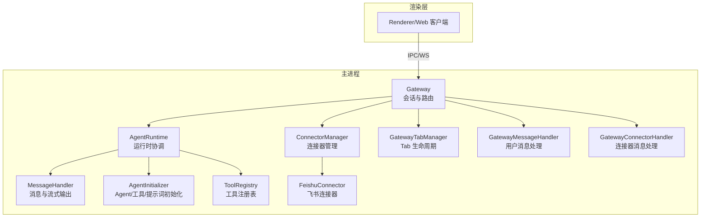
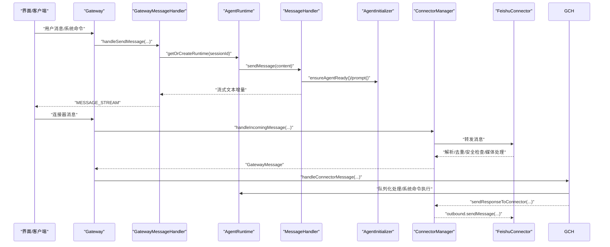
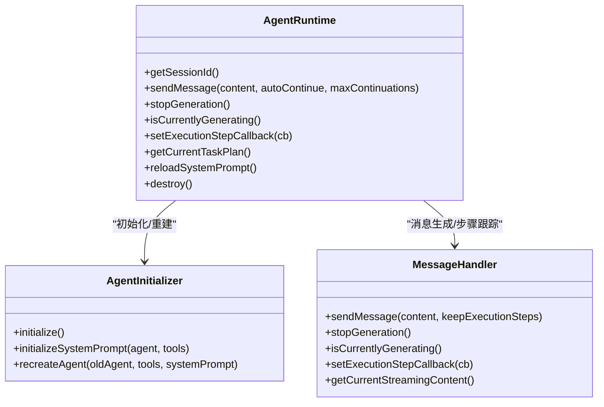
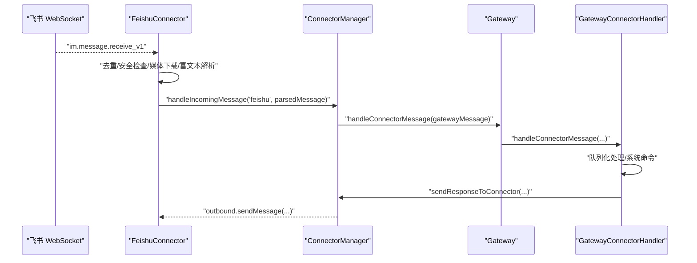
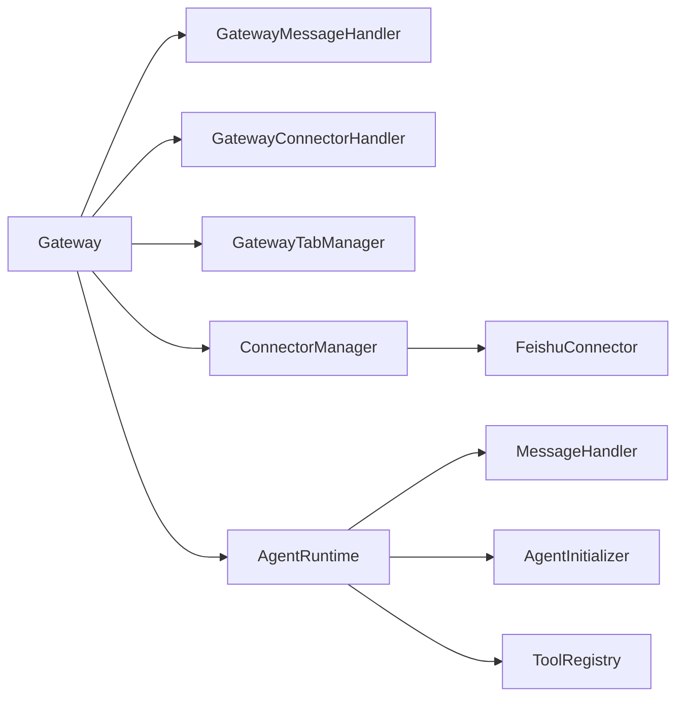

# 组件交互关系

<cite>
**本文引用的文件**
- [gateway.ts](file://src/main/gateway.ts)
- [agent-runtime.ts](file://src/main/agent-runtime/agent-runtime.ts)
- [agent-initializer.ts](file://src/main/agent-runtime/agent-initializer.ts)
- [message-handler.ts](file://src/main/agent-runtime/message-handler.ts)
- [gateway-message.ts](file://src/main/gateway-message.ts)
- [gateway-connector.ts](file://src/main/gateway-connector.ts)
- [gateway-tab.ts](file://src/main/gateway-tab.ts)
- [connector-manager.ts](file://src/main/connectors/connector-manager.ts)
- [feishu-connector.ts](file://src/main/connectors/feishu/feishu-connector.ts)
- [tool-registry.ts](file://src/main/tools/registry/tool-registry.ts)
</cite>

## 目录
1. [简介](#简介)
2. [项目结构](#项目结构)
3. [核心组件](#核心组件)
4. [架构总览](#架构总览)
5. [详细组件分析](#详细组件分析)
6. [依赖分析](#依赖分析)
7. [性能考量](#性能考量)
8. [故障排查指南](#故障排查指南)
9. [结论](#结论)
10. [附录](#附录)

## 简介
本技术文档聚焦 DeepBot 系统中核心组件的交互关系，深入剖析 Gateway、Agent Runtime、工具注册表、连接器管理器等模块之间的协作模式与数据流向。重点涵盖：
- 组件间依赖注入机制与接口抽象
- 事件传播路径与消息传递协议
- 从界面输入到最终响应输出的典型请求处理链路
- 组件解耦设计原则与实现方式
- 扩展与定制的最佳实践

## 项目结构
DeepBot 采用主进程模块化设计，核心交互集中在主进程（src/main），渲染层通过 IPC 通道与主进程通信。关键模块分布如下：
- 网关层：Gateway 负责会话生命周期、消息路由、流式响应与多实例管理
- Agent 运行时：AgentRuntime 协调初始化、消息处理、工具执行与状态管理
- 连接器层：ConnectorManager 统一管理外部连接器，FeishuConnector 通过 WebSocket 接收/发送消息
- 工具层：ToolRegistry 管理工具插件注册与加载
- Tab 管理：GatewayTabManager 管理 Tab 生命周期与持久化
- 消息处理：GatewayMessageHandler 与 GatewayConnectorHandler 分别处理用户消息与连接器消息

图表来源
- [gateway.ts](file://src/main/gateway.ts)
- [agent-runtime.ts](file://src/main/agent-runtime/agent-runtime.ts)
- [message-handler.ts](file://src/main/agent-runtime/message-handler.ts)
- [agent-initializer.ts](file://src/main/agent-runtime/agent-initializer.ts)
- [connector-manager.ts](file://src/main/connectors/connector-manager.ts)
- [feishu-connector.ts](file://src/main/connectors/feishu/feishu-connector.ts)
- [gateway-tab.ts](file://src/main/gateway-tab.ts)
- [gateway-message.ts](file://src/main/gateway-message.ts)
- [gateway-connector.ts](file://src/main/gateway-connector.ts)
- [tool-registry.ts](file://src/main/tools/registry/tool-registry.ts)

章节来源
- [gateway.ts](file://src/main/gateway.ts)
- [agent-runtime.ts](file://src/main/agent-runtime/agent-runtime.ts)
- [gateway-message.ts](file://src/main/gateway-message.ts)
- [gateway-connector.ts](file://src/main/gateway-connector.ts)
- [gateway-tab.ts](file://src/main/gateway-tab.ts)
- [connector-manager.ts](file://src/main/connectors/connector-manager.ts)
- [feishu-connector.ts](file://src/main/connectors/feishu/feishu-connector.ts)
- [tool-registry.ts](file://src/main/tools/registry/tool-registry.ts)

## 核心组件
- Gateway：会话与消息中枢，负责 Tab 管理、消息路由、连接器集成、运行时生命周期管理与依赖注入装配。
- AgentRuntime：统一运行时入口，协调 Agent 初始化、工具加载、消息处理与执行步骤跟踪。
- MessageHandler：封装 Agent 事件订阅与流式输出，管理生成状态、工具执行步骤与中断控制。
- AgentInitializer：负责 Agent 实例创建、工具加载与系统提示词构建。
- ConnectorManager：连接器统一入口，负责启动/停止、配置校验、消息转发与外部发送。
- FeishuConnector：飞书 WebSocket 连接器，负责消息接收、去重、安全检查、媒体下载与回复。
- GatewayTabManager：Tab 生命周期管理，支持持久化、欢迎消息、历史加载与标题更新。
- GatewayMessageHandler：用户消息处理与队列管理，负责流式输出、错误恢复与连接器回推。
- GatewayConnectorHandler：连接器消息处理与系统命令执行，负责队列化处理与进度提醒。
- ToolRegistry：工具注册与配置管理，提供工具查询与列表展示。

章节来源
- [gateway.ts](file://src/main/gateway.ts)
- [agent-runtime.ts](file://src/main/agent-runtime/agent-runtime.ts)
- [message-handler.ts](file://src/main/agent-runtime/message-handler.ts)
- [agent-initializer.ts](file://src/main/agent-runtime/agent-initializer.ts)
- [connector-manager.ts](file://src/main/connectors/connector-manager.ts)
- [feishu-connector.ts](file://src/main/connectors/feishu/feishu-connector.ts)
- [gateway-tab.ts](file://src/main/gateway-tab.ts)
- [gateway-message.ts](file://src/main/gateway-message.ts)
- [gateway-connector.ts](file://src/main/gateway-connector.ts)
- [tool-registry.ts](file://src/main/tools/registry/tool-registry.ts)

## 架构总览
Gateway 作为系统中枢，通过依赖注入将各处理器与管理器绑定，形成清晰的职责边界：
- 会话与路由：Gateway 维护每个 Tab 的 AgentRuntime 实例映射，负责消息路由与状态检查。
- 消息处理：GatewayMessageHandler 负责用户消息入队与流式输出；GatewayConnectorHandler 负责连接器消息队列与系统命令。
- 运行时：AgentRuntime 负责工具加载、系统提示词初始化与消息生成；MessageHandler 订阅 Agent 事件，实时产出执行步骤与流式文本。
- 连接器：ConnectorManager 统一调度，FeishuConnector 通过 WebSocket 接收消息并做去重、安全检查与媒体处理，再转发至 Gateway。
- 工具：ToolRegistry 管理工具插件注册与配置，AgentInitializer 通过 ToolLoader 加载工具并注入 Agent。

图表来源
- [gateway.ts](file://src/main/gateway.ts)
- [gateway-message.ts](file://src/main/gateway-message.ts)
- [agent-runtime.ts](file://src/main/agent-runtime/agent-runtime.ts)
- [message-handler.ts](file://src/main/agent-runtime/message-handler.ts)
- [agent-initializer.ts](file://src/main/agent-runtime/agent-initializer.ts)
- [connector-manager.ts](file://src/main/connectors/connector-manager.ts)
- [feishu-connector.ts](file://src/main/connectors/feishu/feishu-connector.ts)
- [gateway-connector.ts](file://src/main/gateway-connector.ts)

## 详细组件分析

### Gateway：会话与消息中枢
- 职责
  - 管理会话生命周期与多实例运行时
  - 路由用户消息与连接器消息
  - 管理连接器自动启动与配置变更
  - 提供依赖注入装配（Tab、消息、连接器处理器）
- 关键机制
  - 依赖注入：setupHandlerDependencies 将 MainWindow、SessionManager、各处理器回调注入
  - 运行时管理：getOrCreateRuntime 为每个 Tab 维护独立 AgentRuntime
  - 配置热重载：reloadModelConfig/reloadToolConfig/reloadWorkspaceConfig
  - 延迟重置：markPendingRuntimeReset/checkAndApplyPendingReset
- 与上下游关系
  - 上游：Renderer/Web 通过 IPC/WS 发送消息
  - 下游：AgentRuntime、ConnectorManager、GatewayTabManager、GatewayMessageHandler/GatewayConnectorHandler

章节来源
- [gateway.ts](file://src/main/gateway.ts)

### AgentRuntime：运行时协调器
- 职责
  - 统一运行时入口，协调初始化、工具加载、系统提示词与消息生成
  - 维护消息队列维护、执行步骤跟踪与任务计划回调
  - 提供停止生成、切换会话、清空历史等能力
- 关键机制
  - 初始化：AgentInitializer 负责 Agent/工具/提示词创建
  - 消息生成：MessageHandler 订阅 Agent 事件，产出流式文本与执行步骤
  - 历史加载：从 SessionManager 加载上下文并压缩
  - 工具包装：重复检测与跨 Tab 名称注入
- 与上下游关系
  - 上游：GatewayMessageHandler/GatewayConnectorHandler
  - 下游：MessageHandler、AgentInitializer、SessionManager

图表来源
- [agent-runtime.ts](file://src/main/agent-runtime/agent-runtime.ts)
- [agent-initializer.ts](file://src/main/agent-runtime/agent-initializer.ts)
- [message-handler.ts](file://src/main/agent-runtime/message-handler.ts)

章节来源
- [agent-runtime.ts](file://src/main/agent-runtime/agent-runtime.ts)
- [agent-initializer.ts](file://src/main/agent-runtime/agent-initializer.ts)
- [message-handler.ts](file://src/main/agent-runtime/message-handler.ts)

### GatewayMessageHandler：用户消息处理与队列
- 职责
  - 用户消息入队与队列处理，支持定时任务 Tab 等待与普通 Tab 队列
  - 流式输出 MESSAGE_STREAM，实时发送执行步骤
  - AI 连接错误自动恢复与错误上报
  - 保存用户消息与 AI 响应到 SessionManager
- 关键机制
  - 等待任务完成：waitForTaskCompletion
  - 队列处理：processMessageQueue
  - 错误恢复：handleAIConnectionError
  - 执行步骤回调：setExecutionStepCallback

章节来源
- [gateway-message.ts](file://src/main/gateway-message.ts)

### GatewayConnectorHandler：连接器消息与系统命令
- 职责
  - 连接器消息队列化处理，支持群组消息与系统指令
  - 系统命令执行：/new、/memory、/history、/stop、/status、/reload-env
  - 进度提醒：按节点定时发送“还在执行中”提示
  - 连接器回推：sendResponseToConnector
- 关键机制
  - 队列处理：processNextMessage
  - 系统命令：executeSystemCommand
  - 进度提醒：startProgressTimers/clearProgressTimers

章节来源
- [gateway-connector.ts](file://src/main/gateway-connector.ts)

### ConnectorManager 与 FeishuConnector：连接器管理与飞书接入
- ConnectorManager
  - 注册/启动/停止连接器
  - 配置加载与校验
  - 外部消息转发与内部发送
- FeishuConnector
  - WebSocket 长连接接收 im.message.receive_v1
  - 消息去重（基于 message_id 与内容窗口）
  - 安全检查与配对码流程
  - 媒体下载（图片/文件）与富文本解析
  - 回复表情与消息发送

图表来源
- [connector-manager.ts](file://src/main/connectors/connector-manager.ts)
- [feishu-connector.ts](file://src/main/connectors/feishu/feishu-connector.ts)
- [gateway-connector.ts](file://src/main/gateway-connector.ts)
- [gateway.ts](file://src/main/gateway.ts)

章节来源
- [connector-manager.ts](file://src/main/connectors/connector-manager.ts)
- [feishu-connector.ts](file://src/main/connectors/feishu/feishu-connector.ts)
- [gateway-connector.ts](file://src/main/gateway-connector.ts)

### GatewayTabManager：Tab 生命周期与持久化
- 职责
  - Tab 创建/关闭/查询与标题更新
  - 持久化加载与内存文件管理
  - 欢迎消息与历史加载策略
  - 任务 Tab 锁定与暂停
- 关键机制
  - 持久化：saveTabConfig/getAllPersistentTabs/deleteTabConfig
  - 欢迎消息：checkAndSendWelcomeMessage/loadDefaultTabHistory
  - 标题更新：updateTabTitle（同步持久化）

章节来源
- [gateway-tab.ts](file://src/main/gateway-tab.ts)

### ToolRegistry：工具注册与配置
- 职责
  - 工具插件注册与加载
  - 工具配置管理与禁用启用
  - 工具列表查询与 UI 展示
- 关键机制
  - 注册：register
  - 加载：loadFromDirectory（历史遗留）、ToolLoader（实际加载）
  - 配置：setToolConfig/getToolConfig

章节来源
- [tool-registry.ts](file://src/main/tools/registry/tool-registry.ts)

## 依赖分析
- 组件耦合与内聚
  - Gateway 作为高内聚中枢，通过 setDependencies 将 Tab、消息、连接器处理器解耦绑定
  - AgentRuntime 与 MessageHandler 通过接口抽象解耦，便于替换底层 Agent 实现
  - ConnectorManager 与具体连接器（如 FeishuConnector）通过 Connector 接口解耦
- 直接与间接依赖
  - Gateway 间接依赖 SessionManager（通过注入）、ToolRegistry（通过 AgentInitializer）
  - AgentRuntime 间接依赖 ToolRegistry（通过 ToolLoader）
  - GatewayConnectorHandler 与 GatewayMessageHandler 通过 Gateway 注入回调
- 循环依赖规避
  - 通过回调注入与延迟初始化避免循环引用
  - 运行时重置与销毁流程中严格控制生命周期顺序

图表来源
- [gateway.ts](file://src/main/gateway.ts)
- [agent-runtime.ts](file://src/main/agent-runtime/agent-runtime.ts)
- [message-handler.ts](file://src/main/agent-runtime/message-handler.ts)
- [agent-initializer.ts](file://src/main/agent-runtime/agent-initializer.ts)
- [gateway-message.ts](file://src/main/gateway-message.ts)
- [gateway-connector.ts](file://src/main/gateway-connector.ts)
- [gateway-tab.ts](file://src/main/gateway-tab.ts)
- [connector-manager.ts](file://src/main/connectors/connector-manager.ts)
- [feishu-connector.ts](file://src/main/connectors/feishu/feishu-connector.ts)
- [tool-registry.ts](file://src/main/tools/registry/tool-registry.ts)

章节来源
- [gateway.ts](file://src/main/gateway.ts)
- [agent-runtime.ts](file://src/main/agent-runtime/agent-runtime.ts)
- [gateway-message.ts](file://src/main/gateway-message.ts)
- [gateway-connector.ts](file://src/main/gateway-connector.ts)
- [gateway-tab.ts](file://src/main/gateway-tab.ts)
- [connector-manager.ts](file://src/main/connectors/connector-manager.ts)
- [feishu-connector.ts](file://src/main/connectors/feishu/feishu-connector.ts)
- [tool-registry.ts](file://src/main/tools/registry/tool-registry.ts)

## 性能考量
- 流式输出与事件驱动
  - MessageHandler 基于 Agent 事件订阅，边生成边输出，降低前端等待时间
  - 执行步骤实时回调，避免轮询带来的额外开销
- 队列化与并发控制
  - 用户消息队列与连接器消息队列分离，定时任务 Tab 等待上一次执行完成后再进入队列
  - Agent 工具执行采用串行策略，避免并发工具调用导致的资源竞争
- 历史与上下文压缩
  - AgentRuntime 加载历史时进行上下文压缩，控制 Token 使用
- 去重与健康检查
  - 连接器消息去重与健康检查，减少无效处理与网络抖动影响

## 故障排查指南
- AI 连接错误自动恢复
  - GatewayMessageHandler 检测 AI 连接错误后，调用 resetSessionRuntime 并清理缓存重试
- 生成卡住与中断
  - MessageHandler 提供 stopGeneration 与 forceReset，支持用户中断与异常状态恢复
- 连接器异常
  - ConnectorManager.healthCheck 与 FeishuConnector.healthCheck 提供健康状态
  - 连接器启动失败、消息解析异常、媒体下载失败均有日志与错误上报
- 配置变更与热重载
  - Gateway 提供 reloadModelConfig/reloadToolConfig/reloadWorkspaceConfig，配合延迟重置保障一致性

章节来源
- [gateway-message.ts](file://src/main/gateway-message.ts)
- [message-handler.ts](file://src/main/agent-runtime/message-handler.ts)
- [connector-manager.ts](file://src/main/connectors/connector-manager.ts)
- [feishu-connector.ts](file://src/main/connectors/feishu/feishu-connector.ts)
- [gateway.ts](file://src/main/gateway.ts)

## 结论
DeepBot 通过 Gateway 作为中枢，结合依赖注入与接口抽象，实现了组件间的低耦合与高内聚。AgentRuntime 与 MessageHandler 的事件驱动与流式输出提升了交互体验；ConnectorManager 与 FeishuConnector 的去重与安全检查保障了外部消息的稳定性；GatewayTabManager 与持久化机制提供了良好的用户体验。整体架构清晰、扩展性强，适合进一步引入新的连接器与工具。

## 附录
- 扩展与定制最佳实践
  - 新增连接器：实现 Connector 接口，注册到 ConnectorManager，遵循消息去重与安全检查规范
  - 新增工具：在 ToolRegistry 中注册插件，通过 ToolLoader 加载，AgentInitializer 注入
  - 自定义系统提示词：通过 AgentInitializer.initializeSystemPrompt 构建提示词参数
  - 定制消息处理：通过 GatewayMessageHandler/GatewayConnectorHandler 的回调扩展业务逻辑