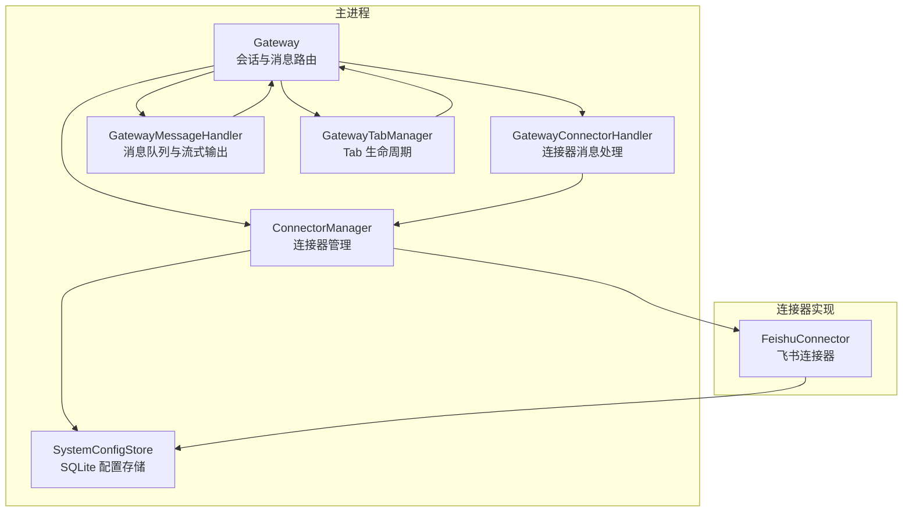
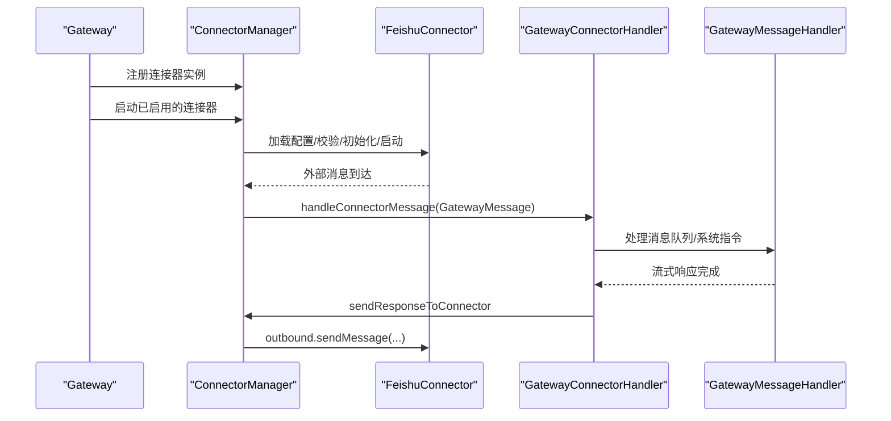
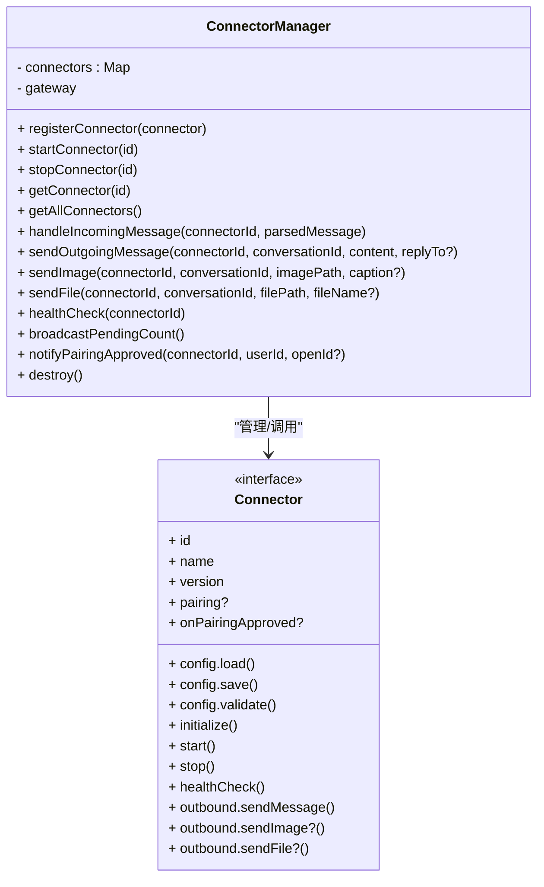
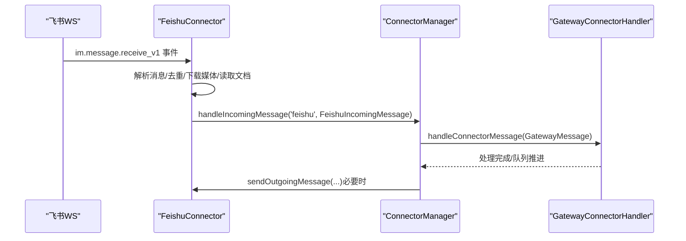
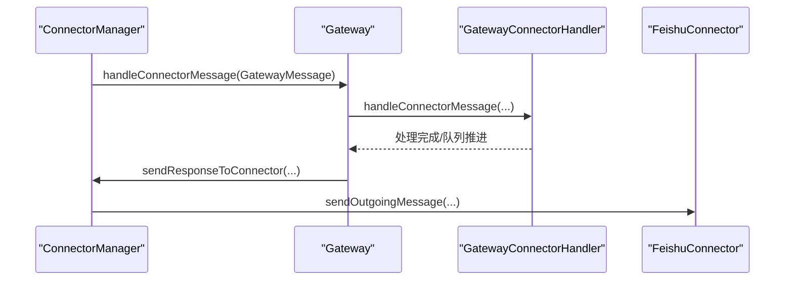
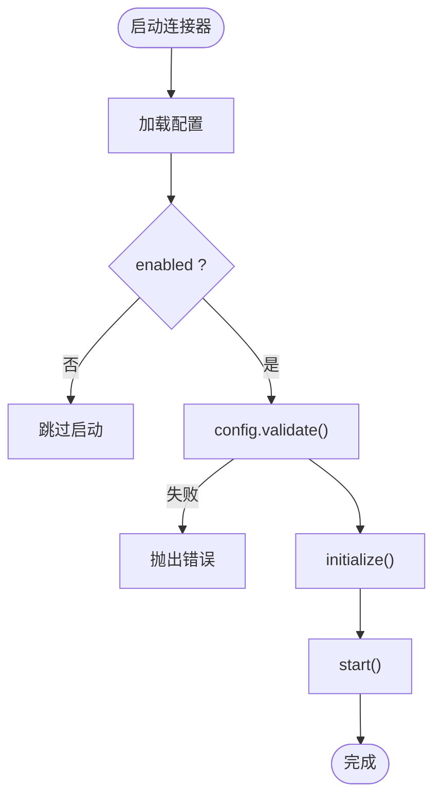
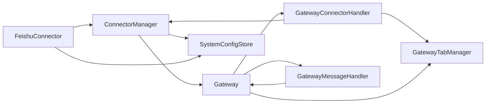

# 连接器管理器

<cite>
**本文引用的文件**
- [connector-manager.ts](file://src/main/connectors/connector-manager.ts)
- [index.ts](file://src/main/connectors/index.ts)
- [feishu-connector.ts](file://src/main/connectors/feishu/feishu-connector.ts)
- [connector.ts](file://src/types/connector.ts)
- [gateway-connector.ts](file://src/main/gateway-connector.ts)
- [gateway.ts](file://src/main/gateway.ts)
- [system-config-store.ts](file://src/main/database/system-config-store.ts)
- [connector-config.ts](file://src/main/database/connector-config.ts)
- [document-handler.ts](file://src/main/connectors/feishu/document-handler.ts)
- [gateway-tab.ts](file://src/main/gateway-tab.ts)
- [gateway-message.ts](file://src/main/gateway-message.ts)
</cite>

## 目录
1. [简介](#简介)
2. [项目结构](#项目结构)
3. [核心组件](#核心组件)
4. [架构总览](#架构总览)
5. [详细组件分析](#详细组件分析)
6. [依赖分析](#依赖分析)
7. [性能考虑](#性能考虑)
8. [故障排除指南](#故障排除指南)
9. [结论](#结论)
10. [附录](#附录)

## 简介
本文件面向开发者，系统性阐述 史丽慧小助理 连接器管理器（ConnectorManager）的设计与实现，重点覆盖以下方面：
- 连接器注册、启动/停止控制、配置管理与健康检查
- 消息路由机制：handleIncomingMessage 与 sendOutgoingMessage 的工作原理
- 与其他组件（Gateway、GatewayConnectorHandler、FeishuConnector 等）的交互关系
- 连接器生命周期管理最佳实践：错误处理、健康检查、资源清理
- 配置验证、状态管理与资源清理的关键功能
- 使用示例与故障排除指南

## 项目结构
连接器管理器位于主进程模块 src/main/connectors 下，围绕 Connector 接口抽象，当前内置飞书连接器（FeishuConnector）。其与网关（Gateway）、消息处理器（GatewayConnectorHandler/GatewayMessageHandler）、Tab 管理器（GatewayTabManager）以及系统配置存储（SystemConfigStore）协同工作。

图表来源
- [gateway.ts:29-114](file://src/main/gateway.ts#L29-L114)
- [connector-manager.ts:21-28](file://src/main/connectors/connector-manager.ts#L21-L28)
- [gateway-connector.ts:44-88](file://src/main/gateway-connector.ts#L44-L88)
- [gateway-message.ts:31-64](file://src/main/gateway-message.ts#L31-L64)
- [gateway-tab.ts:26-61](file://src/main/gateway-tab.ts#L26-L61)
- [system-config-store.ts:37-70](file://src/main/database/system-config-store.ts#L37-L70)
- [feishu-connector.ts:28-50](file://src/main/connectors/feishu/feishu-connector.ts#L28-L50)

章节来源
- [gateway.ts:29-114](file://src/main/gateway.ts#L29-L114)
- [connector-manager.ts:21-28](file://src/main/connectors/connector-manager.ts#L21-L28)
- [gateway-connector.ts:44-88](file://src/main/gateway-connector.ts#L44-L88)
- [gateway-message.ts:31-64](file://src/main/gateway-message.ts#L31-L64)
- [gateway-tab.ts:26-61](file://src/main/gateway-tab.ts#L26-L61)
- [system-config-store.ts:37-70](file://src/main/database/system-config-store.ts#L37-L70)
- [feishu-connector.ts:28-50](file://src/main/connectors/feishu/feishu-connector.ts#L28-L50)

## 核心组件
- Connector 接口：定义连接器的基本能力（配置、生命周期、消息发送、可选的安全与配对机制等）。
- ConnectorManager：集中管理连接器实例，提供注册、启动/停止、配置加载与校验、消息路由、健康检查与销毁。
- FeishuConnector：飞书连接器的具体实现，负责与飞书官方 SDK 建立长连接、消息解析与去重、图片/文件下载、配对与安全检查、消息发送等。
- GatewayConnectorHandler：将连接器消息转交给 Gateway，负责系统指令解析、队列与进度提醒、回传响应到连接器。
- GatewayMessageHandler：通用消息处理与队列管理，负责流式输出、错误恢复、与 AgentRuntime 的交互。
- GatewayTabManager：Tab 生命周期管理，负责创建/关闭/持久化、历史加载、欢迎消息等。
- SystemConfigStore：统一的 SQLite 配置存储，提供连接器配置、配对记录、Tab 配置等的持久化。

章节来源
- [connector.ts:76-146](file://src/types/connector.ts#L76-L146)
- [connector-manager.ts:21-122](file://src/main/connectors/connector-manager.ts#L21-L122)
- [feishu-connector.ts:28-101](file://src/main/connectors/feishu/feishu-connector.ts#L28-L101)
- [gateway-connector.ts:44-88](file://src/main/gateway-connector.ts#L44-L88)
- [gateway-message.ts:31-64](file://src/main/gateway-message.ts#L31-L64)
- [gateway-tab.ts:26-61](file://src/main/gateway-tab.ts#L26-L61)
- [system-config-store.ts:37-70](file://src/main/database/system-config-store.ts#L37-L70)

## 架构总览
连接器管理器在 Gateway 初始化时创建，并注册内置的飞书连接器。Gateway 负责依赖注入，将 ConnectorManager 注入到各处理器中；连接器通过 ConnectorManager 与 Gateway 交互，实现消息的双向路由。

图表来源
- [gateway.ts:68-74](file://src/main/gateway.ts#L68-L74)
- [connector-manager.ts:45-81](file://src/main/connectors/connector-manager.ts#L45-L81)
- [feishu-connector.ts:132-149](file://src/main/connectors/feishu/feishu-connector.ts#L132-L149)
- [gateway-connector.ts:100-115](file://src/main/gateway-connector.ts#L100-L115)
- [gateway-message.ts:76-160](file://src/main/gateway-message.ts#L76-L160)

章节来源
- [gateway.ts:68-74](file://src/main/gateway.ts#L68-L74)
- [connector-manager.ts:45-81](file://src/main/connectors/connector-manager.ts#L45-L81)
- [feishu-connector.ts:132-149](file://src/main/connectors/feishu/feishu-connector.ts#L132-L149)
- [gateway-connector.ts:100-115](file://src/main/gateway-connector.ts#L100-L115)
- [gateway-message.ts:76-160](file://src/main/gateway-message.ts#L76-L160)

## 详细组件分析

### ConnectorManager：连接器生命周期与消息路由
- 注册与发现
  - registerConnector：将连接器实例登记到内存映射，便于后续启动/停止与查询。
  - getConnector/getAllConnectors：按 ID 获取或返回全部连接器实例。
- 启动/停止控制
  - startConnector：加载配置、校验 enabled、调用 initialize/start；失败抛出错误。
  - stopConnector：调用连接器 stop，失败抛出错误。
  - destroy：遍历并停止所有连接器，清空映射。
- 配置管理
  - 通过连接器的 config.load/validate/save 与 SystemConfigStore 协作，实现配置持久化与启用状态切换。
- 消息路由
  - handleIncomingMessage：将外部消息转换为 GatewayMessage，转发给 GatewayConnectorHandler。
  - sendOutgoingMessage/sendImage/sendFile：调用连接器 outbound 发送文本/图片/文件，支持 replyToMessageId。
- 健康检查与广播
  - healthCheck：委托连接器 healthCheck，返回统一状态。
  - broadcastPendingCount：读取配对记录，计算待审批数量并通过主窗口 IPC 推送到前端。
- 安全与配对
  - notifyPairingApproved：统一入口调用连接器 onPairingApproved 回调（如飞书欢迎消息）。

图表来源
- [connector-manager.ts:21-122](file://src/main/connectors/connector-manager.ts#L21-L122)
- [connector.ts:76-146](file://src/types/connector.ts#L76-L146)

章节来源
- [connector-manager.ts:35-122](file://src/main/connectors/connector-manager.ts#L35-L122)
- [connector-manager.ts:130-207](file://src/main/connectors/connector-manager.ts#L130-L207)
- [connector-manager.ts:341-358](file://src/main/connectors/connector-manager.ts#L341-L358)
- [connector-manager.ts:363-377](file://src/main/connectors/connector-manager.ts#L363-L377)
- [connector.ts:76-146](file://src/types/connector.ts#L76-L146)

### FeishuConnector：消息解析、去重与发送
- 配置管理
  - config.load/validate/save：从 SystemConfigStore 读取/校验/保存飞书配置（appId/appSecret 等）。
- 生命周期
  - initialize：初始化 Lark Client 与文档处理器。
  - start：启动 WS 客户端，注册事件分发器，异步轮询机器人 open_id。
  - stop：停止定时器与 WS 连接，重置状态。
  - healthCheck：检查内部状态（isStarted 与 WS 客户端）。
- 消息处理
  - handleIncomingMessage：解析飞书事件，提取发送者、消息类型、@ 信息、图片/文件下载、文档链接读取、安全检查与配对流程、去重策略（messageId 与内容窗口去重）、转发到 ConnectorManager。
  - outbound.sendMessage/sendImage/sendFile：封装飞书 API 调用，支持 reply API 与 open_id/chat_id 两种接收方式。
- 安全与配对
  - fetchUserName：通过通讯录 API 获取真实姓名，带缓存。
  - replyWithReaction：快速表情回复，提升交互体验。
  - 配对流程：私聊未配对时生成配对码并提示管理员批准；管理员指令支持 approve。

图表来源
- [feishu-connector.ts:132-149](file://src/main/connectors/feishu/feishu-connector.ts#L132-L149)
- [feishu-connector.ts:368-577](file://src/main/connectors/feishu/feishu-connector.ts#L368-L577)
- [connector-manager.ts:130-168](file://src/main/connectors/connector-manager.ts#L130-L168)
- [gateway-connector.ts:100-115](file://src/main/gateway-connector.ts#L100-L115)

章节来源
- [feishu-connector.ts:53-80](file://src/main/connectors/feishu/feishu-connector.ts#L53-L80)
- [feishu-connector.ts:89-175](file://src/main/connectors/feishu/feishu-connector.ts#L89-L175)
- [feishu-connector.ts:235-248](file://src/main/connectors/feishu/feishu-connector.ts#L235-L248)
- [feishu-connector.ts:368-577](file://src/main/connectors/feishu/feishu-connector.ts#L368-L577)
- [feishu-connector.ts:581-800](file://src/main/connectors/feishu/feishu-connector.ts#L581-L800)

### 消息路由：handleIncomingMessage 与 sendOutgoingMessage
- handleIncomingMessage（ConnectorManager）
  - 输入：connectorId + FeishuIncomingMessage
  - 转换：将外部消息映射为 GatewayMessage（含 source/conversation/sender/chatType 等）
  - 转发：调用 GatewayConnectorHandler.handleConnectorMessage
- sendOutgoingMessage（ConnectorManager）
  - 输入：connectorId + conversationId + content + replyToMessageId?
  - 调用：connector.outbound.sendMessage，支持回复到原消息（飞书 reply API）

图表来源
- [connector-manager.ts:130-168](file://src/main/connectors/connector-manager.ts#L130-L168)
- [gateway.ts:669-681](file://src/main/gateway.ts#L669-L681)
- [gateway-connector.ts:431-483](file://src/main/gateway-connector.ts#L431-L483)
- [feishu-connector.ts:581-636](file://src/main/connectors/feishu/feishu-connector.ts#L581-L636)

章节来源
- [connector-manager.ts:130-207](file://src/main/connectors/connector-manager.ts#L130-L207)
- [gateway-connector.ts:431-483](file://src/main/gateway-connector.ts#L431-L483)

### 配置管理与验证
- SystemConfigStore
  - 提供 saveConnectorConfig/getConnectorConfig/setConnectorEnabled/deleteConnectorConfig 等接口。
  - 通过 connector-config 模块实现 SQLite 持久化。
- Connector 接口
  - config.validate：由连接器自行实现（如飞书要求 appId/appSecret 存在）。
- Gateway 自动启动
  - 初始化时扫描已启用的连接器并逐个启动。

图表来源
- [connector-manager.ts:55-81](file://src/main/connectors/connector-manager.ts#L55-L81)
- [system-config-store.ts:445-463](file://src/main/database/system-config-store.ts#L445-L463)
- [connector-config.ts:13-38](file://src/main/database/connector-config.ts#L13-L38)
- [gateway.ts:156-185](file://src/main/gateway.ts#L156-L185)

章节来源
- [system-config-store.ts:445-463](file://src/main/database/system-config-store.ts#L445-L463)
- [connector-config.ts:13-38](file://src/main/database/connector-config.ts#L13-L38)
- [connector-manager.ts:55-81](file://src/main/connectors/connector-manager.ts#L55-L81)
- [gateway.ts:156-185](file://src/main/gateway.ts#L156-L185)

### 健康检查与资源清理
- healthCheck：委托连接器 healthCheck，返回统一状态。
- destroy：停止所有连接器并清空映射，避免资源泄漏。
- stopConnector：捕获异常并抛出，便于上层处理。

章节来源
- [connector-manager.ts:341-358](file://src/main/connectors/connector-manager.ts#L341-L358)
- [connector-manager.ts:363-377](file://src/main/connectors/connector-manager.ts#L363-L377)
- [connector-manager.ts:88-103](file://src/main/connectors/connector-manager.ts#L88-L103)

### 飞书文档读取与去重机制
- 文档读取：FeishuDocumentHandler 提取 URL、识别 docx/docs/wiki/sheets，分别调用对应 API 读取元信息与内容，格式化为文本附加内容。
- 去重策略：基于 message_id 的集合与基于 senderId+text 的时间窗口去重，防止重复推送导致的重复处理。

章节来源
- [document-handler.ts:40-93](file://src/main/connectors/feishu/document-handler.ts#L40-L93)
- [document-handler.ts:98-166](file://src/main/connectors/feishu/document-handler.ts#L98-L166)
- [document-handler.ts:171-294](file://src/main/connectors/feishu/document-handler.ts#L171-L294)
- [feishu-connector.ts:454-486](file://src/main/connectors/feishu/feishu-connector.ts#L454-L486)

## 依赖分析
- 组件耦合
  - ConnectorManager 依赖 Gateway（用于消息路由）与 SystemConfigStore（配置持久化）。
  - FeishuConnector 依赖 ConnectorManager（消息回传）、SystemConfigStore（配置与配对）、Lark SDK。
  - GatewayConnectorHandler 依赖 ConnectorManager（消息回传）、GatewayTabManager（Tab 生命周期）、GatewayMessageHandler（消息处理）。
  - GatewayMessageHandler 依赖 AgentRuntime、SessionManager、Gateway（回调注入）。
- 外部依赖
  - @larksuiteoapi/node-sdk：飞书 WebSocket 与消息 API。
  - SQLite：SystemConfigStore 持久化。

图表来源
- [connector-manager.ts:21-28](file://src/main/connectors/connector-manager.ts#L21-L28)
- [feishu-connector.ts:28-50](file://src/main/connectors/feishu/feishu-connector.ts#L28-L50)
- [gateway-connector.ts:44-88](file://src/main/gateway-connector.ts#L44-L88)
- [gateway-message.ts:31-64](file://src/main/gateway-message.ts#L31-L64)
- [gateway-tab.ts:26-61](file://src/main/gateway-tab.ts#L26-L61)
- [gateway.ts:29-114](file://src/main/gateway.ts#L29-L114)

章节来源
- [connector-manager.ts:21-28](file://src/main/connectors/connector-manager.ts#L21-L28)
- [feishu-connector.ts:28-50](file://src/main/connectors/feishu/feishu-connector.ts#L28-L50)
- [gateway-connector.ts:44-88](file://src/main/gateway-connector.ts#L44-L88)
- [gateway-message.ts:31-64](file://src/main/gateway-message.ts#L31-L64)
- [gateway-tab.ts:26-61](file://src/main/gateway-tab.ts#L26-L61)
- [gateway.ts:29-114](file://src/main/gateway.ts#L29-L114)

## 性能考虑
- 去重策略：消息 ID 去重与内容窗口去重结合，减少重复处理与网络调用。
- 异步处理：飞书事件采用 setImmediate 异步处理，避免阻塞事件响应。
- 进度提醒：GatewayConnectorHandler 对长时间任务按固定时间点发送进度提醒，避免前端长时间无反馈。
- 资源清理：destroy/stopConnector 在异常时仍尝试清理，降低资源泄漏风险。

[本节为通用指导，不直接分析具体文件]

## 故障排除指南
- 启动失败
  - 检查配置是否 enabled 且 validate 通过；确认 SystemConfigStore 中的连接器配置存在。
  - 查看 ConnectorManager 启动日志与错误堆栈。
- 连接器未启用
  - 确认 setConnectorEnabled 已在启动前调用。
- 健康检查异常
  - 使用 ConnectorManager.healthCheck 获取状态；若连接器内部状态异常，检查 start/stop 流程与 WS 客户端状态。
- 发送失败
  - sendOutgoingMessage/sendImage/sendFile 抛错时，检查连接器 outbound 实现与飞书 API 返回码。
- 飞书消息未处理
  - 检查去重窗口与 @ 机器人规则；确认 FeishuConnector 的 startBotOpenIdPolling 是否成功获取 open_id。
- 配对与权限
  - 确认配对记录已保存并批准；检查飞书开放平台权限（docx/document:readonly、drive:drive:readonly 等）。

章节来源
- [connector-manager.ts:55-81](file://src/main/connectors/connector-manager.ts#L55-L81)
- [connector-manager.ts:341-358](file://src/main/connectors/connector-manager.ts#L341-L358)
- [feishu-connector.ts:181-233](file://src/main/connectors/feishu/feishu-connector.ts#L181-L233)
- [feishu-connector.ts:581-636](file://src/main/connectors/feishu/feishu-connector.ts#L581-L636)
- [document-handler.ts:115-129](file://src/main/connectors/feishu/document-handler.ts#L115-L129)
- [document-handler.ts:196-200](file://src/main/connectors/feishu/document-handler.ts#L196-L200)

## 结论
ConnectorManager 通过统一接口抽象与清晰的生命周期管理，实现了连接器的注册、启动/停止、配置与健康检查，以及消息的双向路由。配合 FeishuConnector 的去重、文档读取与配对机制，以及 Gateway 系列处理器的消息队列与流式输出，形成完整的外部消息接入与响应闭环。遵循本文最佳实践与故障排除指南，可有效提升连接器稳定性与可维护性。

[本节为总结，不直接分析具体文件]

## 附录

### 使用示例（概念性说明）
- 启动连接器
  - 通过 IPC 或 Gateway 自动启动，调用 ConnectorManager.startConnector。
- 发送消息到外部
  - 调用 ConnectorManager.sendOutgoingMessage，传入 connectorId、conversationId、content 与可选 replyToMessageId。
- 配置连接器
  - 通过 SystemConfigStore.saveConnectorConfig 保存配置，再调用 setConnectorEnabled(true) 启用。

章节来源
- [gateway.ts:156-185](file://src/main/gateway.ts#L156-L185)
- [connector-manager.ts:178-207](file://src/main/connectors/connector-manager.ts#L178-L207)
- [system-config-store.ts:445-463](file://src/main/database/system-config-store.ts#L445-L463)