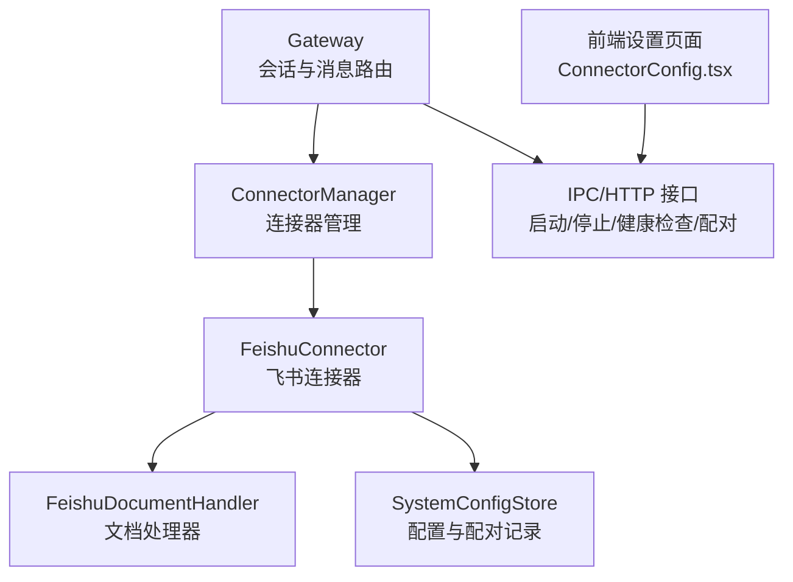
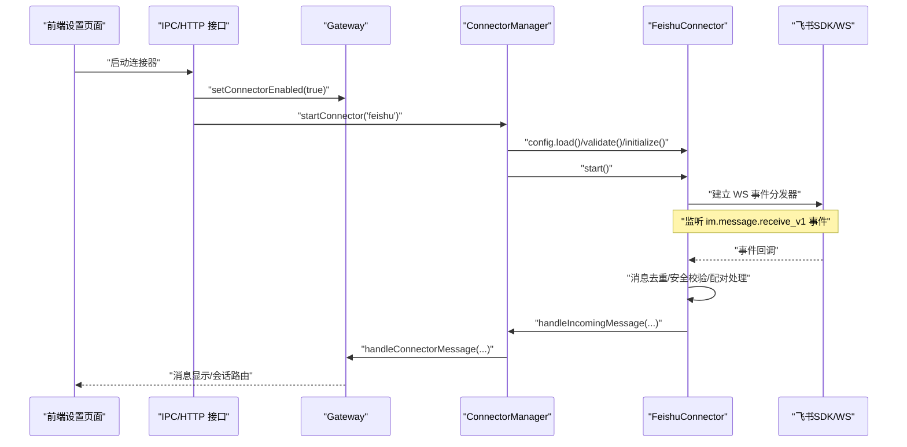
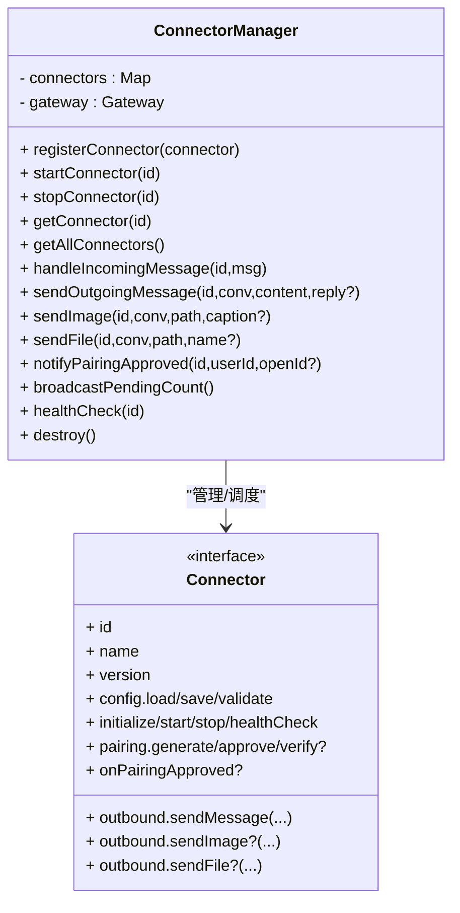
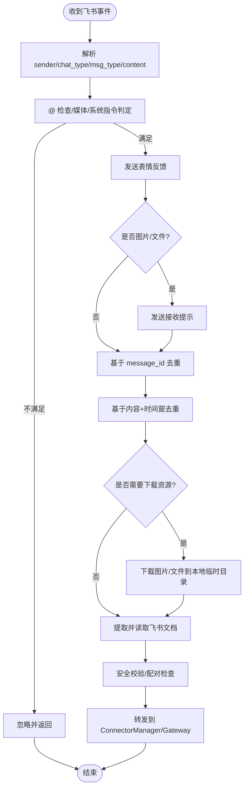
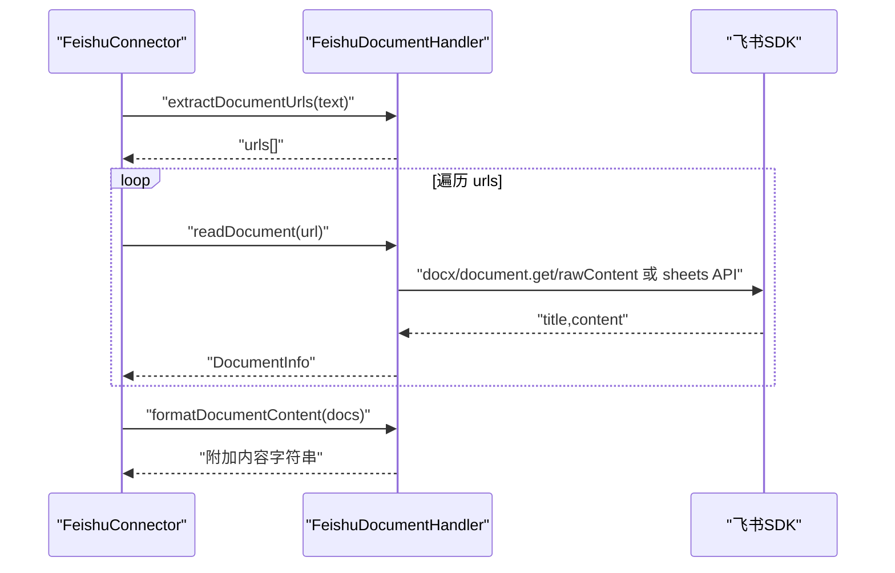
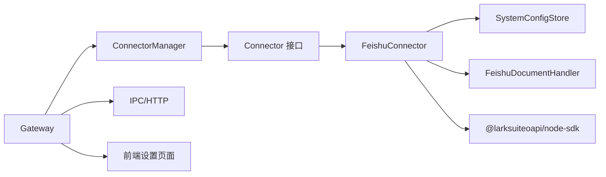

# 连接器系统

<cite>
**本文引用的文件**
- [connector-manager.ts](file://src/main/connectors/connector-manager.ts)
- [feishu-connector.ts](file://src/main/connectors/feishu/feishu-connector.ts)
- [document-handler.ts](file://src/main/connectors/feishu/document-handler.ts)
- [index.ts](file://src/main/connectors/index.ts)
- [connector.ts](file://src/types/connector.ts)
- [gateway.ts](file://src/main/gateway.ts)
- [system-config-store.ts](file://src/main/database/system-config-store.ts)
- [connector-handler.ts](file://src/main/ipc/connector-handler.ts)
- [gateway-adapter.ts](file://src/server/gateway-adapter.ts)
- [ConnectorConfig.tsx](file://src/renderer/components/settings/ConnectorConfig.tsx)
- [README.md](file://README.md)
</cite>

## 目录
1. [简介](#简介)
2. [项目结构](#项目结构)
3. [核心组件](#核心组件)
4. [架构总览](#架构总览)
5. [详细组件分析](#详细组件分析)
6. [依赖分析](#依赖分析)
7. [性能考量](#性能考量)
8. [故障排除指南](#故障排除指南)
9. [结论](#结论)
10. [附录](#附录)

## 简介
本文件系统化阐述 DeepBot 连接器系统的架构设计、消息路由与健康检查机制，重点解析飞书连接器的实现细节（WebSocket 连接、消息去重、文档处理）、连接器注册与扩展方式、配置与故障排除、安全与性能优化，以及面向开发者的自定义连接器开发指南。

## 项目结构
连接器系统位于主进程 src/main/connectors 目录，核心包括：
- 连接器管理器：统一注册、启停、健康检查、消息转发与发送
- 飞书连接器：基于飞书官方 Node.js SDK 的 WebSocket 长连接，实现消息接收、去重、安全校验、配对授权、文档读取与发送图片/文件
- 文档处理器：解析并读取飞书文档（docx/docs/wiki）与电子表格（sheets）
- 类型定义：Connector 接口、消息格式、健康状态等
- 系统配置存储：持久化连接器配置与配对记录
- 网关集成：Gateway 在初始化时注册并自动启动连接器
- IPC/HTTP 接口：前端与后端交互，支持启动/停止/健康检查/配对管理

**图表来源**
- [gateway.ts:69-93](file://src/main/gateway.ts#L69-L93)
- [connector-manager.ts:21-38](file://src/main/connectors/connector-manager.ts#L21-L38)
- [feishu-connector.ts:28-50](file://src/main/connectors/feishu/feishu-connector.ts#L28-L50)
- [document-handler.ts:23-28](file://src/main/connectors/feishu/document-handler.ts#L23-L28)
- [system-config-store.ts:445-463](file://src/main/database/system-config-store.ts#L445-L463)
- [connector-handler.ts:200-231](file://src/main/ipc/connector-handler.ts#L200-L231)
- [ConnectorConfig.tsx:77-113](file://src/renderer/components/settings/ConnectorConfig.tsx#L77-L113)

**章节来源**
- [gateway.ts:69-93](file://src/main/gateway.ts#L69-L93)
- [connector-manager.ts:21-38](file://src/main/connectors/connector-manager.ts#L21-L38)
- [feishu-connector.ts:28-50](file://src/main/connectors/feishu/feishu-connector.ts#L28-L50)
- [document-handler.ts:23-28](file://src/main/connectors/feishu/document-handler.ts#L23-L28)
- [system-config-store.ts:445-463](file://src/main/database/system-config-store.ts#L445-L463)
- [connector-handler.ts:200-231](file://src/main/ipc/connector-handler.ts#L200-L231)
- [ConnectorConfig.tsx:77-113](file://src/renderer/components/settings/ConnectorConfig.tsx#L77-L113)

## 核心组件
- 连接器管理器（ConnectorManager）
  - 职责：注册连接器、加载配置、启动/停止、健康检查、消息入站/出站转发、配对通知与待授权计数广播
  - 关键方法：registerConnector/startConnector/stopConnector/healthCheck/handleIncomingMessage/sendOutgoingMessage/sendImage/sendFile
- 飞书连接器（FeishuConnector）
  - 职责：基于飞书 SDK 建立 WebSocket 长连接，解析消息、去重、安全校验、配对授权、文档读取、图片/文件下载与发送
  - 关键方法：initialize/start/stop/healthCheck/handleIncomingMessage/outbound.sendMessage/sendImage/sendFile/onPairingApproved/getChatName/pairing.*
- 文档处理器（FeishuDocumentHandler）
  - 职责：从消息中提取飞书文档链接，读取 docx/docs/wiki 与 sheets，格式化输出
- 类型定义（Connector 接口与消息格式）
  - 规范连接器生命周期、消息格式、健康状态、配对接口等
- 系统配置存储（SystemConfigStore）
  - 职责：持久化连接器配置、启用状态、配对记录（含用户、配对码、是否批准、管理员标记等）
- 网关（Gateway）
  - 职责：初始化连接器管理器、注册飞书连接器、自动启动已启用连接器、消息路由、跨 Tab 通信
- IPC/HTTP 接口
  - 职责：前端发起启动/停止/健康检查/配对管理，后端调用 ConnectorManager 与 SystemConfigStore

**章节来源**
- [connector-manager.ts:21-379](file://src/main/connectors/connector-manager.ts#L21-L379)
- [feishu-connector.ts:28-994](file://src/main/connectors/feishu/feishu-connector.ts#L28-L994)
- [document-handler.ts:23-369](file://src/main/connectors/feishu/document-handler.ts#L23-L369)
- [connector.ts:76-146](file://src/types/connector.ts#L76-L146)
- [system-config-store.ts:445-539](file://src/main/database/system-config-store.ts#L445-L539)
- [gateway.ts:69-114](file://src/main/gateway.ts#L69-L114)
- [connector-handler.ts:200-231](file://src/main/ipc/connector-handler.ts#L200-L231)

## 架构总览
连接器系统围绕“网关-连接器管理器-具体连接器”的分层设计展开。外部消息（飞书）进入后，由连接器解析并去重，再通过 ConnectorManager 转发至 Gateway；Gateway 将消息路由到对应会话（Tab）的 Agent Runtime。响应消息由 Gateway 通过 ConnectorManager 调用连接器的 outbounds 接口回送到外部平台。

**图表来源**
- [connector-handler.ts:200-231](file://src/main/ipc/connector-handler.ts#L200-L231)
- [gateway.ts:156-185](file://src/main/gateway.ts#L156-L185)
- [connector-manager.ts:45-81](file://src/main/connectors/connector-manager.ts#L45-L81)
- [feishu-connector.ts:103-150](file://src/main/connectors/feishu/feishu-connector.ts#L103-L150)

**章节来源**
- [connector-handler.ts:200-231](file://src/main/ipc/connector-handler.ts#L200-L231)
- [gateway.ts:156-185](file://src/main/gateway.ts#L156-L185)
- [connector-manager.ts:45-81](file://src/main/connectors/connector-manager.ts#L45-L81)
- [feishu-connector.ts:103-150](file://src/main/connectors/feishu/feishu-connector.ts#L103-L150)

## 详细组件分析

### 连接器管理器（ConnectorManager）
- 注册与生命周期
  - registerConnector：将连接器实例登记到 Map
  - startConnector/stopConnector：加载配置、校验、初始化、启动/停止
- 消息处理
  - handleIncomingMessage：将外部消息转换为 GatewayMessage 并转发
  - sendOutgoingMessage/sendImage/sendFile：调用连接器 outbounds 接口发送
- 健康检查
  - healthCheck：委托具体连接器实现
- 配对与广播
  - notifyPairingApproved：统一通知连接器配对批准
  - broadcastPendingCount：推送待授权用户数量到前端

**图表来源**
- [connector-manager.ts:21-379](file://src/main/connectors/connector-manager.ts#L21-L379)
- [connector.ts:76-146](file://src/types/connector.ts#L76-L146)

**章节来源**
- [connector-manager.ts:21-379](file://src/main/connectors/connector-manager.ts#L21-L379)
- [connector.ts:76-146](file://src/types/connector.ts#L76-L146)

### 飞书连接器（FeishuConnector）
- WebSocket 连接与事件分发
  - 初始化 Lark.Client 与 WSClient，注册 im.message.receive_v1 事件分发器，setImmediate 异步处理，避免重推
- 消息去重机制
  - 基于 message_id 的 Set 缓存（上限 1000）
  - 基于 senderId + 文本内容的时间窗去重（5 秒）
- 安全与配对
  - checkSecurity：私聊需配对或免配对自动批准；群组需 @ 或媒体/系统指令放行
  - pairing.generatePairingCode/verifyPairingCode/approvePairing：配对码生成、校验与批准
  - autoApproveUser：首个用户自动批准并设为管理员
  - onPairingApproved：批准后直发欢迎消息（open_id 优先）
- 文档处理
  - documentHandler.extractDocumentUrls/readDocuments/formatDocumentContent：提取并读取 docx/docs/wiki 与 sheets，格式化附加到消息
- 图片/文件处理
  - downloadImage/downloadFile：从 messageResource 下载到本地临时目录
  - sendImage/sendFile：上传到飞书服务器后发送消息，必要时补充说明文本
- 健康检查
  - healthCheck：检查 isStarted 与 wsClient 是否存在

**图表来源**
- [feishu-connector.ts:368-577](file://src/main/connectors/feishu/feishu-connector.ts#L368-L577)

**章节来源**
- [feishu-connector.ts:28-994](file://src/main/connectors/feishu/feishu-connector.ts#L28-L994)

### 文档处理器（FeishuDocumentHandler）
- URL 提取与文档类型识别
- 文档读取
  - docx/docs/wiki：调用 docx.document.get/rawContent 获取标题与内容
  - sheets：调用 sheets.spreadsheet.get/query/values 获取标题与工作表数据并格式化
- 格式化输出
  - formatDocumentContent：将多个文档内容拼接为消息附加内容

**图表来源**
- [document-handler.ts:40-369](file://src/main/connectors/feishu/document-handler.ts#L40-L369)

**章节来源**
- [document-handler.ts:23-369](file://src/main/connectors/feishu/document-handler.ts#L23-L369)

### 类型与配置
- Connector 接口与消息格式
  - Connector：生命周期、配置、outbounds、安全、配对、群组名称等
  - GatewayMessage/FeishuIncomingMessage：统一消息格式，便于跨连接器路由
- 系统配置存储
  - connector_config：连接器启用状态与配置 JSON
  - connector_pairing：配对记录（唯一约束 user_id+connector_id）

**章节来源**
- [connector.ts:76-146](file://src/types/connector.ts#L76-L146)
- [system-config-store.ts:180-225](file://src/main/database/system-config-store.ts#L180-L225)
- [system-config-store.ts:445-539](file://src/main/database/system-config-store.ts#L445-L539)

### 网关集成与自动启动
- Gateway 在构造函数中初始化 ConnectorManager，并注册飞书连接器
- 自动启动：遍历已启用连接器，逐个启动

**章节来源**
- [gateway.ts:69-114](file://src/main/gateway.ts#L69-L114)

### 健康检查与前端联动
- ConnectorManager.healthCheck：委托连接器实现
- IPC/HTTP：IPC_CHANNELS.CONNECTOR_HEALTH 暴露健康检查接口
- 前端设置页：加载连接器列表后，对已启用连接器发起健康检查并缓存状态

**章节来源**
- [connector-manager.ts:341-358](file://src/main/connectors/connector-manager.ts#L341-L358)
- [connector-handler.ts:266-285](file://src/main/ipc/connector-handler.ts#L266-L285)
- [ConnectorConfig.tsx:89-106](file://src/renderer/components/settings/ConnectorConfig.tsx#L89-L106)

## 依赖分析
- 组件耦合
  - Gateway 依赖 ConnectorManager；ConnectorManager 依赖具体连接器实现
  - FeishuConnector 依赖 SystemConfigStore（配置与配对）、FeishuDocumentHandler（文档读取）、Lark SDK（WS/IM API）
- 外部依赖
  - 飞书 Node.js SDK：WebSocket 事件分发、IM API、文档/电子表格 API
  - Electron/WebSocket：IPC 与前端通信
- 循环依赖
  - 通过接口与依赖注入避免循环；ConnectorManager 仅持有 Connector 接口

**图表来源**
- [gateway.ts:69-93](file://src/main/gateway.ts#L69-L93)
- [connector-manager.ts:21-38](file://src/main/connectors/connector-manager.ts#L21-L38)
- [feishu-connector.ts:28-50](file://src/main/connectors/feishu/feishu-connector.ts#L28-L50)
- [system-config-store.ts:445-463](file://src/main/database/system-config-store.ts#L445-L463)
- [ConnectorConfig.tsx:77-113](file://src/renderer/components/settings/ConnectorConfig.tsx#L77-L113)

**章节来源**
- [gateway.ts:69-93](file://src/main/gateway.ts#L69-L93)
- [connector-manager.ts:21-38](file://src/main/connectors/connector-manager.ts#L21-L38)
- [feishu-connector.ts:28-50](file://src/main/connectors/feishu/feishu-connector.ts#L28-L50)
- [system-config-store.ts:445-463](file://src/main/database/system-config-store.ts#L445-L463)
- [ConnectorConfig.tsx:77-113](file://src/renderer/components/settings/ConnectorConfig.tsx#L77-L113)

## 性能考量
- 去重策略
  - message_id 去重集合上限与内容时间窗去重，有效降低重复处理成本
- 异步处理
  - 事件回调立即返回，异步 setImmediate 处理消息，避免飞书重推与阻塞
- 资源下载
  - 临时目录统一管理，图片/文件下载后用于 AI 与展示，避免重复 IO
- 健康检查
  - ConnectorManager.healthCheck 直接检查内部状态，避免每次打开设置页都发起网络请求

**章节来源**
- [feishu-connector.ts:40-47](file://src/main/connectors/feishu/feishu-connector.ts#L40-L47)
- [feishu-connector.ts:134-146](file://src/main/connectors/feishu/feishu-connector.ts#L134-L146)
- [connector-manager.ts:341-358](file://src/main/connectors/connector-manager.ts#L341-L358)

## 故障排除指南
- 连接器未启动
  - 检查系统配置中连接器是否启用；确认配置项（如 appId/appSecret）有效
  - 通过 IPC/HTTP 发起启动，观察日志
- WebSocket 未连接
  - healthCheck 返回未健康；检查 isStarted 与 wsClient 状态
  - 确认飞书应用权限与机器人配置
- 消息未到达
  - 群组消息需 @ 机器人或为媒体/系统指令；私聊需配对或免配对自动批准
  - 检查去重缓存是否命中导致忽略
- 文档读取失败
  - 检查飞书开放平台权限（docx:document:readonly、drive:drive:readonly、sheets:spreadsheet:readonly）
  - 查看文档 URL 格式与 token 是否正确
- 图片/文件发送失败
  - 检查上传响应与 image_key/file_key 是否存在
  - 确认文件路径与权限
- 配对问题
  - 通过前端“配对管理”查看待审批记录；管理员可批准或设置管理员
  - 检查数据库中 connector_pairing 表状态

**章节来源**
- [connector-handler.ts:200-231](file://src/main/ipc/connector-handler.ts#L200-L231)
- [gateway-adapter.ts:478-497](file://src/server/gateway-adapter.ts#L478-L497)
- [document-handler.ts:122-127](file://src/main/connectors/feishu/document-handler.ts#L122-L127)
- [document-handler.ts:196-201](file://src/main/connectors/feishu/document-handler.ts#L196-L201)
- [system-config-store.ts:499-539](file://src/main/database/system-config-store.ts#L499-L539)

## 结论
DeepBot 连接器系统通过清晰的分层与接口抽象，实现了与外部平台（飞书）的稳定交互。飞书连接器在 WebSocket 事件驱动、消息去重、安全与配对、文档读取与资源发送等方面具备完善的实现。ConnectorManager 提供统一的生命周期与消息路由能力，Gateway 负责会话与跨 Tab 协作。整体架构具备良好的扩展性，便于接入更多外部平台。

## 附录

### 配置指南（飞书）
- 在系统设置的“外部连接”中配置飞书应用（App ID、App Secret、机器人名称）
- 配置安全策略（私聊/群聊策略）
- 保存并启动连接器
- 若启用免配对模式，首个用户将自动批准并设为管理员

**章节来源**
- [README.md:269-281](file://README.md#L269-L281)
- [gateway.ts:69-93](file://src/main/gateway.ts#L69-L93)

### 自定义连接器开发指南
- 实现 Connector 接口
  - id/name/version：标识与版本
  - config.load/save/validate：配置加载/保存/校验
  - initialize/start/stop/healthCheck：生命周期与健康检查
  - outbound.sendMessage/sendImage/sendFile：发送消息/图片/文件（可选）
  - pairing.*：配对接口（可选）
  - onPairingApproved：配对批准回调（可选）
- 在 Gateway 中注册
  - 构造连接器实例并调用 ConnectorManager.registerConnector
- 通过 IPC/HTTP 控制
  - 使用 CONNECTOR_START/CONNECTOR_STOP/CONNECTOR_HEALTH 等通道与前端交互

**章节来源**
- [connector.ts:76-146](file://src/types/connector.ts#L76-L146)
- [gateway.ts:69-93](file://src/main/gateway.ts#L69-L93)
- [connector-manager.ts:35-38](file://src/main/connectors/connector-manager.ts#L35-L38)
- [connector-handler.ts:200-231](file://src/main/ipc/connector-handler.ts#L200-L231)