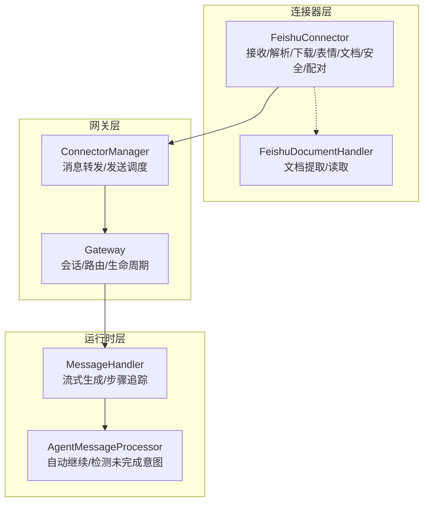
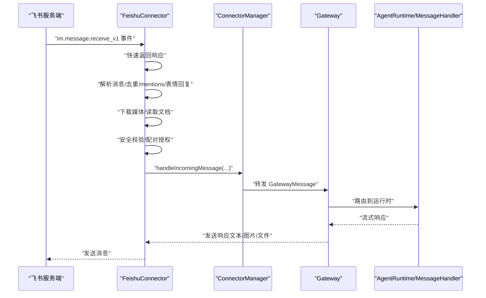
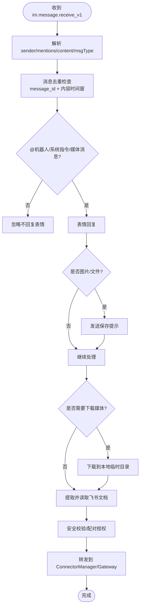
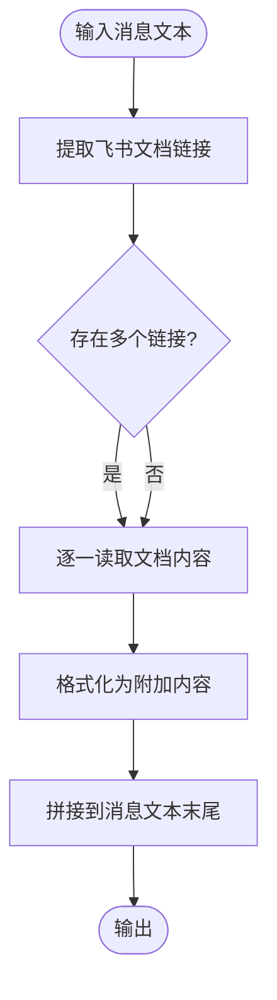
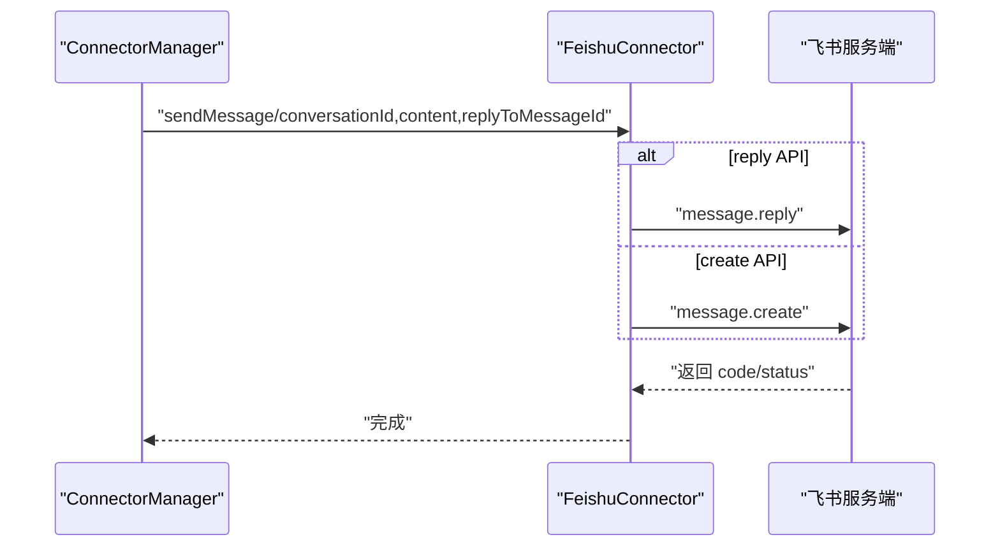
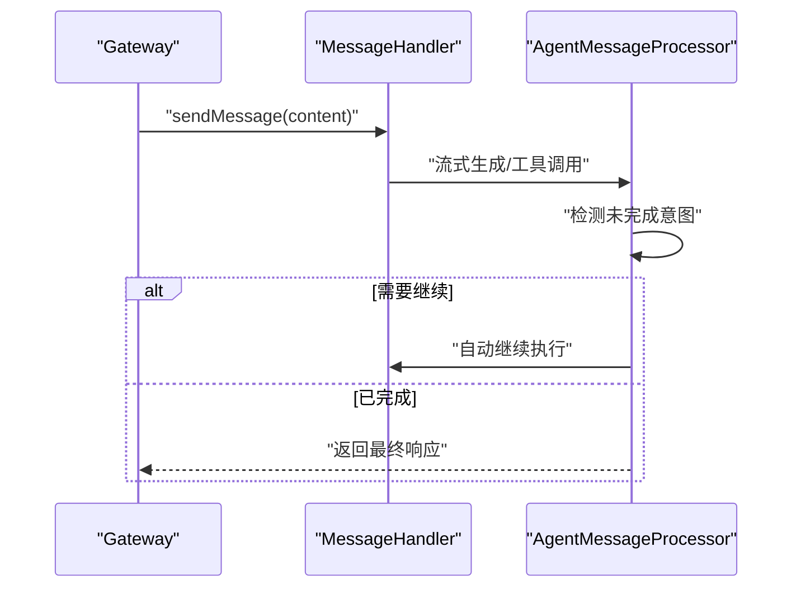
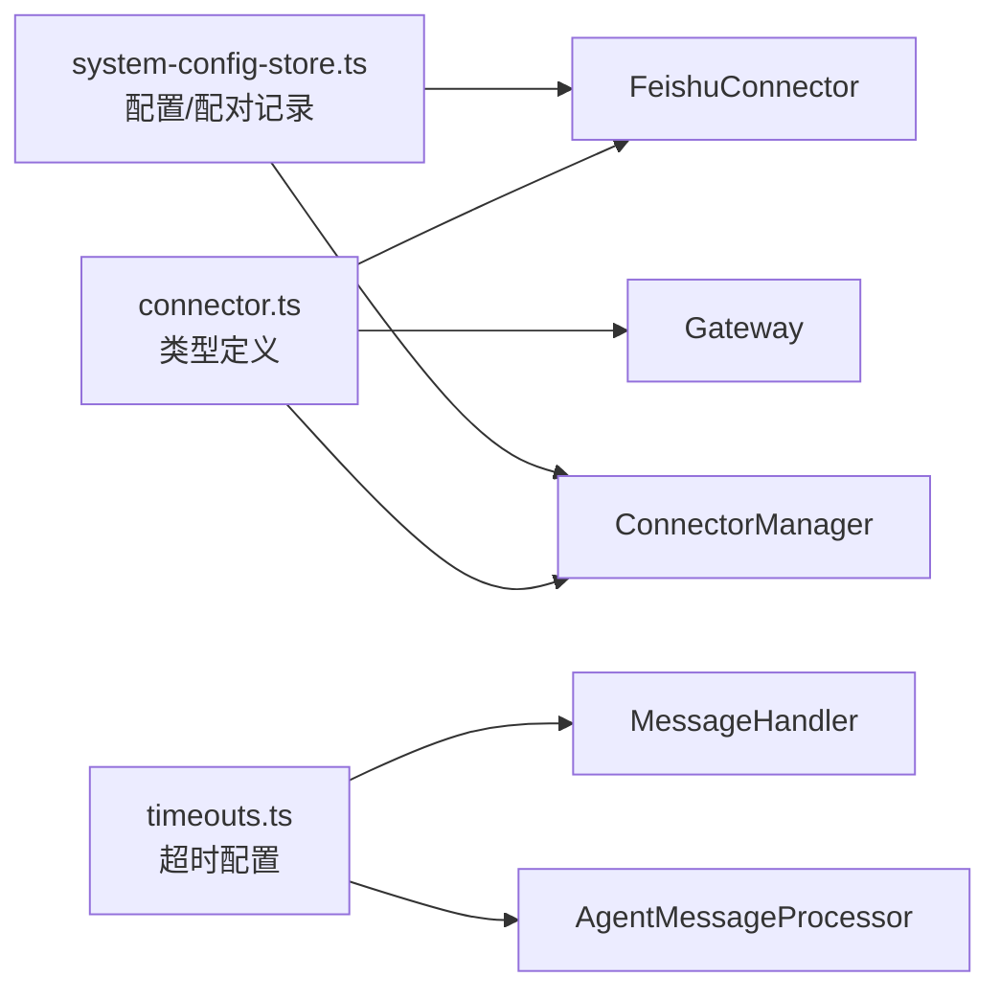

# 消息处理和发送

<cite>
**本文引用的文件**
- [feishu-connector.ts](file://src/main/connectors/feishu/feishu-connector.ts)
- [document-handler.ts](file://src/main/connectors/feishu/document-handler.ts)
- [connector-manager.ts](file://src/main/connectors/connector-manager.ts)
- [gateway.ts](file://src/main/gateway.ts)
- [message-handler.ts](file://src/main/agent-runtime/message-handler.ts)
- [agent-message-processor.ts](file://src/main/agent-runtime/agent-message-processor.ts)
- [feishu-doc-tool.ts](file://src/main/tools/feishu-doc-tool.ts)
- [system-config-store.ts](file://src/main/database/system-config-store.ts)
- [connector.ts](file://src/types/connector.ts)
- [timeouts.ts](file://src/main/config/timeouts.ts)
</cite>

## 目录
1. [简介](#简介)
2. [项目结构](#项目结构)
3. [核心组件](#核心组件)
4. [架构总览](#架构总览)
5. [详细组件分析](#详细组件分析)
6. [依赖关系分析](#依赖关系分析)
7. [性能考量](#性能考量)
8. [故障排查指南](#故障排查指南)
9. [结论](#结论)

## 简介
本文件面向飞书消息处理与发送功能，系统性阐述从消息接收、解析、去重、安全校验、媒体资源下载与本地化、文档内容抽取、配对授权、到消息发送（文本/图片/文件）的完整链路。文档还覆盖错误处理、重试机制与性能优化建议，帮助开发者与运维人员快速理解并高效维护该能力。

## 项目结构
飞书消息处理位于主进程模块中，采用“连接器-网关-运行时”的分层设计：
- 连接器层：负责与飞书官方 SDK 建立长连接、接收事件、解析消息、下载媒体资源、表情回复、文档内容抽取、安全校验与配对授权。
- 网关层：负责会话管理、消息路由、与运行时交互、对外消息发送。
- 运行时层：负责消息流式生成、工具调用、执行步骤追踪、自动继续逻辑。

图表来源
- [feishu-connector.ts:28-175](file://src/main/connectors/feishu/feishu-connector.ts#L28-L175)
- [document-handler.ts:23-93](file://src/main/connectors/feishu/document-handler.ts#L23-L93)
- [connector-manager.ts:21-168](file://src/main/connectors/connector-manager.ts#L21-L168)
- [gateway.ts:33-138](file://src/main/gateway.ts#L33-L138)
- [message-handler.ts:16-113](file://src/main/agent-runtime/message-handler.ts#L16-L113)
- [agent-message-processor.ts:20-82](file://src/main/agent-runtime/agent-message-processor.ts#L20-L82)

章节来源
- [feishu-connector.ts:28-175](file://src/main/connectors/feishu/feishu-connector.ts#L28-L175)
- [connector-manager.ts:21-168](file://src/main/connectors/connector-manager.ts#L21-L168)
- [gateway.ts:33-138](file://src/main/gateway.ts#L33-L138)

## 核心组件
- 飞书连接器（FeishuConnector）：负责 WebSocket 长连接、消息解析、去重、媒体下载、表情回复、文档内容抽取、安全校验与配对授权、对外消息发送。
- 文档处理器（FeishuDocumentHandler）：从消息中提取飞书文档链接，读取文档内容或电子表格数据并格式化。
- 连接器管理器（ConnectorManager）：统一管理连接器生命周期、转发消息到网关、对外发送消息（文本/图片/文件）。
- 网关（Gateway）：会话管理、消息路由、与运行时交互。
- 消息处理器（MessageHandler）：流式生成、执行步骤追踪、停止生成。
- 消息处理器（AgentMessageProcessor）：自动继续、检测未完成意图、保存调试信息。

章节来源
- [feishu-connector.ts:28-175](file://src/main/connectors/feishu/feishu-connector.ts#L28-L175)
- [document-handler.ts:23-93](file://src/main/connectors/feishu/document-handler.ts#L23-L93)
- [connector-manager.ts:21-168](file://src/main/connectors/connector-manager.ts#L21-L168)
- [gateway.ts:33-138](file://src/main/gateway.ts#L33-L138)
- [message-handler.ts:16-113](file://src/main/agent-runtime/message-handler.ts#L16-L113)
- [agent-message-processor.ts:20-82](file://src/main/agent-runtime/agent-message-processor.ts#L20-L82)

## 架构总览
飞书消息处理与发送的关键流程如下：
- 连接器启动后建立 WebSocket 长连接，监听 im.message.receive_v1 事件。
- 收到事件后快速返回响应，异步解析消息、去重、提取 mentions、表情回复、下载媒体资源、读取文档内容。
- 安全校验通过后，将消息转发至 ConnectorManager，再由网关路由到运行时。
- 运行时生成流式响应，支持停止生成、自动继续、执行步骤追踪。
- 网关根据需要调用 ConnectorManager 的发送接口，向飞书发送文本、图片或文件消息。

图表来源
- [feishu-connector.ts:132-149](file://src/main/connectors/feishu/feishu-connector.ts#L132-L149)
- [connector-manager.ts:130-168](file://src/main/connectors/connector-manager.ts#L130-L168)
- [gateway.ts:693-705](file://src/main/gateway.ts#L693-L705)
- [message-handler.ts:114-166](file://src/main/agent-runtime/message-handler.ts#L114-L166)

## 详细组件分析

### 飞书连接器（消息接收与处理）
- 配置管理：加载/保存/校验飞书连接器配置，支持 appId/appSecret。
- 生命周期：初始化 SDK 客户端、启动 WebSocket、后台轮询机器人 open_id、健康检查。
- 消息接收：监听 im.message.receive_v1 事件，快速返回响应，异步处理。
- 消息解析：
  - 提取消息类型（text/post/image/file）、内容（兼容富文本 post）。
  - 提取 mentions 列表，判断是否 @ 机器人；群组消息需 @ 或为系统指令或媒体消息才处理。
- 去重策略：
  - 基于 message_id 的去重集合，最大容量限制。
  - 基于 senderId + 文本内容的时间窗口去重（5 秒）。
- 媒体资源处理：
  - 图片：使用 message-resource API 下载到本地临时目录，返回本地路径与安全文件名。
  - 文件：同上，保持原始扩展名，使用纯英文文件名便于 AI 处理。
- 文档内容抽取：从消息文本中提取飞书文档链接，读取 docx/docs/wiki 或 sheets 内容并拼接到消息文本。
- 安全与配对授权：
  - 私聊未配对用户：生成配对码并通过消息发送；管理员可使用命令批准。
  - 首位用户自动批准并设为管理员，系统注入上下文提示。
- 表情回复：随机选择表情进行即时反馈，提升用户体验。
- 发送接口：支持文本、图片、文件发送，支持 reply API（基于 message_id）。

图表来源
- [feishu-connector.ts:368-577](file://src/main/connectors/feishu/feishu-connector.ts#L368-L577)

章节来源
- [feishu-connector.ts:53-80](file://src/main/connectors/feishu/feishu-connector.ts#L53-L80)
- [feishu-connector.ts:103-175](file://src/main/connectors/feishu/feishu-connector.ts#L103-L175)
- [feishu-connector.ts:267-314](file://src/main/connectors/feishu/feishu-connector.ts#L267-L314)
- [feishu-connector.ts:368-577](file://src/main/connectors/feishu/feishu-connector.ts#L368-L577)
- [feishu-connector.ts:581-800](file://src/main/connectors/feishu/feishu-connector.ts#L581-L800)

### 文档处理器（飞书文档内容抽取）
- URL 提取：支持 docx/docs/wiki/sheets 多类型链接，兼容 Markdown 链接格式。
- 文档读取：
  - docx/docs/wiki：读取文档元信息与原始内容。
  - sheets：读取电子表格元信息、工作表列表，批量读取各工作表值并格式化为文本表格。
- 权限提示：当权限不足时输出明确的权限缺失提示，指导在开放平台添加相应权限。
- 内容格式化：将文档内容拼接到消息文本末尾，便于 AI 一次性处理。

图表来源
- [document-handler.ts:40-93](file://src/main/connectors/feishu/document-handler.ts#L40-L93)
- [document-handler.ts:66-166](file://src/main/connectors/feishu/document-handler.ts#L66-L166)
- [document-handler.ts:171-294](file://src/main/connectors/feishu/document-handler.ts#L171-L294)
- [document-handler.ts:350-367](file://src/main/connectors/feishu/document-handler.ts#L350-L367)

章节来源
- [document-handler.ts:40-93](file://src/main/connectors/feishu/document-handler.ts#L40-L93)
- [document-handler.ts:66-166](file://src/main/connectors/feishu/document-handler.ts#L66-L166)
- [document-handler.ts:171-294](file://src/main/connectors/feishu/document-handler.ts#L171-L294)
- [document-handler.ts:350-367](file://src/main/connectors/feishu/document-handler.ts#L350-L367)

### 连接器管理器（消息转发与发送）
- 转发外部消息：将连接器解析后的消息转换为 GatewayMessage 并转发到网关。
- 发送消息：
  - 文本：支持 reply API（基于 message_id）与普通 create API。
  - 图片：先上传图片到飞书服务器获取 image_key，再发送 image 消息；可选附带说明文字。
  - 文件：先上传文件到飞书服务器获取 file_key，再发送 file 消息。
- 配对通知：统一入口通知连接器某用户的配对已被批准，避免重复实现。

图表来源
- [connector-manager.ts:178-207](file://src/main/connectors/connector-manager.ts#L178-L207)
- [connector-manager.ts:217-249](file://src/main/connectors/connector-manager.ts#L217-L249)
- [connector-manager.ts:259-291](file://src/main/connectors/connector-manager.ts#L259-L291)
- [feishu-connector.ts:581-636](file://src/main/connectors/feishu/feishu-connector.ts#L581-L636)
- [feishu-connector.ts:638-723](file://src/main/connectors/feishu/feishu-connector.ts#L638-L723)
- [feishu-connector.ts:725-800](file://src/main/connectors/feishu/feishu-connector.ts#L725-L800)

章节来源
- [connector-manager.ts:178-207](file://src/main/connectors/connector-manager.ts#L178-L207)
- [connector-manager.ts:217-249](file://src/main/connectors/connector-manager.ts#L217-L249)
- [connector-manager.ts:259-291](file://src/main/connectors/connector-manager.ts#L259-L291)
- [feishu-connector.ts:581-636](file://src/main/connectors/feishu/feishu-connector.ts#L581-L636)
- [feishu-connector.ts:638-723](file://src/main/connectors/feishu/feishu-connector.ts#L638-L723)
- [feishu-connector.ts:725-800](file://src/main/connectors/feishu/feishu-connector.ts#L725-L800)

### 网关与运行时（消息路由与生成）
- 网关职责：会话管理、消息路由、与运行时交互、对外发送响应。
- 运行时职责：流式生成、工具调用、执行步骤追踪、自动继续、错误检测与停止生成。
- 自动继续：检测未完成意图（基于工具调用与响应内容），自动发起“立即执行”继续动作。

图表来源
- [gateway.ts:693-705](file://src/main/gateway.ts#L693-L705)
- [message-handler.ts:114-166](file://src/main/agent-runtime/message-handler.ts#L114-L166)
- [agent-message-processor.ts:345-547](file://src/main/agent-runtime/agent-message-processor.ts#L345-L547)

章节来源
- [gateway.ts:693-705](file://src/main/gateway.ts#L693-L705)
- [message-handler.ts:114-166](file://src/main/agent-runtime/message-handler.ts#L114-L166)
- [agent-message-processor.ts:345-547](file://src/main/agent-runtime/agent-message-processor.ts#L345-L547)

### 飞书云文档工具（可选能力）
- 支持创建文档、获取信息与纯文本、获取所有块、更新块、删除块、添加评论、删除文档、下载云空间文件。
- 依赖连接器配置中的 appId/appSecret，自动缓存 lark Client 实例。
- 提供富文本块工具，支持将 Markdown/HTML 转换为飞书文档块并插入嵌套结构。

章节来源
- [feishu-doc-tool.ts:89-114](file://src/main/tools/feishu-doc-tool.ts#L89-L114)
- [feishu-doc-tool.ts:159-551](file://src/main/tools/feishu-doc-tool.ts#L159-L551)

## 依赖关系分析
- 类型定义：connector.ts 定义了连接器接口、消息格式、配对记录等关键类型，贯穿连接器、网关与运行时。
- 配置存储：system-config-store.ts 提供连接器配置与配对记录的持久化，支持查询、批准、管理员标记等。
- 超时配置：timeouts.ts 提供统一的超时常量，用于 Agent 生成、浏览器、HTTP 等场景。

图表来源
- [connector.ts:76-146](file://src/types/connector.ts#L76-L146)
- [system-config-store.ts:499-539](file://src/main/database/system-config-store.ts#L499-L539)
- [timeouts.ts:9-53](file://src/main/config/timeouts.ts#L9-L53)

章节来源
- [connector.ts:76-146](file://src/types/connector.ts#L76-L146)
- [system-config-store.ts:499-539](file://src/main/database/system-config-store.ts#L499-L539)
- [timeouts.ts:9-53](file://src/main/config/timeouts.ts#L9-L53)

## 性能考量
- 去重策略：双层去重（message_id + 内容时间窗），限制缓存大小，避免重复处理与内存膨胀。
- 异步处理：收到事件后立即返回响应，随后异步处理，降低飞书重推风险与延迟。
- 媒体下载：使用本地临时目录，避免重复下载；图片/文件均使用纯英文文件名，利于 AI 处理。
- 文档读取：对 docx/docs/wiki 与 sheets 分别处理，权限不足时给出明确提示，减少无效重试。
- 流式生成：MessageHandler 采用流式输出，结合超时与停止机制，避免长时间占用。
- 超时与重试：timeouts.ts 提供统一超时配置；可结合 async-utils.retry 进行有限重试（在工具层实现）。

章节来源
- [feishu-connector.ts:40-47](file://src/main/connectors/feishu/feishu-connector.ts#L40-L47)
- [feishu-connector.ts:132-149](file://src/main/connectors/feishu/feishu-connector.ts#L132-L149)
- [feishu-connector.ts:255-261](file://src/main/connectors/feishu/feishu-connector.ts#L255-L261)
- [document-handler.ts:122-127](file://src/main/connectors/feishu/document-handler.ts#L122-L127)
- [message-handler.ts:388-407](file://src/main/agent-runtime/message-handler.ts#L388-L407)
- [timeouts.ts:9-53](file://src/main/config/timeouts.ts#L9-L53)

## 故障排查指南
- 连接器健康检查：healthCheck 返回内部状态，避免每次打开设置页都发 HTTP 请求。
- 表情回复失败：不影响主流程，记录告警日志。
- 下载媒体失败：记录错误并返回占位文本，保证消息继续流转。
- 文档读取失败：输出权限不足提示，指导添加 docx:document:readonly、drive:drive:readonly 或 sheets 权限。
- 发送消息失败：区分 reply API 与 create API 的错误码，抛出可诊断的错误。
- 安全校验失败：私聊未配对用户自动发送配对码；管理员可通过命令批准。
- 生成超时：MessageHandler 使用超时保护与进度日志，必要时可停止生成并清理状态。
- 配对记录：SystemConfigStore 提供查询、批准、删除、管理员标记等操作，配合 ConnectorManager 广播待授权数量。

章节来源
- [feishu-connector.ts:235-248](file://src/main/connectors/feishu/feishu-connector.ts#L235-L248)
- [feishu-connector.ts:353-366](file://src/main/connectors/feishu/feishu-connector.ts#L353-L366)
- [feishu-connector.ts:282-285](file://src/main/connectors/feishu/feishu-connector.ts#L282-L285)
- [document-handler.ts:122-127](file://src/main/connectors/feishu/document-handler.ts#L122-L127)
- [feishu-connector.ts:632-635](file://src/main/connectors/feishu/feishu-connector.ts#L632-L635)
- [message-handler.ts:483-523](file://src/main/agent-runtime/message-handler.ts#L483-L523)
- [system-config-store.ts:499-539](file://src/main/database/system-config-store.ts#L499-L539)
- [connector-manager.ts:319-333](file://src/main/connectors/connector-manager.ts#L319-L333)

## 结论
飞书消息处理与发送功能通过连接器层的全面处理与网关层的统一调度，实现了从消息接收、解析、去重、安全校验、媒体下载、文档抽取到消息发送的完整闭环。配合运行时的流式生成与自动继续机制，既保证了用户体验，也兼顾了性能与可维护性。建议在生产环境中关注权限配置、配对授权与超时策略，以获得稳定可靠的飞书消息处理体验。