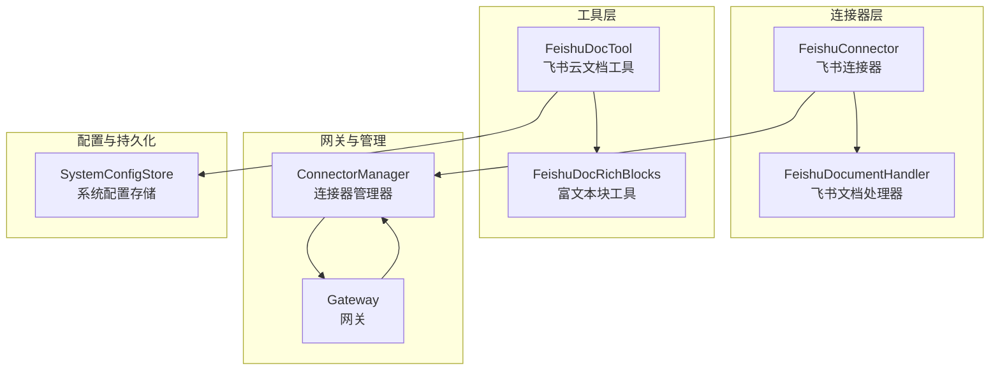
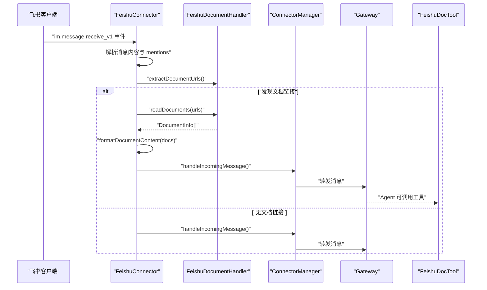
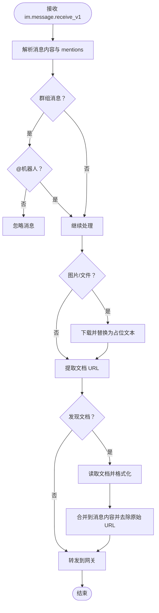
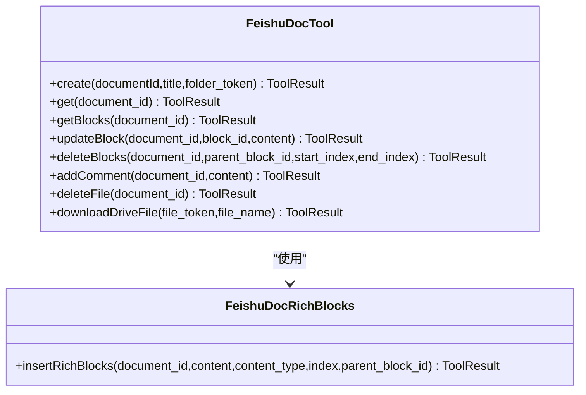
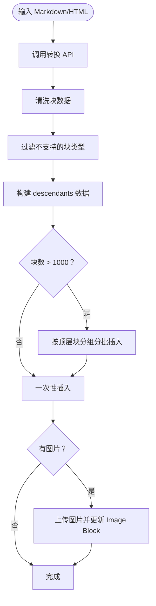
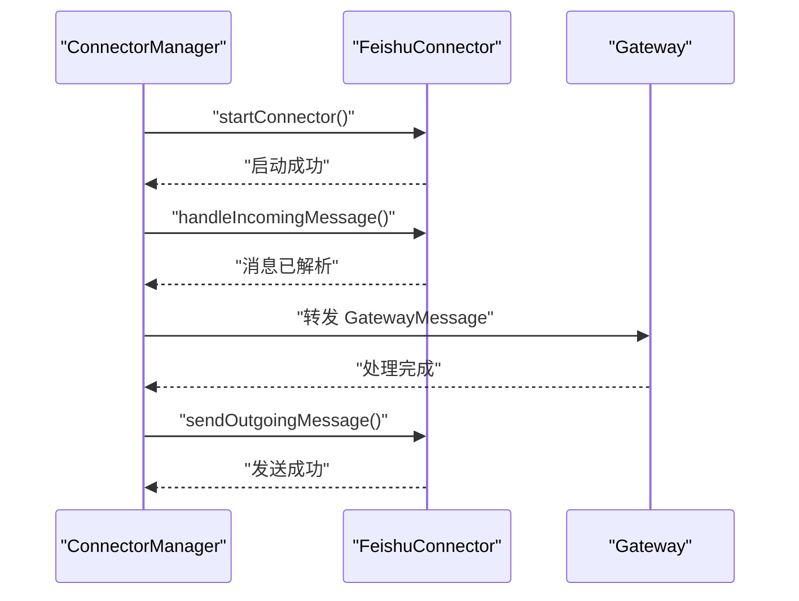
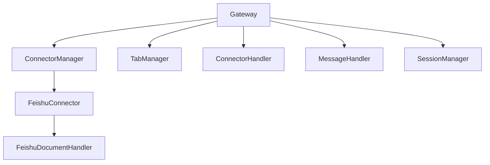
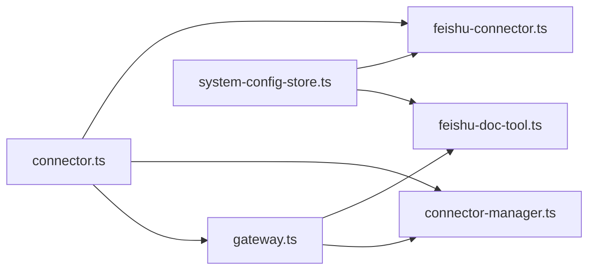

# 飞书文档处理器

<cite>
**本文档引用的文件**
- [document-handler.ts](file://src/main/connectors/feishu/document-handler.ts)
- [feishu-connector.ts](file://src/main/connectors/feishu/feishu-connector.ts)
- [feishu-doc-tool.ts](file://src/main/tools/feishu-doc-tool.ts)
- [feishu-doc-rich-blocks.ts](file://src/main/tools/feishu-doc-rich-blocks.ts)
- [connector-manager.ts](file://src/main/connectors/connector-manager.ts)
- [gateway.ts](file://src/main/gateway.ts)
- [connector.ts](file://src/types/connector.ts)
- [system-config-store.ts](file://src/main/database/system-config-store.ts)
</cite>

## 目录
1. [简介](#简介)
2. [项目结构](#项目结构)
3. [核心组件](#核心组件)
4. [架构概览](#架构概览)
5. [详细组件分析](#详细组件分析)
6. [依赖关系分析](#依赖关系分析)
7. [性能考虑](#性能考虑)
8. [故障排查指南](#故障排查指南)
9. [结论](#结论)
10. [附录](#附录)

## 简介
本文件为飞书文档处理器的综合技术文档，涵盖飞书文档 URL 提取、文档内容读取与富文本块解析、文档内容格式化与多文档合并、内容清理机制、文档协作与权限管理、实时同步与版本管理、处理流程、错误处理与性能优化，以及使用示例与集成指南。文档面向开发者与运维人员，帮助快速理解并集成飞书文档处理能力。

## 项目结构
飞书文档处理能力主要分布在以下模块：
- 连接器层：负责接收飞书消息、提取文档链接、读取文档内容，并将消息转发至网关
- 工具层：提供飞书云文档的增删改查、富文本块插入、评论与文件下载等能力
- 网关与管理：负责消息路由、会话管理、连接器生命周期管理
- 配置与持久化：系统配置存储，包含连接器配置、配对记录等



图表来源
- [feishu-connector.ts:28-101](file://src/main/connectors/feishu/feishu-connector.ts#L28-L101)
- [document-handler.ts:23-28](file://src/main/connectors/feishu/document-handler.ts#L23-L28)
- [feishu-doc-tool.ts:16-44](file://src/main/tools/feishu-doc-tool.ts#L16-L44)
- [feishu-doc-rich-blocks.ts:16-42](file://src/main/tools/feishu-doc-rich-blocks.ts#L16-L42)
- [connector-manager.ts:21-38](file://src/main/connectors/connector-manager.ts#L21-L38)
- [gateway.ts:33-118](file://src/main/gateway.ts#L33-L118)
- [system-config-store.ts:37-70](file://src/main/database/system-config-store.ts#L37-L70)

章节来源
- [feishu-connector.ts:28-101](file://src/main/connectors/feishu/feishu-connector.ts#L28-L101)
- [document-handler.ts:23-28](file://src/main/connectors/feishu/document-handler.ts#L23-L28)
- [feishu-doc-tool.ts:16-44](file://src/main/tools/feishu-doc-tool.ts#L16-L44)
- [feishu-doc-rich-blocks.ts:16-42](file://src/main/tools/feishu-doc-rich-blocks.ts#L16-L42)
- [connector-manager.ts:21-38](file://src/main/connectors/connector-manager.ts#L21-L38)
- [gateway.ts:33-118](file://src/main/gateway.ts#L33-L118)
- [system-config-store.ts:37-70](file://src/main/database/system-config-store.ts#L37-L70)

## 核心组件
- 飞书文档处理器（FeishuDocumentHandler）：负责从消息中提取飞书文档 URL，识别文档类型（docx/docs/wiki/sheets），读取文档元信息与内容，格式化输出。
- 飞书连接器（FeishuConnector）：负责建立飞书 WebSocket 连接，接收消息，解析文本与富文本，提取文档链接并调用文档处理器，处理图片/文件消息，实现去重与安全校验。
- 飞书云文档工具（FeishuDocTool）：提供创建文档、获取信息、获取块列表、更新/删除块、添加评论、删除文档、下载云空间文件等能力；集成富文本块工具。
- 富文本块工具（FeishuDocRichBlocks）：将 Markdown/HTML 转换为飞书文档块，清洗块数据，批量插入嵌套块，处理图片上传与替换。
- 连接器管理器（ConnectorManager）：统一管理连接器生命周期、健康检查、消息转发与外部发送。
- 网关（Gateway）：会话管理、消息路由、工具依赖注入、连接器注册与自动启动。
- 系统配置存储（SystemConfigStore）：持久化连接器配置、配对记录、工作目录等。

章节来源
- [document-handler.ts:23-368](file://src/main/connectors/feishu/document-handler.ts#L23-L368)
- [feishu-connector.ts:28-800](file://src/main/connectors/feishu/feishu-connector.ts#L28-L800)
- [feishu-doc-tool.ts:16-552](file://src/main/tools/feishu-doc-tool.ts#L16-L552)
- [feishu-doc-rich-blocks.ts:16-591](file://src/main/tools/feishu-doc-rich-blocks.ts#L16-L591)
- [connector-manager.ts:21-379](file://src/main/connectors/connector-manager.ts#L21-L379)
- [gateway.ts:33-138](file://src/main/gateway.ts#L33-L138)
- [system-config-store.ts:37-576](file://src/main/database/system-config-store.ts#L37-L576)

## 架构概览
飞书文档处理的整体流程如下：
- 连接器启动并建立 WebSocket 连接，监听 im.message.receive_v1 事件
- 接收消息后，解析文本与富文本，提取飞书文档 URL
- 调用文档处理器读取文档内容（支持 docx/docs/wiki 与 sheets）
- 对于 docx/docs/wiki，读取元信息与原始内容；对于 sheets，读取所有工作表并格式化为文本
- 将文档内容与原文消息合并，去除原始 URL，发送回网关
- 网关将消息路由到 AgentRuntime，Agent 可调用飞书云文档工具进行进一步操作



图表来源
- [feishu-connector.ts:134-146](file://src/main/connectors/feishu/feishu-connector.ts#L134-L146)
- [feishu-connector.ts:368-577](file://src/main/connectors/feishu/feishu-connector.ts#L368-L577)
- [document-handler.ts:40-93](file://src/main/connectors/feishu/document-handler.ts#L40-L93)
- [document-handler.ts:334-345](file://src/main/connectors/feishu/document-handler.ts#L334-L345)
- [connector-manager.ts:130-168](file://src/main/connectors/connector-manager.ts#L130-L168)
- [gateway.ts:688-705](file://src/main/gateway.ts#L688-L705)

章节来源
- [feishu-connector.ts:134-146](file://src/main/connectors/feishu/feishu-connector.ts#L134-L146)
- [feishu-connector.ts:368-577](file://src/main/connectors/feishu/feishu-connector.ts#L368-L577)
- [document-handler.ts:40-93](file://src/main/connectors/feishu/document-handler.ts#L40-L93)
- [document-handler.ts:334-345](file://src/main/connectors/feishu/document-handler.ts#L334-L345)
- [connector-manager.ts:130-168](file://src/main/connectors/connector-manager.ts#L130-L168)
- [gateway.ts:688-705](file://src/main/gateway.ts#L688-L705)

## 详细组件分析

### 飞书文档处理器（FeishuDocumentHandler）
- 文档 URL 提取：支持 docx/docs/wiki/sheets 类型链接，兼容 Markdown 格式的链接
- 文档类型识别：从 URL 中提取文档类型与 ID
- 文档读取：
  - docx/docs/wiki：获取元信息与原始内容，返回标题、URL、内容
  - sheets：获取电子表格元信息与工作表列表，逐表读取值并格式化为文本
- 多文档合并：将多个文档内容合并为统一格式
- 内容格式化：为消息附加内容添加分隔符与标题、链接等

```mermaid
classDiagram
class FeishuDocumentHandler {
+extractDocumentUrls(text) string[]
+readDocument(url) DocumentInfo|null
+readDocuments(urls) DocumentInfo[]
+formatDocumentContent(docs) string
-extractDocumentInfo(url) {id,type}|null
-readDocxDocument(documentId,url) DocumentInfo|null
-readSpreadsheet(spreadsheetToken,url) DocumentInfo|null
-formatSheetData(sheetTitle,values) string
}
class DocumentInfo {
+string documentId
+string title
+string content
+string url
}
```

图表来源
- [document-handler.ts:23-368](file://src/main/connectors/feishu/document-handler.ts#L23-L368)

章节来源
- [document-handler.ts:40-93](file://src/main/connectors/feishu/document-handler.ts#L40-L93)
- [document-handler.ts:98-166](file://src/main/connectors/feishu/document-handler.ts#L98-L166)
- [document-handler.ts:171-294](file://src/main/connectors/feishu/document-handler.ts#L171-L294)
- [document-handler.ts:299-329](file://src/main/connectors/feishu/document-handler.ts#L299-L329)
- [document-handler.ts:334-345](file://src/main/connectors/feishu/document-handler.ts#L334-L345)
- [document-handler.ts:350-367](file://src/main/connectors/feishu/document-handler.ts#L350-L367)

### 飞书连接器（FeishuConnector）
- WebSocket 长连接：使用飞书 SDK 建立事件分发器，监听 im.message.receive_v1
- 消息解析：兼容 text 与 post 富文本，提取 mentions 与 @ 机器人信息
- 去重机制：基于 message_id 与内容时间窗的双重去重
- 安全校验：配对机制与用户权限检查
- 文档处理：调用文档处理器读取文档并合并到消息内容
- 发送能力：支持文本、图片、文件发送，表情回复



图表来源
- [feishu-connector.ts:368-577](file://src/main/connectors/feishu/feishu-connector.ts#L368-L577)
- [feishu-connector.ts:522-536](file://src/main/connectors/feishu/feishu-connector.ts#L522-L536)

章节来源
- [feishu-connector.ts:125-149](file://src/main/connectors/feishu/feishu-connector.ts#L125-L149)
- [feishu-connector.ts:368-577](file://src/main/connectors/feishu/feishu-connector.ts#L368-L577)
- [feishu-connector.ts:522-536](file://src/main/connectors/feishu/feishu-connector.ts#L522-L536)

### 飞书云文档工具（FeishuDocTool）
- 文档操作：创建、获取信息与纯文本、获取块列表、更新/删除块、添加评论、删除文档
- 云空间文件：下载云空间文件（不支持在线文档）
- 协作与权限：自动将发送者添加为文档协作者（管理员）
- 依赖注入：通过 Gateway 注入 SystemConfigStore，读取飞书连接器配置



图表来源
- [feishu-doc-tool.ts:159-551](file://src/main/tools/feishu-doc-tool.ts#L159-L551)
- [feishu-doc-rich-blocks.ts:375-591](file://src/main/tools/feishu-doc-rich-blocks.ts#L375-L591)

章节来源
- [feishu-doc-tool.ts:159-551](file://src/main/tools/feishu-doc-tool.ts#L159-L551)
- [feishu-doc-tool.ts:65-83](file://src/main/tools/feishu-doc-tool.ts#L65-L83)
- [feishu-doc-tool.ts:89-114](file://src/main/tools/feishu-doc-tool.ts#L89-L114)

### 富文本块工具（FeishuDocRichBlocks）
- Markdown/HTML 转换：调用飞书转换 API 获取块数据
- 块数据清洗：去除只读属性、修正字段名、清理样式
- 嵌套块插入：使用 descendant API 批量插入，支持分批（上限 1000 块）
- 图片处理：下载图片并上传到 Image Block，更新块内容
- 错误处理：统一错误返回与日志记录



图表来源
- [feishu-doc-rich-blocks.ts:201-238](file://src/main/tools/feishu-doc-rich-blocks.ts#L201-L238)
- [feishu-doc-rich-blocks.ts:418-552](file://src/main/tools/feishu-doc-rich-blocks.ts#L418-L552)
- [feishu-doc-rich-blocks.ts:297-362](file://src/main/tools/feishu-doc-rich-blocks.ts#L297-L362)

章节来源
- [feishu-doc-rich-blocks.ts:201-238](file://src/main/tools/feishu-doc-rich-blocks.ts#L201-L238)
- [feishu-doc-rich-blocks.ts:418-552](file://src/main/tools/feishu-doc-rich-blocks.ts#L418-L552)
- [feishu-doc-rich-blocks.ts:297-362](file://src/main/tools/feishu-doc-rich-blocks.ts#L297-L362)

### 连接器管理器（ConnectorManager）
- 生命周期管理：启动/停止连接器，健康检查
- 消息路由：将外部消息转换为 GatewayMessage 并转发
- 外部发送：支持文本、图片、文件发送
- 配对通知：通知连接器配对批准



图表来源
- [connector-manager.ts:45-81](file://src/main/connectors/connector-manager.ts#L45-L81)
- [connector-manager.ts:130-168](file://src/main/connectors/connector-manager.ts#L130-L168)
- [connector-manager.ts:178-207](file://src/main/connectors/connector-manager.ts#L178-L207)

章节来源
- [connector-manager.ts:45-81](file://src/main/connectors/connector-manager.ts#L45-L81)
- [connector-manager.ts:130-168](file://src/main/connectors/connector-manager.ts#L130-L168)
- [connector-manager.ts:178-207](file://src/main/connectors/connector-manager.ts#L178-L207)

### 网关（Gateway）
- 会话管理：为每个 Tab 维护 AgentRuntime
- 连接器注册：自动注册并启动已启用的连接器
- 依赖注入：向工具传递 SystemConfigStore 等依赖
- 消息路由：将连接器消息转发到 AgentRuntime



图表来源
- [gateway.ts:72-118](file://src/main/gateway.ts#L72-L118)
- [gateway.ts:688-705](file://src/main/gateway.ts#L688-L705)

章节来源
- [gateway.ts:72-118](file://src/main/gateway.ts#L72-L118)
- [gateway.ts:688-705](file://src/main/gateway.ts#L688-L705)

## 依赖关系分析
- 类型系统：connector.ts 定义了连接器接口、消息格式、配置类型等，贯穿连接器与工具层
- 配置存储：system-config-store.ts 提供连接器配置与配对记录的持久化，被工具与连接器共享
- 工具依赖：feishu-doc-tool.ts 通过 Gateway 注入 SystemConfigStore，读取飞书连接器配置



图表来源
- [connector.ts:76-146](file://src/types/connector.ts#L76-L146)
- [system-config-store.ts:445-463](file://src/main/database/system-config-store.ts#L445-L463)
- [feishu-doc-tool.ts:40-44](file://src/main/tools/feishu-doc-tool.ts#L40-L44)
- [feishu-connector.ts:48-50](file://src/main/connectors/feishu/feishu-connector.ts#L48-L50)
- [gateway.ts:114-117](file://src/main/gateway.ts#L114-L117)

章节来源
- [connector.ts:76-146](file://src/types/connector.ts#L76-L146)
- [system-config-store.ts:445-463](file://src/main/database/system-config-store.ts#L445-L463)
- [feishu-doc-tool.ts:40-44](file://src/main/tools/feishu-doc-tool.ts#L40-L44)
- [feishu-connector.ts:48-50](file://src/main/connectors/feishu/feishu-connector.ts#L48-L50)
- [gateway.ts:114-117](file://src/main/gateway.ts#L114-L117)

## 性能考虑
- 去重策略：基于 message_id 与内容时间窗的双重去重，避免重复处理与飞书重复推送
- 分批插入：富文本块插入支持分批（每批不超过 1000 个块），降低单次请求压力
- 缓存与复用：工具层对 Lark Client 进行缓存，配置不变时复用实例
- 异步处理：消息到达后立即返回响应，异步处理避免阻塞事件推送
- 临时文件：图片/文件下载到本地临时目录，避免直接传输大文件

章节来源
- [feishu-connector.ts:454-486](file://src/main/connectors/feishu/feishu-connector.ts#L454-L486)
- [feishu-doc-rich-blocks.ts:502-552](file://src/main/tools/feishu-doc-rich-blocks.ts#L502-L552)
- [feishu-doc-tool.ts:89-114](file://src/main/tools/feishu-doc-tool.ts#L89-L114)
- [feishu-connector.ts:137-141](file://src/main/connectors/feishu/feishu-connector.ts#L137-L141)

## 故障排查指南
- 权限不足：当读取文档或电子表格失败且返回特定错误码时，检查飞书开放平台权限配置（docx:document:readonly、drive:drive:readonly、sheets:spreadsheet:readonly 等）
- 配对与安全：私聊未配对时会生成配对码；管理员可通过命令批准；检查配对记录与权限状态
- 文档读取失败：确认 URL 格式正确、文档可见性与权限；检查网络与飞书 API 响应
- 富文本插入失败：检查 Markdown/HTML 格式、块类型支持情况、图片 URL 可访问性；查看日志中的错误信息
- 连接器健康：通过 ConnectorManager.healthCheck 检查连接器状态

章节来源
- [document-handler.ts:122-127](file://src/main/connectors/feishu/document-handler.ts#L122-L127)
- [document-handler.ts:196-201](file://src/main/connectors/feishu/document-handler.ts#L196-L201)
- [feishu-connector.ts:544-569](file://src/main/connectors/feishu/feishu-connector.ts#L544-L569)
- [feishu-doc-rich-blocks.ts:582-585](file://src/main/tools/feishu-doc-rich-blocks.ts#L582-L585)
- [connector-manager.ts:341-358](file://src/main/connectors/connector-manager.ts#L341-L358)

## 结论
飞书文档处理器通过连接器层的消息解析与文档读取、工具层的富文本块插入与文档管理，结合网关与配置存储的统一管理，实现了从飞书消息中自动提取与读取文档、格式化内容并进行多文档合并的能力。配合去重、分批插入、缓存复用等性能优化策略，以及完善的错误处理与健康检查机制，能够稳定地支撑文档协作与自动化处理场景。

## 附录

### 使用示例与集成指南
- 配置飞书连接器：在系统设置中填写 appId 与 appSecret，启用连接器
- 在飞书群组或私聊中发送包含飞书文档链接的消息，连接器将自动提取并读取文档内容
- Agent 可通过飞书云文档工具进行文档操作（创建、读取、插入富文本块、添加评论、下载文件等）
- 集成步骤：
  1) 在 Gateway 中注册并启动 FeishuConnector
  2) 通过 ConnectorManager.healthCheck 检查连接器健康状态
  3) 在消息处理流程中调用 FeishuDocumentHandler.readDocuments 读取文档
  4) 使用 FeishuDocTool 与 FeishuDocRichBlocks 进行文档编辑与富文本插入

章节来源
- [gateway.ts:75-98](file://src/main/gateway.ts#L75-L98)
- [connector-manager.ts:341-358](file://src/main/connectors/connector-manager.ts#L341-L358)
- [feishu-connector.ts:522-536](file://src/main/connectors/feishu/feishu-connector.ts#L522-L536)
- [feishu-doc-tool.ts:159-551](file://src/main/tools/feishu-doc-tool.ts#L159-L551)