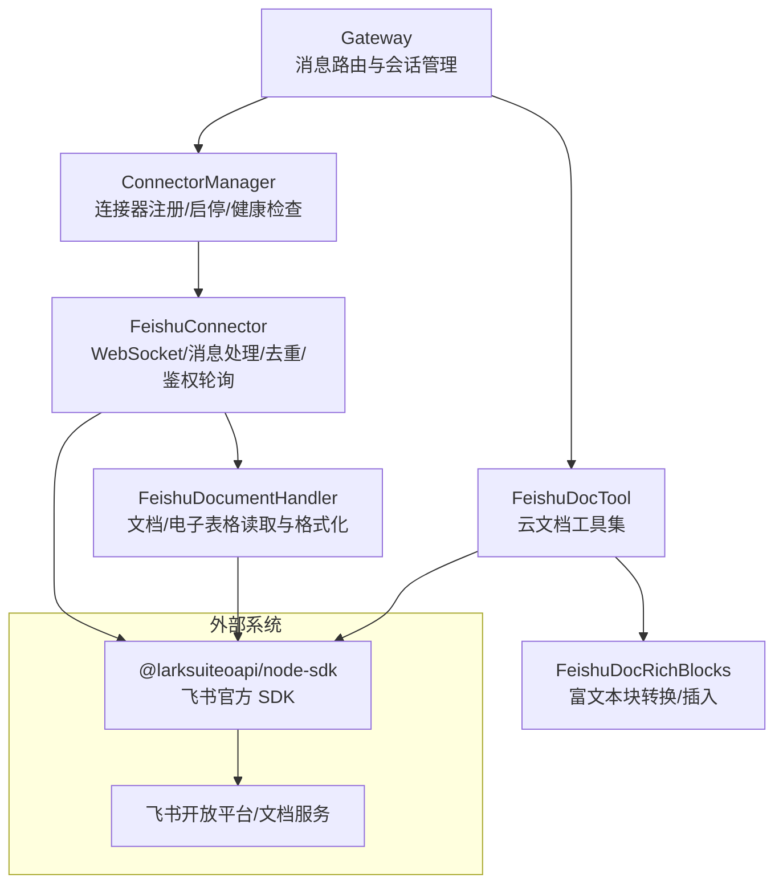
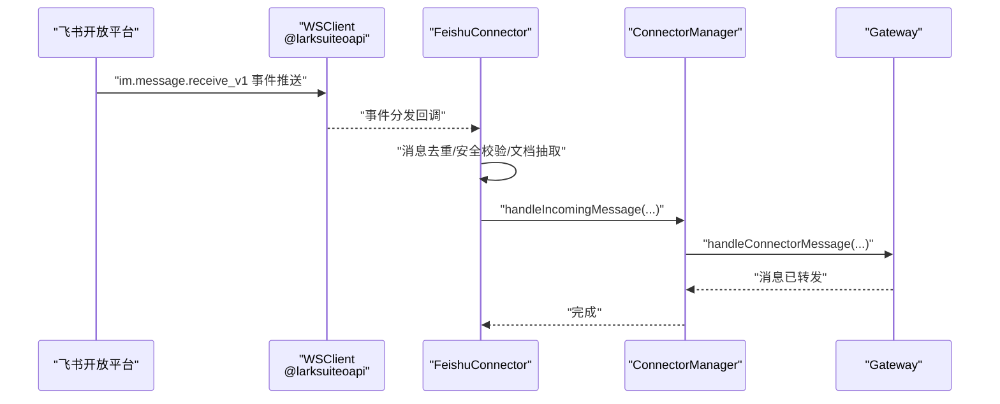
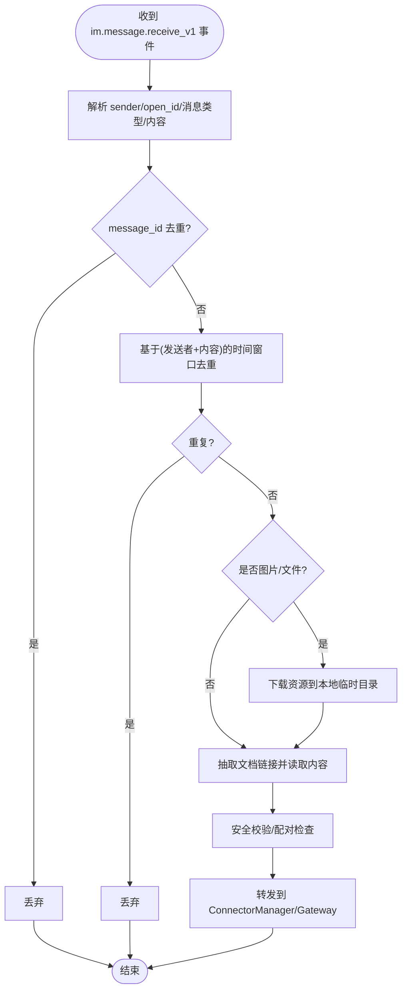
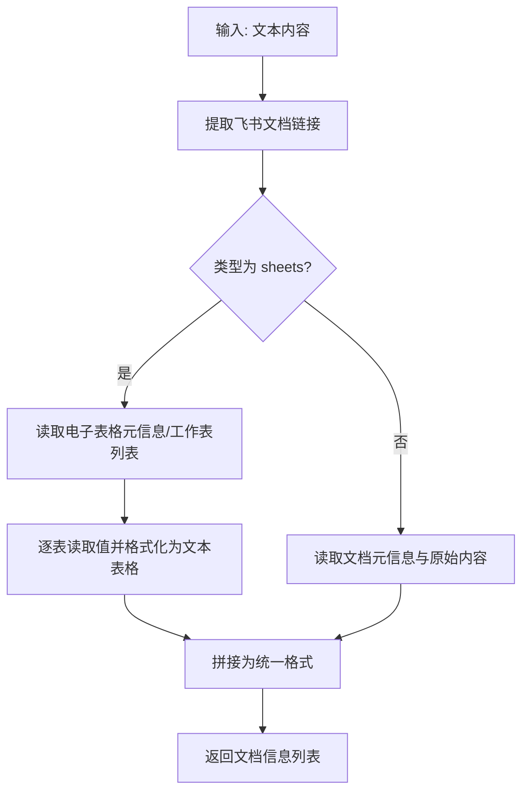
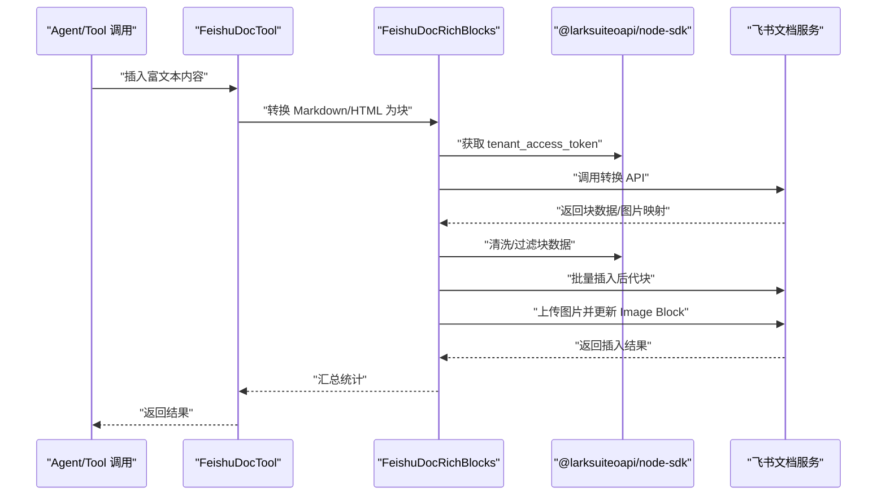
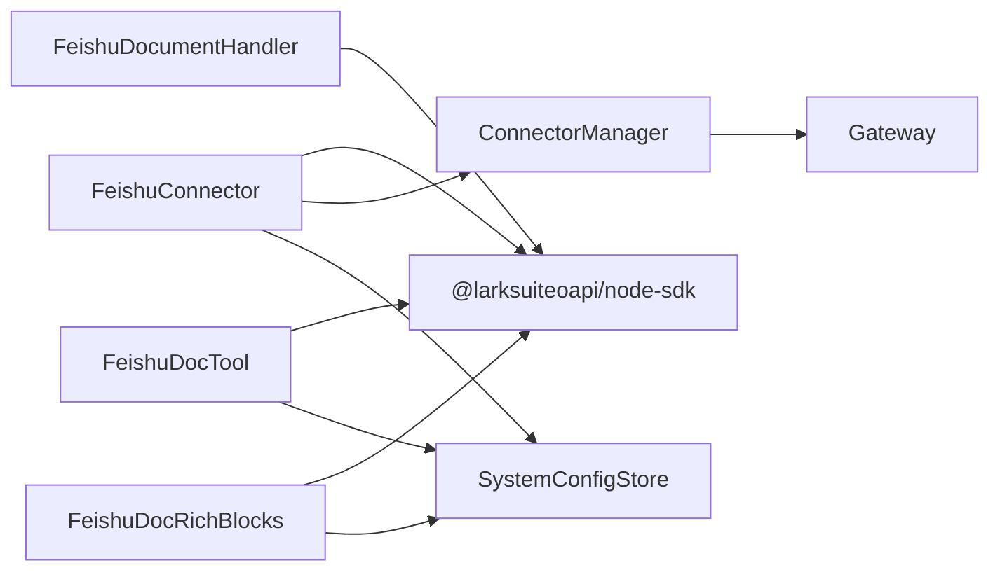

# 飞书连接器

<cite>
**本文引用的文件**
- [feishu-connector.ts](file://src/main/connectors/feishu/feishu-connector.ts)
- [document-handler.ts](file://src/main/connectors/feishu/document-handler.ts)
- [connector-manager.ts](file://src/main/connectors/connector-manager.ts)
- [feishu-doc-tool.ts](file://src/main/tools/feishu-doc-tool.ts)
- [feishu-doc-rich-blocks.ts](file://src/main/tools/feishu-doc-rich-blocks.ts)
- [connector.ts](file://src/types/connector.ts)
- [gateway.ts](file://src/main/gateway.ts)
- [connectors.ts](file://src/server/routes/connectors.ts)
- [connector-handlers.ts](file://src/main/tools/handlers/connector-handlers.ts)
- [logger.ts](file://src/shared/utils/logger.ts)
</cite>

## 目录
1. [简介](#简介)
2. [项目结构](#项目结构)
3. [核心组件](#核心组件)
4. [架构总览](#架构总览)
5. [详细组件分析](#详细组件分析)
6. [依赖关系分析](#依赖关系分析)
7. [性能考量](#性能考量)
8. [故障排查指南](#故障排查指南)
9. [结论](#结论)
10. [附录](#附录)

## 简介
本文件为 史丽慧小助理 飞书连接器的综合技术文档，覆盖架构设计与实现细节，包括：
- WebSocket 连接建立与心跳维持
- 消息去重机制（基于消息 ID 与内容窗口）
- 文档处理器对飞书文档/电子表格的读取与内容格式化
- 飞书消息格式转换、会话管理与用户认证流程
- 配置指南、API 使用示例与性能优化建议
- 常见问题排查与安全注意事项

## 项目结构
飞书连接器位于主进程模块中，采用“连接器 + 文档处理器 + 工具”的分层设计：
- 连接器负责与飞书服务交互（WebSocket、消息收发、鉴权轮询）
- 文档处理器负责解析并读取飞书文档/电子表格内容
- 工具层提供对飞书云文档的创建、读取、块级编辑、富文本插入等能力
- 网关与连接器管理器负责生命周期管理、消息路由与健康检查

图表来源
- [gateway.ts:69-93](file://src/main/gateway.ts#L69-L93)
- [connector-manager.ts:21-38](file://src/main/connectors/connector-manager.ts#L21-L38)
- [feishu-connector.ts:28-101](file://src/main/connectors/feishu/feishu-connector.ts#L28-L101)
- [document-handler.ts:23-28](file://src/main/connectors/feishu/document-handler.ts#L23-L28)
- [feishu-doc-tool.ts:17-44](file://src/main/tools/feishu-doc-tool.ts#L17-L44)
- [feishu-doc-rich-blocks.ts:17-42](file://src/main/tools/feishu-doc-rich-blocks.ts#L17-L42)

章节来源
- [gateway.ts:69-93](file://src/main/gateway.ts#L69-L93)
- [connector-manager.ts:21-38](file://src/main/connectors/connector-manager.ts#L21-L38)

## 核心组件
- 飞书连接器（FeishuConnector）
  - 负责初始化飞书 SDK、建立 WebSocket 长连接、事件分发、消息去重、媒体资源下载、用户名称缓存、机器人 open_id 轮询、健康检查与消息发送
- 文档处理器（FeishuDocumentHandler）
  - 负责从消息中提取飞书文档链接、读取文档/电子表格内容、格式化为文本并附加到消息
- 连接器管理器（ConnectorManager）
  - 负责连接器注册、启停、健康检查、消息路由到网关
- 云文档工具（FeishuDocTool + FeishuDocRichBlocks）
  - 提供创建/读取/更新/删除文档块、插入富文本（Markdown/HTML）为飞书块、上传图片等能力

章节来源
- [feishu-connector.ts:28-101](file://src/main/connectors/feishu/feishu-connector.ts#L28-L101)
- [document-handler.ts:23-93](file://src/main/connectors/feishu/document-handler.ts#L23-L93)
- [connector-manager.ts:21-81](file://src/main/connectors/connector-manager.ts#L21-L81)
- [feishu-doc-tool.ts:17-52](file://src/main/tools/feishu-doc-tool.ts#L17-L52)
- [feishu-doc-rich-blocks.ts:17-42](file://src/main/tools/feishu-doc-rich-blocks.ts#L17-L42)

## 架构总览
飞书连接器通过飞书官方 Node.js SDK 建立 WebSocket 长连接，监听 im.message.receive_v1 事件；消息到达后进行去重、安全校验、文档内容抽取与格式化，最终通过 ConnectorManager 转发至 Gateway。

图表来源
- [feishu-connector.ts:132-149](file://src/main/connectors/feishu/feishu-connector.ts#L132-L149)
- [connector-manager.ts:130-168](file://src/main/connectors/connector-manager.ts#L130-L168)

章节来源
- [feishu-connector.ts:132-149](file://src/main/connectors/feishu/feishu-connector.ts#L132-L149)
- [connector-manager.ts:130-168](file://src/main/connectors/connector-manager.ts#L130-L168)

## 详细组件分析

### 飞书连接器（WebSocket、去重、鉴权轮询）
- WebSocket 连接建立
  - 初始化 Lark.Client 与 Lark.WSClient，注册 im.message.receive_v1 事件分发器，启动长连接
- 消息去重
  - 基于消息 ID 的 Set 缓存（上限 1000），以及基于“发送者+文本内容”的时间窗口去重（默认 5 秒）
- 机器人 open_id 轮询
  - 后台定时轮询获取机器人 open_id，避免阻塞连接启动；失败时 5 秒重试
- 健康检查
  - 直接检查内部状态，避免每次打开设置页都发起网络请求
- 消息发送
  - 支持文本、图片、文件发送；reply API 与 create API 双通道；自动处理响应 code

图表来源
- [feishu-connector.ts:368-577](file://src/main/connectors/feishu/feishu-connector.ts#L368-L577)

章节来源
- [feishu-connector.ts:103-175](file://src/main/connectors/feishu/feishu-connector.ts#L103-L175)
- [feishu-connector.ts:181-233](file://src/main/connectors/feishu/feishu-connector.ts#L181-L233)
- [feishu-connector.ts:235-248](file://src/main/connectors/feishu/feishu-connector.ts#L235-L248)
- [feishu-connector.ts:368-577](file://src/main/connectors/feishu/feishu-connector.ts#L368-L577)

### 文档处理器（文档/电子表格读取与格式化）
- 文档链接提取
  - 支持 docx/docs/wiki/sheets 多类型链接，兼容 Markdown 链接格式
- 文档读取
  - docx/docs/wiki：获取元信息与原始内容，返回标题、URL、内容
  - sheets：获取电子表格元信息与工作表列表，逐表读取值并格式化为文本表格
- 内容格式化
  - 将多个文档内容拼接为统一格式附加到消息中

图表来源
- [document-handler.ts:40-93](file://src/main/connectors/feishu/document-handler.ts#L40-L93)
- [document-handler.ts:98-166](file://src/main/connectors/feishu/document-handler.ts#L98-L166)
- [document-handler.ts:171-294](file://src/main/connectors/feishu/document-handler.ts#L171-L294)
- [document-handler.ts:350-367](file://src/main/connectors/feishu/document-handler.ts#L350-L367)

章节来源
- [document-handler.ts:40-93](file://src/main/connectors/feishu/document-handler.ts#L40-L93)
- [document-handler.ts:98-166](file://src/main/connectors/feishu/document-handler.ts#L98-L166)
- [document-handler.ts:171-294](file://src/main/connectors/feishu/document-handler.ts#L171-L294)
- [document-handler.ts:350-367](file://src/main/connectors/feishu/document-handler.ts#L350-L367)

### 云文档工具（创建/读取/块级编辑/富文本插入）
- 客户端缓存
  - 基于 appId/appSecret 缓存 lark Client，配置不变时复用
- 权限与协作者
  - 创建文档后自动添加发送者为协作者（管理员权限）
- 丰富格式块
  - 将 Markdown/HTML 转换为飞书块，清洗/过滤不支持的块类型，批量插入后代块，并处理图片上传

图表来源
- [feishu-doc-tool.ts:89-114](file://src/main/tools/feishu-doc-tool.ts#L89-L114)
- [feishu-doc-tool.ts:194-202](file://src/main/tools/feishu-doc-tool.ts#L194-L202)
- [feishu-doc-rich-blocks.ts:201-238](file://src/main/tools/feishu-doc-rich-blocks.ts#L201-L238)
- [feishu-doc-rich-blocks.ts:418-586](file://src/main/tools/feishu-doc-rich-blocks.ts#L418-L586)

章节来源
- [feishu-doc-tool.ts:89-114](file://src/main/tools/feishu-doc-tool.ts#L89-L114)
- [feishu-doc-tool.ts:194-202](file://src/main/tools/feishu-doc-tool.ts#L194-L202)
- [feishu-doc-rich-blocks.ts:201-238](file://src/main/tools/feishu-doc-rich-blocks.ts#L201-L238)
- [feishu-doc-rich-blocks.ts:418-586](file://src/main/tools/feishu-doc-rich-blocks.ts#L418-L586)

### 配置与 API 使用示例
- 配置保存与启用
  - 通过工具处理器设置飞书连接器配置并启用
- 连接器启停与健康检查
  - 通过网关适配器与路由接口进行启停与健康检查
- 配对管理
  - 获取/批准/删除配对记录，通知连接器发送欢迎消息

章节来源
- [connector-handlers.ts:26-58](file://src/main/tools/handlers/connector-handlers.ts#L26-L58)
- [connector-handlers.ts:64-101](file://src/main/tools/handlers/connector-handlers.ts#L64-L101)
- [connector-handlers.ts:178-222](file://src/main/tools/handlers/connector-handlers.ts#L178-L222)
- [connectors.ts:16-26](file://src/server/routes/connectors.ts#L16-L26)
- [connectors.ts:71-84](file://src/server/routes/connectors.ts#L71-L84)
- [connectors.ts:109-122](file://src/server/routes/connectors.ts#L109-L122)
- [connectors.ts:190-200](file://src/server/routes/connectors.ts#L190-L200)

## 依赖关系分析
- 组件耦合
  - FeishuConnector 依赖 @larksuiteoapi/node-sdk、SystemConfigStore、ConnectorManager
  - FeishuDocumentHandler 依赖 Lark.Client
  - ConnectorManager 依赖 Gateway、SystemConfigStore
  - FeishuDocTool/FeishuDocRichBlocks 依赖 SystemConfigStore 与 Lark.Client
- 外部依赖
  - 飞书开放平台 API（文档/电子表格/IM/图片/文件等）

图表来源
- [feishu-connector.ts:11-25](file://src/main/connectors/feishu/feishu-connector.ts#L11-L25)
- [document-handler.ts:7-8](file://src/main/connectors/feishu/document-handler.ts#L7-L8)
- [connector-manager.ts:11-19](file://src/main/connectors/connector-manager.ts#L11-L19)
- [feishu-doc-tool.ts:17-24](file://src/main/tools/feishu-doc-tool.ts#L17-L24)
- [feishu-doc-rich-blocks.ts:17-21](file://src/main/tools/feishu-doc-rich-blocks.ts#L17-L21)

章节来源
- [feishu-connector.ts:11-25](file://src/main/connectors/feishu/feishu-connector.ts#L11-L25)
- [document-handler.ts:7-8](file://src/main/connectors/feishu/document-handler.ts#L7-L8)
- [connector-manager.ts:11-19](file://src/main/connectors/connector-manager.ts#L11-L19)
- [feishu-doc-tool.ts:17-24](file://src/main/tools/feishu-doc-tool.ts#L17-L24)
- [feishu-doc-rich-blocks.ts:17-21](file://src/main/tools/feishu-doc-rich-blocks.ts#L17-L21)

## 性能考量
- 去重策略
  - 消息 ID 去重 + 内容时间窗口去重，避免重复处理与资源浪费
- 资源下载
  - 图片/文件下载到本地临时目录，避免将大文件直接传给下游模型
- 批量插入富文本块
  - 对超过阈值的块集合进行分批插入，降低单次请求压力
- 定时轮询
  - 机器人 open_id 轮询采用 5 秒间隔，失败重试，避免阻塞启动流程
- 日志与监控
  - 统一日志工具，支持文件落盘与级别控制，便于定位性能瓶颈

章节来源
- [feishu-connector.ts:40-47](file://src/main/connectors/feishu/feishu-connector.ts#L40-L47)
- [feishu-connector.ts:255-314](file://src/main/connectors/feishu/feishu-connector.ts#L255-L314)
- [feishu-doc-rich-blocks.ts:502-552](file://src/main/tools/feishu-doc-rich-blocks.ts#L502-L552)
- [feishu-connector.ts:181-233](file://src/main/connectors/feishu/feishu-connector.ts#L181-L233)
- [logger.ts:16-49](file://src/shared/utils/logger.ts#L16-L49)

## 故障排查指南
- 连接器未启动/未连接
  - 使用健康检查接口确认状态；检查配置是否保存并启用
- 机器人 open_id 获取失败
  - 检查 App ID/Secret 是否正确；查看轮询日志；确认网络可达性
- 文档读取失败
  - 检查权限：docx:document:readonly、drive:drive:readonly、sheets:spreadsheet:readonly 等
  - 确认文档链接格式与可访问性
- 富文本插入失败
  - 检查 Markdown/HTML 格式；关注不支持的块类型；查看图片上传失败日志
- 配对与权限
  - 通过配对记录接口查看待审核/已审核状态；批准后通知连接器发送欢迎消息

章节来源
- [connectors.ts:109-122](file://src/server/routes/connectors.ts#L109-L122)
- [document-handler.ts:122-126](file://src/main/connectors/feishu/document-handler.ts#L122-L126)
- [document-handler.ts:196-200](file://src/main/connectors/feishu/document-handler.ts#L196-L200)
- [feishu-doc-rich-blocks.ts:558-566](file://src/main/tools/feishu-doc-rich-blocks.ts#L558-L566)
- [connector-handlers.ts:178-222](file://src/main/tools/handlers/connector-handlers.ts#L178-L222)

## 结论
飞书连接器通过稳健的 WebSocket 长连接、完善的去重与鉴权机制、灵活的文档读取与富文本插入能力，实现了与飞书生态的深度集成。配合网关与工具层，能够满足从消息收发到文档协作的完整需求。建议在生产环境中开启日志落盘、合理设置去重窗口与批处理阈值，并持续关注飞书开放平台权限与接口变更。

## 附录

### 配置指南
- 在设置页面中填写 App ID 与 App Secret，保存后可选择启用连接器
- 启用后连接器自动拉取机器人 open_id 并建立 WebSocket 连接
- 可通过健康检查接口确认连接状态

章节来源
- [ConnectorConfig.tsx:232-280](file://src/renderer/components/settings/ConnectorConfig.tsx#L232-L280)
- [connectors.ts:16-26](file://src/server/routes/connectors.ts#L16-L26)
- [connectors.ts:71-84](file://src/server/routes/connectors.ts#L71-L84)
- [connectors.ts:109-122](file://src/server/routes/connectors.ts#L109-L122)

### API 使用示例（概览）
- 设置飞书连接器配置
  - 工具：设置飞书连接器配置
  - 参数：appId、appSecret、enabled（可选）
- 启用/禁用连接器
  - 工具：启用/禁用连接器
  - 参数：connectorId='feishu'、enabled=true/false
- 健康检查
  - 路由：GET /api/connectors/:connectorId/health
- 配对管理
  - 获取配对记录：GET /api/connectors/pairing
  - 批准配对：POST /api/connectors/pairing/approve
  - 删除配对：DELETE /api/connectors/:connectorId/pairing/:userId

章节来源
- [feishu-doc-tool.ts:108-128](file://src/main/tools/feishu-doc-tool.ts#L108-L128)
- [connectors.ts:16-26](file://src/server/routes/connectors.ts#L16-L26)
- [connectors.ts:109-122](file://src/server/routes/connectors.ts#L109-L122)
- [connectors.ts:186-211](file://src/server/routes/connectors.ts#L186-L211)