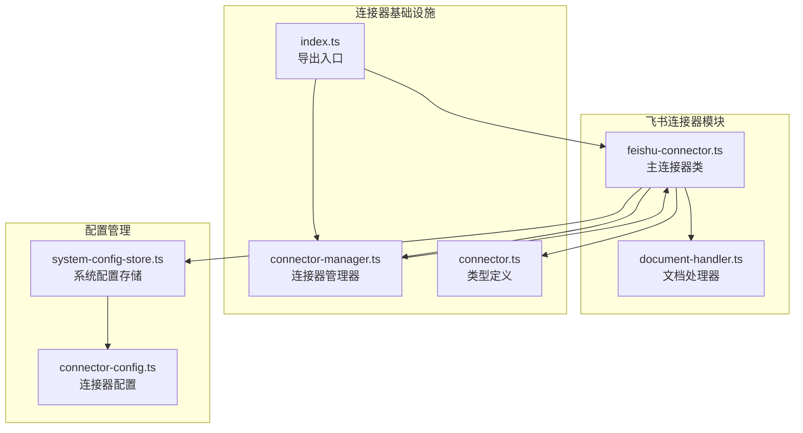
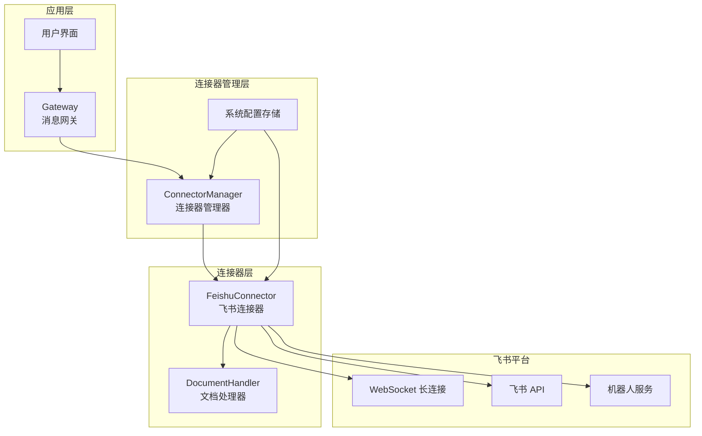
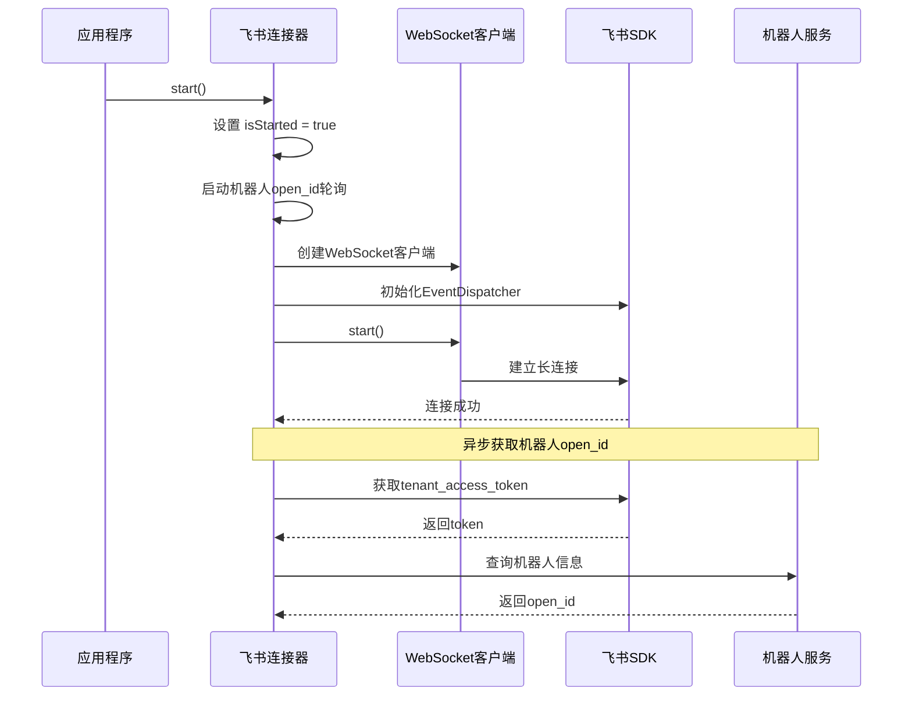
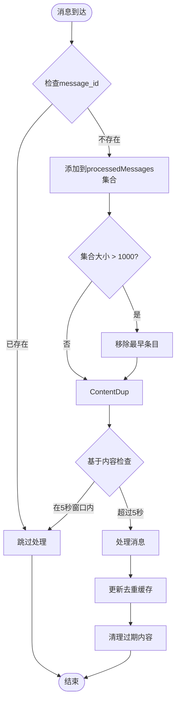
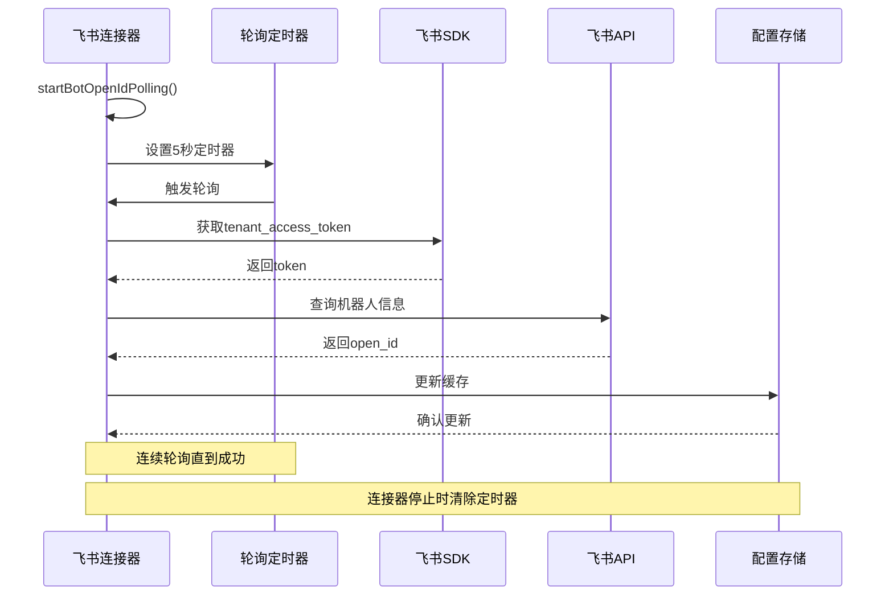
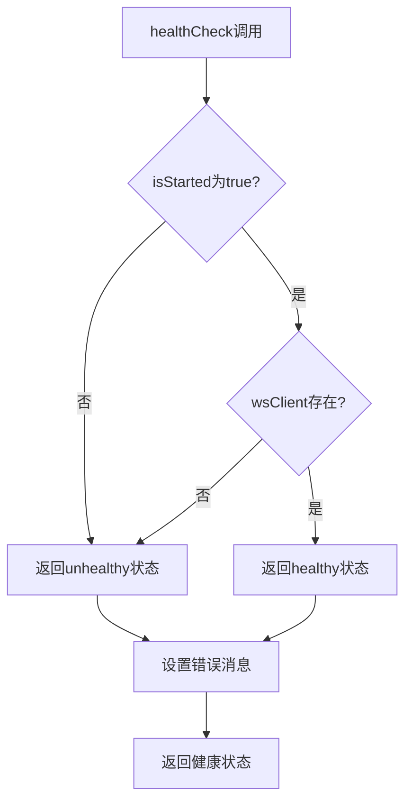
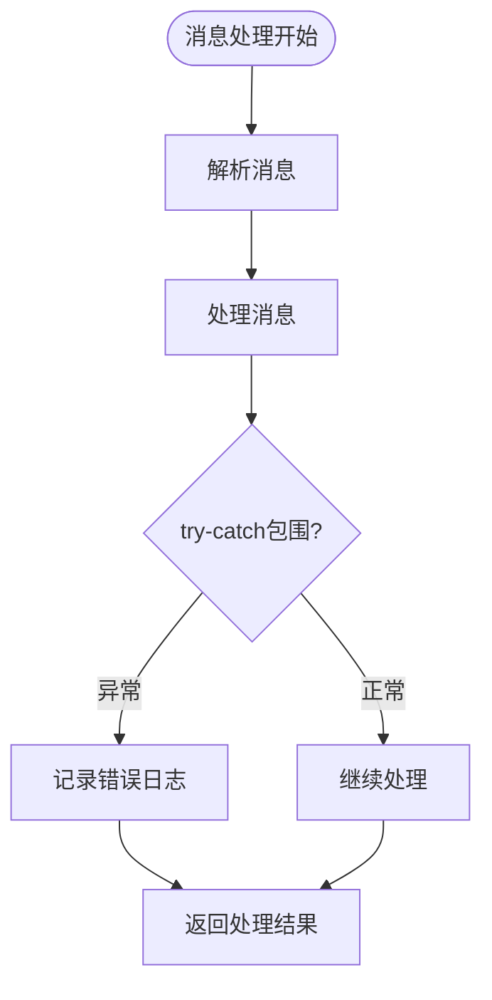
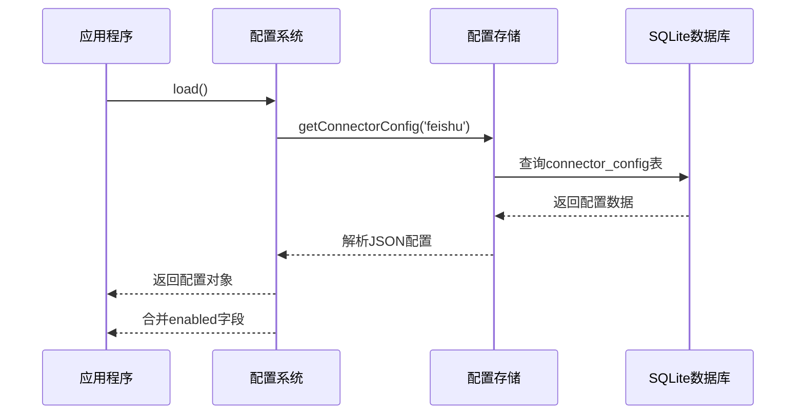
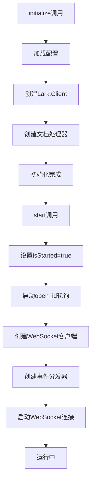

# 飞书连接器核心功能

<cite>
**本文档引用的文件**
- [feishu-connector.ts](file://src/main/connectors/feishu/feishu-connector.ts)
- [document-handler.ts](file://src/main/connectors/feishu/document-handler.ts)
- [connector-manager.ts](file://src/main/connectors/connector-manager.ts)
- [index.ts](file://src/main/connectors/index.ts)
- [connector.ts](file://src/types/connector.ts)
- [system-config-store.ts](file://src/main/database/system-config-store.ts)
- [connector-config.ts](file://src/main/database/connector-config.ts)
</cite>

## 目录
1. [简介](#简介)
2. [项目结构](#项目结构)
3. [核心组件](#核心组件)
4. [架构概览](#架构概览)
5. [详细组件分析](#详细组件分析)
6. [依赖关系分析](#依赖关系分析)
7. [性能考虑](#性能考虑)
8. [故障排除指南](#故障排除指南)
9. [结论](#结论)

## 简介

飞书连接器是 DeepBot 生态系统中的核心组件，负责与飞书平台建立 WebSocket 长连接，实现实时消息接收和处理。该连接器采用模块化设计，集成了消息去重机制、机器人 open_id 轮询、健康检查功能和完善的异常处理策略。

飞书连接器的主要特性包括：
- 基于官方 Node.js SDK 的 WebSocket 长连接
- 智能消息去重机制（基于 message_id 和内容时间窗口）
- 机器人 open_id 自动轮询获取
- 完整的配对授权机制
- 多媒体内容处理（图片、文件）
- 健康检查和异常处理

## 项目结构

飞书连接器位于 `src/main/connectors/feishu/` 目录下，主要包含以下文件：



**图表来源**
- [feishu-connector.ts:1-50](file://src/main/connectors/feishu/feishu-connector.ts#L1-L50)
- [document-handler.ts:1-30](file://src/main/connectors/feishu/document-handler.ts#L1-L30)
- [connector-manager.ts:1-30](file://src/main/connectors/connector-manager.ts#L1-L30)

**章节来源**
- [feishu-connector.ts:1-100](file://src/main/connectors/feishu/feishu-connector.ts#L1-L100)
- [document-handler.ts:1-50](file://src/main/connectors/feishu/document-handler.ts#L1-L50)
- [connector-manager.ts:1-50](file://src/main/connectors/connector-manager.ts#L1-L50)

## 核心组件

飞书连接器由多个核心组件构成，每个组件都有明确的职责分工：

### 主连接器类 (FeishuConnector)
- **职责**：管理飞书连接器的完整生命周期
- **功能**：WebSocket 连接、消息处理、配置管理、健康检查
- **关键特性**：消息去重、机器人轮询、异常处理

### 文档处理器 (FeishuDocumentHandler)
- **职责**：处理飞书文档内容提取
- **功能**：支持 docx、docs、wiki、sheets 文档类型
- **特性**：URL 解析、内容提取、格式化输出

### 连接器管理器 (ConnectorManager)
- **职责**：统一管理所有连接器实例
- **功能**：启动/停止连接器、消息路由、健康检查
- **特性**：跨连接器通信、配置验证

**章节来源**
- [feishu-connector.ts:28-100](file://src/main/connectors/feishu/feishu-connector.ts#L28-L100)
- [document-handler.ts:23-45](file://src/main/connectors/feishu/document-handler.ts#L23-L45)
- [connector-manager.ts:21-80](file://src/main/connectors/connector-manager.ts#L21-L80)

## 架构概览

飞书连接器采用分层架构设计，确保高内聚低耦合：



**图表来源**
- [feishu-connector.ts:103-150](file://src/main/connectors/feishu/feishu-connector.ts#L103-L150)
- [connector-manager.ts:130-168](file://src/main/connectors/connector-manager.ts#L130-L168)

### WebSocket 连接建立流程



**图表来源**
- [feishu-connector.ts:103-150](file://src/main/connectors/feishu/feishu-connector.ts#L103-L150)
- [feishu-connector.ts:181-233](file://src/main/connectors/feishu/feishu-connector.ts#L181-L233)

**章节来源**
- [feishu-connector.ts:103-150](file://src/main/connectors/feishu/feishu-connector.ts#L103-L150)
- [feishu-connector.ts:181-233](file://src/main/connectors/feishu/feishu-connector.ts#L181-L233)

## 详细组件分析

### 消息去重机制

飞书连接器实现了双重消息去重机制，确保消息处理的准确性和效率：

#### 基于 message_id 的去重集合



**图表来源**
- [feishu-connector.ts:454-486](file://src/main/connectors/feishu/feishu-connector.ts#L454-L486)

#### 基于内容的时间窗口去重

去重机制的关键参数：
- **最大消息缓存**：1000 条（防止内存无限增长）
- **内容去重窗口**：5 秒（防止飞书重复推送相同内容但不同 message_id）

**章节来源**
- [feishu-connector.ts:40-47](file://src/main/connectors/feishu/feishu-connector.ts#L40-L47)
- [feishu-connector.ts:454-486](file://src/main/connectors/feishu/feishu-connector.ts#L454-L486)

### 机器人 open_id 轮询机制

机器人 open_id 是飞书连接器的重要标识符，用于精确匹配群组 @ 机器人消息：



**图表来源**
- [feishu-connector.ts:181-233](file://src/main/connectors/feishu/feishu-connector.ts#L181-L233)

**章节来源**
- [feishu-connector.ts:82-86](file://src/main/connectors/feishu/feishu-connector.ts#L82-L86)
- [feishu-connector.ts:181-233](file://src/main/connectors/feishu/feishu-connector.ts#L181-L233)

### 健康检查功能

健康检查是连接器状态监控的重要机制：



**图表来源**
- [feishu-connector.ts:235-248](file://src/main/connectors/feishu/feishu-connector.ts#L235-L248)

**章节来源**
- [feishu-connector.ts:235-248](file://src/main/connectors/feishu/feishu-connector.ts#L235-L248)

### 异常处理策略

飞书连接器采用了多层次的异常处理策略：

#### 消息处理异常处理



#### 网络请求异常处理

网络请求异常处理包括：
- **重试机制**：机器人 open_id 获取失败时自动重试
- **降级策略**：用户名称获取失败时使用 ID 后缀
- **超时处理**：网络请求设置合理的超时时间

**章节来源**
- [feishu-connector.ts:574-577](file://src/main/connectors/feishu/feishu-connector.ts#L574-L577)
- [feishu-connector.ts:224-228](file://src/main/connectors/feishu/feishu-connector.ts#L224-L228)

### 配置管理

飞书连接器的配置管理采用集中式存储：

#### 配置加载流程



**图表来源**
- [feishu-connector.ts:54-80](file://src/main/connectors/feishu/feishu-connector.ts#L54-L80)

**章节来源**
- [feishu-connector.ts:54-80](file://src/main/connectors/feishu/feishu-connector.ts#L54-L80)
- [connector-config.ts:43-60](file://src/main/database/connector-config.ts#L43-L60)

### 初始化流程

飞书连接器的初始化流程确保了正确的启动顺序：



**图表来源**
- [feishu-connector.ts:89-101](file://src/main/connectors/feishu/feishu-connector.ts#L89-L101)
- [feishu-connector.ts:103-150](file://src/main/connectors/feishu/feishu-connector.ts#L103-L150)

**章节来源**
- [feishu-connector.ts:89-101](file://src/main/connectors/feishu/feishu-connector.ts#L89-L101)
- [feishu-connector.ts:103-150](file://src/main/connectors/feishu/feishu-connector.ts#L103-L150)

### 启动停止过程

#### 启动过程

启动过程的关键步骤：
1. 设置启动标志
2. 启动机器人 open_id 轮询
3. 创建 WebSocket 客户端
4. 注册事件分发器
5. 启动长连接

#### 停止过程

停止过程的关键步骤：
1. 停止 open_id 轮询定时器
2. 清理机器人 open_id 缓存
3. 关闭 WebSocket 连接
4. 重置启动状态

**章节来源**
- [feishu-connector.ts:103-175](file://src/main/connectors/feishu/feishu-connector.ts#L103-L175)

## 依赖关系分析

飞书连接器的依赖关系体现了清晰的模块化设计：

```mermaid
graph TB
subgraph "外部依赖"
Lark[@larksuiteoapi/node-sdk<br/>飞书官方SDK]
FS[node:fs<br/>文件系统]
Path[node:path<br/>路径处理]
end
subgraph "内部依赖"
Types[types/connector.ts<br/>类型定义]
Utils[shared/utils/*<br/>工具函数]
DB[database/*<br/>数据库模块]
end
subgraph "核心组件"
FC[FeishuConnector]
DH[DocumentHandler]
CM[ConnectorManager]
end
FC --> Lark
FC --> FS
FC --> Path
FC --> Types
FC --> Utils
FC --> DB
DH --> Lark
DH --> Types
DH --> Utils
CM --> Types
CM --> DB
```

**图表来源**
- [feishu-connector.ts:11-25](file://src/main/connectors/feishu/feishu-connector.ts#L11-L25)
- [document-handler.ts:7-8](file://src/main/connectors/feishu/document-handler.ts#L7-L8)

### 关键依赖分析

#### 飞书官方 SDK 依赖
- **版本**：@larksuiteoapi/node-sdk
- **用途**：WebSocket 连接、消息发送、文档读取
- **特性**：自动重连、事件分发、API 封装

#### 数据库依赖
- **SQLite**：持久化配置和配对记录
- **SystemConfigStore**：统一配置管理
- **connector-config**：连接器配置 CRUD

**章节来源**
- [feishu-connector.ts:11-25](file://src/main/connectors/feishu/feishu-connector.ts#L11-L25)
- [system-config-store.ts:11-15](file://src/main/database/system-config-store.ts#L11-L15)

## 性能考虑

飞书连接器在设计时充分考虑了性能优化：

### 内存管理
- **消息去重集合**：限制最大 1000 条，自动清理最旧条目
- **内容去重缓存**：5 秒时间窗口，避免内存无限增长
- **用户名称缓存**：使用 Map 结构，支持快速查找

### 网络优化
- **异步处理**：消息到达后立即返回响应，异步处理避免阻塞
- **轮询机制**：机器人 open_id 轮询，避免阻塞启动流程
- **缓存策略**：用户信息和文档内容的智能缓存

### 并发处理
- **事件驱动**：基于事件分发器的异步消息处理
- **Promise 链**：避免回调地狱，提高代码可读性
- **错误隔离**：每个消息处理独立 try-catch，防止连锁反应

## 故障排除指南

### 常见问题及解决方案

#### WebSocket 连接失败
**症状**：连接器启动后无法接收消息
**原因**：
- 飞书 API 密钥配置错误
- 网络连接不稳定
- 防火墙阻止连接

**解决方案**：
1. 验证 appId 和 appSecret 配置
2. 检查网络连接状态
3. 确认防火墙设置

#### 机器人 open_id 获取失败
**症状**：群组消息无法正确识别 @ 机器人
**原因**：
- tenant_access_token 获取失败
- 机器人信息查询异常
- 权限不足

**解决方案**：
1. 检查应用权限配置
2. 验证机器人状态
3. 查看日志获取详细错误信息

#### 消息重复处理
**症状**：同一消息被多次处理
**原因**：
- 飞书平台重复推送
- 去重机制失效
- 缓存数据异常

**解决方案**：
1. 检查 processedMessages 集合状态
2. 验证内容去重时间窗口
3. 重启连接器重置缓存

**章节来源**
- [feishu-connector.ts:235-248](file://src/main/connectors/feishu/feishu-connector.ts#L235-L248)
- [feishu-connector.ts:181-233](file://src/main/connectors/feishu/feishu-connector.ts#L181-L233)

### 日志分析

飞书连接器提供了丰富的日志信息，便于问题诊断：

#### 关键日志类别
- **启动日志**：连接器启动、停止状态
- **消息日志**：消息接收、处理进度
- **错误日志**：异常情况、错误详情
- **健康检查**：连接状态、性能指标

#### 调试建议
1. 启用详细日志级别
2. 关注关键状态变化
3. 分析错误堆栈信息
4. 监控资源使用情况

## 结论

飞书连接器展现了优秀的软件工程实践，具有以下特点：

### 设计优势
- **模块化设计**：清晰的职责分离和依赖管理
- **健壮性**：完善的异常处理和错误恢复机制
- **性能优化**：智能缓存和异步处理策略
- **可维护性**：良好的代码结构和文档注释

### 技术亮点
- **双重去重机制**：确保消息处理的准确性
- **智能轮询**：机器人 open_id 的自动获取
- **灵活配置**：支持多种部署环境
- **完整生态**：与其他连接器的一致性设计

### 最佳实践建议
1. **配置验证**：启动前验证所有配置参数
2. **监控告警**：建立健康检查和异常告警机制
3. **日志管理**：合理设置日志级别和轮转策略
4. **性能监控**：定期检查内存使用和连接状态
5. **安全考虑**：定期更新 API 密钥和权限配置

飞书连接器为 DeepBot 生态系统提供了稳定可靠的即时通讯能力，其设计思路和实现细节为类似项目的开发提供了宝贵的参考价值。