# 名称配置管理

<cite>
**本文档引用的文件**
- [name-config.ts](file://src/main/database/name-config.ts)
- [system-config-store.ts](file://src/main/database/system-config-store.ts)
- [sqlite-adapter.ts](file://src/shared/utils/sqlite-adapter.ts)
- [name-session-handlers.ts](file://src/main/tools/handlers/name-session-handlers.ts)
- [tab-config.ts](file://src/main/database/tab-config.ts)
- [system-prompt.ts](file://src/main/prompts/system-prompt.ts)
- [api-tool.formatters.ts](file://src/main/tools/api-tool.formatters.ts)
</cite>

## 目录
1. [简介](#简介)
2. [项目结构](#项目结构)
3. [核心组件](#核心组件)
4. [架构概览](#架构概览)
5. [详细组件分析](#详细组件分析)
6. [依赖关系分析](#依赖关系分析)
7. [性能考量](#性能考量)
8. [故障排除指南](#故障排除指南)
9. [结论](#结论)

## 简介

DeepBot 的名称配置管理模块是一个关键的用户体验优化组件，负责管理系统中智能体名称（Agent Name）和用户称呼（User Name）的配置、持久化和应用。该模块通过 SQLite 数据库存储配置信息，提供完整的 CRUD 操作，并支持全局配置和会话级别的个性化设置。

该模块的核心价值在于：
- **个性化体验**：允许用户自定义智能体名称和用户称呼
- **多会话支持**：支持全局配置和每个会话的独立配置
- **即时生效**：配置变更立即反映在系统提示词和界面显示中
- **数据持久化**：基于 SQLite 的可靠数据存储

## 项目结构

名称配置管理模块位于 DeepBot 项目的多个层次中，形成了清晰的分层架构：

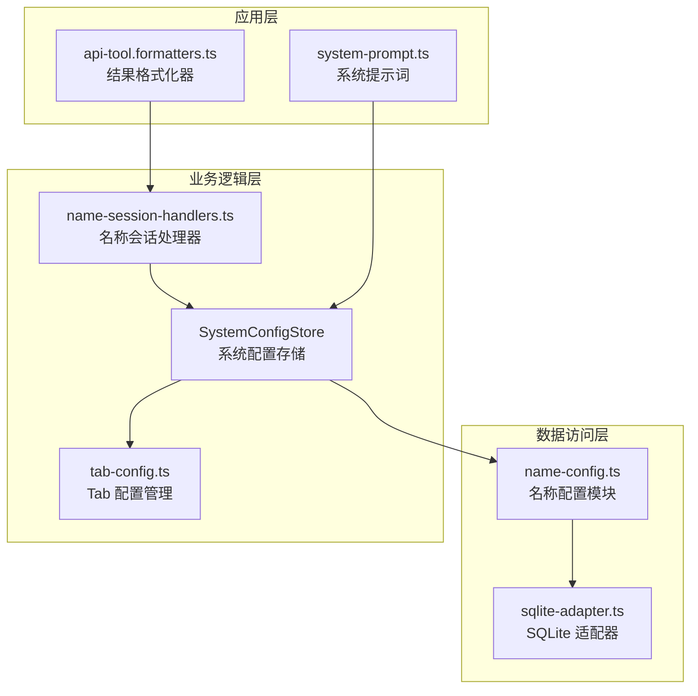

**图表来源**
- [name-config.ts:1-140](file://src/main/database/name-config.ts#L1-L140)
- [system-config-store.ts:1-576](file://src/main/database/system-config-store.ts#L1-L576)
- [sqlite-adapter.ts:1-102](file://src/shared/utils/sqlite-adapter.ts#L1-L102)

**章节来源**
- [name-config.ts:1-140](file://src/main/database/name-config.ts#L1-L140)
- [system-config-store.ts:1-576](file://src/main/database/system-config-store.ts#L1-L576)

## 核心组件

### 数据结构设计

名称配置模块采用简洁而高效的数据结构设计：

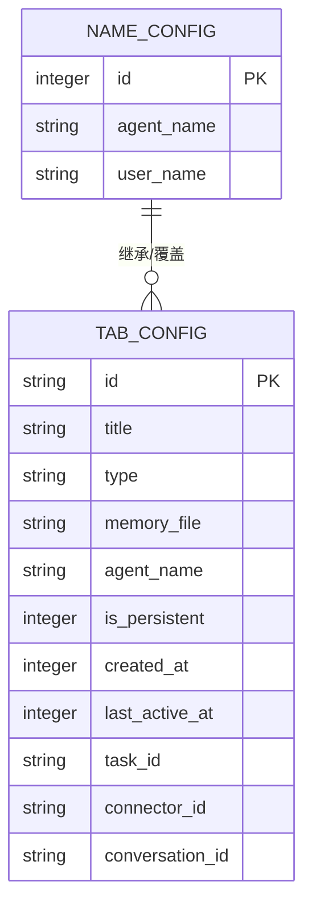

**图表来源**
- [name-config.ts:164-171](file://src/main/database/name-config.ts#L164-L171)
- [tab-config.ts:12-41](file://src/main/database/tab-config.ts#L12-L41)

### 配置层级架构

系统实现了三层配置架构：

1. **全局配置**：存储在 `name_config` 表中，ID 固定为 1
2. **会话配置**：存储在 `agent_tabs` 表中，支持每个会话的独立配置
3. **动态继承**：会话级别配置可覆盖全局配置

**章节来源**
- [name-config.ts:164-171](file://src/main/database/name-config.ts#L164-L171)
- [tab-config.ts:46-64](file://src/main/database/tab-config.ts#L46-L64)

## 架构概览

名称配置管理模块采用模块化设计，各组件职责明确：

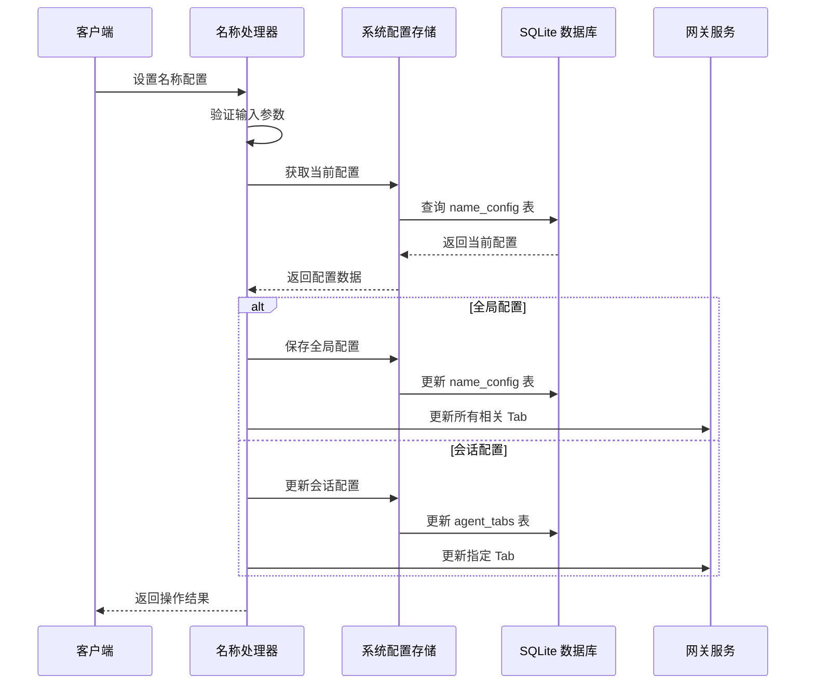

**图表来源**
- [name-session-handlers.ts:56-233](file://src/main/tools/handlers/name-session-handlers.ts#L56-L233)
- [system-config-store.ts:425-441](file://src/main/database/system-config-store.ts#L425-L441)

## 详细组件分析

### 数据访问层 - 名称配置模块

名称配置模块提供了完整的 CRUD 操作：

#### 获取名称配置
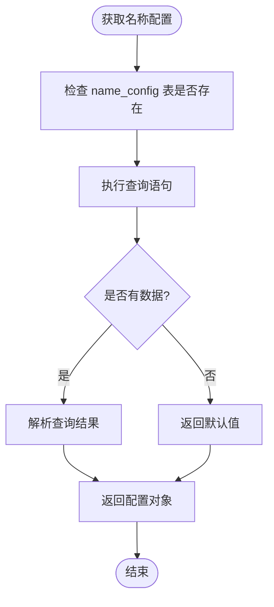

**图表来源**
- [name-config.ts:10-41](file://src/main/database/name-config.ts#L10-L41)

#### 保存智能体名称
保存智能体名称时包含严格的输入验证和条件逻辑：

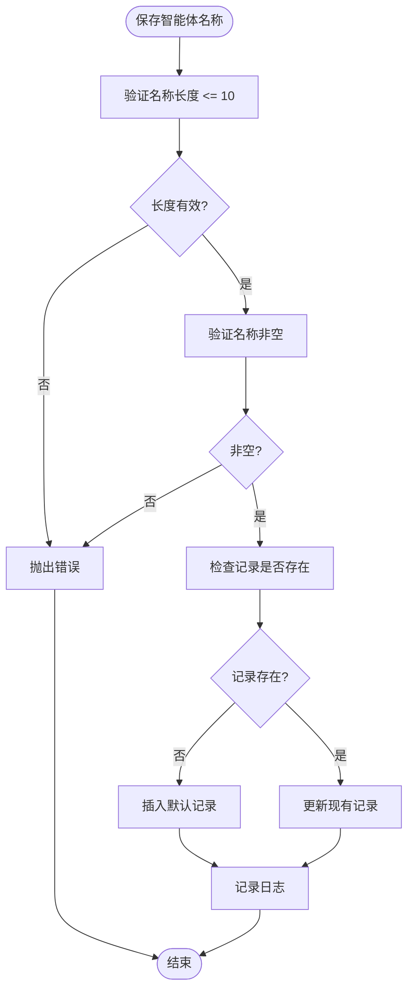

**图表来源**
- [name-config.ts:46-74](file://src/main/database/name-config.ts#L46-L74)

#### 保存用户称呼
用户称呼的保存逻辑与智能体名称类似，但有一些特殊限制：

- 用户称呼只能在主会话（sessionId = 'default'）中设置
- 非主会话尝试设置用户称呼会抛出错误
- 支持独立的长度限制和空值检查

**章节来源**
- [name-config.ts:46-107](file://src/main/database/name-config.ts#L46-L107)

### 业务逻辑层 - 系统配置存储

系统配置存储作为核心协调者，管理着整个配置系统的生命周期：

#### 单例模式实现
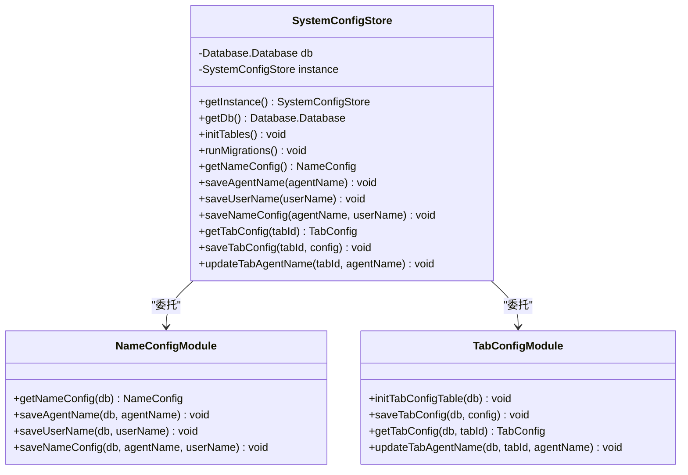

**图表来源**
- [system-config-store.ts:37-70](file://src/main/database/system-config-store.ts#L37-L70)
- [system-config-store.ts:425-441](file://src/main/database/system-config-store.ts#L425-L441)

#### 数据库初始化流程
系统配置存储在初始化时会创建必要的数据库表：

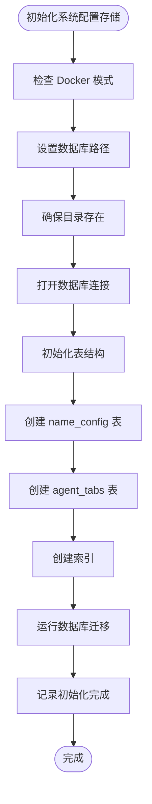

**图表来源**
- [system-config-store.ts:41-60](file://src/main/database/system-config-store.ts#L41-L60)
- [system-config-store.ts:82-225](file://src/main/database/system-config-store.ts#L82-L225)

**章节来源**
- [system-config-store.ts:37-225](file://src/main/database/system-config-store.ts#L37-L225)

### 应用层 - 名称会话处理器

名称会话处理器提供了面向用户的 API 接口：

#### 全局配置 vs 会话配置
处理器实现了智能的配置策略：

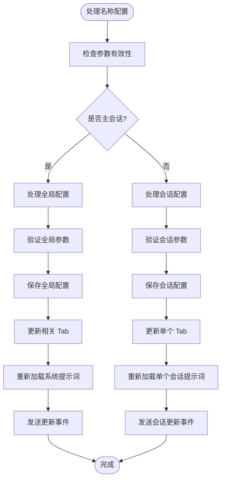

**图表来源**
- [name-session-handlers.ts:56-233](file://src/main/tools/handlers/name-session-handlers.ts#L56-L233)

#### 会话级别的个性化设置
处理器支持每个会话的独立配置，实现真正的个性化体验：

- **继承机制**：未设置独立配置的会话继承全局配置
- **独立覆盖**：已设置独立配置的会话使用自己的配置
- **即时生效**：配置变更立即反映在当前会话中

**章节来源**
- [name-session-handlers.ts:56-233](file://src/main/tools/handlers/name-session-handlers.ts#L56-L233)

### 集成层 - 系统提示词

系统提示词模块集成了名称配置，确保配置变更立即生效：

#### 动态配置集成
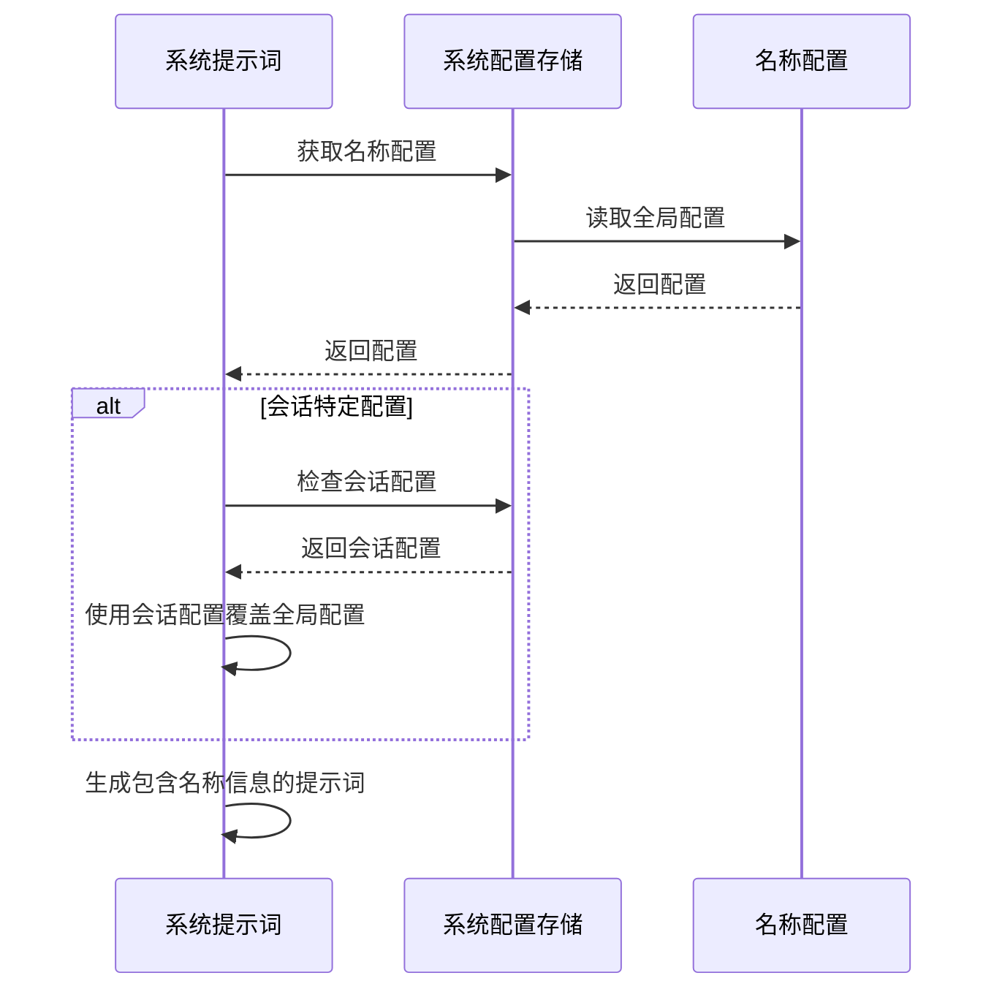

**图表来源**
- [system-prompt.ts:28-45](file://src/main/prompts/system-prompt.ts#L28-L45)

**章节来源**
- [system-prompt.ts:28-45](file://src/main/prompts/system-prompt.ts#L28-L45)

## 依赖关系分析

名称配置管理模块的依赖关系清晰且层次分明：

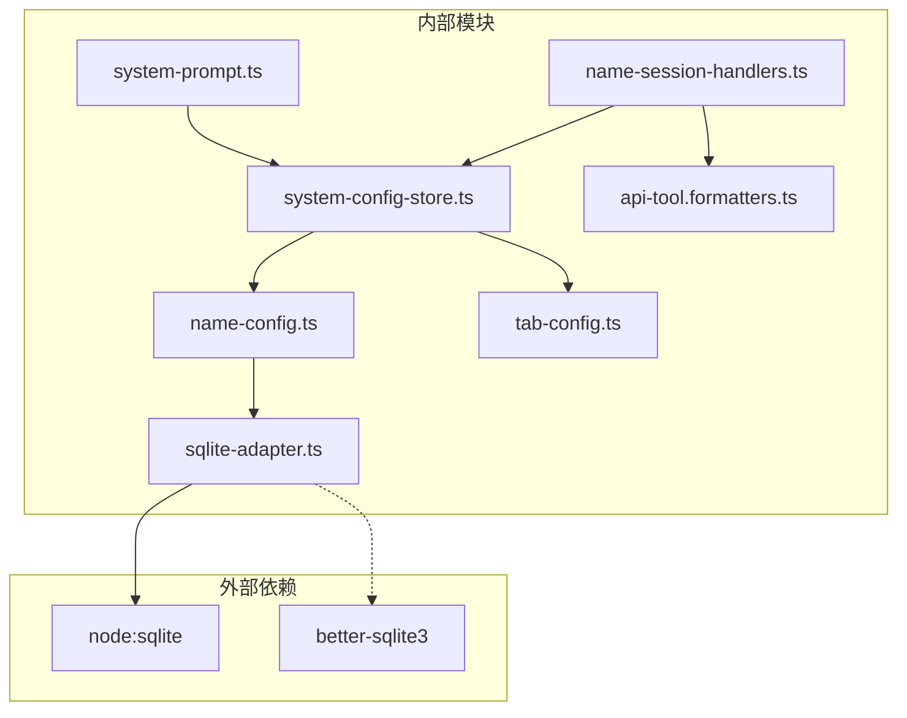

**图表来源**
- [sqlite-adapter.ts:8-20](file://src/shared/utils/sqlite-adapter.ts#L8-L20)
- [system-config-store.ts:11-15](file://src/main/database/system-config-store.ts#L11-L15)

### 数据库适配器设计

SQLite 适配器提供了与 better-sqlite3 兼容的 API：

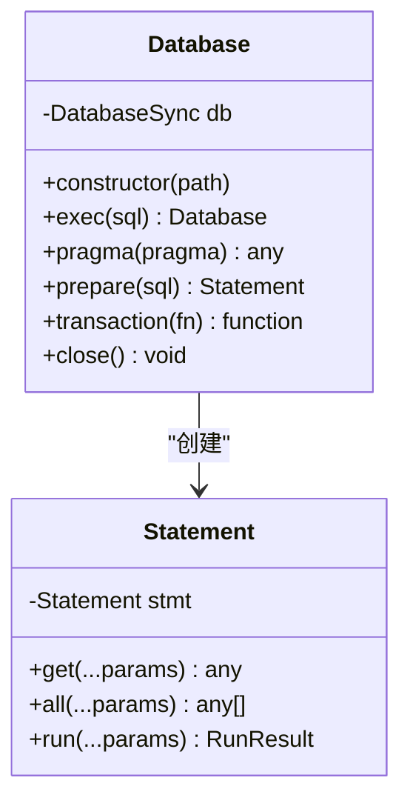

**图表来源**
- [sqlite-adapter.ts:14-70](file://src/shared/utils/sqlite-adapter.ts#L14-L70)

**章节来源**
- [sqlite-adapter.ts:14-70](file://src/shared/utils/sqlite-adapter.ts#L14-L70)

## 性能考量

### 数据库性能优化

1. **WAL 模式**：系统配置存储使用 Write-Ahead Logging 模式提高并发性能
2. **索引优化**：为连接器配对表创建了复合索引
3. **事务管理**：提供原生事务支持，确保数据一致性

### 缓存策略

- **内存缓存**：系统配置存储采用单例模式，避免重复创建数据库连接
- **查询优化**：使用预编译语句减少 SQL 解析开销
- **延迟初始化**：按需初始化数据库表，减少启动时间

### 并发控制

- **原子操作**：使用 SQLite 的原子性特性保证配置变更的完整性
- **锁机制**：WAL 模式下的读写分离，提高并发性能

## 故障排除指南

### 常见问题及解决方案

#### 数据库连接问题
- **症状**：配置保存失败，出现数据库连接错误
- **原因**：数据库文件权限不足或路径不存在
- **解决**：检查数据库目录权限，确保应用程序有读写权限

#### 配置验证错误
- **症状**：保存配置时报错，提示名称无效
- **原因**：名称长度超过限制或为空
- **解决**：确保名称长度不超过 10 个字符且不为空

#### 会话配置冲突
- **症状**：在非主会话设置用户称呼时报错
- **原因**：用户称呼只能在主会话设置
- **解决**：在主会话（sessionId = 'default'）中设置用户称呼

### 调试技巧

1. **启用详细日志**：查看控制台输出的详细操作日志
2. **检查数据库状态**：使用 SQLite 工具检查表结构和数据
3. **验证配置格式**：确保配置数据符合预期的数据类型

**章节来源**
- [name-config.ts:34-40](file://src/main/database/name-config.ts#L34-L40)
- [name-session-handlers.ts:230-232](file://src/main/tools/handlers/name-session-handlers.ts#L230-L232)

## 结论

DeepBot 的名称配置管理模块展现了优秀的软件工程实践：

### 设计优势

1. **模块化架构**：清晰的分层设计便于维护和扩展
2. **数据一致性**：基于 SQLite 的可靠数据存储
3. **用户体验**：支持全局和会话级别的个性化配置
4. **性能优化**：合理的数据库设计和缓存策略

### 技术亮点

- **灵活的配置继承机制**：支持全局配置与会话配置的智能组合
- **即时生效机制**：配置变更立即反映在系统行为中
- **完善的错误处理**：全面的输入验证和异常处理
- **可扩展的设计**：为未来功能扩展预留接口

### 未来发展建议

1. **国际化支持**：考虑添加多语言支持
2. **配置模板**：提供常用配置模板
3. **配置导入导出**：支持配置的备份和恢复
4. **配置版本控制**：跟踪配置变更历史

该模块为 DeepBot 提供了强大的个性化能力，是提升用户体验的重要基础设施。