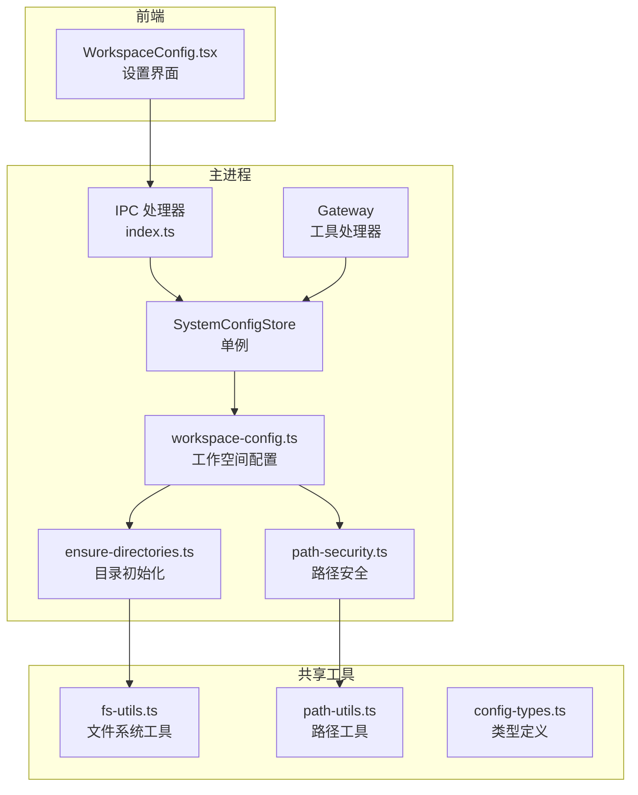
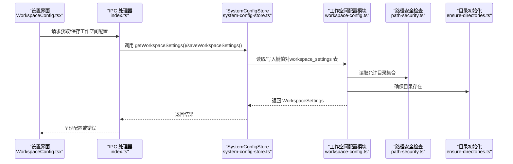
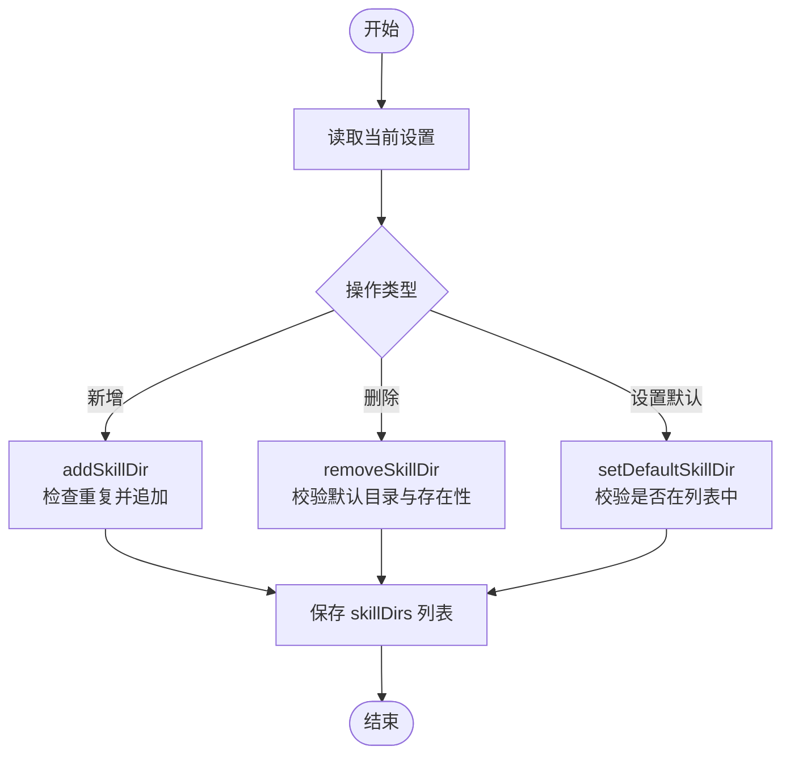
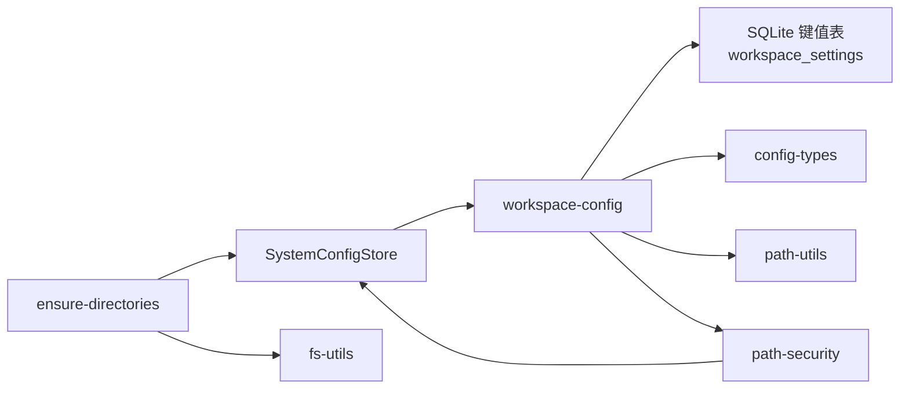

# 工作空间配置管理

<cite>
**本文档引用的文件**
- [workspace-config.ts](file://src/main/database/workspace-config.ts)
- [system-config-store.ts](file://src/main/database/system-config-store.ts)
- [config-types.ts](file://src/main/database/config-types.ts)
- [skill-paths.ts](file://src/main/config/skill-paths.ts)
- [ensure-directories.ts](file://src/main/utils/ensure-directories.ts)
- [path-security.ts](file://src/main/utils/path-security.ts)
- [WorkspaceConfig.tsx](file://src/renderer/components/settings/WorkspaceConfig.tsx)
- [fs-utils.ts](file://src/shared/utils/fs-utils.ts)
- [path-utils.ts](file://src/shared/utils/path-utils.ts)
- [index.ts](file://src/main/index.ts)
- [config-handlers.ts](file://src/main/tools/handlers/config-handlers.ts)
</cite>

## 目录
1. [简介](#简介)
2. [项目结构](#项目结构)
3. [核心组件](#核心组件)
4. [架构总览](#架构总览)
5. [详细组件分析](#详细组件分析)
6. [依赖关系分析](#依赖关系分析)
7. [性能考虑](#性能考虑)
8. [故障排除指南](#故障排除指南)
9. [结论](#结论)
10. [附录](#附录)

## 简介
本文件面向 DeepBot 工作空间配置管理模块，系统性阐述工作空间设置的数据结构、CRUD 实现、目录管理最佳实践、使用场景以及配置变更后的系统响应与重新加载机制。重点覆盖以下配置项：
- 默认工作目录（workspaceDir）
- Python 脚本目录（scriptDir）
- 技能目录列表（skillDirs）
- 默认技能目录（defaultSkillDir）
- 图片生成目录（imageDir）
- 记忆管理目录（memoryDir）
- 会话目录（sessionDir）

该模块通过 SQLite 持久化配置，并在 Electron 主进程与渲染进程之间通过 IPC 和 API 路由进行交互；同时提供路径安全检查与目录初始化能力，确保 AI 仅在受控的工作目录内进行文件操作。

## 项目结构
工作空间配置管理涉及的主要文件与职责如下：
- 数据层：系统配置存储器（SystemConfigStore）、工作空间配置模块（workspace-config）、配置类型定义（config-types）
- 工具层：目录创建与校验（ensure-directories）、路径安全检查（path-security）、路径展开（path-utils）、文件系统工具（fs-utils）
- 前端设置界面：工作空间配置组件（WorkspaceConfig.tsx）
- IPC/API：主进程 IPC 处理（index.ts）、工具处理器（config-handlers.ts）

**图表来源**
- [WorkspaceConfig.tsx:1-670](file://src/renderer/components/settings/WorkspaceConfig.tsx#L1-L670)
- [index.ts:449-491](file://src/main/index.ts#L449-L491)
- [system-config-store.ts:1-576](file://src/main/database/system-config-store.ts#L1-L576)
- [workspace-config.ts:1-219](file://src/main/database/workspace-config.ts#L1-L219)
- [path-security.ts:1-118](file://src/main/utils/path-security.ts#L1-L118)
- [ensure-directories.ts:1-54](file://src/main/utils/ensure-directories.ts#L1-L54)
- [fs-utils.ts:1-162](file://src/shared/utils/fs-utils.ts#L1-L162)
- [path-utils.ts:1-48](file://src/shared/utils/path-utils.ts#L1-L48)
- [config-types.ts:1-67](file://src/main/database/config-types.ts#L1-L67)

**章节来源**
- [workspace-config.ts:1-219](file://src/main/database/workspace-config.ts#L1-L219)
- [system-config-store.ts:1-576](file://src/main/database/system-config-store.ts#L1-L576)
- [config-types.ts:1-67](file://src/main/database/config-types.ts#L1-L67)
- [skill-paths.ts:1-69](file://src/main/config/skill-paths.ts#L1-L69)
- [ensure-directories.ts:1-54](file://src/main/utils/ensure-directories.ts#L1-L54)
- [path-security.ts:1-118](file://src/main/utils/path-security.ts#L1-L118)
- [WorkspaceConfig.tsx:1-670](file://src/renderer/components/settings/WorkspaceConfig.tsx#L1-L670)
- [fs-utils.ts:1-162](file://src/shared/utils/fs-utils.ts#L1-L162)
- [path-utils.ts:1-48](file://src/shared/utils/path-utils.ts#L1-L48)
- [index.ts:449-491](file://src/main/index.ts#L449-L491)
- [config-handlers.ts:126-140](file://src/main/tools/handlers/config-handlers.ts#L126-L140)

## 核心组件
- 系统配置存储器（SystemConfigStore）
  - 单例管理，负责数据库初始化、表结构与迁移、各配置模块的代理调用
  - 提供工作空间配置的获取与保存接口
- 工作空间配置模块（workspace-config）
  - 定义 WorkspaceSettings 类型
  - 提供默认配置、持久化读取、保存、目录增删改等 CRUD 方法
- 路径安全与目录管理
  - 路径安全检查（path-security）：判断文件路径是否在允许范围内
  - 目录初始化（ensure-directories）：确保工作目录、脚本目录、技能目录、图片目录、记忆目录存在
- 前端设置界面（WorkspaceConfig.tsx）
  - 提供工作目录、脚本目录、图片目录、记忆目录、会话目录、技能目录列表的可视化配置
- IPC 与工具处理器
  - 主进程 IPC（index.ts）：提供获取默认/当前工作空间配置的接口
  - 工具处理器（config-handlers.ts）：在配置更新后触发 Gateway 重新加载工作空间配置

**章节来源**
- [system-config-store.ts:37-576](file://src/main/database/system-config-store.ts#L37-L576)
- [workspace-config.ts:17-219](file://src/main/database/workspace-config.ts#L17-L219)
- [path-security.ts:29-118](file://src/main/utils/path-security.ts#L29-L118)
- [ensure-directories.ts:16-54](file://src/main/utils/ensure-directories.ts#L16-L54)
- [WorkspaceConfig.tsx:28-670](file://src/renderer/components/settings/WorkspaceConfig.tsx#L28-L670)
- [index.ts:449-491](file://src/main/index.ts#L449-L491)
- [config-handlers.ts:126-140](file://src/main/tools/handlers/config-handlers.ts#L126-L140)

## 架构总览
工作空间配置的读写流程贯穿前端、主进程、存储层与工具层：

**图表来源**
- [WorkspaceConfig.tsx:86-111](file://src/renderer/components/settings/WorkspaceConfig.tsx#L86-L111)
- [index.ts:449-491](file://src/main/index.ts#L449-L491)
- [system-config-store.ts:341-347](file://src/main/database/system-config-store.ts#L341-L347)
- [workspace-config.ts:51-89](file://src/main/database/workspace-config.ts#L51-L89)
- [path-security.ts:29-45](file://src/main/utils/path-security.ts#L29-L45)
- [ensure-directories.ts:16-54](file://src/main/utils/ensure-directories.ts#L16-L54)

## 详细组件分析

### 数据结构与类型定义
- WorkspaceSettings
  - 字段：workspaceDir、scriptDir、skillDirs（字符串数组）、defaultSkillDir、imageDir、memoryDir、sessionDir
  - 作用：统一描述工作空间的各类目录路径
- Docker 模式下的默认路径
  - 当处于容器运行环境时，使用固定前缀 /data/ 并可通过环境变量覆盖
- JSON 序列化
  - skillDirs 以 JSON 数组形式存储于键值表中，读取时进行安全解析

**章节来源**
- [config-types.ts:21-29](file://src/main/database/config-types.ts#L21-L29)
- [workspace-config.ts:17-46](file://src/main/database/workspace-config.ts#L17-L46)
- [workspace-config.ts:72-74](file://src/main/database/workspace-config.ts#L72-L74)

### 默认设置与持久化读取
- getDefaultWorkspaceSettings
  - 非 Docker：基于用户主目录生成默认路径
  - Docker：优先读取环境变量，否则回退到 /data/* 固定路径
- getWorkspaceSettings
  - 非 Docker：从键值表批量读取 workspace_settings，解析 skillDirs，与默认值合并
  - Docker：直接返回默认值（忽略数据库配置）
  - 异常兜底：读取失败时返回默认值

**章节来源**
- [workspace-config.ts:17-46](file://src/main/database/workspace-config.ts#L17-L46)
- [workspace-config.ts:51-89](file://src/main/database/workspace-config.ts#L51-L89)

### CRUD 操作实现
- 保存设置
  - saveWorkspaceSettings：一次性保存所有目录配置
  - 单字段保存：saveWorkspaceDir、saveScriptDir、saveSkillDirs、saveDefaultSkillDir、saveImageDir、saveMemoryDir、saveSessionDir
- 目录管理
  - addSkillDir：新增技能目录（去重校验）
  - removeSkillDir：删除技能目录（禁止删除默认目录）
  - setDefaultSkillDir：设置默认技能目录（必须存在于列表中）
- 错误处理
  - 目录不存在、重复添加、试图删除默认目录等场景抛出明确错误

**图表来源**
- [workspace-config.ts:163-218](file://src/main/database/workspace-config.ts#L163-L218)

**章节来源**
- [workspace-config.ts:94-158](file://src/main/database/workspace-config.ts#L94-L158)
- [workspace-config.ts:163-218](file://src/main/database/workspace-config.ts#L163-L218)

### 目录管理最佳实践
- 目录创建
  - ensureWorkspaceDirectories：启动时确保工作目录、脚本目录、默认技能目录、图片目录、记忆目录存在
  - fs-utils.ensureDirectoryExists：递归创建目录，返回是否新建
- 权限检查
  - path-security.assertPathAllowed：在非 Docker 模式下严格限制路径范围，仅允许配置的目录及其子目录
  - getAllowedDirectories：汇总允许访问的绝对路径集合
- 路径验证
  - path-utils.expandUserPath：支持 ~ 展开为用户主目录
  - Docker 模式：路径检查跳过，由容器挂载决定

**章节来源**
- [ensure-directories.ts:16-54](file://src/main/utils/ensure-directories.ts#L16-L54)
- [fs-utils.ts:19-26](file://src/shared/utils/fs-utils.ts#L19-L26)
- [path-security.ts:59-117](file://src/main/utils/path-security.ts#L59-L117)
- [path-utils.ts:21-33](file://src/shared/utils/path-utils.ts#L21-L33)

### 前端使用与交互
- WorkspaceConfig.tsx
  - 支持逐项保存（工作目录、脚本目录、图片目录、记忆目录、会话目录）
  - 支持技能目录列表的添加、删除、设置默认
  - Docker 模式下禁用可编辑字段并显示提示
  - 保存后清除“脏”状态并提示成功/失败

**章节来源**
- [WorkspaceConfig.tsx:86-340](file://src/renderer/components/settings/WorkspaceConfig.tsx#L86-L340)
- [WorkspaceConfig.tsx:358-371](file://src/renderer/components/settings/WorkspaceConfig.tsx#L358-L371)

### IPC 与工具处理器集成
- 主进程 IPC
  - GET/GET_DEFAULT_WORKSPACE_SETTINGS：返回当前或默认工作空间配置
- 工具处理器
  - 更新工作空间配置后，调用 gateway.reloadWorkspaceConfig() 触发系统重新加载

**章节来源**
- [index.ts:449-491](file://src/main/index.ts#L449-L491)
- [config-handlers.ts:126-140](file://src/main/tools/handlers/config-handlers.ts#L126-L140)

## 依赖关系分析
- 组件耦合
  - SystemConfigStore 作为门面，聚合各配置模块（含 workspace-config）
  - workspace-config 依赖 db-utils、json-utils、docker-utils、config-types
  - path-security 依赖 SystemConfigStore 获取当前设置
  - ensure-directories 依赖 SystemConfigStore 获取设置并调用 fs-utils
- 外部依赖
  - SQLite 适配器（shared/utils/sqlite-adapter）
  - Node.js 内置模块：path、os、fs
  - Electron 主进程 IPC

**图表来源**
- [system-config-store.ts:26-32](file://src/main/database/system-config-store.ts#L26-L32)
- [workspace-config.ts:5-11](file://src/main/database/workspace-config.ts#L5-L11)
- [ensure-directories.ts:8-9](file://src/main/utils/ensure-directories.ts#L8-L9)
- [path-security.ts:8-9](file://src/main/utils/path-security.ts#L8-L9)

**章节来源**
- [system-config-store.ts:26-32](file://src/main/database/system-config-store.ts#L26-L32)
- [workspace-config.ts:5-11](file://src/main/database/workspace-config.ts#L5-L11)
- [ensure-directories.ts:8-9](file://src/main/utils/ensure-directories.ts#L8-L9)
- [path-security.ts:8-9](file://src/main/utils/path-security.ts#L8-L9)

## 性能考虑
- SQLite WAL 模式：SystemConfigStore 初始化时启用 WAL，提升并发读写性能
- 批量读取：getWorkspaceSettings 使用批量键值读取，减少多次查询
- JSON 序列化：skillDirs 以 JSON 存储，读取时进行安全解析，避免频繁格式转换
- 目录检查：ensureWorkspaceDirectories 仅在启动阶段执行，避免运行期频繁 IO

**章节来源**
- [system-config-store.ts:56-57](file://src/main/database/system-config-store.ts#L56-L57)
- [workspace-config.ts:61-69](file://src/main/database/workspace-config.ts#L61-L69)
- [workspace-config.ts](file://src/main/database/workspace-config.ts#L124)

## 故障排除指南
- 获取配置失败
  - 现象：前端或工具处理器报错
  - 排查：确认数据库初始化完成、表存在、键值表中有对应 key
  - 参考：getWorkspaceSettings 的异常兜底逻辑
- 路径不受允许
  - 现象：访问文件时报“只能访问配置的目录”
  - 排查：检查 path-security 的允许目录集合是否包含目标路径；Docker 模式下跳过检查
- 目录未创建
  - 现象：首次启动找不到目录
  - 排查：调用 ensureWorkspaceDirectories 或等待应用自动初始化
- Docker 模式下无法修改目录
  - 现象：前端禁用编辑
  - 说明：目录由容器挂载决定，需修改环境变量或重启容器

**章节来源**
- [workspace-config.ts:85-88](file://src/main/database/workspace-config.ts#L85-L88)
- [path-security.ts:91-117](file://src/main/utils/path-security.ts#L91-L117)
- [ensure-directories.ts:49-52](file://src/main/utils/ensure-directories.ts#L49-L52)
- [WorkspaceConfig.tsx:358-371](file://src/renderer/components/settings/WorkspaceConfig.tsx#L358-L371)

## 结论
工作空间配置管理模块通过清晰的数据结构、完善的 CRUD 操作、严格的路径安全与健壮的目录初始化，实现了对工作目录、脚本目录、技能目录、图片目录、记忆目录与会话目录的统一管理。结合 IPC 与工具处理器，在配置变更后能够及时触发系统重新加载，确保 AI 的文件操作始终在受控范围内进行。建议在生产环境中优先采用 Docker 模式并配合环境变量进行路径定制，同时在开发阶段利用前端设置界面进行可视化配置与验证。

## 附录
- 使用场景
  - 技能加载：从 skillDirs 中扫描技能，使用 defaultSkillDir 作为默认安装路径
  - 文件存储：Python 脚本保存至 scriptDir，生成图片保存至 imageDir，记忆文件保存至 memoryDir
  - 缓存管理：会话历史保存至 sessionDir，便于跨标签通信与历史检索
- 配置变更后的系统响应
  - 工具处理器在保存后调用 gateway.reloadWorkspaceConfig()，使运行时生效
  - 前端保存成功后清除“脏”状态并提示用户

**章节来源**
- [skill-paths.ts:31-41](file://src/main/config/skill-paths.ts#L31-L41)
- [config-handlers.ts:126-140](file://src/main/tools/handlers/config-handlers.ts#L126-L140)
- [WorkspaceConfig.tsx:120-125](file://src/renderer/components/settings/WorkspaceConfig.tsx#L120-L125)