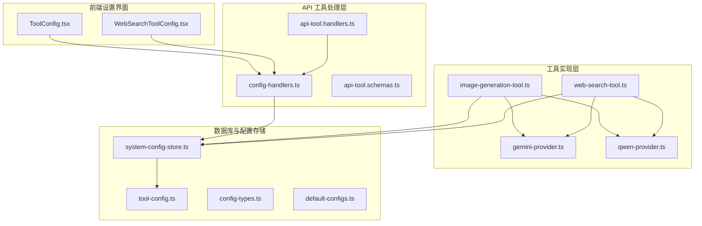
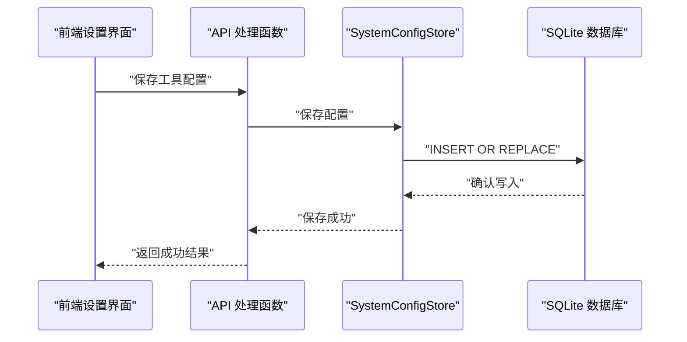
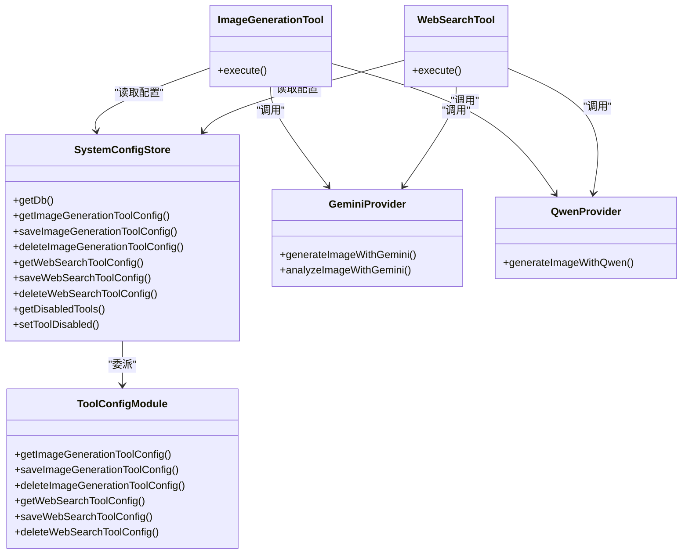

# 工具配置管理

<cite>
**本文档引用的文件**
- [src/main/database/tool-config.ts](file://src/main/database/tool-config.ts)
- [src/main/database/system-config-store.ts](file://src/main/database/system-config-store.ts)
- [src/main/database/config-types.ts](file://src/main/database/config-types.ts)
- [src/main/tools/api-tool.schemas.ts](file://src/main/tools/api-tool.schemas.ts)
- [src/main/tools/api-tool.handlers.ts](file://src/main/tools/api-tool.handlers.ts)
- [src/main/tools/handlers/config-handlers.ts](file://src/main/tools/handlers/config-handlers.ts)
- [src/main/tools/image-generation-tool.ts](file://src/main/tools/image-generation-tool.ts)
- [src/main/tools/web-search-tool.ts](file://src/main/tools/web-search-tool.ts)
- [src/main/tools/providers/gemini-provider.ts](file://src/main/tools/providers/gemini-provider.ts)
- [src/main/tools/providers/qwen-provider.ts](file://src/main/tools/providers/qwen-provider.ts)
- [src/shared/config/default-configs.ts](file://src/shared/config/default-configs.ts)
- [src/renderer/components/settings/ToolConfig.tsx](file://src/renderer/components/settings/ToolConfig.tsx)
- [src/renderer/components/settings/WebSearchToolConfig.tsx](file://src/renderer/components/settings/WebSearchToolConfig.tsx)
</cite>

## 目录
1. [简介](#简介)
2. [项目结构](#项目结构)
3. [核心组件](#核心组件)
4. [架构概览](#架构概览)
5. [详细组件分析](#详细组件分析)
6. [依赖关系分析](#依赖关系分析)
7. [性能考量](#性能考量)
8. [故障排除指南](#故障排除指南)
9. [结论](#结论)
10. [附录](#附录)

## 简介
本文件为 DeepBot 工具配置管理模块的技术文档，聚焦于工具配置的数据结构与 CRUD 实现，重点覆盖图片生成工具与 Web 搜索工具的配置管理。文档将详细说明以下内容：
- 工具配置的数据结构与字段含义（提供商类型、模型名称、API URL、API Key 等）
- 工具配置的 CRUD 操作实现（获取、保存、删除）
- 不同工具类型的配置差异与特殊字段
- 使用场景、最佳实践（配置验证、错误处理、安全考虑）
- 版本兼容性与迁移策略

## 项目结构
工具配置管理涉及后端数据库层、配置存储类、工具实现层以及前端设置界面。整体结构如下：

图表来源
- [src/renderer/components/settings/ToolConfig.tsx:1-505](file://src/renderer/components/settings/ToolConfig.tsx#L1-505)
- [src/renderer/components/settings/WebSearchToolConfig.tsx:1-184](file://src/renderer/components/settings/WebSearchToolConfig.tsx#L1-184)
- [src/main/tools/handlers/config-handlers.ts:1-322](file://src/main/tools/handlers/config-handlers.ts#L1-322)
- [src/main/tools/api-tool.schemas.ts:1-258](file://src/main/tools/api-tool.schemas.ts#L1-258)
- [src/main/tools/api-tool.handlers.ts:1-44](file://src/main/tools/api-tool.handlers.ts#L1-44)
- [src/main/tools/image-generation-tool.ts:1-364](file://src/main/tools/image-generation-tool.ts#L1-364)
- [src/main/tools/web-search-tool.ts:1-533](file://src/main/tools/web-search-tool.ts#L1-533)
- [src/main/tools/providers/gemini-provider.ts:1-409](file://src/main/tools/providers/gemini-provider.ts#L1-409)
- [src/main/tools/providers/qwen-provider.ts:1-310](file://src/main/tools/providers/qwen-provider.ts#L1-310)
- [src/main/database/system-config-store.ts:1-576](file://src/main/database/system-config-store.ts#L1-576)
- [src/main/database/tool-config.ts:1-128](file://src/main/database/tool-config.ts#L1-128)
- [src/main/database/config-types.ts:1-67](file://src/main/database/config-types.ts#L1-67)
- [src/shared/config/default-configs.ts:1-133](file://src/shared/config/default-configs.ts#L1-133)

章节来源
- [src/main/database/tool-config.ts:1-128](file://src/main/database/tool-config.ts#L1-L128)
- [src/main/database/system-config-store.ts:1-576](file://src/main/database/system-config-store.ts#L1-L576)
- [src/main/database/config-types.ts:1-67](file://src/main/database/config-types.ts#L1-L67)
- [src/main/tools/api-tool.schemas.ts:1-258](file://src/main/tools/api-tool.schemas.ts#L1-L258)
- [src/main/tools/api-tool.handlers.ts:1-44](file://src/main/tools/api-tool.handlers.ts#L1-L44)
- [src/main/tools/handlers/config-handlers.ts:1-322](file://src/main/tools/handlers/config-handlers.ts#L1-L322)
- [src/main/tools/image-generation-tool.ts:1-364](file://src/main/tools/image-generation-tool.ts#L1-L364)
- [src/main/tools/web-search-tool.ts:1-533](file://src/main/tools/web-search-tool.ts#L1-L533)
- [src/main/tools/providers/gemini-provider.ts:1-409](file://src/main/tools/providers/gemini-provider.ts#L1-L409)
- [src/main/tools/providers/qwen-provider.ts:1-310](file://src/main/tools/providers/qwen-provider.ts#L1-L310)
- [src/shared/config/default-configs.ts:1-133](file://src/shared/config/default-configs.ts#L1-L133)
- [src/renderer/components/settings/ToolConfig.tsx:1-505](file://src/renderer/components/settings/ToolConfig.tsx#L1-L505)
- [src/renderer/components/settings/WebSearchToolConfig.tsx:1-184](file://src/renderer/components/settings/WebSearchToolConfig.tsx#L1-L184)

## 核心组件
- 数据库与配置存储
  - SystemConfigStore：统一的配置存储入口，负责数据库初始化、表结构与迁移、各配置模块的委派。
  - tool-config：封装图片生成工具与 Web 搜索工具的 CRUD 操作。
  - config-types：定义工具配置的数据结构（ImageGenerationToolConfig、WebSearchToolConfig）。
- 工具实现
  - image-generation-tool：图片生成工具，支持 Gemini 与 Qwen 提供商，负责参数校验、调用提供商、保存图片。
  - web-search-tool：网络搜索工具，支持 Qwen 与 Gemini 提供商，负责参数校验、调用提供商、解析结果。
  - providers：Gemini 与 Qwen 提供商的具体实现，负责与外部 API 的交互。
- API 与前端
  - api-tool.schemas：定义配置相关 API 的参数 Schema（TypeBox）。
  - config-handlers：配置管理的处理函数（获取/设置工具配置、工具启用/禁用）。
  - ToolConfig.tsx、WebSearchToolConfig.tsx：前端设置界面，负责用户输入与保存。

章节来源
- [src/main/database/system-config-store.ts:37-566](file://src/main/database/system-config-store.ts#L37-L566)
- [src/main/database/tool-config.ts:13-127](file://src/main/database/tool-config.ts#L13-L127)
- [src/main/database/config-types.ts:48-67](file://src/main/database/config-types.ts#L48-L67)
- [src/main/tools/image-generation-tool.ts:25-67](file://src/main/tools/image-generation-tool.ts#L25-L67)
- [src/main/tools/web-search-tool.ts:21-54](file://src/main/tools/web-search-tool.ts#L21-L54)
- [src/main/tools/providers/gemini-provider.ts:21-255](file://src/main/tools/providers/gemini-provider.ts#L21-L255)
- [src/main/tools/providers/qwen-provider.ts:25-234](file://src/main/tools/providers/qwen-provider.ts#L25-L234)
- [src/main/tools/api-tool.schemas.ts:12-135](file://src/main/tools/api-tool.schemas.ts#L12-L135)
- [src/main/tools/handlers/config-handlers.ts:32-322](file://src/main/tools/handlers/config-handlers.ts#L32-L322)
- [src/renderer/components/settings/ToolConfig.tsx:38-153](file://src/renderer/components/settings/ToolConfig.tsx#L38-L153)
- [src/renderer/components/settings/WebSearchToolConfig.tsx:24-81](file://src/renderer/components/settings/WebSearchToolConfig.tsx#L24-L81)

## 架构概览
工具配置管理采用“前端设置 → API 处理 → 存储委派 → 数据库”的分层架构。SystemConfigStore 作为单例，负责数据库初始化与迁移，并将工具配置的 CRUD 委派给 tool-config 模块。工具实现层在执行时从 SystemConfigStore 读取配置，确保一致性与安全性。

图表来源
- [src/main/tools/handlers/config-handlers.ts:207-242](file://src/main/tools/handlers/config-handlers.ts#L207-L242)
- [src/main/database/tool-config.ts:37-55](file://src/main/database/tool-config.ts#L37-L55)
- [src/main/database/system-config-store.ts:405-423](file://src/main/database/system-config-store.ts#L405-L423)

## 详细组件分析

### 数据结构与字段定义
- 图片生成工具配置（ImageGenerationToolConfig）
  - provider：提供商标识（新增字段，兼容旧配置）
  - model：模型名称
  - apiUrl：API 地址
  - apiKey：API Key
- Web 搜索工具配置（WebSearchToolConfig）
  - provider：提供商标识（qwen 或 gemini）
  - model：模型名称
  - apiUrl：API 地址
  - apiKey：API Key

章节来源
- [src/main/database/config-types.ts:48-67](file://src/main/database/config-types.ts#L48-L67)
- [src/shared/config/default-configs.ts:115-132](file://src/shared/config/default-configs.ts#L115-L132)

### CRUD 操作实现
- 获取工具配置
  - 图片生成：getImageGenerationToolConfig 从 tool_config_image_generation 表读取 id=1 的记录，若无记录返回 null。
  - Web 搜索：getWebSearchToolConfig 从 tool_config_web_search 表读取 id=1 的记录，若无记录返回 null。
- 保存工具配置
  - 图片生成：saveImageGenerationToolConfig 使用 INSERT OR REPLACE，字段包含 provider、model、api_url、api_key，默认 provider 为 'gemini'。
  - Web 搜索：saveWebSearchToolConfig 使用 INSERT OR REPLACE，字段包含 provider、model、api_url、api_key，默认 provider 为 'qwen'。
- 删除工具配置
  - 图片生成：deleteImageGenerationToolConfig 删除 id=1 的记录。
  - Web 搜索：deleteWebSearchToolConfig 删除 id=1 的记录。

章节来源
- [src/main/database/tool-config.ts:13-127](file://src/main/database/tool-config.ts#L13-L127)

### 工具配置差异与特殊字段
- 提供商类型
  - 图片生成：支持 'gemini'、'qwen'（新增 deepbot 支持在工具实现中体现）。
  - Web 搜索：支持 'qwen'、'gemini'。
- 模型名称
  - 图片生成：根据提供商选择默认模型（如 gemini-3.1-flash-image-preview、qwen-image-2.0-pro）。
  - Web 搜索：根据提供商选择默认模型（如 gemini-3-flash-preview、qwen3.5-plus）。
- API URL 与 API Key
  - 前端提供预设提供商的默认 API 地址，用户可自定义。
  - API Key 由用户在前端输入并保存至数据库。

章节来源
- [src/shared/config/default-configs.ts:61-98](file://src/shared/config/default-configs.ts#L61-L98)
- [src/renderer/components/settings/ToolConfig.tsx:118-127](file://src/renderer/components/settings/ToolConfig.tsx#L118-L127)
- [src/renderer/components/settings/WebSearchToolConfig.tsx:52-60](file://src/renderer/components/settings/WebSearchToolConfig.tsx#L52-L60)

### 配置验证与错误处理
- 图片生成工具
  - 读取配置时进行非空校验（apiKey、apiUrl、model），缺失则抛出明确错误。
  - 根据 provider 或模型名称自动判定提供商类型。
  - 执行过程中支持 AbortSignal，及时中止请求并返回错误。
- Web 搜索工具
  - 读取配置时进行非空校验（apiKey、apiUrl、model），缺失则抛出明确错误。
  - 查询文本长度限制（最大 10000 字符），超限则报错。
  - 支持 AbortSignal，中止请求并返回错误。
- 提供商调用
  - Gemini：使用 HTTPS Agent，支持超时与 AbortSignal。
  - Qwen：使用同步 API，支持超时与 AbortSignal，必要时下载生成图片。

章节来源
- [src/main/tools/image-generation-tool.ts:25-67](file://src/main/tools/image-generation-tool.ts#L25-L67)
- [src/main/tools/web-search-tool.ts:21-54](file://src/main/tools/web-search-tool.ts#L21-L54)
- [src/main/tools/web-search-tool.ts:433-439](file://src/main/tools/web-search-tool.ts#L433-L439)
- [src/main/tools/providers/gemini-provider.ts:130-208](file://src/main/tools/providers/gemini-provider.ts#L130-L208)
- [src/main/tools/providers/qwen-provider.ts:123-187](file://src/main/tools/providers/qwen-provider.ts#L123-L187)

### 安全考虑
- API Key 存储
  - 通过 SystemConfigStore 与 tool-config 模块持久化存储，前端以密码框形式输入。
- 网络安全
  - 使用 HTTPS Agent，支持禁用 SSL 验证（开发用途）。
  - 超时控制与 AbortSignal，避免长时间占用资源。
- 前端输入
  - 前端设置界面提供必填项校验与提示，减少无效配置。

章节来源
- [src/main/database/tool-config.ts:37-55](file://src/main/database/tool-config.ts#L37-L55)
- [src/main/tools/providers/gemini-provider.ts:13-16](file://src/main/tools/providers/gemini-provider.ts#L13-L16)
- [src/main/tools/providers/qwen-provider.ts:17-20](file://src/main/tools/providers/qwen-provider.ts#L17-L20)
- [src/renderer/components/settings/ToolConfig.tsx:129-153](file://src/renderer/components/settings/ToolConfig.tsx#L129-L153)
- [src/renderer/components/settings/WebSearchToolConfig.tsx:62-81](file://src/renderer/components/settings/WebSearchToolConfig.tsx#L62-L81)

### 版本兼容性与迁移策略
- 数据库迁移
  - tool_config_web_search：新增 provider 字段，默认值为 'qwen'。
  - model_config：新增 provider_type、context_window、last_fetched、api_type 字段。
  - connector_pairing：新增 is_admin、user_name、open_id 字段。
- 前端兼容
  - ToolConfig.tsx 对旧配置格式进行兼容处理（当无 provider 字段时，依据模型名称推断提供商）。
- 默认配置
  - 使用 default-configs.ts 提供默认值，确保首次使用或缺失配置时的可用性。

章节来源
- [src/main/database/system-config-store.ts:230-315](file://src/main/database/system-config-store.ts#L230-L315)
- [src/renderer/components/settings/ToolConfig.tsx:60-90](file://src/renderer/components/settings/ToolConfig.tsx#L60-L90)
- [src/shared/config/default-configs.ts:103-132](file://src/shared/config/default-configs.ts#L103-L132)

### 使用场景与最佳实践
- 图片生成工具
  - 适用场景：根据文字描述生成图片、基于参考图风格生成图片。
  - 最佳实践：选择合适的提供商与模型；合理设置宽高比与分辨率；使用 AbortSignal 控制长时间任务。
- Web 搜索工具
  - 适用场景：获取实时信息、新闻、天气等。
  - 最佳实践：控制查询文本长度；根据提供商选择合适的模型；注意超时与中止机制。
- 配置管理
  - 最佳实践：通过前端设置界面进行配置；保存后立即生效；工具启用/禁用通过 API 处理函数进行管理。

章节来源
- [src/main/tools/image-generation-tool.ts:183-364](file://src/main/tools/image-generation-tool.ts#L183-L364)
- [src/main/tools/web-search-tool.ts:409-533](file://src/main/tools/web-search-tool.ts#L409-L533)
- [src/main/tools/handlers/config-handlers.ts:207-322](file://src/main/tools/handlers/config-handlers.ts#L207-L322)

## 依赖关系分析

图表来源
- [src/main/database/system-config-store.ts:37-566](file://src/main/database/system-config-store.ts#L37-L566)
- [src/main/database/tool-config.ts:13-127](file://src/main/database/tool-config.ts#L13-L127)
- [src/main/tools/image-generation-tool.ts:183-364](file://src/main/tools/image-generation-tool.ts#L183-L364)
- [src/main/tools/web-search-tool.ts:409-533](file://src/main/tools/web-search-tool.ts#L409-L533)
- [src/main/tools/providers/gemini-provider.ts:21-255](file://src/main/tools/providers/gemini-provider.ts#L21-L255)
- [src/main/tools/providers/qwen-provider.ts:25-234](file://src/main/tools/providers/qwen-provider.ts#L25-L234)

## 性能考量
- 超时控制
  - 图片生成工具：TIMEOUTS.IMAGE_GENERATION_TIMEOUT（60 秒）。
  - Web 搜索工具：TIMEOUTS.WEB_SEARCH_TIMEOUT（30 秒）。
- 中止机制
  - 所有外部 API 调用均支持 AbortSignal，避免长时间占用资源。
- 数据库写入
  - 使用 INSERT OR REPLACE，保证幂等性与一致性。

章节来源
- [src/main/tools/providers/gemini-provider.ts:149-149](file://src/main/tools/providers/gemini-provider.ts#L149-L149)
- [src/main/tools/web-search-tool.ts:136-136](file://src/main/tools/web-search-tool.ts#L136-L136)
- [src/main/database/tool-config.ts:37-55](file://src/main/database/tool-config.ts#L37-L55)

## 故障排除指南
- 配置缺失
  - 现象：工具执行时报错“未配置”。
  - 处理：在前端设置界面完善 API Key、API 地址与模型。
- 查询文本过长
  - 现象：Web 搜索报错“查询文本过长”。
  - 处理：缩短查询文本或分段处理。
- 网络超时或中止
  - 现象：外部 API 调用超时或被中止。
  - 处理：检查网络与代理设置；适当延长超时时间；确保 AbortSignal 正确传递。
- 数据库迁移问题
  - 现象：启动时报错或字段缺失。
  - 处理：确认迁移脚本执行；检查数据库权限与路径。

章节来源
- [src/main/tools/image-generation-tool.ts:340-361](file://src/main/tools/image-generation-tool.ts#L340-L361)
- [src/main/tools/web-search-tool.ts:433-439](file://src/main/tools/web-search-tool.ts#L433-L439)
- [src/main/database/system-config-store.ts:230-315](file://src/main/database/system-config-store.ts#L230-L315)

## 结论
工具配置管理模块通过 SystemConfigStore 与 tool-config 模块实现了稳定的 CRUD 能力，并在工具实现层提供了完善的配置验证、错误处理与安全机制。配合前端设置界面与默认配置策略，用户可以便捷地完成工具配置的管理与维护。数据库迁移策略确保了版本演进过程中的兼容性与稳定性。

## 附录
- API Schema 定义
  - 获取配置：configType 支持 'workspace'、'model'、'image-generation'、'web-search'、'all'。
  - 设置图片生成工具配置：支持 model、apiUrl、apiKey。
  - 设置 Web 搜索工具配置：支持 provider、model、apiUrl、apiKey。
- 前端设置界面
  - ToolConfig.tsx：图片生成工具配置与工具管理。
  - WebSearchToolConfig.tsx：Web 搜索工具配置。

章节来源
- [src/main/tools/api-tool.schemas.ts:12-135](file://src/main/tools/api-tool.schemas.ts#L12-L135)
- [src/renderer/components/settings/ToolConfig.tsx:38-153](file://src/renderer/components/settings/ToolConfig.tsx#L38-L153)
- [src/renderer/components/settings/WebSearchToolConfig.tsx:24-81](file://src/renderer/components/settings/WebSearchToolConfig.tsx#L24-L81)