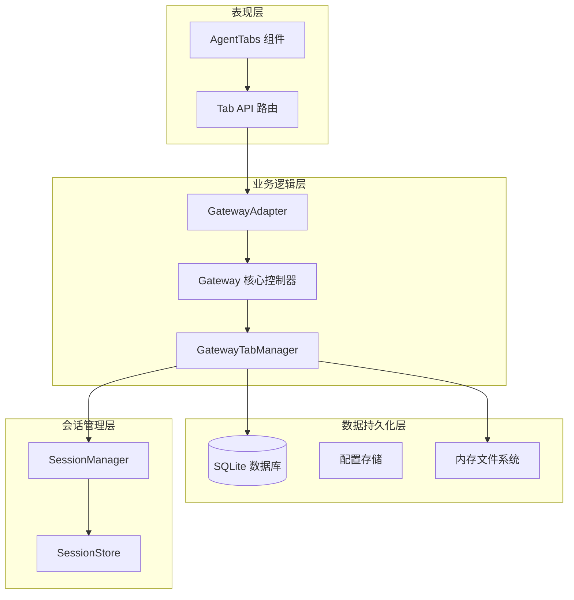
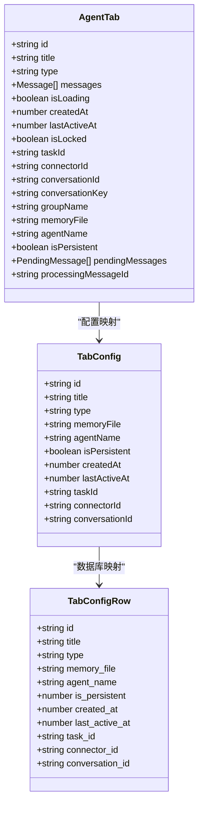
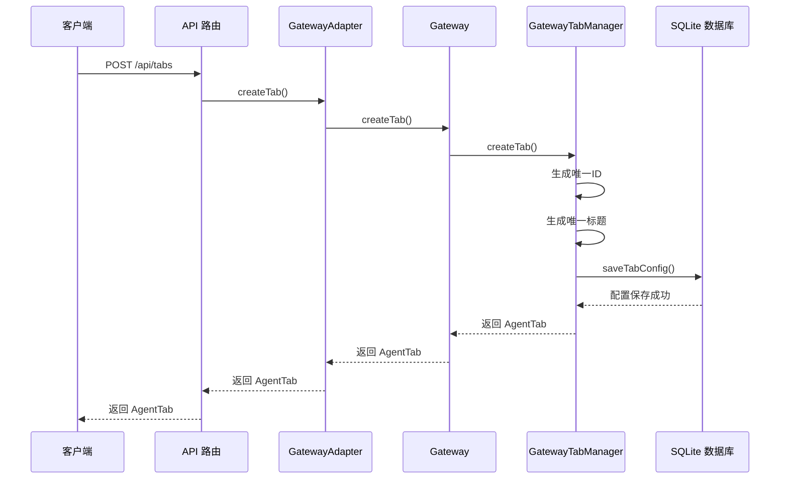
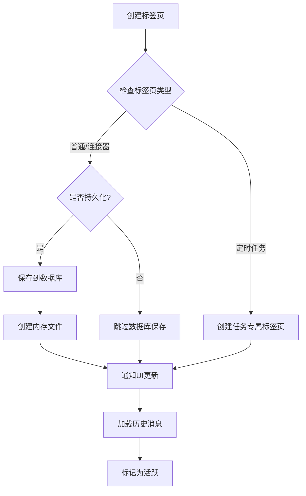
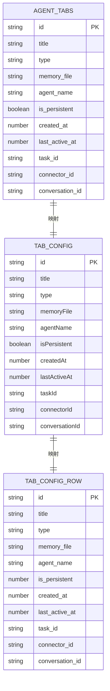
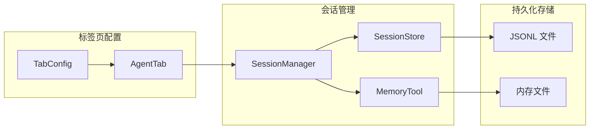
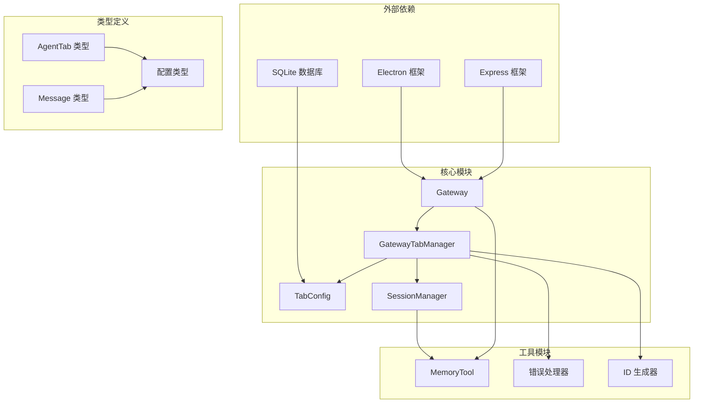

# 标签页配置管理

<cite>
**本文档引用的文件**
- [agent-tab.ts](file://src/types/agent-tab.ts)
- [tab-config.ts](file://src/main/database/tab-config.ts)
- [gateway-tab.ts](file://src/main/gateway-tab.ts)
- [gateway.ts](file://src/main/gateway.ts)
- [tabs.ts](file://src/server/routes/tabs.ts)
- [gateway-adapter.ts](file://src/server/gateway-adapter.ts)
- [session-manager.ts](file://src/main/session/session-manager.ts)
- [session-store.ts](file://src/main/session/session-store.ts)
- [memory-tool.ts](file://src/main/tools/memory-tool.ts)
- [version.ts](file://src/shared/constants/version.ts)
- [AgentTabs.tsx](file://src/renderer/components/AgentTabs.tsx)
</cite>

## 目录
1. [简介](#简介)
2. [项目结构](#项目结构)
3. [核心组件](#核心组件)
4. [架构概览](#架构概览)
5. [详细组件分析](#详细组件分析)
6. [依赖关系分析](#依赖关系分析)
7. [性能考虑](#性能考虑)
8. [故障排除指南](#故障排除指南)
9. [结论](#结论)

## 简介

DeepBot 标签页配置管理模块是系统中负责管理多会话窗口状态的核心组件。该模块实现了完整的标签页生命周期管理，包括持久化配置、内存管理、状态保持和资源回收等功能。通过统一的配置管理接口，系统能够支持多会话并发处理、状态持久化存储和动态资源分配。

该模块采用分层架构设计，将配置管理、生命周期控制和状态持久化分离到不同的组件中，确保了系统的可维护性和扩展性。标签页配置不仅包含基本的标识信息，还支持独立的内存文件路径、代理名称配置和持久化状态管理。

## 项目结构

标签页配置管理模块涉及多个层次的组件协作：

**图表来源**
- [gateway.ts:29-114](file://src/main/gateway.ts#L29-L114)
- [gateway-tab.ts:26-61](file://src/main/gateway-tab.ts#L26-L61)
- [gateway-adapter.ts:45-58](file://src/server/gateway-adapter.ts#L45-L58)

**章节来源**
- [gateway.ts:29-114](file://src/main/gateway.ts#L29-L114)
- [gateway-tab.ts:26-61](file://src/main/gateway-tab.ts#L26-L61)
- [tabs.ts:10-136](file://src/server/routes/tabs.ts#L10-L136)

## 核心组件

### 标签页数据结构

标签页配置采用强类型设计，包含以下关键字段：

**图表来源**
- [agent-tab.ts:23-46](file://src/types/agent-tab.ts#L23-L46)
- [tab-config.ts:12-41](file://src/main/database/tab-config.ts#L12-L41)

### 配置管理接口

配置管理模块提供了完整的 CRUD 操作接口：

| 操作类型 | 方法名 | 描述 | 数据库操作 |
|---------|--------|------|-----------|
| 创建 | `saveTabConfig` | 保存标签页配置 | INSERT OR REPLACE |
| 读取 | `getTabConfig` | 获取单个配置 | SELECT |
| 查询 | `getAllPersistentTabs` | 获取所有持久化配置 | SELECT WHERE |
| 更新 | `updateTabTitle` | 更新标题 | UPDATE |
| 更新 | `updateTabAgentName` | 更新代理名称 | UPDATE |
| 删除 | `deleteTabConfig` | 删除配置 | DELETE |
| 清理 | `deleteNonPersistentTabs` | 清理非持久化配置 | DELETE WHERE |

**章节来源**
- [tab-config.ts:69-198](file://src/main/database/tab-config.ts#L69-L198)
- [agent-tab.ts:23-46](file://src/types/agent-tab.ts#L23-L46)

## 架构概览

标签页配置管理采用分层架构，各层职责明确：

**图表来源**
- [tabs.ts:28-39](file://src/server/routes/tabs.ts#L28-L39)
- [gateway-adapter.ts:208-211](file://src/server/gateway-adapter.ts#L208-L211)
- [gateway.ts:616-628](file://src/main/gateway.ts#L616-L628)

**章节来源**
- [gateway-adapter.ts:208-211](file://src/server/gateway-adapter.ts#L208-L211)
- [gateway.ts:616-628](file://src/main/gateway.ts#L616-L628)

## 详细组件分析

### GatewayTabManager 核心管理器

GatewayTabManager 是标签页生命周期管理的核心组件，负责：

#### 生命周期管理
- **创建阶段**：生成唯一ID和标题，确定持久化策略
- **加载阶段**：从数据库恢复持久化标签页，加载历史消息
- **活动监控**：跟踪最后活跃时间，支持超时清理
- **销毁阶段**：清理内存文件、会话数据和数据库记录

#### 持久化策略

**图表来源**
- [gateway-tab.ts:492-611](file://src/main/gateway-tab.ts#L492-L611)
- [gateway-tab.ts:422-487](file://src/main/gateway-tab.ts#L422-L487)

#### 内存管理
- **独立内存文件**：每个标签页可配置独立的内存文件路径
- **自动清理**：关闭标签页时自动删除内存文件
- **继承机制**：新标签页可继承主内存文件内容

**章节来源**
- [gateway-tab.ts:492-611](file://src/main/gateway-tab.ts#L492-L611)
- [memory-tool.ts:114-138](file://src/main/tools/memory-tool.ts#L114-L138)

### 数据库配置管理

TabConfig 模块提供完整的数据库操作接口：

#### 数据库模式设计

**图表来源**
- [tab-config.ts:12-41](file://src/main/database/tab-config.ts#L12-L41)

#### CRUD 操作实现
- **保存配置**：使用 `INSERT OR REPLACE` 确保配置更新
- **批量查询**：支持按持久化状态筛选标签页
- **状态更新**：实时更新最后活跃时间
- **资源清理**：提供批量清理非持久化配置功能

**章节来源**
- [tab-config.ts:69-198](file://src/main/database/tab-config.ts#L69-L198)

### 会话管理集成

标签页配置与会话管理系统深度集成：

**图表来源**
- [session-manager.ts:17-26](file://src/main/session/session-manager.ts#L17-L26)
- [session-store.ts:46-51](file://src/main/session/session-store.ts#L46-L51)
- [memory-tool.ts:114-138](file://src/main/tools/memory-tool.ts#L114-L138)

**章节来源**
- [session-manager.ts:103-130](file://src/main/session/session-manager.ts#L103-L130)
- [session-store.ts:146-165](file://src/main/session/session-store.ts#L146-L165)

## 依赖关系分析

标签页配置管理模块的依赖关系呈现清晰的分层结构：

**图表来源**
- [gateway.ts:11-27](file://src/main/gateway.ts#L11-L27)
- [gateway-tab.ts:11-21](file://src/main/gateway-tab.ts#L11-L21)

**章节来源**
- [gateway.ts:11-27](file://src/main/gateway.ts#L11-L27)
- [gateway-tab.ts:11-21](file://src/main/gateway-tab.ts#L11-L21)

## 性能考虑

### 内存优化策略

1. **懒加载机制**：标签页历史消息采用延迟加载，避免一次性加载大量数据
2. **内存文件管理**：及时清理不再使用的内存文件，防止磁盘空间浪费
3. **会话缓存**：活跃标签页的会话数据保持在内存中，提高响应速度

### 数据库性能

1. **索引优化**：按最后活跃时间排序查询，支持高效的标签页排序
2. **批量操作**：提供批量清理非持久化配置功能，减少数据库压力
3. **事务管理**：关键操作使用事务确保数据一致性

### 并发处理

1. **线程安全**：使用 Map 数据结构存储标签页状态，支持高并发访问
2. **异步操作**：所有 I/O 操作采用异步模式，避免阻塞主线程
3. **资源池管理**：合理管理 AgentRuntime 实例，避免资源泄漏

## 故障排除指南

### 常见问题及解决方案

#### 标签页创建失败
- **症状**：创建标签页时报错
- **原因**：达到最大标签页数量限制
- **解决方案**：关闭不需要的标签页或增加 MAX_TABS 配置

#### 内存文件丢失
- **症状**：标签页关闭后内存文件未删除
- **原因**：文件系统权限问题或异常退出
- **解决方案**：手动清理内存文件目录或重启应用

#### 历史消息加载异常
- **症状**：标签页历史消息无法加载
- **原因**：会话文件损坏或权限不足
- **解决方案**：检查会话文件完整性或重建会话数据

**章节来源**
- [gateway-tab.ts:504-507](file://src/main/gateway-tab.ts#L504-L507)
- [version.ts](file://src/shared/constants/version.ts#L21)

## 结论

DeepBot 标签页配置管理模块通过精心设计的分层架构和完善的生命周期管理，为多会话应用场景提供了可靠的技术支撑。模块的主要优势包括：

1. **完整的生命周期管理**：从创建到销毁的全流程控制
2. **灵活的持久化策略**：支持多种配置持久化方案
3. **高效的内存管理**：智能的资源分配和回收机制
4. **强大的扩展性**：模块化设计便于功能扩展和维护

该模块为 DeepBot 的多会话管理、状态保持和资源回收提供了坚实的基础，支持复杂的企业级应用场景。通过持续的优化和改进，该模块将继续为用户提供稳定可靠的服务。