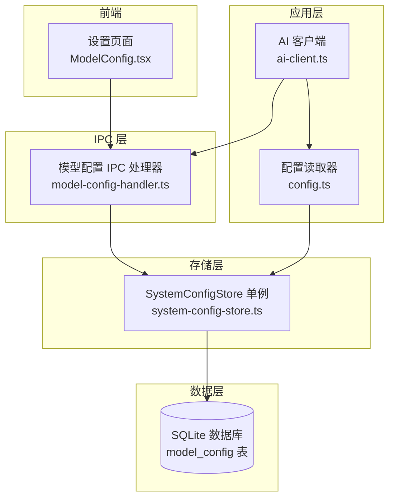
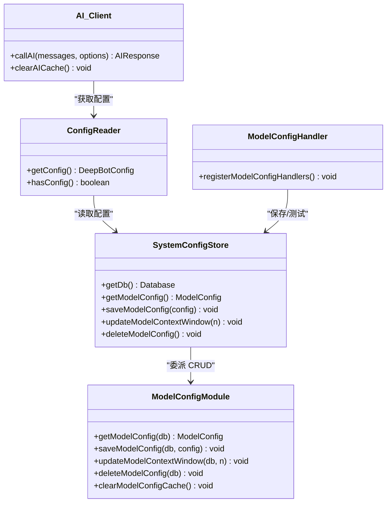
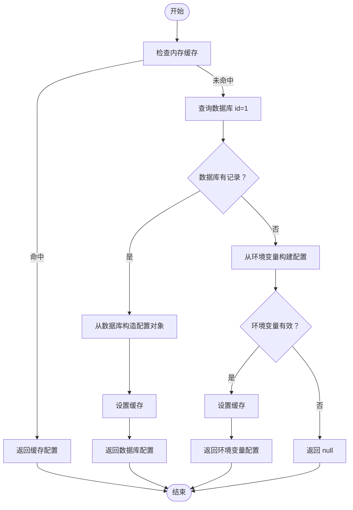
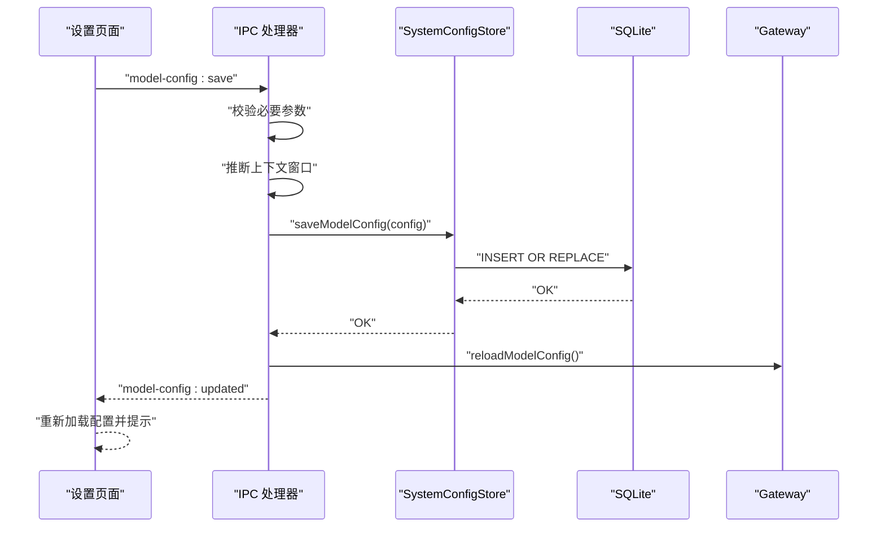
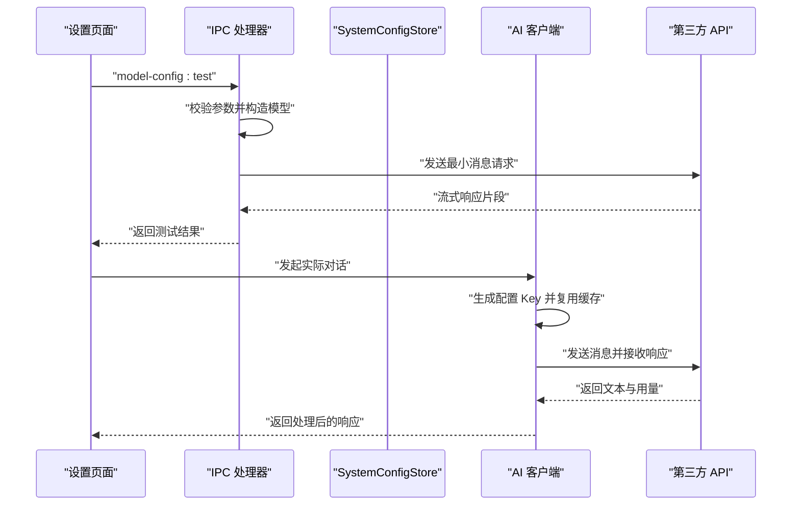
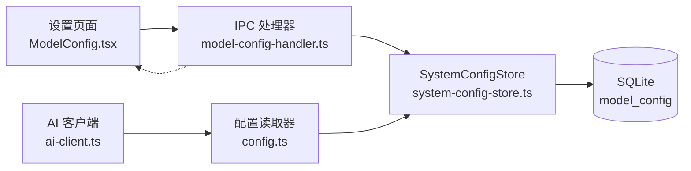

# 模型配置管理

<cite>
**本文档引用的文件**
- [src/main/database/model-config.ts](file://src/main/database/model-config.ts)
- [src/main/database/system-config-store.ts](file://src/main/database/system-config-store.ts)
- [src/main/ipc/model-config-handler.ts](file://src/main/ipc/model-config-handler.ts)
- [src/main/config.ts](file://src/main/config.ts)
- [src/main/utils/ai-client.ts](file://src/main/utils/ai-client.ts)
- [src/main/utils/model-info-fetcher.ts](file://src/main/utils/model-info-fetcher.ts)
- [src/main/database/config-types.ts](file://src/main/database/config-types.ts)
- [src/renderer/components/settings/ModelConfig.tsx](file://src/renderer/components/settings/ModelConfig.tsx)
- [src/types/ipc.ts](file://src/types/ipc.ts)
</cite>

## 目录
1. [简介](#简介)
2. [项目结构](#项目结构)
3. [核心组件](#核心组件)
4. [架构总览](#架构总览)
5. [详细组件分析](#详细组件分析)
6. [依赖关系分析](#依赖关系分析)
7. [性能考虑](#性能考虑)
8. [故障排查指南](#故障排查指南)
9. [结论](#结论)
10. [附录](#附录)

## 简介
本文件面向 DeepBot 的“模型配置管理”模块，系统性阐述模型配置的数据结构、CRUD 实现、验证与错误处理、使用场景、缓存与性能优化策略。目标读者既包括开发者也包括对技术细节有一定需求的非专业用户。

## 项目结构
模型配置管理涉及以下关键层次：
- 数据层：SQLite 持久化，单表 model_config，封装 CRUD 与缓存。
- 存储层：SystemConfigStore 单例，负责数据库初始化、表结构迁移与各配置模块的委派。
- IPC 层：模型配置 IPC 处理器，提供获取、保存、测试配置的 IPC 接口，并触发前端更新通知。
- 应用层：配置读取器 getConfig，统一从数据库或环境变量获取配置；AI 客户端 callAI，基于配置进行模型调用。
- 前端层：设置页面 ModelConfig 组件，提供 UI 配置入口与上下文窗口推断逻辑。

图表来源
- [src/renderer/components/settings/ModelConfig.tsx:1-432](file://src/renderer/components/settings/ModelConfig.tsx#L1-L432)
- [src/main/ipc/model-config-handler.ts:1-228](file://src/main/ipc/model-config-handler.ts#L1-L228)
- [src/main/database/system-config-store.ts:1-576](file://src/main/database/system-config-store.ts#L1-L576)
- [src/main/config.ts:1-108](file://src/main/config.ts#L1-L108)
- [src/main/utils/ai-client.ts:1-365](file://src/main/utils/ai-client.ts#L1-L365)

章节来源
- [src/main/database/system-config-store.ts:1-576](file://src/main/database/system-config-store.ts#L1-L576)
- [src/main/ipc/model-config-handler.ts:1-228](file://src/main/ipc/model-config-handler.ts#L1-L228)
- [src/main/config.ts:1-108](file://src/main/config.ts#L1-L108)
- [src/main/utils/ai-client.ts:1-365](file://src/main/utils/ai-client.ts#L1-L365)

## 核心组件
- 模型配置数据结构：定义在 config-types.ts，包含提供商类型、提供商 ID、提供商名称、基础 URL、模型 ID、API 类型、模型 ID2（快速模型）、API Key、上下文窗口大小、最后获取时间、来源标记等字段。
- CRUD 实现：
  - 获取：优先从数据库读取，若无则回退到环境变量；命中内存缓存避免重复查询。
  - 保存：INSERT OR REPLACE 写入数据库，强制 WAL checkpoint，清除缓存。
  - 更新上下文窗口：UPDATE 并记录 last_fetched。
  - 删除：DELETE WHERE id=1。
- 验证与错误处理：
  - IPC 层在保存前进行必要字段校验（API Key、Base URL、Model ID）。
  - AI 客户端在调用前检查配置完整性，捕获并友好化错误信息。
- 使用场景：
  - AI 模型调用：callAI 依据配置选择模型、构造上下文、发送请求、解析响应。
  - 参数传递：支持温度、最大令牌数、API Key、Base URL、是否使用快速模型等。
  - 响应处理：统一移除推理标签、提取文本、统计用量。
- 缓存与性能：
  - 内存缓存：避免重复查询数据库。
  - 连接池与单例：复用 Model 实例与模块导入，减少开销。
  - WAL 模式与主动 checkpoint：保证持久化可靠性。

章节来源
- [src/main/database/config-types.ts:32-46](file://src/main/database/config-types.ts#L32-L46)
- [src/main/database/model-config.ts:1-162](file://src/main/database/model-config.ts#L1-L162)
- [src/main/ipc/model-config-handler.ts:63-112](file://src/main/ipc/model-config-handler.ts#L63-L112)
- [src/main/utils/ai-client.ts:196-365](file://src/main/utils/ai-client.ts#L196-L365)

## 架构总览
模型配置管理采用分层架构：
- 数据层：SQLite 表 model_config，含 provider_type、provider_id、provider_name、base_url、model_id、model_name、model_id_2、api_key、context_window、last_fetched 等字段。
- 存储层：SystemConfigStore 单例，负责数据库初始化、表结构迁移、各配置模块委派。
- IPC 层：注册 IPC 处理器，提供获取、保存、测试配置的通道，并向前端广播更新事件。
- 应用层：getConfig 优先数据库，其次环境变量；callAI 基于配置进行模型调用。
- 前端层：ModelConfig 页面负责 UI 输入、保存、测试与提示。

图表来源
- [src/main/database/system-config-store.ts:37-77](file://src/main/database/system-config-store.ts#L37-L77)
- [src/main/database/model-config.ts:1-162](file://src/main/database/model-config.ts#L1-L162)
- [src/main/config.ts:38-83](file://src/main/config.ts#L38-L83)
- [src/main/utils/ai-client.ts:196-365](file://src/main/utils/ai-client.ts#L196-L365)
- [src/main/ipc/model-config-handler.ts:40-227](file://src/main/ipc/model-config-handler.ts#L40-L227)

## 详细组件分析

### 数据结构与字段说明
- 提供商类型（providerType）：用于 UI 下拉选择，支持 qwen、deepseek、gemini、minimax、custom。
- 提供商 ID（providerId）：提供商标识，通常与 providerType 相同。
- 提供商名称（providerName）：用于显示。
- 基础 URL（baseUrl）：API 端点地址。
- 模型 ID（modelId）：主模型标识。
- API 类型（apiType）：'openai-completions' 或 'google-generative-ai'。
- 模型 ID2（modelId2）：快速模型（可选），用于轻量任务。
- API Key（apiKey）：加密存储。
- 上下文窗口大小（contextWindow）：tokens 数，可由用户指定或自动推断。
- 最后获取时间（lastFetched）：时间戳，用于记录推断或更新时间。
- 来源标记（fromEnv）：是否来自环境变量。

章节来源
- [src/main/database/config-types.ts:32-46](file://src/main/database/config-types.ts#L32-L46)

### CRUD 操作实现
- 获取模型配置
  - 优先从数据库读取 id=1 的记录，构造 ModelConfig 对象。
  - 若数据库无配置，则从环境变量构建配置对象（AI_API_KEY、AI_BASE_URL、AI_MODEL_ID 三者缺一不可）。
  - 使用内存缓存避免重复查询；异常时返回 null 并记录错误。
- 保存模型配置
  - 使用 INSERT OR REPLACE 写入所有字段，其中 model_name 使用 modelId。
  - 强制执行 wal_checkpoint(PASSIVE) 以确保立即落盘。
  - 清除内存缓存，下次读取时重新加载。
- 更新上下文窗口
  - UPDATE 语句更新 context_window 与 last_fetched。
  - 同步落盘并清除缓存。
- 删除模型配置
  - DELETE FROM WHERE id=1。
  - 清除缓存并记录日志。

图表来源
- [src/main/database/model-config.ts:60-95](file://src/main/database/model-config.ts#L60-L95)

章节来源
- [src/main/database/model-config.ts:14-161](file://src/main/database/model-config.ts#L14-L161)

### 验证机制与错误处理
- IPC 保存配置前的验证
  - 必要参数校验：API Key、Base URL、Model ID 均不能为空。
  - 自动推断上下文窗口：若用户未设置，根据模型 ID 通过模型映射表推断。
  - 保存后触发 Gateway 重新加载与前端更新通知。
- 测试配置
  - 构造临时模型（根据 apiType 选择 openai-completions 或 google-generative-ai）。
  - 发送最小消息请求，读取首个响应片段以验证连通性。
  - 捕获并友好化错误信息（如 401、404、超时等）。
- AI 客户端错误处理
  - 配置缺失：抛出明确错误提示。
  - 调用被取消：AbortError。
  - API 错误：解析 stopReason 与 errorMessage，转换为用户可理解的信息。
  - 空响应：抛出错误并提示。
- 前端提示
  - 若配置来自环境变量，界面显示提示。
  - 保存成功后重新加载配置，展示后端推断的上下文窗口值。

图表来源
- [src/main/ipc/model-config-handler.ts:63-112](file://src/main/ipc/model-config-handler.ts#L63-L112)
- [src/main/database/system-config-store.ts:387-389](file://src/main/database/system-config-store.ts#L387-L389)

章节来源
- [src/main/ipc/model-config-handler.ts:63-112](file://src/main/ipc/model-config-handler.ts#L63-L112)
- [src/main/ipc/model-config-handler.ts:114-224](file://src/main/ipc/model-config-handler.ts#L114-L224)
- [src/main/utils/ai-client.ts:200-365](file://src/main/utils/ai-client.ts#L200-L365)

### 使用场景与集成点
- AI 模型调用
  - callAI 依据配置选择模型类型（OpenAI 兼容或 Gemini 原生），构造上下文与请求参数。
  - 支持快速模型切换（useFastModel），自动复用连接池与模块单例。
  - 统一处理响应，移除推理标签，提取文本并统计用量。
- 参数传递
  - 支持 temperature、maxTokens、apiKey、baseUrl、signal、useFastModel 等选项。
  - 通过 getConfig 获取当前配置，若未配置则抛错。
- 响应处理
  - 遍历响应内容，优先使用 textSignature 解码，其次使用 text。
  - 若仍为空，回退到 result.text；最终仍为空则报错。
- 前端交互
  - ModelConfig 页面提供提供商选择、API 类型切换、API Key 输入、上下文窗口编辑与保存/测试按钮。
  - 保存成功后自动刷新配置并提示。

图表来源
- [src/main/ipc/model-config-handler.ts:114-224](file://src/main/ipc/model-config-handler.ts#L114-L224)
- [src/main/utils/ai-client.ts:196-365](file://src/main/utils/ai-client.ts#L196-L365)
- [src/main/config.ts:38-83](file://src/main/config.ts#L38-L83)

章节来源
- [src/renderer/components/settings/ModelConfig.tsx:104-149](file://src/renderer/components/settings/ModelConfig.tsx#L104-L149)
- [src/main/utils/ai-client.ts:196-365](file://src/main/utils/ai-client.ts#L196-L365)

### 缓存机制与性能优化
- 内存缓存
  - ModelConfigModule 内部维护 cachedConfig，避免重复查询数据库与日志输出。
  - 保存、更新、删除配置后调用 clearModelConfigCache 清除缓存。
- 连接池与单例
  - ai-client.ts 维护 cachedModel 与 cachedPiAI，按配置 Key 复用 Model 实例与模块导入。
  - 生成配置 Key 时包含 API Key 片段、模型 ID、Base URL 与 API 类型，确保配置变更时重建实例。
- 数据库持久化
  - WAL 模式提升并发写入性能；保存后执行 wal_checkpoint(PASSIVE) 确保立即落盘。
- 上下文窗口推断
  - 通过 model-info-fetcher.ts 基于模型 ID 模糊匹配推断上下文窗口，减少用户配置成本。

章节来源
- [src/main/database/model-config.ts:8-16](file://src/main/database/model-config.ts#L8-L16)
- [src/main/database/model-config.ts:121-125](file://src/main/database/model-config.ts#L121-L125)
- [src/main/utils/ai-client.ts:56-91](file://src/main/utils/ai-client.ts#L56-L91)
- [src/main/utils/ai-client.ts:159-187](file://src/main/utils/ai-client.ts#L159-L187)
- [src/main/utils/model-info-fetcher.ts:13-83](file://src/main/utils/model-info-fetcher.ts#L13-L83)

## 依赖关系分析
- SystemConfigStore 单例负责数据库初始化与迁移，委派具体配置模块（如模型配置）执行 CRUD。
- IPC 层依赖 SystemConfigStore 进行保存与测试，同时向前端广播更新事件。
- 应用层通过 getConfig 获取配置，再由 AI 客户端进行模型调用。
- 前端设置页面通过 IPC 通道与后端交互，保存配置后重新加载并提示。

图表来源
- [src/renderer/components/settings/ModelConfig.tsx:1-432](file://src/renderer/components/settings/ModelConfig.tsx#L1-L432)
- [src/main/ipc/model-config-handler.ts:1-228](file://src/main/ipc/model-config-handler.ts#L1-L228)
- [src/main/database/system-config-store.ts:1-576](file://src/main/database/system-config-store.ts#L1-L576)
- [src/main/config.ts:1-108](file://src/main/config.ts#L1-L108)
- [src/main/utils/ai-client.ts:1-365](file://src/main/utils/ai-client.ts#L1-L365)

章节来源
- [src/main/database/system-config-store.ts:37-77](file://src/main/database/system-config-store.ts#L37-L77)
- [src/main/ipc/model-config-handler.ts:40-227](file://src/main/ipc/model-config-handler.ts#L40-L227)

## 性能考虑
- 读取性能
  - 内存缓存显著降低数据库访问频率，建议在高频读取场景下保持缓存策略。
- 写入性能
  - WAL 模式与 PASSIVE checkpoint 在保证可靠性的同时提升写入吞吐。
- 连接与实例复用
  - ai-client.ts 的连接池与单例机制减少重复初始化开销，建议在高并发场景下保持该策略。
- 上下文窗口推断
  - 通过模型 ID 模糊匹配推断上下文窗口，减少用户配置负担，同时避免因配置不当导致的性能问题。

## 故障排查指南
- 配置未生效
  - 检查是否保存成功并触发前端更新事件；确认缓存是否被正确清除。
  - 确认 SystemConfigStore 是否成功初始化数据库与迁移。
- API Key 无效
  - IPC 测试配置会返回明确错误（如 401 Unauthorized），请核对 API Key。
- 模型不存在
  - IPC 测试配置会返回明确错误（如 404 Not Found），请核对模型 ID。
- 超时或空响应
  - 检查网络连通性与代理设置；确认 API 基础 URL 正确。
- 环境变量覆盖
  - 若界面显示“当前使用环境变量配置”，请在 UI 中保存配置以覆盖环境变量。

章节来源
- [src/main/ipc/model-config-handler.ts:114-224](file://src/main/ipc/model-config-handler.ts#L114-L224)
- [src/main/utils/ai-client.ts:346-365](file://src/main/utils/ai-client.ts#L346-L365)
- [src/main/database/system-config-store.ts:221-315](file://src/main/database/system-config-store.ts#L221-L315)

## 结论
模型配置管理模块通过清晰的分层设计与完善的缓存、验证与错误处理机制，实现了稳定可靠的配置持久化与调用链路。结合上下文窗口自动推断与连接池优化，能够在保证易用性的同时兼顾性能与可靠性。建议在生产环境中持续关注数据库迁移与缓存一致性，确保配置变更的及时生效与一致性。

## 附录
- IPC 通道定义
  - 获取模型配置：model-config:get
  - 保存模型配置：model-config:save
  - 测试模型配置：model-config:test
  - 配置更新通知：model-config:updated

章节来源
- [src/types/ipc.ts:42-84](file://src/types/ipc.ts#L42-L84)
- [src/types/ipc.ts:244-266](file://src/types/ipc.ts#L244-L266)