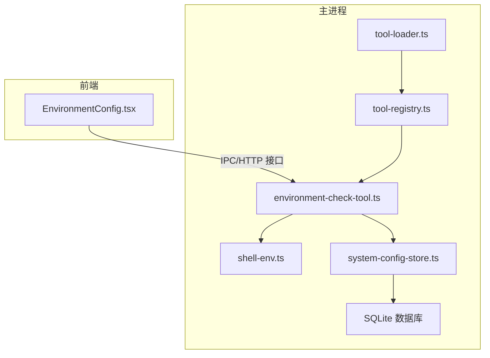
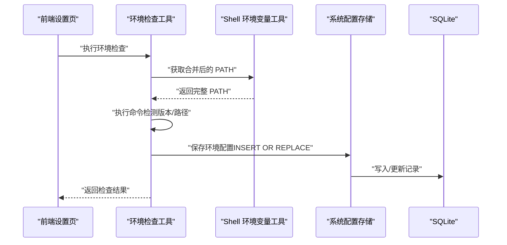
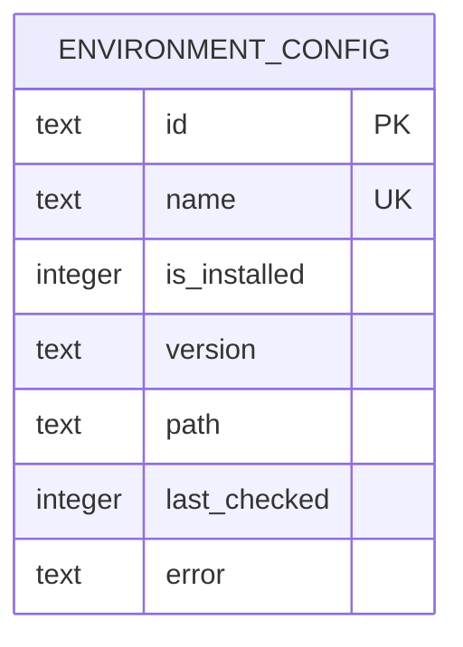
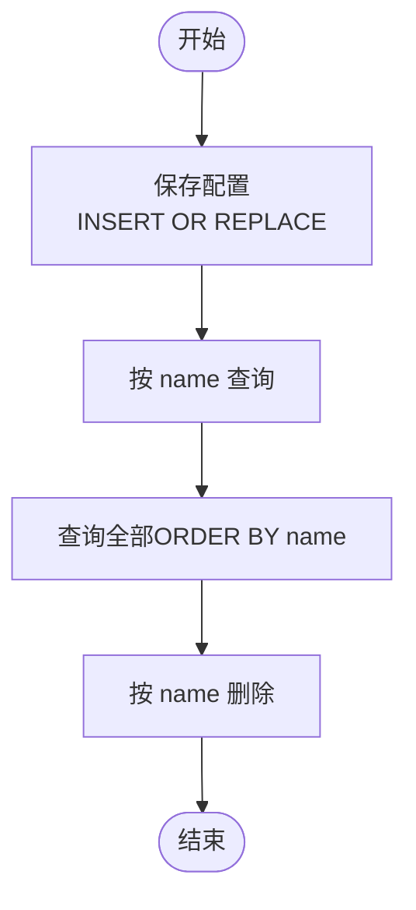
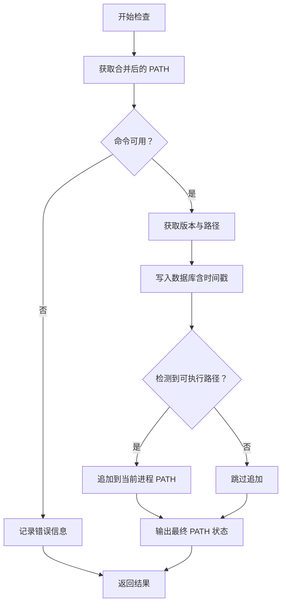
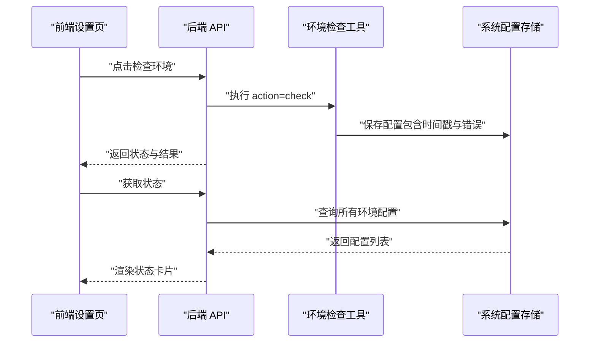
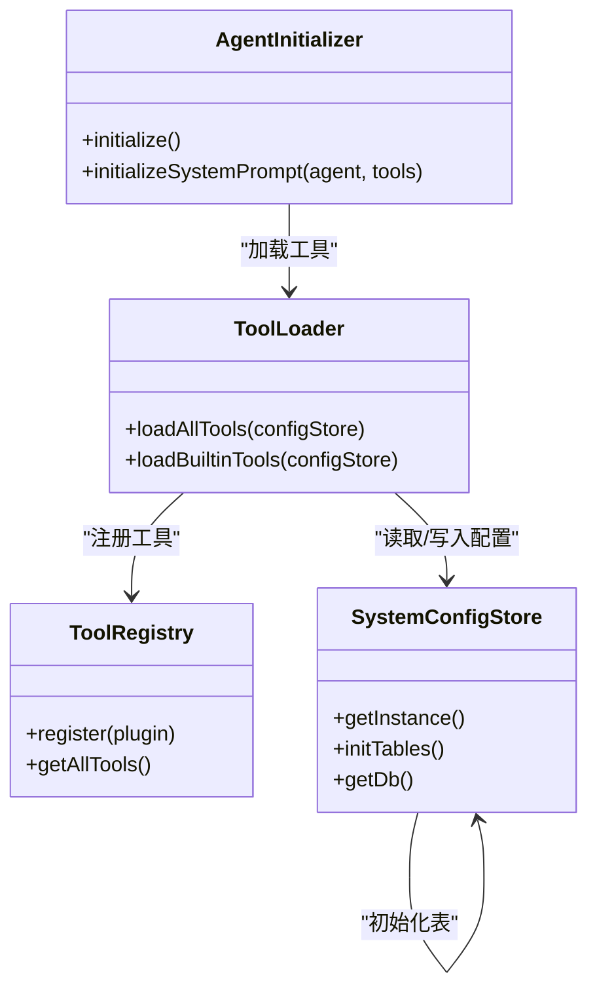
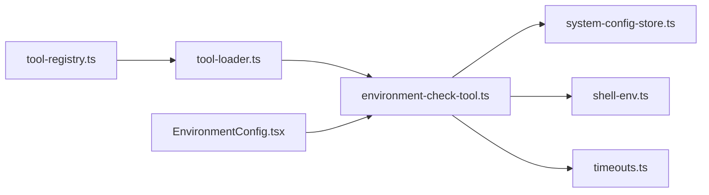

# 环境配置管理

<cite>
**本文档引用的文件**
- [environment-config.ts](file://src/main/database/environment-config.ts)
- [config-types.ts](file://src/main/database/config-types.ts)
- [system-config-store.ts](file://src/main/database/system-config-store.ts)
- [environment-check-tool.ts](file://src/main/tools/environment-check-tool.ts)
- [shell-env.ts](file://src/main/tools/shell-env.ts)
- [timeouts.ts](file://src/main/config/timeouts.ts)
- [EnvironmentConfig.tsx](file://src/renderer/components/settings/EnvironmentConfig.tsx)
- [tool-loader.ts](file://src/main/tools/registry/tool-loader.ts)
- [tool-registry.ts](file://src/main/tools/registry/tool-registry.ts)
- [tool-names.ts](file://src/main/tools/tool-names.ts)
- [agent-initializer.ts](file://src/main/agent-runtime/agent-initializer.ts)
</cite>

## 目录
1. [简介](#简介)
2. [项目结构](#项目结构)
3. [核心组件](#核心组件)
4. [架构总览](#架构总览)
5. [详细组件分析](#详细组件分析)
6. [依赖关系分析](#依赖关系分析)
7. [性能考虑](#性能考虑)
8. [故障排查指南](#故障排查指南)
9. [结论](#结论)
10. [附录](#附录)

## 简介
本文件面向 史丽慧小助理 环境配置管理模块，系统性阐述环境配置的数据结构、存储机制、CRUD 操作、检查与错误处理策略，并结合前端设置页与工具链集成，给出使用场景、最佳实践以及系统启动时的加载与验证流程。目标读者既包括需要深入理解实现细节的开发者，也包括希望正确配置和维护系统的使用者。

## 项目结构
围绕环境配置管理的关键文件分布如下：
- 数据层：SQLite 表 schema、CRUD 函数、系统配置存储类
- 工具层：环境检查工具、Shell 环境变量工具、工具加载器与注册表
- 前端层：环境配置设置页组件
- 配置层：超时等运行时参数

**图表来源**
- [EnvironmentConfig.tsx:31-76](file://src/renderer/components/settings/EnvironmentConfig.tsx#L31-L76)
- [tool-loader.ts:109-161](file://src/main/tools/registry/tool-loader.ts#L109-L161)
- [tool-registry.ts:36-55](file://src/main/tools/registry/tool-registry.ts#L36-L55)
- [environment-check-tool.ts:104-146](file://src/main/tools/environment-check-tool.ts#L104-L146)
- [shell-env.ts:284-327](file://src/main/tools/shell-env.ts#L284-L327)
- [system-config-store.ts:37-77](file://src/main/database/system-config-store.ts#L37-L77)
- [environment-config.ts:11-27](file://src/main/database/environment-config.ts#L11-L27)

**章节来源**
- [EnvironmentConfig.tsx:31-76](file://src/renderer/components/settings/EnvironmentConfig.tsx#L31-L76)
- [tool-loader.ts:109-161](file://src/main/tools/registry/tool-loader.ts#L109-L161)
- [system-config-store.ts:82-94](file://src/main/database/system-config-store.ts#L82-L94)

## 核心组件
- 环境配置数据结构：包含标识、名称、安装状态、版本、路径、最后检查时间、错误信息等字段
- 存储层：SQLite 表 schema 与 CRUD 函数封装
- 系统配置存储类：统一初始化数据库、创建表、提供各配置模块的访问入口
- 环境检查工具：执行命令检测、合并 PATH、刷新缓存、写入数据库
- Shell 环境变量工具：解决 Electron 主进程环境变量不完整问题
- 工具加载器与注册表：将环境检查工具注入 Agent 工具集
- 前端设置页：展示状态、触发检查、引导安装

**章节来源**
- [config-types.ts:8-16](file://src/main/database/config-types.ts#L8-L16)
- [environment-config.ts:11-79](file://src/main/database/environment-config.ts#L11-L79)
- [system-config-store.ts:82-94](file://src/main/database/system-config-store.ts#L82-L94)
- [environment-check-tool.ts:104-318](file://src/main/tools/environment-check-tool.ts#L104-L318)
- [shell-env.ts:284-327](file://src/main/tools/shell-env.ts#L284-L327)
- [tool-loader.ts:159-161](file://src/main/tools/registry/tool-loader.ts#L159-L161)
- [EnvironmentConfig.tsx:31-76](file://src/renderer/components/settings/EnvironmentConfig.tsx#L31-L76)

## 架构总览
环境配置管理采用“前端展示 + 主进程工具 + 数据持久化”的分层架构。前端通过 IPC/HTTP 触发主进程工具执行环境检查；工具通过 Shell 环境变量工具获取完整 PATH，执行命令检测后将结果写入数据库；系统配置存储类负责数据库初始化与表结构管理；Agent 初始化阶段加载工具，使环境检查能力可被对话流程调用。

**图表来源**
- [EnvironmentConfig.tsx:61-76](file://src/renderer/components/settings/EnvironmentConfig.tsx#L61-L76)
- [environment-check-tool.ts:118-163](file://src/main/tools/environment-check-tool.ts#L118-L163)
- [shell-env.ts:284-327](file://src/main/tools/shell-env.ts#L284-L327)
- [system-config-store.ts:319-321](file://src/main/database/system-config-store.ts#L319-L321)
- [environment-config.ts:11-27](file://src/main/database/environment-config.ts#L11-L27)

## 详细组件分析

### 数据结构与存储机制
- 数据结构字段
  - id：环境项唯一标识（如 python）
  - name：环境项名称（如 python）
  - isInstalled：布尔型安装状态
  - version：命令行输出的版本字符串
  - path：命令所在路径（which/where 输出）
  - lastChecked：最近检查的时间戳
  - error：检测异常信息
- 存储机制
  - 表结构：environment_config，包含唯一 name 索引
  - 初始化：SystemConfigStore 在构造时创建表
  - CRUD：封装在 environment-config 模块中，使用 INSERT OR REPLACE 保证幂等

**图表来源**
- [system-config-store.ts:84-94](file://src/main/database/system-config-store.ts#L84-L94)
- [config-types.ts:8-16](file://src/main/database/config-types.ts#L8-L16)

**章节来源**
- [config-types.ts:8-16](file://src/main/database/config-types.ts#L8-L16)
- [system-config-store.ts:84-94](file://src/main/database/system-config-store.ts#L84-L94)
- [environment-config.ts:11-79](file://src/main/database/environment-config.ts#L11-L79)

### CRUD 操作实现
- 保存环境配置
  - 使用 INSERT OR REPLACE，按 id/name 唯一键进行更新
  - 将布尔值转换为 1/0 存储
- 获取特定环境配置
  - 按 name 查询，返回结构化对象
- 获取所有环境配置
  - 按 name 排序列出
- 删除环境配置
  - 按 name 删除对应记录

**图表来源**
- [environment-config.ts:11-79](file://src/main/database/environment-config.ts#L11-L79)

**章节来源**
- [environment-config.ts:11-79](file://src/main/database/environment-config.ts#L11-L79)

### 环境检查机制与错误处理
- 检查流程
  - 合并 PATH：从登录 shell 获取完整 PATH，回退解析配置文件
  - 命令检测：执行 --version 获取版本，执行 which/where 获取路径
  - 结果写入：将 isInstalled、version、path、lastChecked、error 写入数据库
  - 保险机制：若检测到 Python 路径，将其追加到当前进程 PATH
- 错误处理
  - 异常捕获并转换为可读错误信息
  - refresh 操作可重置 Shell 环境变量缓存
- 超时控制
  - 命令执行超时由 TIMEOUTS.COMMAND_EXECUTION_TIMEOUT 控制

**图表来源**
- [environment-check-tool.ts:21-69](file://src/main/tools/environment-check-tool.ts#L21-L69)
- [environment-check-tool.ts:146-217](file://src/main/tools/environment-check-tool.ts#L146-L217)
- [shell-env.ts:284-327](file://src/main/tools/shell-env.ts#L284-L327)
- [timeouts.ts:33-33](file://src/main/config/timeouts.ts#L33-L33)

**章节来源**
- [environment-check-tool.ts:104-318](file://src/main/tools/environment-check-tool.ts#L104-L318)
- [shell-env.ts:284-327](file://src/main/tools/shell-env.ts#L284-L327)
- [timeouts.ts:33-33](file://src/main/config/timeouts.ts#L33-L33)

### 前端使用场景与最佳实践
- 使用场景
  - 首次启动引导：检测 Python 环境，提示安装步骤
  - 运行时验证：在执行依赖 Python 的技能或脚本前检查状态
  - 环境变更后刷新：当 PATH 或配置变化时，先执行 refresh 再 check
- 最佳实践
  - 保持 lastChecked 时间戳最新，便于后续审计
  - 将 error 信息用于前端提示，指导用户修复
  - 多环境支持：不同工作区可独立维护环境配置（通过不同 name）
  - 版本管理：关注 version 字段变化，配合 error 字段定位问题

**图表来源**
- [EnvironmentConfig.tsx:38-50](file://src/renderer/components/settings/EnvironmentConfig.tsx#L38-L50)
- [EnvironmentConfig.tsx:61-76](file://src/renderer/components/settings/EnvironmentConfig.tsx#L61-L76)
- [environment-check-tool.ts:234-282](file://src/main/tools/environment-check-tool.ts#L234-L282)
- [system-config-store.ts:327-329](file://src/main/database/system-config-store.ts#L327-L329)

**章节来源**
- [EnvironmentConfig.tsx:31-323](file://src/renderer/components/settings/EnvironmentConfig.tsx#L31-L323)
- [environment-check-tool.ts:234-282](file://src/main/tools/environment-check-tool.ts#L234-L282)

### 系统启动时的加载与验证
- 工具注入
  - ToolLoader 在加载内置工具时显式创建并注册环境检查工具
  - ToolRegistry 负责工具注册与查询
- Agent 初始化
  - AgentInitializer 通过 ToolLoader 加载工具，使环境检查工具可在对话流程中被调用
- 配置持久化
  - SystemConfigStore 在构造时初始化数据库与表结构，确保环境配置可持久化

**图表来源**
- [tool-loader.ts:57-71](file://src/main/tools/registry/tool-loader.ts#L57-L71)
- [tool-loader.ts:109-161](file://src/main/tools/registry/tool-loader.ts#L109-L161)
- [tool-registry.ts:36-55](file://src/main/tools/registry/tool-registry.ts#L36-L55)
- [agent-initializer.ts:76-79](file://src/main/agent-runtime/agent-initializer.ts#L76-L79)
- [system-config-store.ts:41-60](file://src/main/database/system-config-store.ts#L41-L60)

**章节来源**
- [tool-loader.ts:109-161](file://src/main/tools/registry/tool-loader.ts#L109-L161)
- [tool-registry.ts:36-55](file://src/main/tools/registry/tool-registry.ts#L36-L55)
- [agent-initializer.ts:76-79](file://src/main/agent-runtime/agent-initializer.ts#L76-L79)
- [system-config-store.ts:41-60](file://src/main/database/system-config-store.ts#L41-L60)

## 依赖关系分析
- 环境检查工具依赖
  - SystemConfigStore：写入/读取环境配置
  - TIMEOUTS：控制命令执行超时
  - shell-env：获取合并后的 PATH
- 工具注册与加载
  - ToolLoader 显式导入并创建环境检查工具
  - ToolRegistry 管理工具生命周期与配置
- 前端依赖
  - 通过设置页组件触发检查与状态查询

**图表来源**
- [environment-check-tool.ts:104-146](file://src/main/tools/environment-check-tool.ts#L104-L146)
- [system-config-store.ts:319-321](file://src/main/database/system-config-store.ts#L319-L321)
- [shell-env.ts:284-327](file://src/main/tools/shell-env.ts#L284-L327)
- [timeouts.ts:33-33](file://src/main/config/timeouts.ts#L33-L33)
- [tool-loader.ts:159-161](file://src/main/tools/registry/tool-loader.ts#L159-L161)
- [tool-registry.ts:36-55](file://src/main/tools/registry/tool-registry.ts#L36-L55)
- [EnvironmentConfig.tsx:38-50](file://src/renderer/components/settings/EnvironmentConfig.tsx#L38-L50)

**章节来源**
- [environment-check-tool.ts:104-146](file://src/main/tools/environment-check-tool.ts#L104-L146)
- [tool-loader.ts:159-161](file://src/main/tools/registry/tool-loader.ts#L159-L161)
- [tool-registry.ts:36-55](file://src/main/tools/registry/tool-registry.ts#L36-L55)
- [EnvironmentConfig.tsx:38-50](file://src/renderer/components/settings/EnvironmentConfig.tsx#L38-L50)

## 性能考虑
- 数据库写入
  - 使用 INSERT OR REPLACE，避免重复插入，减少索引冲突
  - WAL 模式提升并发写入性能
- 命令执行
  - 设置合理超时，避免长时间阻塞
  - 仅在必要时刷新 Shell 环境变量缓存
- 前端渲染
  - 避免重复加载状态，使用 ref 标记已加载
  - 仅在需要时发起检查请求

[本节为通用建议，无需具体文件引用]

## 故障排查指南
- 常见问题
  - PATH 不完整：Electron 主进程环境变量不完整，需执行 refresh 并重新检查
  - 命令不可用：确认命令是否存在于合并后的 PATH 中
  - 超时失败：适当增大 TIMEOUTS.COMMAND_EXECUTION_TIMEOUT
- 排查步骤
  - 在前端设置页执行 refresh，再执行 check
  - 查看数据库中对应 name 的记录，核对 isInstalled、version、path、error
  - 检查 Shell 环境变量工具的日志输出
- 相关实现参考
  - 环境检查工具的错误捕获与返回
  - Shell 环境变量缓存重置
  - 数据库写入与查询

**章节来源**
- [environment-check-tool.ts:298-314](file://src/main/tools/environment-check-tool.ts#L298-L314)
- [environment-check-tool.ts:127-131](file://src/main/tools/environment-check-tool.ts#L127-L131)
- [shell-env.ts:332-336](file://src/main/tools/shell-env.ts#L332-L336)
- [environment-config.ts:32-49](file://src/main/database/environment-config.ts#L32-L49)

## 结论
环境配置管理模块通过清晰的数据结构、可靠的持久化与完善的工具链集成，实现了对系统运行环境的自动化检查与状态维护。前端设置页提供了直观的操作入口，主进程工具保障了跨平台环境变量的准确性，系统配置存储类确保了配置的持久化与迁移兼容。遵循本文的最佳实践与排障指南，可有效提升系统的稳定性与用户体验。

[本节为总结性内容，无需具体文件引用]

## 附录
- 工具名称常量：统一管理工具名称，避免硬编码
- 多环境支持建议：为不同工作区或用户场景使用不同的 name，实现隔离
- 版本管理建议：关注 version 字段变化，结合 error 字段进行问题定位

**章节来源**
- [tool-names.ts:8-94](file://src/main/tools/tool-names.ts#L8-L94)