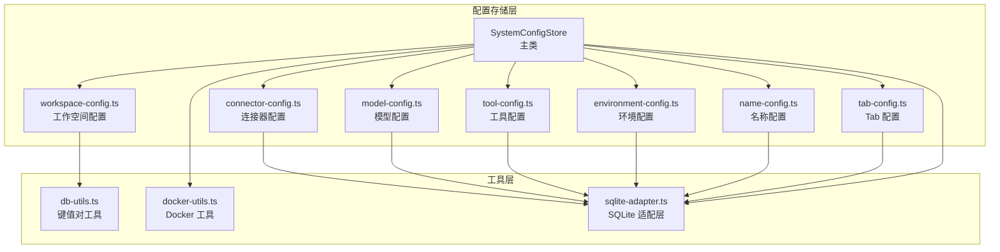
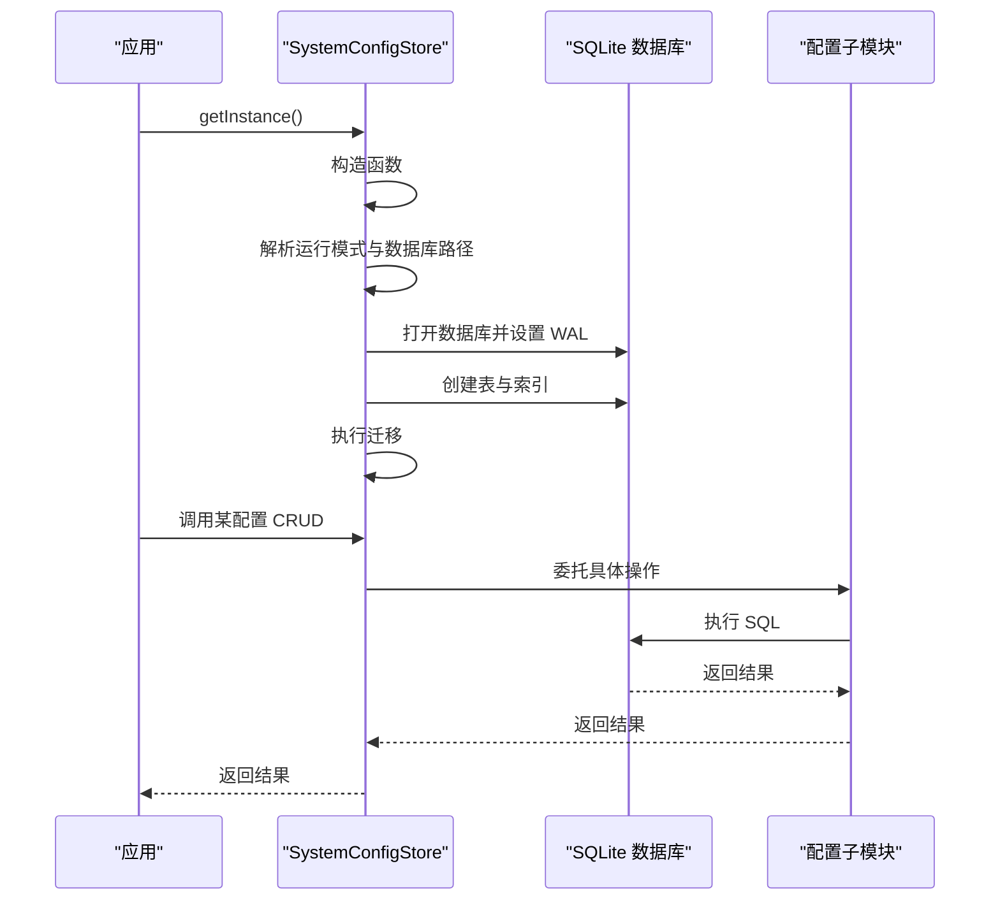
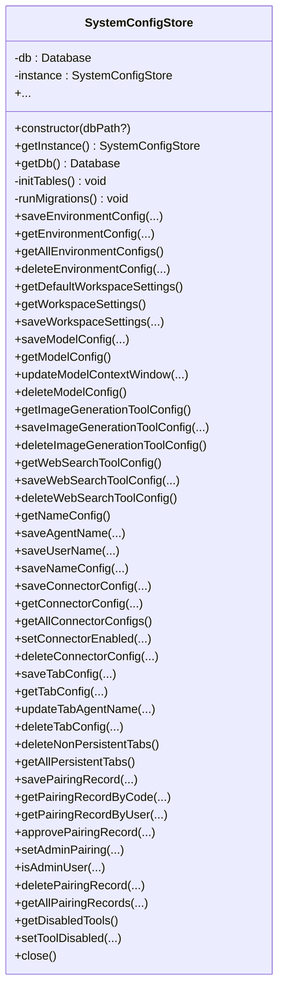
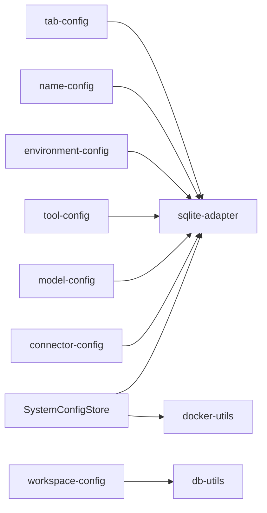

# 系统配置存储核心

<cite>
**本文档引用的文件**
- [system-config-store.ts](file://src/main/database/system-config-store.ts)
- [environment-config.ts](file://src/main/database/environment-config.ts)
- [workspace-config.ts](file://src/main/database/workspace-config.ts)
- [model-config.ts](file://src/main/database/model-config.ts)
- [tool-config.ts](file://src/main/database/tool-config.ts)
- [connector-config.ts](file://src/main/database/connector-config.ts)
- [name-config.ts](file://src/main/database/name-config.ts)
- [tab-config.ts](file://src/main/database/tab-config.ts)
- [config-types.ts](file://src/main/database/config-types.ts)
- [docker-utils.ts](file://src/shared/utils/docker-utils.ts)
- [db-utils.ts](file://src/shared/utils/db-utils.ts)
- [sqlite-adapter.ts](file://src/shared/utils/sqlite-adapter.ts)
</cite>

## 目录
1. [简介](#简介)
2. [项目结构](#项目结构)
3. [核心组件](#核心组件)
4. [架构总览](#架构总览)
5. [详细组件分析](#详细组件分析)
6. [依赖关系分析](#依赖关系分析)
7. [性能考量](#性能考量)
8. [故障排查指南](#故障排查指南)
9. [结论](#结论)

## 简介
本文件面向 DeepBot 系统的“系统配置存储核心”模块，聚焦于 SystemConfigStore 类的设计与实现，涵盖以下主题：
- 单例模式实现与生命周期管理
- SQLite 数据库初始化与表结构设计
- 多种配置表的创建与迁移机制
- 配置存储的 CRUD 接口说明
- Docker 模式与本地模式下的数据库路径差异
- 索引优化与性能特性

## 项目结构
该模块采用“主类 + 子模块”的分层设计：
- 主类 SystemConfigStore 负责数据库初始化、单例管理与表初始化
- 各配置子模块负责具体配置的 CRUD 操作（环境、工作空间、模型、工具、连接器、名称、Tab 等）
- 适配层 sqlite-adapter 提供与 better-sqlite3 兼容的 API
- docker-utils 提供 Docker/本地模式判断与数据库目录解析

图表来源
- [system-config-store.ts:37-77](file://src/main/database/system-config-store.ts#L37-L77)
- [workspace-config.ts:1-219](file://src/main/database/workspace-config.ts#L1-L219)
- [model-config.ts:1-162](file://src/main/database/model-config.ts#L1-L162)
- [tool-config.ts:1-128](file://src/main/database/tool-config.ts#L1-L128)
- [connector-config.ts:1-281](file://src/main/database/connector-config.ts#L1-L281)
- [name-config.ts:1-140](file://src/main/database/name-config.ts#L1-L140)
- [tab-config.ts:1-218](file://src/main/database/tab-config.ts#L1-L218)
- [db-utils.ts:1-138](file://src/shared/utils/db-utils.ts#L1-L138)
- [docker-utils.ts:1-25](file://src/shared/utils/docker-utils.ts#L1-L25)
- [sqlite-adapter.ts:1-102](file://src/shared/utils/sqlite-adapter.ts#L1-L102)

章节来源
- [system-config-store.ts:37-77](file://src/main/database/system-config-store.ts#L37-L77)
- [docker-utils.ts:1-25](file://src/shared/utils/docker-utils.ts#L1-L25)
- [sqlite-adapter.ts:1-102](file://src/shared/utils/sqlite-adapter.ts#L1-L102)

## 核心组件
- SystemConfigStore：单例数据库入口，负责数据库打开、表初始化、索引创建、迁移执行与对外 CRUD 代理
- 配置子模块：按功能拆分，每个模块提供一组 CRUD 方法，统一通过主类暴露
- 适配层：封装 node:sqlite 的 API，兼容 better-sqlite3 的常用接口
- 工具层：提供 Docker 模式判断、数据库目录解析、键值对读写等通用能力

章节来源
- [system-config-store.ts:37-77](file://src/main/database/system-config-store.ts#L37-L77)
- [config-types.ts:1-67](file://src/main/database/config-types.ts#L1-L67)
- [sqlite-adapter.ts:1-102](file://src/shared/utils/sqlite-adapter.ts#L1-L102)
- [db-utils.ts:1-138](file://src/shared/utils/db-utils.ts#L1-L138)
- [docker-utils.ts:1-25](file://src/shared/utils/docker-utils.ts#L1-L25)

## 架构总览
SystemConfigStore 采用“主类集中初始化 + 子模块职责分离”的架构：
- 初始化阶段：根据运行模式确定数据库目录与文件路径，创建目录，打开数据库，启用 WAL 模式，创建表与索引，并执行迁移
- 运行阶段：对外暴露统一的 CRUD 方法，内部委托给对应子模块；部分表（如工具禁用列表）由主类直接操作

图表来源
- [system-config-store.ts:41-60](file://src/main/database/system-config-store.ts#L41-L60)
- [system-config-store.ts:82-225](file://src/main/database/system-config-store.ts#L82-L225)
- [system-config-store.ts:230-315](file://src/main/database/system-config-store.ts#L230-L315)

## 详细组件分析

### SystemConfigStore 设计与实现
- 单例模式：静态实例字段与静态获取方法，保证全局唯一
- 数据库初始化：根据 Docker/本地模式计算数据库目录与文件路径，确保目录存在，打开数据库并设置 WAL 模式
- 表初始化：创建环境配置、工作空间设置、模型配置、工具配置（图片生成、Web Search）、名称配置、工具禁用列表、连接器配置、连接器配对记录、Tab 配置表
- 索引优化：为连接器配对记录建立唯一索引与复合索引，提升查询效率
- 迁移机制：动态检测表结构变化并增量添加缺失列，保证向后兼容
- 对外接口：以代理方式暴露各配置模块的 CRUD 方法，便于统一管理与扩展

图表来源
- [system-config-store.ts:37-566](file://src/main/database/system-config-store.ts#L37-L566)

章节来源
- [system-config-store.ts:37-77](file://src/main/database/system-config-store.ts#L37-L77)
- [system-config-store.ts:82-225](file://src/main/database/system-config-store.ts#L82-L225)
- [system-config-store.ts:230-315](file://src/main/database/system-config-store.ts#L230-L315)

### 数据库表结构与设计要点
- 环境配置表：按环境名称唯一，记录安装状态、版本、路径、最后检查时间与错误信息
- 工作空间设置表：键值对存储多路径配置，Docker 模式下强制使用固定路径
- 模型配置表：单行记录，包含提供商类型/ID/名称、基础地址、模型 ID、API 类型、可选快速模型 ID、API Key、上下文窗口与最后获取时间
- 工具配置表（图片生成）：单行记录，包含提供商、模型、API 地址与 Key
- 工具配置表（Web Search）：单行记录，包含提供商、模型、API 地址与 Key
- 名称配置表：单行记录，存储智能体名称与用户称呼
- 工具禁用列表：按工具名唯一，用于快速禁用某些工具
- 连接器配置表：按连接器 ID 唯一，存储启用状态、配置 JSON、创建与更新时间
- 连接器配对记录表：按配对码唯一，支持用户 ID、审批状态、管理员标记、创建与审批时间等
- Tab 配置表：按 Tab ID 唯一，存储标题、类型、持久化标志、时间戳与任务/连接器/会话标识

章节来源
- [system-config-store.ts:84-204](file://src/main/database/system-config-store.ts#L84-L204)
- [tab-config.ts:46-64](file://src/main/database/tab-config.ts#L46-L64)

### 迁移机制与版本兼容
- 动态迁移：启动时检测目标列是否存在，若缺失则执行 ALTER TABLE 增加列，并输出迁移日志
- 典型迁移点：
  - Web Search 工具配置表增加 provider 字段
  - 模型配置表增加 provider_type、context_window、last_fetched、api_type 字段
  - 连接器配对记录表增加 is_admin、user_name、open_id 字段
- 迁移策略：幂等执行，避免重复迁移造成异常

章节来源
- [system-config-store.ts:230-315](file://src/main/database/system-config-store.ts#L230-L315)

### CRUD 操作接口说明
- 环境配置
  - 保存：按 ID/名称唯一插入或替换
  - 获取：按名称查询单条
  - 列表：按名称排序列出
  - 删除：按名称删除
- 工作空间配置
  - 默认设置：Docker 模式返回固定路径，否则返回用户主目录下的默认路径
  - 读取设置：Docker 模式强制使用默认路径；非 Docker 模式从键值表批量读取并解析 JSON
  - 保存设置：批量保存键值对（事务包裹）
  - 目录管理：新增/删除/设置默认技能目录，包含完整性校验
- 模型配置
  - 读取：优先数据库配置，其次从环境变量构建（仅在数据库无配置时）
  - 保存：单行插入或替换，WAL 模式下主动 checkpoint
  - 更新上下文窗口：更新时间戳并同步
  - 删除：清空单行记录
- 工具配置（图片生成/Web Search）
  - 读取/保存/删除：单行记录，Web Search 支持提供商字段
- 名称配置
  - 读取：单行记录，不存在返回默认值
  - 保存：支持单独保存智能体名称/用户称呼，或同时保存
- 连接器配置
  - 保存：支持启用状态与 JSON 配置，自动维护创建/更新时间
  - 获取：按 ID 查询并解析 JSON
  - 列表：查询全部连接器配置
  - 启用/禁用：更新启用状态
  - 删除：按 ID 删除
- 连接器配对记录
  - 保存：按用户与连接器 ID 唯一，生成配对码
  - 查询：按配对码或用户查询
  - 审批：更新审批状态与时间
  - 管理员：设置/取消管理员权限
  - 删除：按连接器与用户删除
  - 列表：支持按连接器过滤
- Tab 配置
  - 保存/获取/删除：按 Tab ID 唯一
  - 更新：标题、最后活跃时间、Agent 名称
  - 清理：删除非持久化 Tab
  - 列表：查询持久化 Tab 并按最近活跃排序
- 工具禁用
  - 列表：查询所有禁用工具名
  - 设置：插入或删除禁用记录

章节来源
- [environment-config.ts:11-79](file://src/main/database/environment-config.ts#L11-L79)
- [workspace-config.ts:17-219](file://src/main/database/workspace-config.ts#L17-L219)
- [model-config.ts:60-162](file://src/main/database/model-config.ts#L60-L162)
- [tool-config.ts:13-127](file://src/main/database/tool-config.ts#L13-L127)
- [name-config.ts:10-139](file://src/main/database/name-config.ts#L10-L139)
- [connector-config.ts:13-280](file://src/main/database/connector-config.ts#L13-L280)
- [tab-config.ts:69-217](file://src/main/database/tab-config.ts#L69-L217)

### Docker 模式与本地模式的数据库路径处理
- Docker 模式
  - 数据库目录：优先使用环境变量 DB_DIR，否则默认 /data/db
  - 工作空间路径：Docker 模式下强制使用 /data/* 固定路径，忽略数据库中的自定义路径
- 本地模式
  - 数据库文件：~/.deepbot/system-config.db
  - 工作空间路径：默认位于用户主目录下的深度学习/脚本/技能/图片/记忆/会话等目录

章节来源
- [system-config-store.ts:41-52](file://src/main/database/system-config-store.ts#L41-L52)
- [docker-utils.ts:19-24](file://src/shared/utils/docker-utils.ts#L19-L24)
- [workspace-config.ts:17-46](file://src/main/database/workspace-config.ts#L17-L46)

### 索引优化与性能考虑
- 连接器配对记录索引
  - 唯一索引：pairing_code
  - 复合索引：connector_id + user_id，用于高效查找用户在特定连接器下的配对记录
- WAL 模式
  - 开启 WAL 以提升并发读写性能
  - 关键写入后执行 wal_checkpoint(PASSIVE) 以确保尽快落盘
- 事务与批量写入
  - 工作空间设置保存采用事务包裹，减少多次提交开销
- 缓存策略
  - 模型配置读取采用内存缓存，避免重复查询与日志打印

章节来源
- [system-config-store.ts:56-57](file://src/main/database/system-config-store.ts#L56-L57)
- [system-config-store.ts:211-219](file://src/main/database/system-config-store.ts#L211-L219)
- [model-config.ts:14-16](file://src/main/database/model-config.ts#L14-L16)
- [model-config.ts:121-122](file://src/main/database/model-config.ts#L121-L122)
- [workspace-config.ts:94-102](file://src/main/database/workspace-config.ts#L94-L102)
- [db-utils.ts:84-91](file://src/shared/utils/db-utils.ts#L84-L91)

## 依赖关系分析
- SystemConfigStore 依赖 sqlite-adapter 提供的数据库 API
- 工作空间配置依赖 db-utils 的键值对读写与事务封装
- 连接器配置依赖 JSON 序列化工具进行配置持久化
- Docker 模式路径解析依赖 docker-utils

图表来源
- [system-config-store.ts:11-33](file://src/main/database/system-config-store.ts#L11-L33)
- [workspace-config.ts:8-11](file://src/main/database/workspace-config.ts#L8-L11)
- [connector-config.ts:5-6](file://src/main/database/connector-config.ts#L5-L6)
- [docker-utils.ts:1-25](file://src/shared/utils/docker-utils.ts#L1-L25)
- [db-utils.ts:1-138](file://src/shared/utils/db-utils.ts#L1-L138)
- [sqlite-adapter.ts:1-102](file://src/shared/utils/sqlite-adapter.ts#L1-L102)

章节来源
- [system-config-store.ts:11-33](file://src/main/database/system-config-store.ts#L11-L33)
- [workspace-config.ts:8-11](file://src/main/database/workspace-config.ts#L8-L11)
- [connector-config.ts:5-6](file://src/main/database/connector-config.ts#L5-L6)
- [docker-utils.ts:1-25](file://src/shared/utils/docker-utils.ts#L1-L25)
- [db-utils.ts:1-138](file://src/shared/utils/db-utils.ts#L1-L138)
- [sqlite-adapter.ts:1-102](file://src/shared/utils/sqlite-adapter.ts#L1-L102)

## 性能考量
- WAL 模式：提升并发读写吞吐，降低锁竞争
- 索引：为高频查询字段建立索引，减少全表扫描
- 事务：批量写入使用事务，减少提交次数
- 缓存：模型配置读取使用内存缓存，避免重复查询
- 路径策略：Docker 模式下固定路径，减少配置解析成本

## 故障排查指南
- 数据库无法打开
  - 检查数据库目录权限与存在性（Docker 模式下 DB_DIR 是否正确）
  - 确认 SQLite 文件路径与 WAL 日志文件可访问
- 迁移失败或重复迁移
  - 查看控制台迁移日志，确认目标列是否存在
  - 确保数据库版本与迁移逻辑匹配
- 查询性能问题
  - 检查是否命中索引（特别是连接器配对记录）
  - 对频繁查询的键值表使用批量读取
- Docker 模式路径异常
  - 确认 DEEPBOT_DOCKER=true 与 DB_DIR 环境变量设置
  - 确认 /data/* 目录挂载与权限

章节来源
- [system-config-store.ts:230-315](file://src/main/database/system-config-store.ts#L230-L315)
- [system-config-store.ts:211-219](file://src/main/database/system-config-store.ts#L211-L219)
- [docker-utils.ts:10-24](file://src/shared/utils/docker-utils.ts#L10-L24)

## 结论
SystemConfigStore 通过清晰的分层设计与完善的迁移机制，实现了对多种配置的统一管理。其单例模式与 WAL 模式结合，既保证了线程安全与高并发性能，又兼顾了数据一致性与可靠性。配合 Docker/本地模式的差异化路径策略与索引优化，整体具备良好的可维护性与可扩展性。