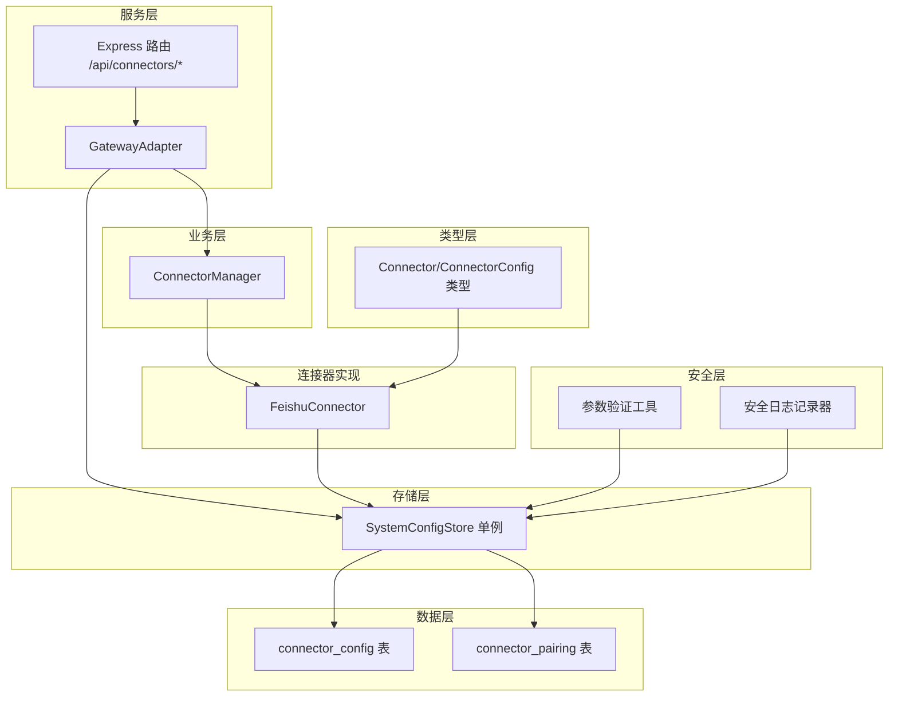
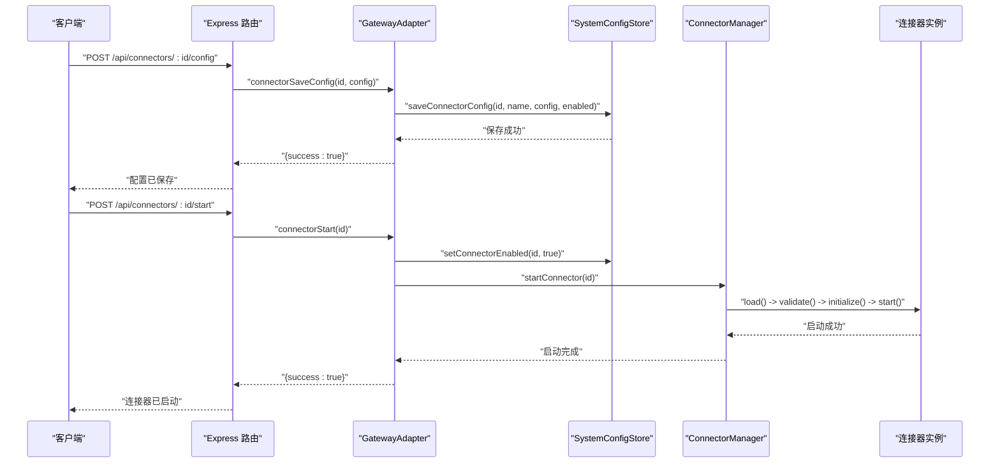
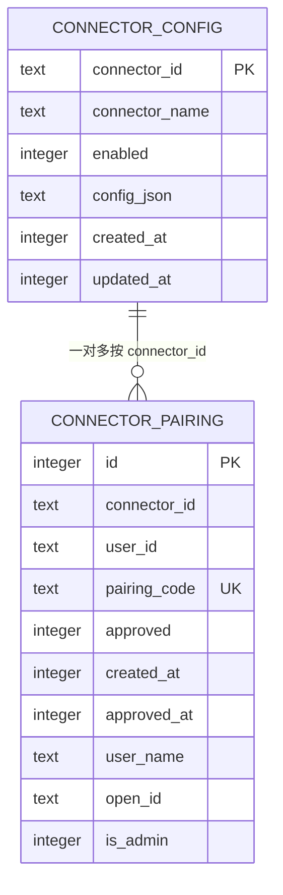
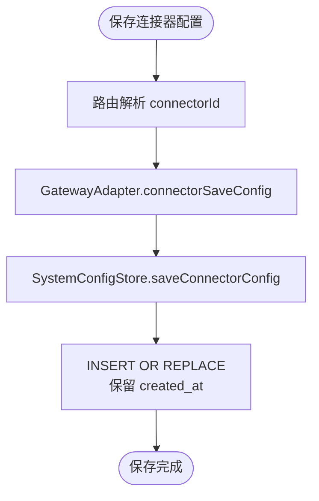
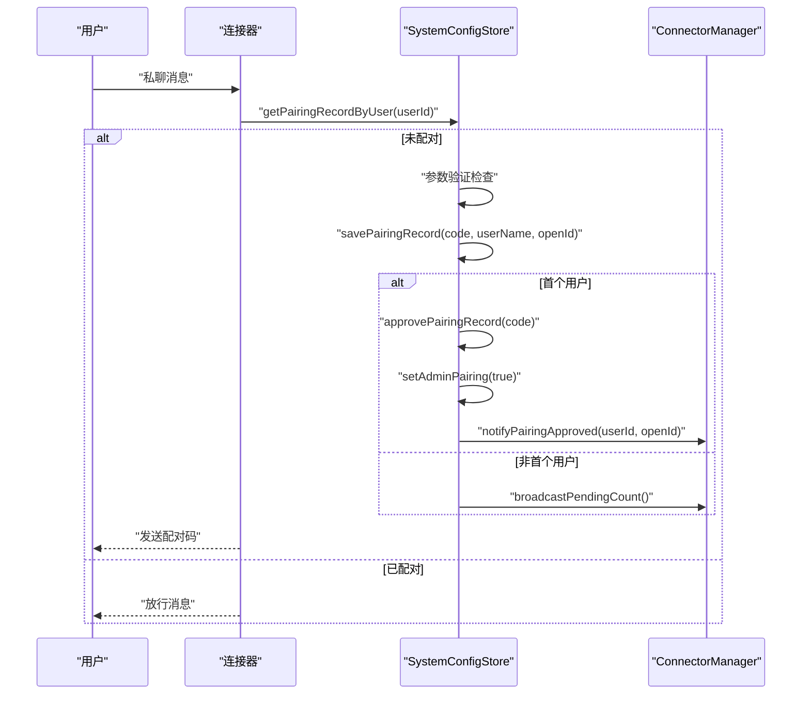
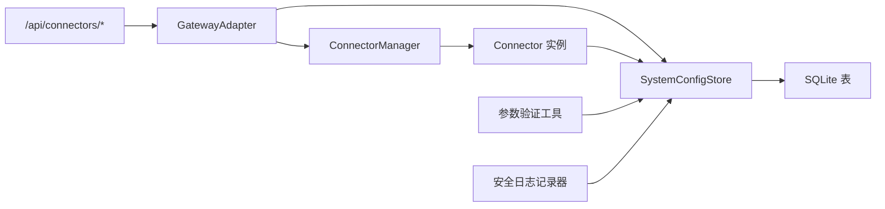

# 连接器配置管理

<cite>
**本文引用的文件**
- [connector-config.ts](file://src/main/database/connector-config.ts)
- [system-config-store.ts](file://src/main/database/system-config-store.ts)
- [connector-manager.ts](file://src/main/connectors/connector-manager.ts)
- [connector.ts](file://src/types/connector.ts)
- [connectors.ts](file://src/server/routes/connectors.ts)
- [gateway-adapter.ts](file://src/server/gateway-adapter.ts)
- [feishu-connector.ts](file://src/main/connectors/feishu/feishu-connector.ts)
- [connector-handlers.ts](file://src/main/tools/handlers/connector-handlers.ts)
- [logger.ts](file://src/shared/utils/logger.ts)
- [validation.ts](file://src/shared/utils/validation.ts)
</cite>

## 更新摘要
**变更内容**
- 新增参数验证和安全日志记录机制
- 增强配对记录管理的安全性
- 完善错误处理和安全检查
- 添加统一的参数验证工具

## 目录
1. [简介](#简介)
2. [项目结构](#项目结构)
3. [核心组件](#核心组件)
4. [架构总览](#架构总览)
5. [详细组件分析](#详细组件分析)
6. [依赖关系分析](#依赖关系分析)
7. [性能考量](#性能考量)
8. [故障排查指南](#故障排查指南)
9. [结论](#结论)
10. [附录](#附录)

## 简介
本文件面向 DeepBot 连接器配置管理模块，系统性阐述连接器配置的数据结构、CRUD 操作、配对记录管理机制、安全与访问控制策略，并结合实际代码路径给出可视化架构图与流程图，帮助开发者与运维人员高效理解与维护连接器配置体系。

**更新** 本版本新增了参数验证和安全日志记录功能，增强了配对记录管理系统的安全性，防止信息泄露和恶意输入攻击。

## 项目结构
连接器配置管理涉及以下关键层次：
- 数据层：SQLite 持久化，包含连接器配置表与配对记录表
- 存储层：SystemConfigStore 单例封装，提供统一的 CRUD 接口
- 业务层：ConnectorManager 管理连接器生命周期与消息路由
- 服务层：Express 路由与 GatewayAdapter 提供 API 与适配
- 类型层：Connector/ConnectorConfig 等类型定义确保一致性
- 连接器实现：以飞书连接器为例，展示配对与安全校验流程
- 安全层：参数验证工具和安全日志记录机制

**图表来源**
- [system-config-store.ts:180-225](file://src/main/database/system-config-store.ts#L180-L225)
- [connector-config.ts:180-225](file://src/main/database/connector-config.ts#L180-L225)
- [gateway-adapter.ts:367-476](file://src/server/gateway-adapter.ts#L367-L476)
- [connector-manager.ts:21-379](file://src/main/connectors/connector-manager.ts#L21-L379)
- [connector.ts:76-146](file://src/types/connector.ts#L76-L146)
- [feishu-connector.ts:28-994](file://src/main/connectors/feishu/feishu-connector.ts#L28-L994)
- [validation.ts:1-72](file://src/shared/utils/validation.ts#L1-L72)
- [logger.ts:51-94](file://src/shared/utils/logger.ts#L51-L94)

**章节来源**
- [system-config-store.ts:1-576](file://src/main/database/system-config-store.ts#L1-L576)
- [connector-config.ts:1-305](file://src/main/database/connector-config.ts#L1-L305)
- [gateway-adapter.ts:1-763](file://src/server/gateway-adapter.ts#L1-L763)
- [connector-manager.ts:1-379](file://src/main/connectors/connector-manager.ts#L1-L379)
- [connector.ts:1-387](file://src/types/connector.ts#L1-L387)
- [feishu-connector.ts:1-994](file://src/main/connectors/feishu/feishu-connector.ts#L1-L994)
- [validation.ts:1-72](file://src/shared/utils/validation.ts#L1-L72)
- [logger.ts:51-94](file://src/shared/utils/logger.ts#L51-L94)

## 核心组件
- 连接器配置数据结构
  - 连接器 ID、连接器名称、启用状态、配置 JSON、创建时间、更新时间
  - 配对记录：连接器 ID、用户 ID、配对码、是否批准、创建时间、批准时间、用户名、开放平台 ID、是否管理员
- CRUD 操作
  - 保存连接器配置、获取连接器配置、获取所有连接器配置、设置启用状态、删除连接器配置
- 配对记录管理
  - 生成配对码、校验配对码、批准配对、设置管理员、删除配对、查询配对记录
- 安全与访问控制
  - 私聊免配对自动批准、首个用户自动设为管理员、管理员指令审批、消息去重与安全校验
  - **新增** 参数验证和安全日志记录机制
- 统一参数验证工具
  - 字符串、数字、布尔值的参数验证
  - 防止恶意输入和类型注入攻击

**章节来源**
- [connector-config.ts:10-109](file://src/main/database/connector-config.ts#L10-L109)
- [connector-config.ts:113-305](file://src/main/database/connector-config.ts#L113-L305)
- [system-config-store.ts:443-463](file://src/main/database/system-config-store.ts#L443-L463)
- [system-config-store.ts:497-539](file://src/main/database/system-config-store.ts#L497-L539)
- [validation.ts:1-72](file://src/shared/utils/validation.ts#L1-L72)

## 架构总览
连接器配置管理贯穿"路由 -> 适配器 -> 存储 -> 连接器"的链路，配合 ConnectorManager 实现启动/停止与消息路由。

**图表来源**
- [connectors.ts:47-103](file://src/server/routes/connectors.ts#L47-L103)
- [gateway-adapter.ts:408-452](file://src/server/gateway-adapter.ts#L408-L452)
- [system-config-store.ts:445-463](file://src/main/database/system-config-store.ts#L445-L463)
- [connector-manager.ts:45-81](file://src/main/connectors/connector-manager.ts#L45-L81)
- [connector.ts:76-146](file://src/types/connector.ts#L76-L146)

## 详细组件分析

### 数据结构与持久化
- 连接器配置表
  - 字段：connector_id（PK）、connector_name、enabled、config_json、created_at、updated_at
  - 用途：保存每个连接器的启用状态与配置 JSON
- 配对记录表
  - 字段：id（自增主键）、connector_id、user_id、pairing_code（UNIQUE）、approved、created_at、approved_at、user_name、open_id、is_admin
  - 约束：connector_id+user_id 唯一
  - 用途：记录用户与连接器的授权关系、管理员权限与配对状态

**图表来源**
- [system-config-store.ts:180-225](file://src/main/database/system-config-store.ts#L180-L225)
- [system-config-store.ts:192-220](file://src/main/database/system-config-store.ts#L192-L220)

**章节来源**
- [system-config-store.ts:180-225](file://src/main/database/system-config-store.ts#L180-L225)
- [system-config-store.ts:290-314](file://src/main/database/system-config-store.ts#L290-L314)

### CRUD 操作实现
- 保存连接器配置
  - 路由：POST /api/connectors/:id/config
  - 适配器：connectorSaveConfig
  - 存储：saveConnectorConfig（INSERT OR REPLACE，保留 created_at）
- 获取连接器配置
  - 路由：GET /api/connectors/:id/config
  - 适配器：connectorGetConfig
  - 存储：getConnectorConfig（JSON 解析与 enabled 状态）
- 获取所有连接器配置
  - 适配器：connectorGetAll
  - 存储：getAllConnectorConfigs
- 设置启用状态
  - 适配器：connectorStart/connectorStop -> setConnectorEnabled
  - 存储：setConnectorEnabled（UPDATE）
- 删除连接器配置
  - 适配器：删除连接器配置
  - 存储：deleteConnectorConfig（DELETE）

**图表来源**
- [connectors.ts:47-65](file://src/server/routes/connectors.ts#L47-L65)
- [gateway-adapter.ts:408-428](file://src/server/gateway-adapter.ts#L408-L428)
- [system-config-store.ts:445-447](file://src/main/database/system-config-store.ts#L445-L447)
- [connector-config.ts:13-38](file://src/main/database/connector-config.ts#L13-L38)

**章节来源**
- [connectors.ts:12-103](file://src/server/routes/connectors.ts#L12-L103)
- [gateway-adapter.ts:392-452](file://src/server/gateway-adapter.ts#L392-L452)
- [connector-config.ts:10-109](file://src/main/database/connector-config.ts#L10-L109)

### 配对记录管理机制
- 生成配对码
  - 连接器实现：generatePairingCode（随机 6 位大写码）
  - 首个用户自动批准并设为管理员，非首个用户推送待授权数量
- 校验配对码
  - verifyPairingCode（通过用户 ID 查询 approved 状态）
- 批准配对
  - approvePairingRecord（UPDATE approved=1, approved_at）
  - 通知连接器发送欢迎消息，推送待授权数量
- 设置/取消管理员
  - setAdminPairing（UPDATE is_admin）
  - isAdminUser（查询 is_admin）
- 删除配对
  - deletePairingRecord（DELETE）
- 查询配对记录
  - getPairingRecordByCode/getPairingRecordByUser
  - getAllPairingRecords（支持按连接器筛选）

**更新** 新增参数验证和安全日志记录机制：
- savePairingRecord 和 getPairingRecordByUser 函数都包含了参数有效性检查
- 使用 console.warn 记录无效参数，防止信息泄露
- 对用户 ID 进行截断处理，避免敏感信息泄露

**图表来源**
- [feishu-connector.ts:948-991](file://src/main/connectors/feishu/feishu-connector.ts#L948-L991)
- [connector-config.ts:116-132](file://src/main/database/connector-config.ts#L116-L132)
- [connector-config.ts:191-197](file://src/main/database/connector-config.ts#L191-L197)
- [connector-config.ts:202-207](file://src/main/database/connector-config.ts#L202-L207)
- [connector-manager.ts:294-333](file://src/main/connectors/connector-manager.ts#L294-L333)

**章节来源**
- [feishu-connector.ts:948-991](file://src/main/connectors/feishu/feishu-connector.ts#L948-L991)
- [connector-config.ts:113-305](file://src/main/database/connector-config.ts#L113-L305)
- [connector-manager.ts:294-333](file://src/main/connectors/connector-manager.ts#L294-L333)

### 安全与访问控制
- 免配对模式
  - 当 requirePairing=false 时，私聊自动批准用户并放行消息
- 管理员指令
  - 支持 deepbot pairing approve feishu <code>，仅管理员可执行
  - 通过 isAdminUser 校验权限
- 消息去重与安全校验
  - 飞书连接器内置消息去重与安全校验，避免重复与未授权消息
- 路由与适配器
  - 所有连接器操作通过 Express 路由与 GatewayAdapter 统一入口，便于扩展与审计
- **新增** 参数验证和安全日志记录
  - 统一的参数验证工具，防止恶意输入
  - 安全的日志记录机制，避免敏感信息泄露
  - 对用户 ID 进行截断处理，防止信息泄露

**章节来源**
- [feishu-connector.ts:904-944](file://src/main/connectors/feishu/feishu-connector.ts#L904-L944)
- [feishu-connector.ts:843-902](file://src/main/connectors/feishu/feishu-connector.ts#L843-L902)
- [connector.ts:119-146](file://src/types/connector.ts#L119-L146)
- [validation.ts:1-72](file://src/shared/utils/validation.ts#L1-L72)
- [logger.ts:51-94](file://src/shared/utils/logger.ts#L51-L94)

### 使用场景
- 外部服务集成
  - 通过保存连接器配置（如飞书 appId/appSecret）并启动连接器，实现与外部 IM 平台的双向通信
- 消息路由
  - ConnectorManager 将外部消息转换为 GatewayMessage 并转发至网关，实现跨连接器的消息路由
- 安全认证
  - 配对码机制与管理员权限控制，确保只有授权用户可使用连接器
- **新增** 安全管理
  - 参数验证防止恶意输入攻击
  - 安全日志记录便于审计和问题追踪

**章节来源**
- [connector-manager.ts:130-168](file://src/main/connectors/connector-manager.ts#L130-L168)
- [gateway-adapter.ts:408-452](file://src/server/gateway-adapter.ts#L408-L452)

## 依赖关系分析
- 路由依赖适配器，适配器依赖存储，存储依赖 SQLite 表
- 连接器实现依赖存储进行配对与配置读写
- ConnectorManager 依赖连接器实例与存储进行启动/停止与配对通知
- **新增** 安全工具依赖关系
  - 参数验证工具依赖于存储层进行安全检查
  - 日志记录器提供统一的安全日志输出

**图表来源**
- [connectors.ts:9-214](file://src/server/routes/connectors.ts#L9-L214)
- [gateway-adapter.ts:367-527](file://src/server/gateway-adapter.ts#L367-L527)
- [system-config-store.ts:443-539](file://src/main/database/system-config-store.ts#L443-L539)
- [connector-manager.ts:21-379](file://src/main/connectors/connector-manager.ts#L21-L379)
- [feishu-connector.ts:28-994](file://src/main/connectors/feishu/feishu-connector.ts#L28-L994)
- [validation.ts:1-72](file://src/shared/utils/validation.ts#L1-L72)
- [logger.ts:51-94](file://src/shared/utils/logger.ts#L51-L94)

**章节来源**
- [connectors.ts:1-215](file://src/server/routes/connectors.ts#L1-L215)
- [gateway-adapter.ts:1-763](file://src/server/gateway-adapter.ts#L1-L763)
- [system-config-store.ts:1-576](file://src/main/database/system-config-store.ts#L1-L576)

## 性能考量
- SQLite WAL 模式提升并发写入性能
- 配对记录表建立索引（pairing_code、connector_id+user_id）优化查询
- 连接器启动前先更新数据库状态，避免状态不一致
- 飞书连接器内置消息去重与缓存，降低重复处理成本
- **新增** 参数验证的性能优化
  - 缓存验证结果，减少重复验证开销
  - 异步验证机制，避免阻塞主线程

**章节来源**
- [system-config-store.ts:55-57](file://src/main/database/system-config-store.ts#L55-L57)
- [system-config-store.ts:211-219](file://src/main/database/system-config-store.ts#L211-L219)
- [gateway-adapter.ts:434-435](file://src/server/gateway-adapter.ts#L434-L435)
- [feishu-connector.ts:40-47](file://src/main/connectors/feishu/feishu-connector.ts#L40-L47)

## 故障排查指南
- 启动连接器失败
  - 检查配置是否有效（validate 返回 true）
  - 查看日志输出与错误信息
- 配对码无效或过期
  - 确认配对记录存在且未批准
  - 首个用户自动批准，后续用户需管理员审批
- 管理员权限不足
  - 确认 is_admin 标记为真
  - 通过 setAdminPairing 设置管理员
- 消息未到达
  - 检查连接器健康状态（healthCheck）
  - 飞书连接器需 @ 机器人或为系统指令/媒体消息
- **新增** 安全相关问题
  - 参数验证失败：检查输入参数的有效性和格式
  - 安全日志：查看安全日志记录，识别潜在的安全威胁
  - 信息泄露防护：确认日志中敏感信息已被正确处理

**章节来源**
- [connector-manager.ts:341-358](file://src/main/connectors/connector-manager.ts#L341-L358)
- [connector-handlers.ts:178-231](file://src/main/tools/handlers/connector-handlers.ts#L178-L231)
- [feishu-connector.ts:904-944](file://src/main/connectors/feishu/feishu-connector.ts#L904-L944)

## 结论
连接器配置管理模块通过清晰的数据结构、完善的 CRUD 与配对机制、严格的安全部署与访问控制，实现了与外部 IM 平台的稳定集成与安全运行。借助 SystemConfigStore 单例与 GatewayAdapter 适配，系统具备良好的可扩展性与可维护性。

**更新** 新增的参数验证和安全日志记录机制进一步增强了系统的安全性，防止恶意输入攻击和信息泄露，为连接器配置管理提供了更加完善的安全保障。

## 附录
- API 端点概览
  - GET /api/connectors
  - GET /api/connectors/:connectorId/config
  - POST /api/connectors/:connectorId/config
  - POST /api/connectors/:connectorId/start
  - POST /api/connectors/:connectorId/stop
  - GET /api/connectors/:connectorId/health
  - POST /api/connectors/pairing/approve
  - POST /api/connectors/:connectorId/pairing/:userId/admin
  - DELETE /api/connectors/:connectorId/pairing/:userId
  - GET /api/connectors/pairing

**章节来源**
- [connectors.ts:12-211](file://src/server/routes/connectors.ts#L12-L211)