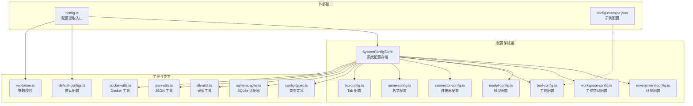
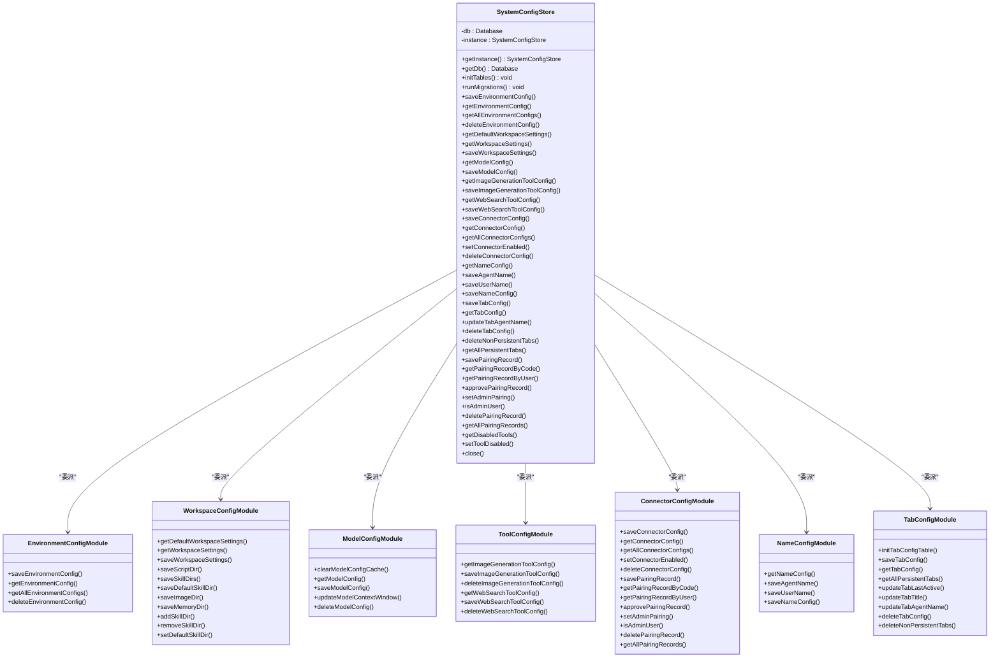
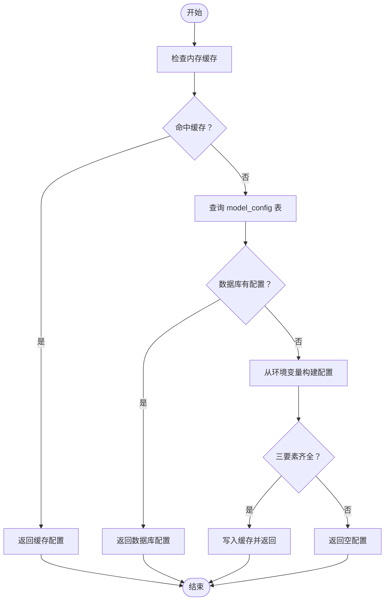
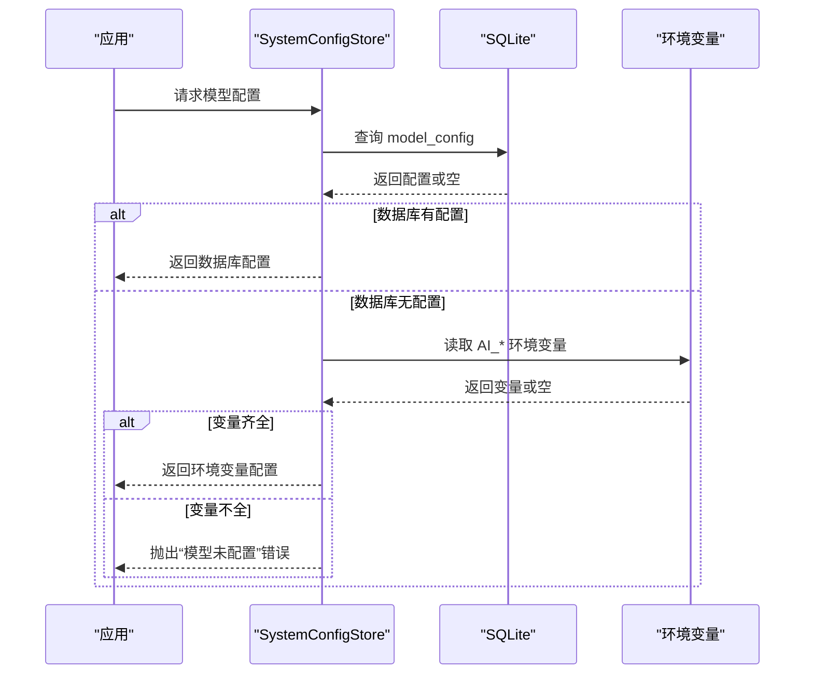
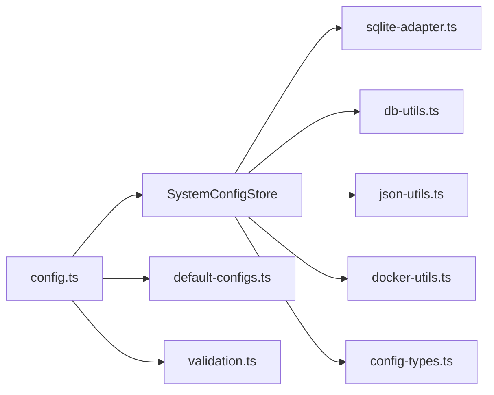

# 配置管理系统

<cite>
**本文引用的文件**
- [system-config-store.ts](file://src/main/database/system-config-store.ts)
- [config-types.ts](file://src/main/database/config-types.ts)
- [environment-config.ts](file://src/main/database/environment-config.ts)
- [workspace-config.ts](file://src/main/database/workspace-config.ts)
- [model-config.ts](file://src/main/database/model-config.ts)
- [tool-config.ts](file://src/main/database/tool-config.ts)
- [connector-config.ts](file://src/main/database/connector-config.ts)
- [name-config.ts](file://src/main/database/name-config.ts)
- [tab-config.ts](file://src/main/database/tab-config.ts)
- [config.ts](file://src/main/config.ts)
- [default-configs.ts](file://src/shared/config/default-configs.ts)
- [validation.ts](file://src/shared/utils/validation.ts)
- [sqlite-adapter.ts](file://src/shared/utils/sqlite-adapter.ts)
- [db-utils.ts](file://src/shared/utils/db-utils.ts)
- [json-utils.ts](file://src/shared/utils/json-utils.ts)
- [docker-utils.ts](file://src/shared/utils/docker-utils.ts)
- [config.example.json](file://src/main/tools/email-tool/config.example.json)
</cite>

## 目录
1. [简介](#简介)
2. [项目结构](#项目结构)
3. [核心组件](#核心组件)
4. [架构总览](#架构总览)
5. [详细组件分析](#详细组件分析)
6. [依赖关系分析](#依赖关系分析)
7. [性能考量](#性能考量)
8. [故障排查指南](#故障排查指南)
9. [结论](#结论)
10. [附录](#附录)

## 简介
本文件面向 DeepBot 配置管理系统，系统以 SQLite 作为配置持久化存储，围绕“系统配置存储”为中心，提供环境配置、工作空间设置、模型配置、工具配置、连接器配置、名字配置以及 Agent Tab 配置等模块的完整生命周期管理。系统采用“数据库配置优先，环境变量回退”的加载策略，并内置数据库迁移与索引优化，确保配置在不同运行环境下的一致性与稳定性。

## 项目结构
配置管理相关代码主要位于以下位置：
- 主要入口与聚合：src/main/database/system-config-store.ts
- 配置类型定义：src/main/database/config-types.ts
- 各模块实现：environment-config.ts、workspace-config.ts、model-config.ts、tool-config.ts、connector-config.ts、name-config.ts、tab-config.ts
- 配置读取与优先级：src/main/config.ts
- 默认配置与预设：src/shared/config/default-configs.ts
- 工具校验与通用工具：src/shared/utils/validation.ts、src/shared/utils/sqlite-adapter.ts、src/shared/utils/db-utils.ts、src/shared/utils/json-utils.ts、src/shared/utils/docker-utils.ts
- 示例配置：src/main/tools/email-tool/config.example.json



图表来源
- [system-config-store.ts:1-576](file://src/main/database/system-config-store.ts#L1-L576)
- [config-types.ts:1-67](file://src/main/database/config-types.ts#L1-L67)
- [environment-config.ts:1-80](file://src/main/database/environment-config.ts#L1-L80)
- [workspace-config.ts:1-219](file://src/main/database/workspace-config.ts#L1-L219)
- [model-config.ts:1-162](file://src/main/database/model-config.ts#L1-L162)
- [tool-config.ts:1-128](file://src/main/database/tool-config.ts#L1-L128)
- [connector-config.ts:1-281](file://src/main/database/connector-config.ts#L1-L281)
- [name-config.ts:1-140](file://src/main/database/name-config.ts#L1-L140)
- [tab-config.ts:1-218](file://src/main/database/tab-config.ts#L1-L218)
- [config.ts:1-108](file://src/main/config.ts#L1-L108)
- [default-configs.ts:1-133](file://src/shared/config/default-configs.ts#L1-L133)
- [validation.ts:1-73](file://src/shared/utils/validation.ts#L1-L73)
- [sqlite-adapter.ts](file://src/shared/utils/sqlite-adapter.ts)
- [db-utils.ts](file://src/shared/utils/db-utils.ts)
- [json-utils.ts](file://src/shared/utils/json-utils.ts)
- [docker-utils.ts](file://src/shared/utils/docker-utils.ts)
- [config.example.json:1-9](file://src/main/tools/email-tool/config.example.json#L1-L9)

章节来源
- [system-config-store.ts:1-576](file://src/main/database/system-config-store.ts#L1-L576)
- [config-types.ts:1-67](file://src/main/database/config-types.ts#L1-L67)

## 核心组件
- 系统配置存储（SystemConfigStore）：负责数据库初始化、单例管理、表结构初始化与迁移、各模块配置的委派与索引维护。
- 配置类型定义（config-types.ts）：统一定义环境、工作空间、模型、工具等配置的数据结构。
- 各模块配置管理：分别封装 CRUD 与业务逻辑，如环境检测、工作目录、模型优先级、工具配置、连接器与配对、名字与 Tab 管理。
- 配置读取入口（config.ts）：对外暴露统一的配置读取方法，遵循“数据库 > 环境变量 > 错误”的优先级。
- 默认配置与预设（default-configs.ts）：提供常用提供商的默认值，便于快速初始化与 UI 下拉选择。
- 工具与通用能力：SQLite 适配器、键值工具、JSON 工具、Docker 工具、参数校验等。

章节来源
- [system-config-store.ts:37-77](file://src/main/database/system-config-store.ts#L37-L77)
- [config.ts:38-83](file://src/main/config.ts#L38-L83)
- [default-configs.ts:103-132](file://src/shared/config/default-configs.ts#L103-L132)

## 架构总览
系统采用“集中式存储 + 分模块实现”的架构。SystemConfigStore 作为门面，负责数据库生命周期与表初始化；各模块通过独立文件实现具体业务，既保证内聚又降低耦合。数据库采用 WAL 模式提升并发写入性能，并在关键写入后执行检查点以确保落盘。



图表来源
- [system-config-store.ts:37-566](file://src/main/database/system-config-store.ts#L37-L566)
- [environment-config.ts:11-79](file://src/main/database/environment-config.ts#L11-L79)
- [workspace-config.ts:17-218](file://src/main/database/workspace-config.ts#L17-L218)
- [model-config.ts:14-161](file://src/main/database/model-config.ts#L14-L161)
- [tool-config.ts:13-127](file://src/main/database/tool-config.ts#L13-L127)
- [connector-config.ts:13-280](file://src/main/database/connector-config.ts#L13-L280)
- [name-config.ts:10-139](file://src/main/database/name-config.ts#L10-L139)
- [tab-config.ts:46-217](file://src/main/database/tab-config.ts#L46-L217)

## 详细组件分析

### 数据库设计与迁移机制
- 存储介质：SQLite，WAL 模式提升并发写入与恢复能力。
- 表结构概览：
  - environment_config：环境检测与安装状态记录。
  - workspace_settings：键值形式存储工作目录相关路径。
  - model_config：模型配置（含主模型、快速模型、API 类型、上下文窗口等）。
  - tool_config_image_generation：图片生成工具配置。
  - tool_config_web_search：Web 搜索工具配置。
  - name_config：智能体与用户称呼。
  - tool_disabled：禁用工具清单。
  - connector_config：连接器配置与启用状态。
  - connector_pairing：连接器配对记录（含管理员标记、用户标识等）。
  - agent_tabs：Agent Tab 的持久化配置。
- 索引：为配对码与配对组合建立索引，加速查询。
- 迁移策略：启动时自动检测并迁移缺失列（如 model_id_2、provider、api_type、is_admin、user_name、open_id 等），兼容历史版本。

```mermaid
erDiagram
ENVIRONMENT_CONFIG {
text id PK
text name UK
integer is_installed
text version
text path
integer last_checked
text error
}
WORKSPACE_SETTINGS {
text key PK
text value
}
MODEL_CONFIG {
integer id PK "CHECK(id=1)"
text provider_type
text provider_id
text provider_name
text base_url
text model_id
text model_name
text model_id_2
text api_key
integer context_window
integer last_fetched
}
TOOL_CONFIG_IMAGE_GENERATION {
integer id PK "CHECK(id=1)"
text provider
text model
text api_url
text api_key
}
TOOL_CONFIG_WEB_SEARCH {
integer id PK "CHECK(id=1)"
text provider
text model
text api_url
text api_key
}
NAME_CONFIG {
integer id PK "CHECK(id=1)"
text agent_name
text user_name
}
TOOL_DISABLED {
text tool_name PK
}
CONNECTOR_CONFIG {
text connector_id PK
text connector_name
integer enabled
text config_json
integer created_at
integer updated_at
}
CONNECTOR_PAIRING {
integer id PK "AUTO_INCREMENT"
text connector_id
text user_id
text pairing_code UK
integer approved
integer created_at
integer approved_at
unique connector_id user_id
}
AGENT_TABS {
text id PK
text title
text type "CHECK IN (manual, task, connector)"
text memory_file
text agent_name
integer is_persistent
integer created_at
integer last_active_at
text task_id
text connector_id
text conversation_id
}
```

图表来源
- [system-config-store.ts:84-224](file://src/main/database/system-config-store.ts#L84-L224)

章节来源
- [system-config-store.ts:82-315](file://src/main/database/system-config-store.ts#L82-L315)

### 环境配置管理
- 功能：保存、查询、列出、删除环境配置；记录安装状态、版本、路径、最后检查时间与错误信息。
- 关键点：使用“插入或替换”策略，确保唯一性；查询时将整数字段映射为布尔值。

章节来源
- [environment-config.ts:11-79](file://src/main/database/environment-config.ts#L11-L79)

### 工作空间设置
- 功能：默认路径计算（普通模式与 Docker 模式）、批量读取/保存、技能目录增删改、会话目录新增。
- 关键点：Docker 模式强制使用固定路径，忽略数据库配置；技能目录以 JSON 数组形式存储；提供严格校验与错误提示。

章节来源
- [workspace-config.ts:17-218](file://src/main/database/workspace-config.ts#L17-L218)

### 模型配置
- 加载优先级：数据库配置 > 环境变量；数据库无配置时从环境变量回退，且仅当三要素齐全才生效。
- 缓存策略：内存缓存避免重复查询与日志输出。
- 写入策略：WAL 模式下写入后执行检查点，确保立即落盘；变更后清除缓存。
- 字段扩展：支持 provider_type、context_window、last_fetched、api_type、model_id_2 等迁移字段。



图表来源
- [model-config.ts:60-95](file://src/main/database/model-config.ts#L60-L95)
- [model-config.ts:24-52](file://src/main/database/model-config.ts#L24-L52)

章节来源
- [model-config.ts:14-161](file://src/main/database/model-config.ts#L14-L161)

### 工具配置
- 图片生成工具：提供提供商、模型、API 地址与密钥的配置与持久化。
- Web 搜索工具：提供提供商、模型、API 地址与密钥的配置与持久化。
- 兼容性：启动时自动迁移 provider 字段，确保向后兼容。

章节来源
- [tool-config.ts:13-127](file://src/main/database/tool-config.ts#L13-L127)

### 连接器配置与配对
- 连接器配置：保存/读取/启用/删除连接器配置，JSON 序列化存储复杂配置。
- 配对记录：支持按配对码与用户查询、批准、设置管理员、删除记录、列出全部记录。
- 安全与权限：支持管理员标记与用户标识字段，便于权限控制。

章节来源
- [connector-config.ts:13-280](file://src/main/database/connector-config.ts#L13-L280)

### 名字配置
- 功能：保存智能体名字与用户称呼，限制长度并进行校验；若记录不存在则自动插入默认值。
- 默认值：智能体名字默认“matrix”，用户称呼默认“user”。

章节来源
- [name-config.ts:10-139](file://src/main/database/name-config.ts#L10-L139)

### Tab 配置
- 功能：持久化 Agent Tab 的标题、类型、记忆文件、Agent 名称、持久化标志、创建与活跃时间、任务/连接器/会话标识。
- 生命周期：支持保存、查询、更新标题与 Agent 名称、删除、清理非持久化 Tab。

章节来源
- [tab-config.ts:46-217](file://src/main/database/tab-config.ts#L46-L217)

### 配置加载顺序与优先级
- 模型配置优先级：数据库配置 > 环境变量 > 抛错。
- 工作空间配置：Docker 模式强制使用默认路径，忽略数据库配置。
- 工具配置：以数据库配置为准，不存在时为空。
- 连接器配置：以数据库配置为准，不存在时为空。
- 名字配置：以数据库配置为准，不存在时使用默认值。



图表来源
- [config.ts:38-83](file://src/main/config.ts#L38-L83)
- [model-config.ts:60-95](file://src/main/database/model-config.ts#L60-L95)

章节来源
- [config.ts:38-107](file://src/main/config.ts#L38-L107)

### 配置文件格式与示例
- 工具配置示例：邮箱工具配置采用 JSON 格式，包含发件人、密码/授权码、SMTP 服务器、端口、SSL 开关与发件人姓名等字段。
- 工具配置建议：敏感信息建议通过环境变量或安全存储管理，避免明文写入数据库或文件。

章节来源
- [config.example.json:1-9](file://src/main/tools/email-tool/config.example.json#L1-L9)

### 配置验证与错误处理
- 参数验证：提供字符串、数字、布尔等基础校验工具，确保输入合法性。
- 模型配置校验：环境变量回退前进行三要素完整性检查。
- 工作空间校验：技能目录增删改时进行存在性与默认目录保护检查。
- 名字配置校验：长度限制与非空检查。
- 错误处理：模块内捕获异常并记录日志，必要时向上抛出明确错误信息。

章节来源
- [validation.ts:8-72](file://src/shared/utils/validation.ts#L8-L72)
- [workspace-config.ts:163-218](file://src/main/database/workspace-config.ts#L163-L218)
- [name-config.ts:46-139](file://src/main/database/name-config.ts#L46-L139)

## 依赖关系分析
- SystemConfigStore 依赖 SQLite 适配器与通用工具（键值工具、JSON 工具、Docker 工具）。
- 各模块通过委派方式被 SystemConfigStore 调用，保持低耦合高内聚。
- 配置读取入口依赖 SystemConfigStore 与默认配置，形成清晰的调用链。



图表来源
- [system-config-store.ts:11-15](file://src/main/database/system-config-store.ts#L11-L15)
- [config.ts:5](file://src/main/config.ts#L5)

章节来源
- [system-config-store.ts:11-15](file://src/main/database/system-config-store.ts#L11-L15)
- [config.ts:5](file://src/main/config.ts#L5)

## 性能考量
- WAL 模式：提升并发写入与崩溃恢复能力。
- 检查点：关键写入后执行检查点，确保数据尽快落盘。
- 索引优化：为配对码与配对组合建立索引，减少查询延迟。
- 缓存策略：模型配置内存缓存，避免重复查询与日志输出。
- Docker 模式：固定路径策略减少 IO 与路径解析成本。

章节来源
- [system-config-store.ts:56](file://src/main/database/system-config-store.ts#L56)
- [model-config.ts:121-122](file://src/main/database/model-config.ts#L121-L122)
- [model-config.ts:145-146](file://src/main/database/model-config.ts#L145-L146)
- [system-config-store.ts:211-219](file://src/main/database/system-config-store.ts#L211-L219)

## 故障排查指南
- 数据库迁移失败：检查表结构与列是否存在，确认迁移日志输出；必要时手动执行迁移语句。
- 配置读取为空：确认数据库中是否存在有效配置；若无则检查环境变量是否齐全。
- 工作空间目录异常：Docker 模式下忽略数据库配置，确认容器内路径挂载正确。
- 连接器配对问题：检查配对码唯一性与批准状态；确认管理员标记与用户标识字段是否正确设置。
- 名字配置异常：检查长度与非空约束；确认记录存在性。

章节来源
- [system-config-store.ts:230-315](file://src/main/database/system-config-store.ts#L230-L315)
- [config.ts:55-72](file://src/main/config.ts#L55-L72)
- [workspace-config.ts:54-58](file://src/main/database/workspace-config.ts#L54-L58)
- [connector-config.ts:116-132](file://src/main/database/connector-config.ts#L116-L132)
- [name-config.ts:46-74](file://src/main/database/name-config.ts#L46-L74)

## 结论
DeepBot 配置管理系统以 SQLite 为核心，结合模块化设计与严格的优先级策略，实现了从环境检测、工作空间、模型、工具、连接器到名字与 Tab 的全栈配置管理。系统具备完善的迁移机制、索引优化与缓存策略，在保证易用性的同时兼顾了性能与稳定性。建议在生产环境中配合环境变量与安全存储，确保敏感配置的安全与合规。

## 附录
- 默认配置预设：提供常见提供商的默认值，便于快速初始化与 UI 下拉选择。
- 配置读取入口：统一对外暴露配置获取与存在性检查方法，简化上层调用。

章节来源
- [default-configs.ts:11-132](file://src/shared/config/default-configs.ts#L11-L132)
- [config.ts:88-107](file://src/main/config.ts#L88-L107)