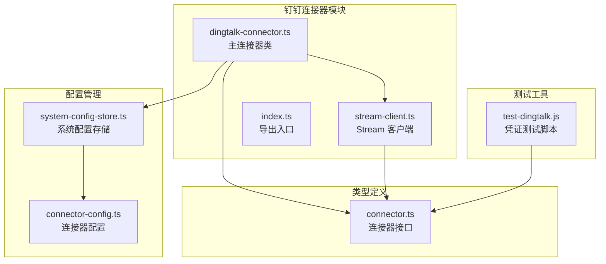
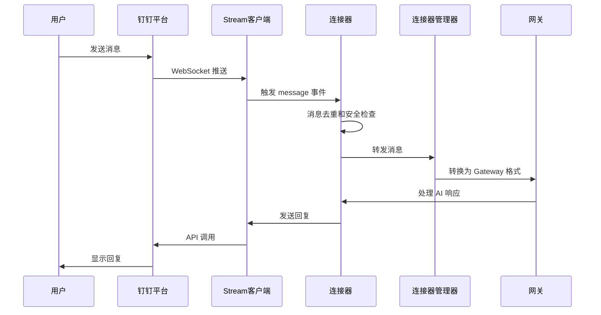
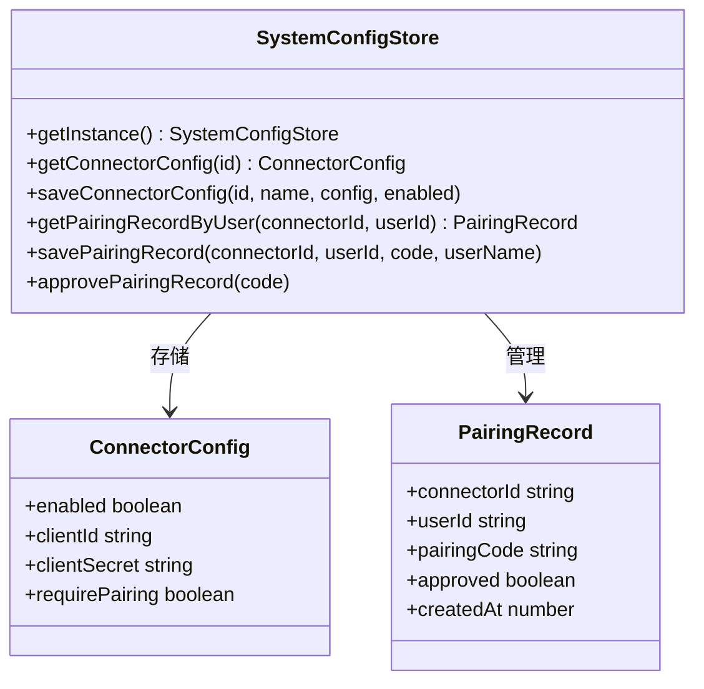
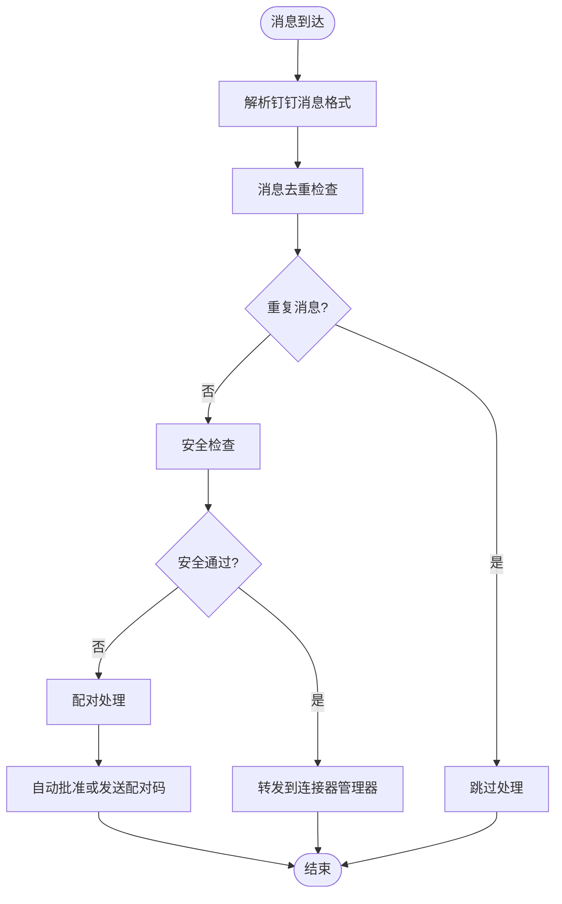
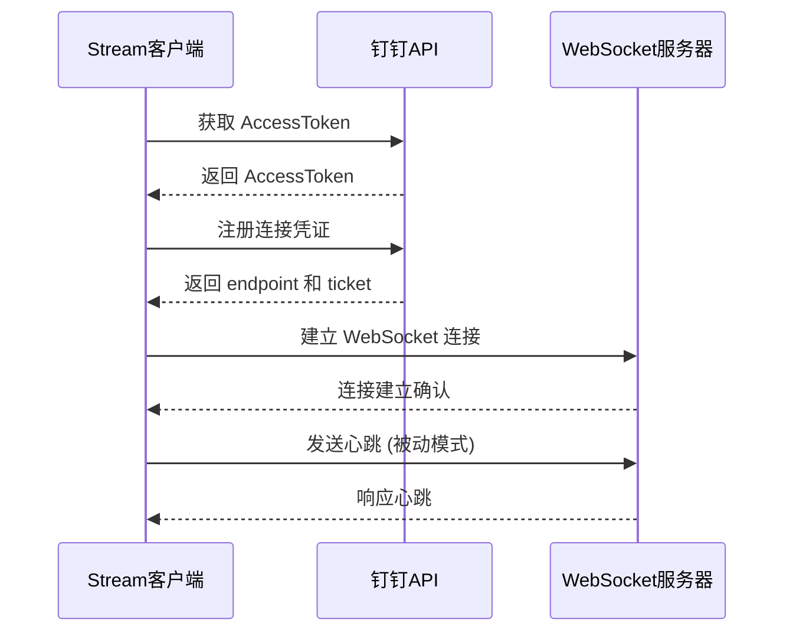
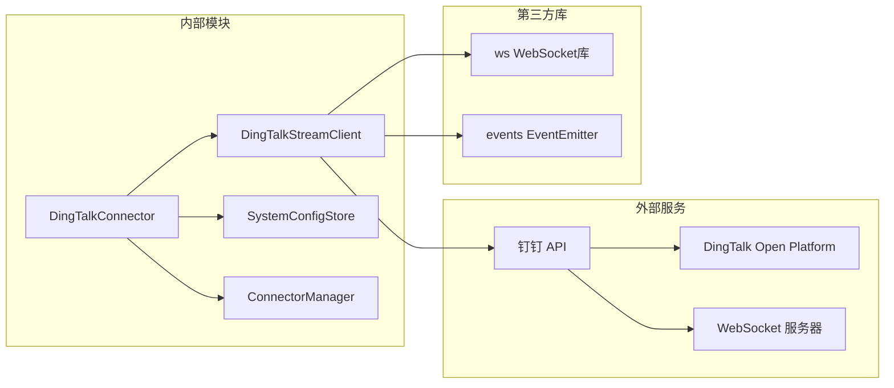
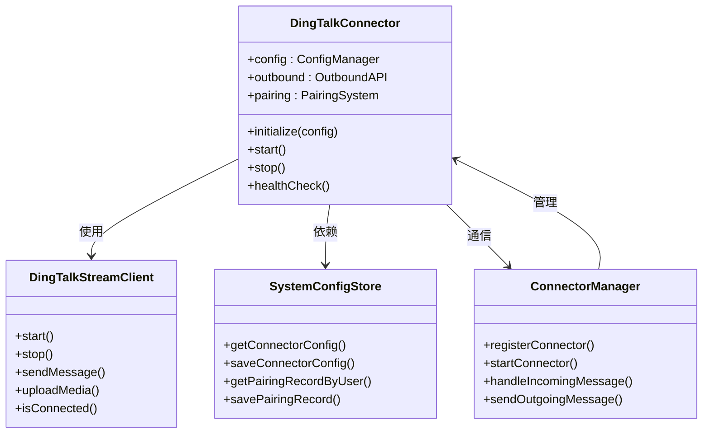
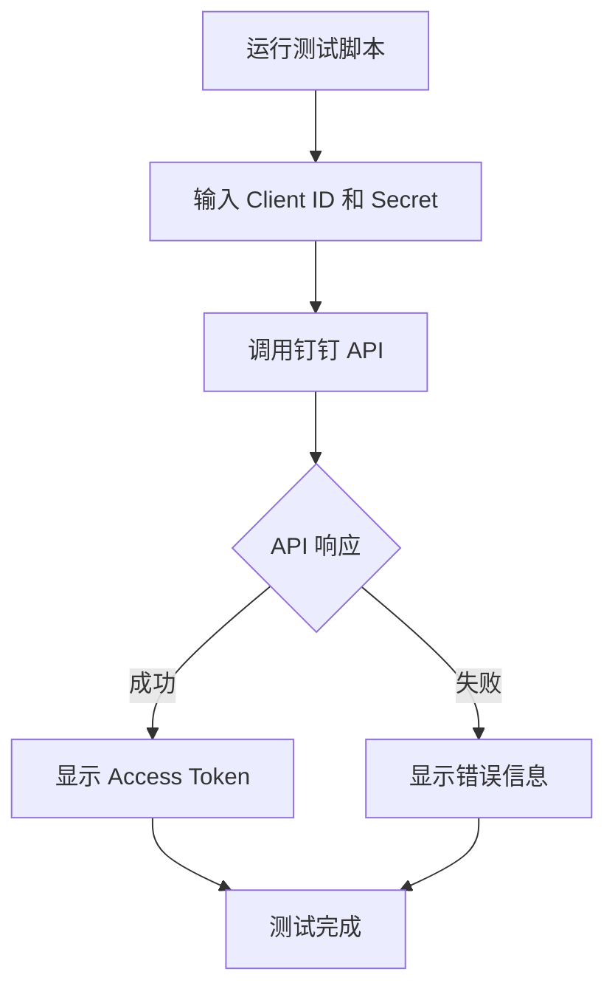

# 钉钉机器人配置指南

<cite>
**本文引用的文件**
- [钉钉机器人配置指南.md](file://docs/钉钉机器人配置指南.md)
- [dingtalk-connector.ts](file://src/main/connectors/dingtalk/dingtalk-connector.ts)
- [stream-client.ts](file://src/main/connectors/dingtalk/stream-client.ts)
- [index.ts](file://src/main/connectors/dingtalk/index.ts)
- [test-dingtalk.js](file://clienttest/test-dingtalk.js)
- [connector.ts](file://src/types/connector.ts)
- [system-config-store.ts](file://src/main/database/system-config-store.ts)
- [connector-manager.ts](file://src/main/connectors/connector-manager.ts)
- [connector-config.ts](file://src/main/database/connector-config.ts)
</cite>

## 目录
1. [简介](#简介)
2. [项目结构](#项目结构)
3. [核心组件](#核心组件)
4. [架构概览](#架构概览)
5. [详细组件分析](#详细组件分析)
6. [依赖关系分析](#依赖关系分析)
7. [性能考虑](#性能考虑)
8. [故障排除指南](#故障排除指南)
9. [结论](#结论)

## 简介

本文档详细介绍如何配置 史丽慧小助理 的钉钉连接器，使其能够通过钉钉接收和发送消息。史丽慧小助理 使用钉钉开放平台的 Stream 模式建立 WebSocket 长连接，无需配置公网回调地址即可实现实时消息收发。

## 项目结构

史丽慧小助理 采用模块化的架构设计，钉钉连接器位于 `src/main/connectors/dingtalk/` 目录下，包含以下关键文件：

**图表来源**
- [dingtalk-connector.ts:1-524](file://src/main/connectors/dingtalk/dingtalk-connector.ts#L1-L524)
- [stream-client.ts:1-541](file://src/main/connectors/dingtalk/stream-client.ts#L1-L541)
- [connector.ts:211-256](file://src/types/connector.ts#L211-L256)

**章节来源**
- [dingtalk-connector.ts:1-524](file://src/main/connectors/dingtalk/dingtalk-connector.ts#L1-L524)
- [stream-client.ts:1-541](file://src/main/connectors/dingtalk/stream-client.ts#L1-L541)
- [connector.ts:1-388](file://src/types/connector.ts#L1-L388)

## 核心组件

### 钉钉连接器 (DingTalkConnector)

钉钉连接器是整个系统的入口点，负责管理连接生命周期、消息处理和安全控制。

**主要功能特性：**
- Stream 模式 WebSocket 连接管理
- 消息去重和防抖机制
- 配对授权系统
- 单聊和群聊消息处理
- 媒体文件上传和发送

### Stream 客户端 (DingTalkStreamClient)

Stream 客户端实现了与钉钉开放平台的 WebSocket 通信协议。

**核心能力：**
- AccessToken 获取和刷新
- 连接凭证注册
- WebSocket 连接建立和维护
- 消息 ACK 确认机制
- 媒体文件上传服务

**章节来源**
- [dingtalk-connector.ts:27-524](file://src/main/connectors/dingtalk/dingtalk-connector.ts#L27-L524)
- [stream-client.ts:32-541](file://src/main/connectors/dingtalk/stream-client.ts#L32-L541)

## 架构概览

史丽慧小助理 的钉钉集成采用分层架构设计，确保了良好的可维护性和扩展性：

**图表来源**
- [dingtalk-connector.ts:85-140](file://src/main/connectors/dingtalk/dingtalk-connector.ts#L85-L140)
- [stream-client.ts:56-82](file://src/main/connectors/dingtalk/stream-client.ts#L56-L82)
- [connector-manager.ts:130-168](file://src/main/connectors/connector-manager.ts#L130-L168)

## 详细组件分析

### 配置管理系统

系统使用 SQLite 数据库存储配置信息，提供完整的配置管理功能：

**图表来源**
- [system-config-store.ts:37-70](file://src/main/database/system-config-store.ts#L37-L70)
- [connector-config.ts:13-38](file://src/main/database/connector-config.ts#L13-L38)
- [connector-config.ts:116-147](file://src/main/database/connector-config.ts#L116-L147)

### 消息处理流程

钉钉连接器实现了完整的消息处理流水线，包括去重、安全检查和转发：

**图表来源**
- [dingtalk-connector.ts:171-307](file://src/main/connectors/dingtalk/dingtalk-connector.ts#L171-L307)
- [dingtalk-connector.ts:325-344](file://src/main/connectors/dingtalk/dingtalk-connector.ts#L325-L344)

### Stream 连接建立过程

WebSocket 连接建立遵循严格的协议顺序：

**图表来源**
- [stream-client.ts:56-82](file://src/main/connectors/dingtalk/stream-client.ts#L56-L82)
- [stream-client.ts:87-127](file://src/main/connectors/dingtalk/stream-client.ts#L87-L127)
- [stream-client.ts:132-185](file://src/main/connectors/dingtalk/stream-client.ts#L132-L185)

**章节来源**
- [dingtalk-connector.ts:49-76](file://src/main/connectors/dingtalk/dingtalk-connector.ts#L49-L76)
- [stream-client.ts:190-233](file://src/main/connectors/dingtalk/stream-client.ts#L190-L233)

## 依赖关系分析

### 外部依赖

钉钉连接器依赖以下外部服务和库：

**图表来源**
- [stream-client.ts:8-10](file://src/main/connectors/dingtalk/stream-client.ts#L8-L10)
- [connector-manager.ts:11-19](file://src/main/connectors/connector-manager.ts#L11-L19)

### 内部依赖关系

**图表来源**
- [dingtalk-connector.ts:27-47](file://src/main/connectors/dingtalk/dingtalk-connector.ts#L27-L47)
- [connector-manager.ts:21-28](file://src/main/connectors/connector-manager.ts#L21-L28)

**章节来源**
- [connector.ts:76-146](file://src/types/connector.ts#L76-L146)
- [system-config-store.ts:37-70](file://src/main/database/system-config-store.ts#L37-L70)

## 性能考虑

### 消息去重机制

系统实现了双重去重保护机制：

1. **基于消息ID的去重**：使用 Set 缓存最近 1000 条已处理的消息 ID
2. **基于内容的去重**：使用 Map 缓存 5 秒内的相同内容消息

### 连接管理优化

- 自动重连机制：连接断开后 5 秒自动重试
- 心跳检测：被动模式的心跳机制，减少不必要的网络开销
- 资源清理：及时清理 WebSocket 连接和定时器

### 媒体文件处理

- 本地缓存：临时上传目录用于缓存媒体文件
- 异步上传：文件上传采用异步处理，避免阻塞主线程

## 故障排除指南

### 常见问题及解决方案

#### 连接器启动失败

**可能原因：**
- ClientId 或 ClientSecret 配置错误
- 网络无法访问钉钉 API
- 应用未发布或权限不足

**解决步骤：**
1. 使用测试脚本验证凭证有效性
2. 检查网络连接和防火墙设置
3. 确认应用已在钉钉开放平台发布

#### 收不到消息

**可能原因：**
- Stream 模式配置错误
- 事件订阅未正确设置
- 权限申请不完整

**解决步骤：**
1. 确认消息推送模式为 Stream 模式
2. 检查是否订阅了必要的事件
3. 验证应用权限申请状态

#### 发送消息失败

**可能原因：**
- 缺少发送权限
- 会话 ID 错误
- AccessToken 过期

**解决步骤：**
1. 检查发送权限配置
2. 验证会话 ID 格式
3. 重新获取 AccessToken

### 调试工具

系统提供了专门的调试脚本来验证凭证配置：

**图表来源**
- [test-dingtalk.js:6-38](file://clienttest/test-dingtalk.js#L6-L38)

**章节来源**
- [test-dingtalk.js:1-48](file://clienttest/test-dingtalk.js#L1-L48)
- [dingtalk-connector.ts:85-123](file://src/main/connectors/dingtalk/dingtalk-connector.ts#L85-L123)

## 结论

史丽慧小助理 的钉钉连接器提供了完整的企业级即时通讯解决方案，具有以下优势：

1. **零公网配置**：使用 Stream 模式无需配置公网回调地址
2. **高可用性**：完善的连接管理和自动重连机制
3. **安全性**：支持配对授权和消息去重机制
4. **易用性**：简洁的配置界面和详细的错误提示
5. **扩展性**：模块化设计便于功能扩展和维护

通过遵循本文档的配置指南，用户可以快速部署和使用 史丽慧小助理 的钉钉集成功能，享受高效的企业级 AI 助手服务。