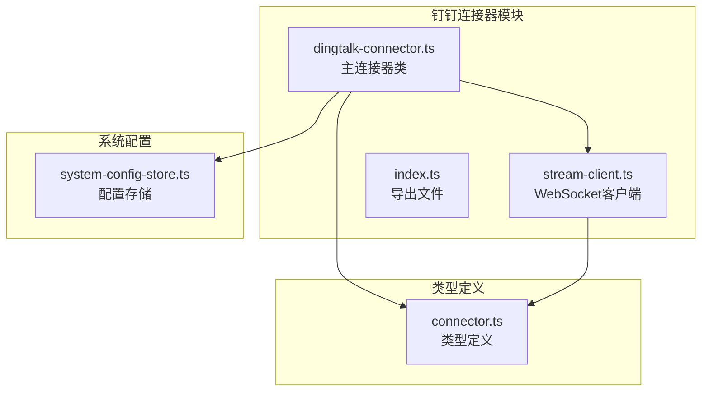
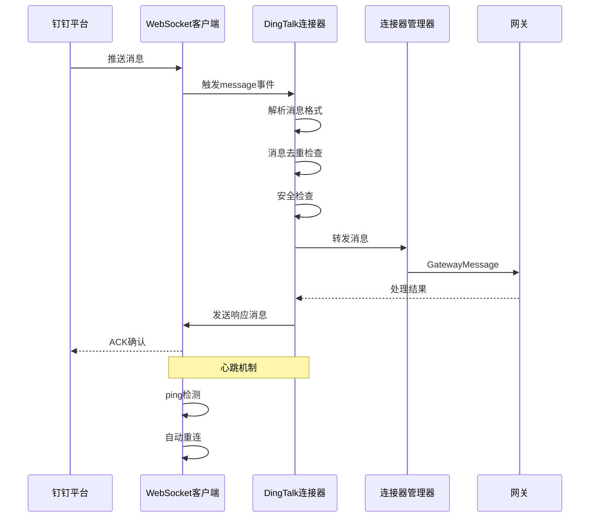
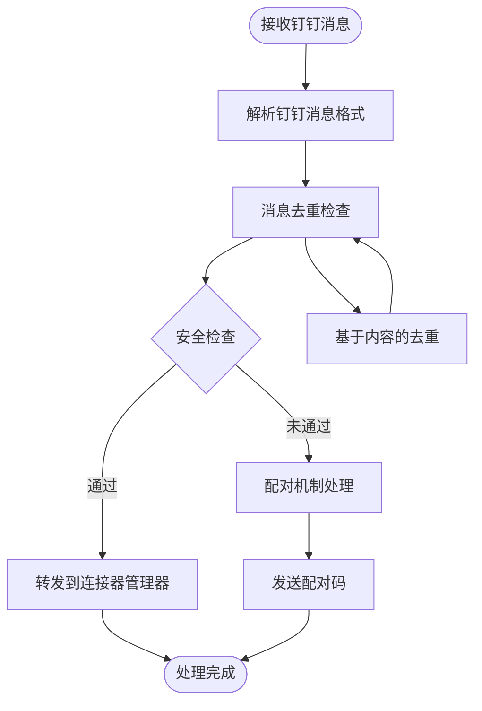
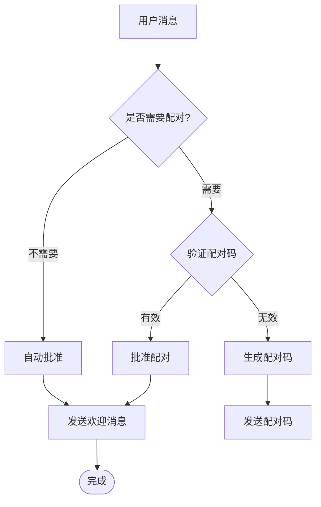
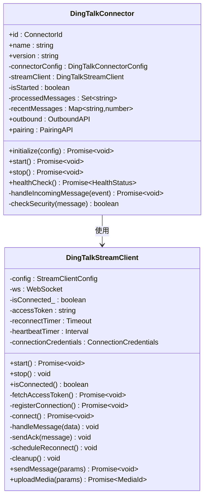
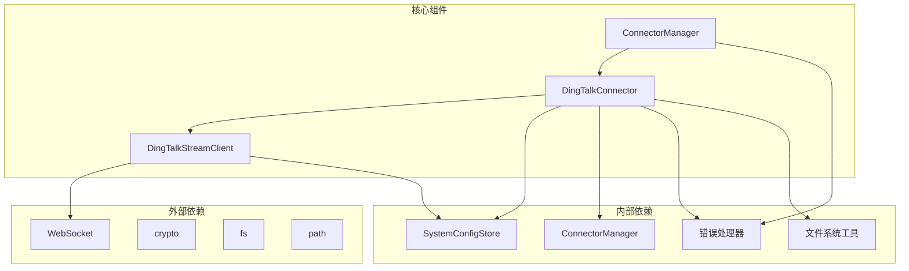

# 钉钉连接器

<cite>
**本文档引用的文件**
- [dingtalk-connector.ts](file://src/main/connectors/dingtalk/dingtalk-connector.ts)
- [stream-client.ts](file://src/main/connectors/dingtalk/stream-client.ts)
- [connector-manager.ts](file://src/main/connectors/connector-manager.ts)
- [connector.ts](file://src/types/connector.ts)
- [index.ts](file://src/main/connectors/index.ts)
- [钉钉机器人配置指南.md](file://docs/钉钉机器人配置指南.md)
- [test-dingtalk.js](file://clienttest/test-dingtalk.js)
- [system-config-store.ts](file://src/main/database/system-config-store.ts)
</cite>

## 目录
1. [简介](#简介)
2. [项目结构](#项目结构)
3. [核心组件](#核心组件)
4. [架构概览](#架构概览)
5. [详细组件分析](#详细组件分析)
6. [依赖关系分析](#依赖关系分析)
7. [性能考虑](#性能考虑)
8. [故障排除指南](#故障排除指南)
9. [结论](#结论)

## 简介

钉钉连接器是 DeepBot 项目中的一个关键组件，负责与钉钉开放平台进行集成，实现双向消息通信。该连接器基于钉钉开放平台的 Stream 模式，通过 WebSocket 建立长连接来接收和发送消息。

主要功能包括：
- 通过 Stream 模式建立与钉钉的实时连接
- 接收钉钉消息并转换为内部消息格式
- 发送文本、图片、文件等不同类型的消息
- 实现用户配对授权机制
- 提供消息去重和安全检查功能

## 项目结构

钉钉连接器位于 `src/main/connectors/dingtalk/` 目录下，包含以下核心文件：

**图表来源**
- [dingtalk-connector.ts:1-524](file://src/main/connectors/dingtalk/dingtalk-connector.ts#L1-L524)
- [stream-client.ts:1-541](file://src/main/connectors/dingtalk/stream-client.ts#L1-L541)
- [connector.ts:211-254](file://src/types/connector.ts#L211-L254)

**章节来源**
- [dingtalk-connector.ts:1-50](file://src/main/connectors/dingtalk/dingtalk-connector.ts#L1-L50)
- [stream-client.ts:1-50](file://src/main/connectors/dingtalk/stream-client.ts#L1-L50)

## 核心组件

### DingTalkConnector 主连接器

DingTalkConnector 是连接器的核心类，实现了 Connector 接口的所有方法：

- **生命周期管理**：initialize、start、stop、healthCheck
- **配置管理**：load、save、validate
- **消息处理**：handleIncomingMessage、checkSecurity
- **消息发送**：sendMessage、sendImage、sendFile
- **配对机制**：generatePairingCode、verifyPairingCode、approvePairing

### DingTalkStreamClient WebSocket 客户端

基于 WebSocket 实现的客户端，负责与钉钉开放平台建立实时连接：

- **认证流程**：获取 access_token、注册连接凭证
- **连接管理**：建立 WebSocket 连接、心跳维护、自动重连
- **消息处理**：接收消息、ACK 确认、系统消息处理
- **消息发送**：支持单聊和群聊消息发送
- **媒体上传**：支持图片和文件上传

**章节来源**
- [dingtalk-connector.ts:27-153](file://src/main/connectors/dingtalk/dingtalk-connector.ts#L27-L153)
- [stream-client.ts:32-82](file://src/main/connectors/dingtalk/stream-client.ts#L32-L82)

## 架构概览

**图表来源**
- [stream-client.ts:238-288](file://src/main/connectors/dingtalk/stream-client.ts#L238-L288)
- [dingtalk-connector.ts:171-307](file://src/main/connectors/dingtalk/dingtalk-connector.ts#L171-L307)
- [connector-manager.ts:130-168](file://src/main/connectors/connector-manager.ts#L130-L168)

## 详细组件分析

### 消息处理流程

**图表来源**
- [dingtalk-connector.ts:171-307](file://src/main/connectors/dingtalk/dingtalk-connector.ts#L171-L307)

### 配对授权机制

**图表来源**
- [dingtalk-connector.ts:277-344](file://src/main/connectors/dingtalk/dingtalk-connector.ts#L277-L344)
- [dingtalk-connector.ts:492-522](file://src/main/connectors/dingtalk/dingtalk-connector.ts#L492-L522)

### WebSocket 连接管理

**图表来源**
- [stream-client.ts:32-541](file://src/main/connectors/dingtalk/stream-client.ts#L32-L541)
- [dingtalk-connector.ts:27-524](file://src/main/connectors/dingtalk/dingtalk-connector.ts#L27-L524)

**章节来源**
- [stream-client.ts:56-82](file://src/main/connectors/dingtalk/stream-client.ts#L56-L82)
- [dingtalk-connector.ts:85-140](file://src/main/connectors/dingtalk/dingtalk-connector.ts#L85-L140)

## 依赖关系分析

**图表来源**
- [dingtalk-connector.ts:11-24](file://src/main/connectors/dingtalk/dingtalk-connector.ts#L11-L24)
- [stream-client.ts:8-17](file://src/main/connectors/dingtalk/stream-client.ts#L8-L17)

### 类型系统设计

连接器系统采用 TypeScript 类型系统确保类型安全：

- **Connector 接口**：定义所有连接器必须实现的标准方法
- **DingTalkConnectorConfig**：钉钉连接器的配置类型
- **DingTalkIncomingMessage**：内部消息格式定义
- **PairingRecord**：配对记录的数据结构

**章节来源**
- [connector.ts:76-146](file://src/types/connector.ts#L76-L146)
- [connector.ts:216-254](file://src/types/connector.ts#L216-L254)

## 性能考虑

### 消息去重机制

连接器实现了双重消息去重策略：

1. **基于消息ID的去重**：使用 Set 存储最近 1000 条已处理的消息 ID
2. **基于内容的去重**：使用 Map 存储消息内容和时间戳，5 秒内相同内容视为重复

### 内存管理

- 最大缓存条目数限制：1000 条
- 时间窗口控制：5 秒内的重复消息会被过滤
- 自动清理机制：超出限制时删除最旧的条目

### 连接优化

- **自动重连**：5 秒延迟重连机制
- **心跳检测**：被动心跳模式，减少不必要的网络负载
- **错误恢复**：完善的错误处理和资源清理

## 故障排除指南

### 常见问题及解决方案

#### 1. 连接器启动失败

**可能原因**：
- ClientId 或 ClientSecret 配置错误
- 网络无法访问钉钉 API
- 应用未发布或权限不足

**诊断步骤**：
1. 使用测试脚本验证凭证有效性
2. 检查网络连接和防火墙设置
3. 确认应用权限配置完整

#### 2. 收不到消息

**可能原因**：
- Stream 模式配置错误
- 事件订阅未正确设置
- 应用权限未申请

**解决方法**：
1. 确认消息推送模式设置为 Stream 模式
2. 检查相关事件订阅配置
3. 重新申请必要的应用权限

#### 3. 发送消息失败

**可能原因**：
- 缺少发送消息权限
- 用户或群组 ID 错误
- access_token 过期

**排查步骤**：
1. 验证发送权限配置
2. 检查会话 ID 格式
3. 查看 access_token 状态

**章节来源**
- [test-dingtalk.js:6-38](file://clienttest/test-dingtalk.js#L6-L38)
- [钉钉机器人配置指南.md:86-111](file://docs/钉钉机器人配置指南.md#L86-L111)

### 调试建议

1. **启用详细日志**：观察连接器启动和消息处理过程
2. **监控内存使用**：关注去重缓存的大小变化
3. **检查网络连接**：验证 WebSocket 连接状态
4. **验证配置文件**：确保所有必需配置项都已正确设置

## 结论

钉钉连接器是一个功能完整、设计合理的消息桥接组件，具有以下特点：

**技术优势**：
- 基于 Stream 模式的实时通信
- 完善的安全检查和配对机制
- 高效的消息去重和内存管理
- 稳健的错误处理和自动恢复

**架构设计**：
- 清晰的分层架构，职责分离明确
- 基于事件驱动的消息处理模式
- 类型安全的接口设计
- 可扩展的插件化架构

**实用性**：
- 支持多种消息类型（文本、图片、文件）
- 完整的配对授权流程
- 详细的错误诊断和日志记录
- 易于部署和维护

该连接器为 DeepBot 提供了可靠的钉钉集成能力，能够满足企业级应用场景的需求。