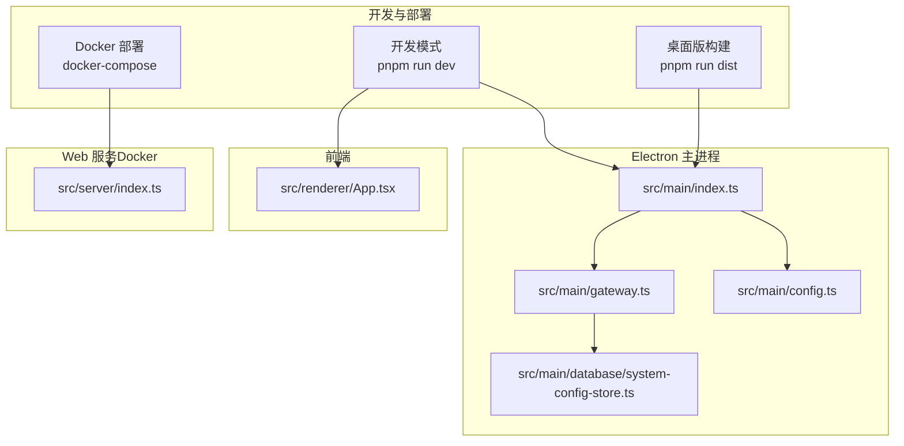
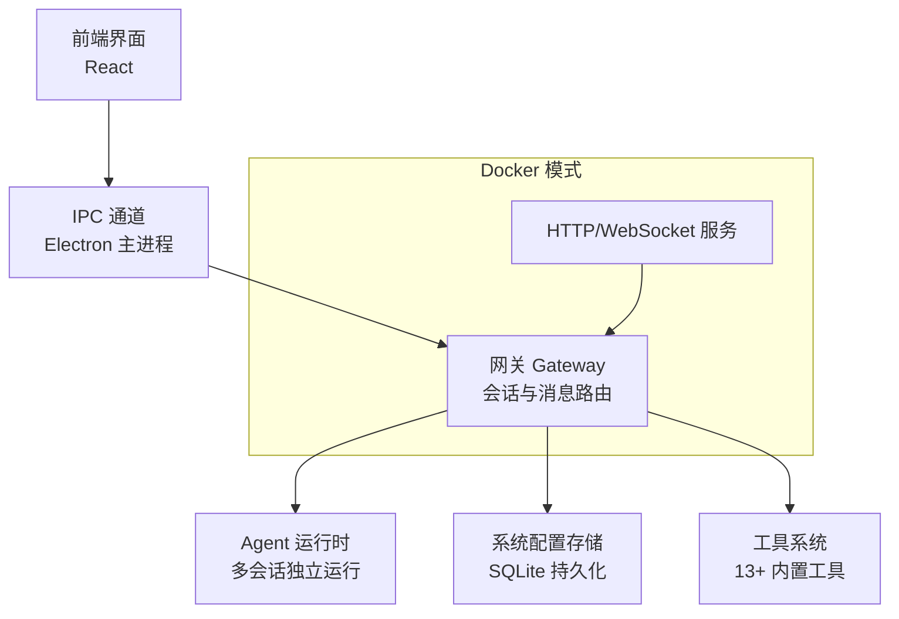
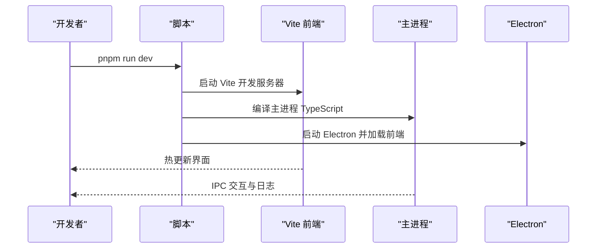
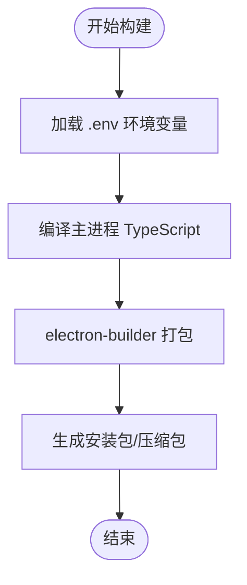
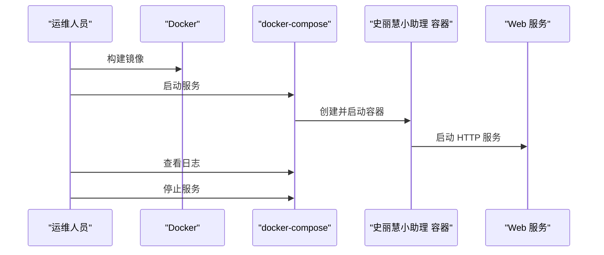
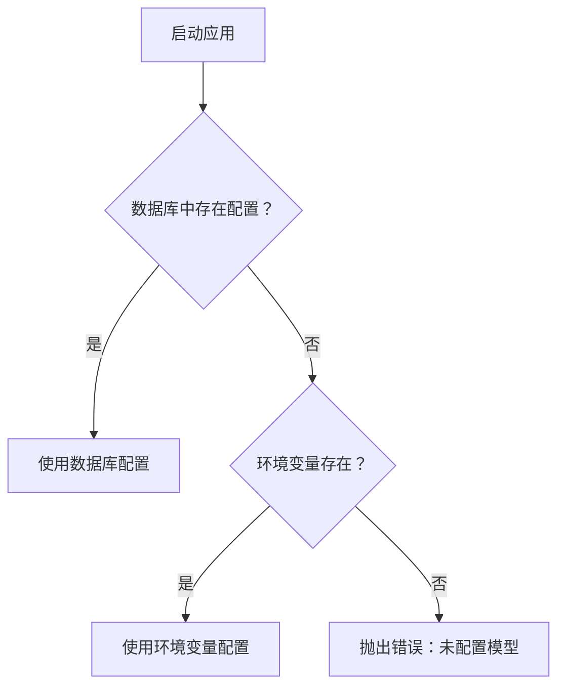
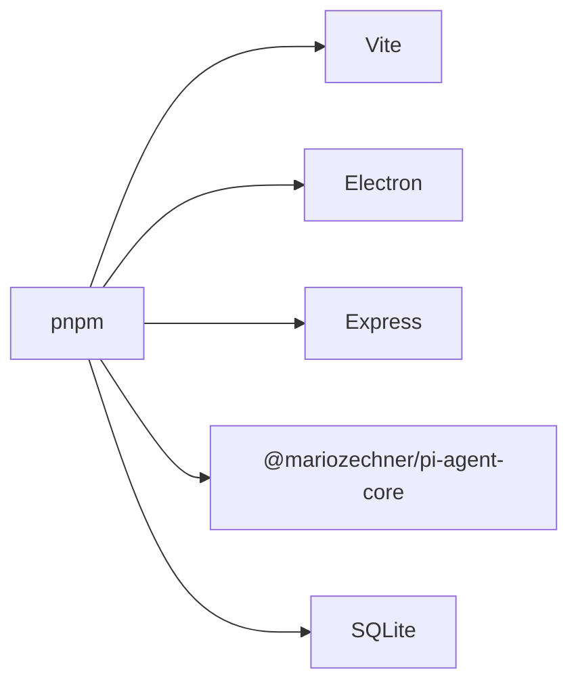

# 快速开始指南

<cite>
**本文档引用的文件**
- [README.md](file://README.md)
- [package.json](file://package.json)
- [Dockerfile](file://Dockerfile)
- [docker-compose.yml](file://docker-compose.yml)
- [scripts/load-env-build.js](file://scripts/load-env-build.js)
- [src/main/config.ts](file://src/main/config.ts)
- [src/main/database/system-config-store.ts](file://src/main/database/system-config-store.ts)
- [src/shared/utils/docker-utils.ts](file://src/shared/utils/docker-utils.ts)
- [src/main/gateway.ts](file://src/main/gateway.ts)
- [src/main/index.ts](file://src/main/index.ts)
</cite>

## 目录
1. [简介](#简介)
2. [项目结构](#项目结构)
3. [核心组件](#核心组件)
4. [架构总览](#架构总览)
5. [详细组件分析](#详细组件分析)
6. [依赖分析](#依赖分析)
7. [性能考虑](#性能考虑)
8. [故障排除指南](#故障排除指南)
9. [结论](#结论)
10. [附录](#附录)

## 简介
本指南面向初学者，帮助您在本地快速搭建 史丽慧小助理 开发环境，并提供完整的开发模式运行、桌面版构建以及 Docker 部署流程。同时涵盖配置文件设置方法（.env 与 docker-compose.yml 参数调整），并给出常见问题的解决方案。

## 项目结构
史丽慧小助理 采用 Electron + React 前端 + Node.js 后端的混合架构，主要目录与职责如下：
- src/main：Electron 主进程与后端逻辑（会话管理、Agent 运行时、工具系统、数据库等）
- src/renderer：React 前端界面
- src/server：Web 服务（Docker 部署时使用）
- scripts：构建与打包辅助脚本
- docs：文档资源
- 其他：配置文件、构建配置、类型定义等

**图表来源**
- [src/main/index.ts:1-120](file://src/main/index.ts#L1-L120)
- [src/main/gateway.ts:1-120](file://src/main/gateway.ts#L1-L120)
- [src/main/config.ts:1-108](file://src/main/config.ts#L1-L108)
- [src/main/database/system-config-store.ts:1-120](file://src/main/database/system-config-store.ts#L1-L120)

**章节来源**
- [README.md:37-98](file://README.md#L37-L98)
- [package.json:9-44](file://package.json#L9-L44)

## 核心组件
- 配置管理：优先从数据库读取，其次从环境变量读取，缺失时抛出错误提示
- 系统配置存储：SQLite 持久化，支持模型配置、工作目录、工具配置、连接器配置等
- 网关（Gateway）：会话管理与消息路由，支持多 Agent 协作与跨 Tab 通信
- Docker 环境工具：判断 Docker 模式并确定数据库目录等

**章节来源**
- [src/main/config.ts:30-108](file://src/main/config.ts#L30-L108)
- [src/main/database/system-config-store.ts:1-225](file://src/main/database/system-config-store.ts#L1-L225)
- [src/main/gateway.ts:29-114](file://src/main/gateway.ts#L29-L114)
- [src/shared/utils/docker-utils.ts:1-25](file://src/shared/utils/docker-utils.ts#L1-L25)

## 架构总览
史丽慧小助理 的核心运行时由主进程（Electron）承载，前端通过 IPC 与主进程交互；在 Docker 环境下，Web 服务直接提供 HTTP 接口。

**图表来源**
- [src/main/index.ts:307-331](file://src/main/index.ts#L307-L331)
- [src/main/gateway.ts:11-114](file://src/main/gateway.ts#L11-L114)
- [src/main/database/system-config-store.ts:37-120](file://src/main/database/system-config-store.ts#L37-L120)

## 详细组件分析

### 环境要求与安装
- 环境要求
  - Python：3.11 或更高版本
  - Node.js：20.0.0 或更高版本（可选，用于运行 JS 脚本）
  - pnpm：10.23.0 或更高版本（可选，用于运行 JS 脚本）
  - 操作系统：macOS、Windows（桌面版），Linux/Docker
- 安装步骤
  - 克隆仓库并安装依赖
  - 开发模式运行
  - 构建桌面版（全平台或指定平台）

**章节来源**
- [README.md:39-71](file://README.md#L39-L71)

### 开发模式运行
- 启动命令
  - pnpm run dev：同时启动渲染进程、主进程、模板复制与 Electron 启动
  - pnpm run dev:renderer：Vite 前端开发服务器
  - pnpm run dev:main：TypeScript 主进程监听编译
- 开发注意事项
  - 开发模式下，Electron 主窗口加载 Vite 开发服务器地址
  - 支持开发者工具快捷键（macOS：Cmd+Option+I）

**图表来源**
- [package.json:10-15](file://package.json#L10-L15)
- [src/main/index.ts:148-160](file://src/main/index.ts#L148-L160)

**章节来源**
- [package.json:10-15](file://package.json#L10-L15)
- [src/main/index.ts:148-160](file://src/main/index.ts#L148-L160)

### 桌面版构建
- 构建命令
  - pnpm run dist：构建所有平台
  - pnpm run dist:mac：仅构建 macOS
  - pnpm run dist:win：仅构建 Windows
- 构建脚本
  - scripts/load-env-build.js：加载 .env 环境变量后执行 electron-builder 打包
  - package.json 中的 build 配置定义了产物、签名、安装包目标等

**图表来源**
- [scripts/load-env-build.js:1-39](file://scripts/load-env-build.js#L1-L39)
- [package.json:24-27](file://package.json#L24-L27)

**章节来源**
- [README.md:60-71](file://README.md#L60-L71)
- [scripts/load-env-build.js:1-39](file://scripts/load-env-build.js#L1-L39)
- [package.json:24-27](file://package.json#L24-L27)

### Docker 部署
- 镜像构建
  - docker build -t slhbot:latest .
  - Dockerfile 支持多架构（linux/amd64、linux/arm64），包含 Web 服务与前端构建产物
- 容器启动
  - docker-compose up -d
  - 端口映射默认 3008，可通过 .env 调整
- 日志查看与停止
  - docker-compose logs -f
  - docker-compose down
- 访问地址
  - http://localhost:3008

**图表来源**
- [Dockerfile:1-122](file://Dockerfile#L1-L122)
- [docker-compose.yml:1-65](file://docker-compose.yml#L1-L65)

**章节来源**
- [README.md:73-98](file://README.md#L73-L98)
- [Dockerfile:1-122](file://Dockerfile#L1-L122)
- [docker-compose.yml:1-65](file://docker-compose.yml#L1-L65)

### 配置文件设置
- .env 文件
  - 复制 .env.example 为 .env，填入模型 API Key、Base URL、模型 ID 等
  - Docker 模式下通过 docker-compose.yml 的 env_file 加载
- docker-compose.yml 参数调整
  - 端口映射：PORT（默认 3008）
  - 数据卷挂载：WORKSPACE_DIR、SKILLS_DIR、MEMORY_DIR、SESSIONS_DIR、SCRIPTS_DIR、IMAGES_DIR、DB_DIR、PLAYWRIGHT_CACHE_DIR
  - 健康检查：/health 路径与端口配置一致
- 配置读取优先级
  - 数据库配置（SQLite）优先于环境变量
  - 缺失时抛出错误，提示在系统设置中配置 AI 模型

**图表来源**
- [src/main/config.ts:30-83](file://src/main/config.ts#L30-L83)

**章节来源**
- [README.md:93-97](file://README.md#L93-L97)
- [docker-compose.yml:13-65](file://docker-compose.yml#L13-L65)
- [src/main/config.ts:30-83](file://src/main/config.ts#L30-L83)

## 依赖分析
- 开发与构建
  - concurrently：并行启动多个进程
  - vite / @vitejs/plugin-react：前端开发与构建
  - electron / electron-builder：桌面应用打包
  - pnpm：包管理器
- 运行时依赖
  - express / ws：Web 服务与 WebSocket
  - @mariozechner/pi-agent-core 等：Agent 运行时与工具生态
  - sqlite：系统配置存储

**图表来源**
- [package.json:45-107](file://package.json#L45-L107)

**章节来源**
- [package.json:45-107](file://package.json#L45-L107)

## 性能考虑
- 构建缓存与增量编译
  - Vite 提供快速热更新与开发体验
  - TypeScript 监听编译减少重复构建
- Docker 多阶段构建
  - 分离构建与运行阶段，减小镜像体积
  - 使用 BuildKit cache mount 加速依赖安装
- 运行时优化
  - SQLite WAL 模式提升并发读写性能
  - Playwright 浏览器缓存持久化，避免重复下载

**章节来源**
- [Dockerfile:30-44](file://Dockerfile#L30-L44)
- [src/main/database/system-config-store.ts:56](file://src/main/database/system-config-store.ts#L56)

## 故障排除指南
- macOS 首次打开应用的安全提示
  - 应用已损坏：执行 xattr 命令移除 quarantine 属性
  - 无法验证开发者：通过系统设置“仍要打开”
- Docker 端口冲突
  - 修改 docker-compose.yml 中的 PORT 映射或宿主机端口
- 配置缺失导致启动失败
  - 在系统设置中配置 AI 模型，或在 .env 中补全 AI_API_KEY、AI_BASE_URL、AI_MODEL_ID
- 容器健康检查失败
  - 确认容器内服务已监听 0.0.0.0:3000，且 /health 路由可用

**章节来源**
- [README.md:100-125](file://README.md#L100-L125)
- [docker-compose.yml:59-65](file://docker-compose.yml#L59-L65)
- [src/main/config.ts:68-83](file://src/main/config.ts#L68-L83)

## 结论
通过本指南，您可以完成 史丽慧小助理 的环境准备、开发模式运行、桌面版构建以及 Docker 部署全流程。建议在开发阶段使用 .env 配置模型参数，在生产环境中通过 docker-compose 管理端口与数据卷，并结合健康检查保障服务可用性。

## 附录
- 常用命令速查
  - 开发：pnpm run dev
  - 构建：pnpm run dist / dist:mac / dist:win
  - Docker：docker build -t slhbot:latest .；docker-compose up -d；logs -f；down
- 配置项参考
  - 端口：PORT（默认 3008）
  - 数据目录：WORKSPACE_DIR、SKILLS_DIR、MEMORY_DIR、SESSIONS_DIR、SCRIPTS_DIR、IMAGES_DIR、DB_DIR、PLAYWRIGHT_CACHE_DIR