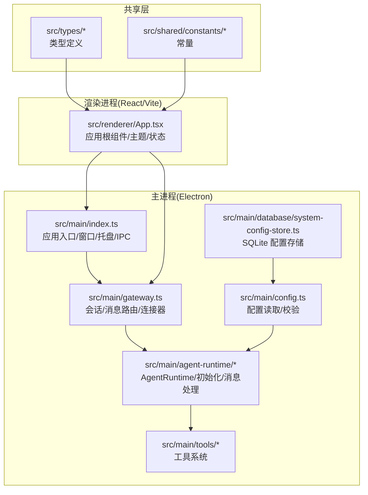
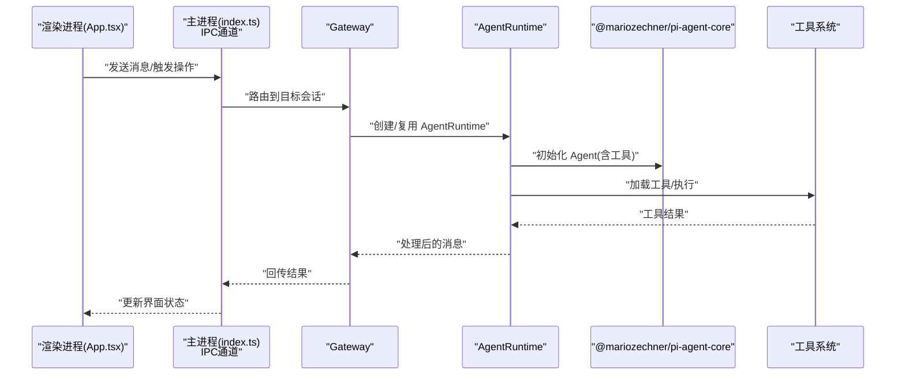
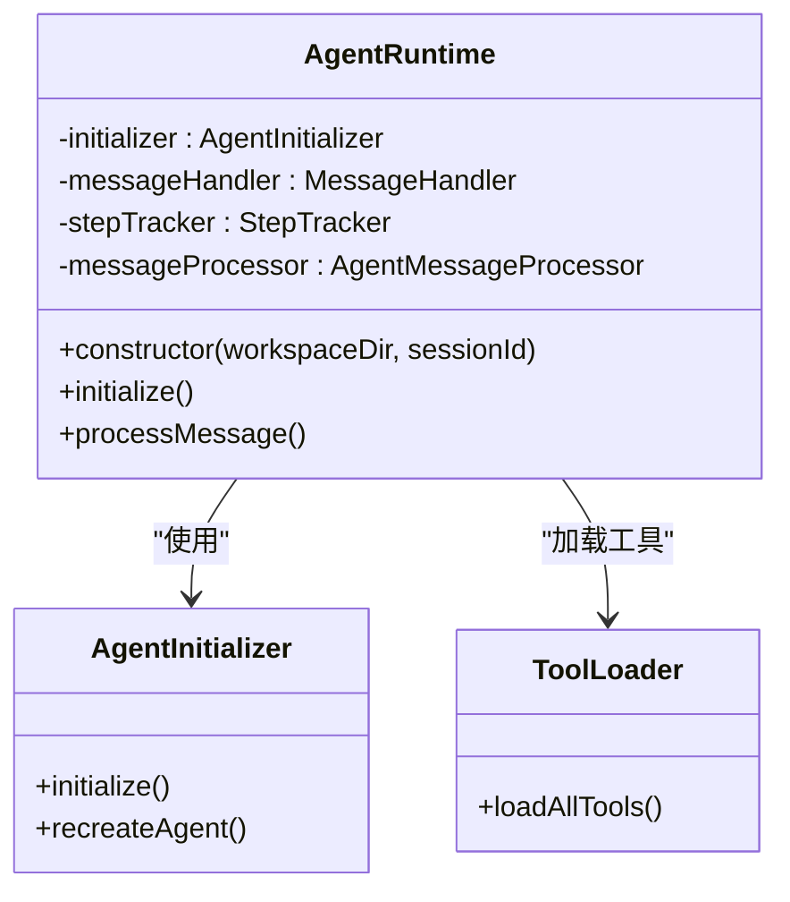

# 技术栈和依赖

<cite>
**本文引用的文件**
- [package.json](file://package.json)
- [README.md](file://README.md)
- [tsconfig.json](file://tsconfig.json)
- [vite.config.ts](file://vite.config.ts)
- [src/main/index.ts](file://src/main/index.ts)
- [src/main/gateway.ts](file://src/main/gateway.ts)
- [src/main/agent-runtime/agent-runtime.ts](file://src/main/agent-runtime/agent-runtime.ts)
- [src/main/agent-runtime/agent-initializer.ts](file://src/main/agent-runtime/agent-initializer.ts)
- [src/main/config.ts](file://src/main/config.ts)
- [src/main/database/system-config-store.ts](file://src/main/database/system-config-store.ts)
- [src/main/tools/registry/tool-loader.ts](file://src/main/tools/registry/tool-loader.ts)
- [src/main/tools/registry/tool-registry.ts](file://src/main/tools/registry/tool-registry.ts)
- [src/main/tools/chat-tool.ts](file://src/main/tools/chat-tool.ts)
- [src/renderer/App.tsx](file://src/renderer/App.tsx)
- [src/types/index.ts](file://src/types/index.ts)
- [src/shared/constants/version.ts](file://src/shared/constants/version.ts)
</cite>

## 目录
1. [简介](#简介)
2. [项目结构](#项目结构)
3. [核心组件](#核心组件)
4. [架构总览](#架构总览)
5. [详细组件分析](#详细组件分析)
6. [依赖分析](#依赖分析)
7. [性能考量](#性能考量)
8. [故障排查指南](#故障排查指南)
9. [结论](#结论)
10. [附录](#附录)

## 简介
本文件面向 史丽慧小助理 的技术栈与依赖，系统梳理项目采用的关键技术选型（Electron、React、TypeScript、@mariozechner/pi-agent-core 等），说明各依赖的作用、版本要求与兼容性，并解释技术栈选择的原因与优势（开发效率、性能表现、维护性）。同时提供依赖安装与管理的最佳实践，帮助开发者快速理解并高效迭代。

## 项目结构
史丽慧小助理 采用多进程架构：主进程（Electron）负责窗口、系统托盘、IPC、会话与 Agent 运行时调度；渲染进程（React/Vite）负责 UI 与用户交互；共享层提供类型、工具与常量；工具系统基于注册表与加载器组织；配置持久化使用 SQLite；构建与打包通过 Vite 与 Electron Builder 完成。

图表来源
- [src/main/index.ts:1-331](file://src/main/index.ts#L1-L331)
- [src/main/gateway.ts:1-200](file://src/main/gateway.ts#L1-L200)
- [src/main/agent-runtime/agent-runtime.ts:1-200](file://src/main/agent-runtime/agent-runtime.ts#L1-L200)
- [src/main/config.ts:1-108](file://src/main/config.ts#L1-L108)
- [src/main/database/system-config-store.ts:1-200](file://src/main/database/system-config-store.ts#L1-L200)
- [src/main/tools/registry/tool-loader.ts:1-200](file://src/main/tools/registry/tool-loader.ts#L1-L200)
- [src/renderer/App.tsx:1-200](file://src/renderer/App.tsx#L1-L200)

章节来源
- [README.md:128-225](file://README.md#L128-L225)
- [src/main/index.ts:119-331](file://src/main/index.ts#L119-L331)
- [src/main/gateway.ts:29-114](file://src/main/gateway.ts#L29-L114)
- [src/main/agent-runtime/agent-runtime.ts:27-188](file://src/main/agent-runtime/agent-runtime.ts#L27-L188)
- [src/renderer/App.tsx:24-132](file://src/renderer/App.tsx#L24-L132)

## 核心组件
- Electron 主进程：负责窗口创建、系统托盘、IPC 通道、生命周期管理、与 Gateway/AgentRuntime 的桥接。
- Gateway：会话与消息路由中枢，管理多个 AgentRuntime（每个 Tab 一个）、连接器、消息处理器与会话管理器。
- AgentRuntime：基于 @mariozechner/pi-agent-core 的智能体运行时，负责系统提示词组装、工具编排、消息处理与执行追踪。
- 工具系统：通过 ToolLoader/ToolRegistry 组织 13+ 内置工具，支持启用/禁用、配置文件与动态加载。
- 配置与持久化：SystemConfigStore 使用 SQLite 存储模型、工作目录、工具、连接器等配置。
- 渲染进程：React + Vite，提供聊天界面、技能管理、定时任务、系统设置等 UI。

章节来源
- [src/main/index.ts:23-331](file://src/main/index.ts#L23-L331)
- [src/main/gateway.ts:29-114](file://src/main/gateway.ts#L29-L114)
- [src/main/agent-runtime/agent-runtime.ts:27-188](file://src/main/agent-runtime/agent-runtime.ts#L27-L188)
- [src/main/tools/registry/tool-loader.ts:57-71](file://src/main/tools/registry/tool-loader.ts#L57-L71)
- [src/main/database/system-config-store.ts:37-70](file://src/main/database/system-config-store.ts#L37-L70)
- [src/renderer/App.tsx:24-132](file://src/renderer/App.tsx#L24-L132)

## 架构总览

图表来源
- [src/renderer/App.tsx:115-132](file://src/renderer/App.tsx#L115-L132)
- [src/main/index.ts:336-447](file://src/main/index.ts#L336-L447)
- [src/main/gateway.ts:129-147](file://src/main/gateway.ts#L129-L147)
- [src/main/agent-runtime/agent-initializer.ts:42-71](file://src/main/agent-runtime/agent-initializer.ts#L42-L71)
- [src/main/agent-runtime/agent-runtime.ts:193-200](file://src/main/agent-runtime/agent-runtime.ts#L193-L200)

## 详细组件分析

### Electron 主进程与窗口
- 职责：创建 BrowserWindow、系统托盘、拦截外部链接、注入预加载脚本、注册 IPC 处理器。
- 特性：开发模式加载 Vite，生产模式加载构建产物；窗口最小化到托盘；右键菜单与图片另存；统一错误监听。
- 与渲染进程交互：通过 IPC_CHANNELS 通道分发消息与操作。

章节来源
- [src/main/index.ts:119-331](file://src/main/index.ts#L119-L331)
- [src/main/index.ts:336-522](file://src/main/index.ts#L336-L522)

### Gateway 会话与消息路由
- 职责：管理会话生命周期、消息路由、跨 Tab 消息、连接器管理、定时任务集成。
- 设计：每 Tab 一个 AgentRuntime；异步初始化 SessionManager；自动启动已启用连接器；支持重新加载配置。
- 与工具链：向工具系统传递 Gateway 实例，支撑跨 Tab 调用与连接器通信。

章节来源
- [src/main/gateway.ts:29-114](file://src/main/gateway.ts#L29-L114)
- [src/main/gateway.ts:129-147](file://src/main/gateway.ts#L129-L147)
- [src/main/gateway.ts:156-185](file://src/main/gateway.ts#L156-L185)

### AgentRuntime 与 @mariozechner/pi-agent-core
- 职责：协调初始化、消息处理、步骤追踪、工具编排、重复检测与操作追踪。
- 与 pi-agent-core：动态导入 Agent 类，串行执行工具，避免并发依赖问题；根据配置创建模型对象（OpenAI 兼容或 Google Generative AI）。
- 配置来源：SystemConfigStore 提供模型配置与上下文窗口，支持回退与推断。

图表来源
- [src/main/agent-runtime/agent-runtime.ts:27-188](file://src/main/agent-runtime/agent-runtime.ts#L27-L188)
- [src/main/agent-runtime/agent-initializer.ts:42-71](file://src/main/agent-runtime/agent-initializer.ts#L42-L71)
- [src/main/tools/registry/tool-loader.ts:57-71](file://src/main/tools/registry/tool-loader.ts#L57-L71)

章节来源
- [src/main/agent-runtime/agent-runtime.ts:65-188](file://src/main/agent-runtime/agent-runtime.ts#L65-L188)
- [src/main/agent-runtime/agent-initializer.ts:42-71](file://src/main/agent-runtime/agent-initializer.ts#L42-L71)

### 工具系统：加载器与注册表
- ToolLoader：集中导入与加载内置工具，按启用/禁用过滤，动态读取工具配置文件。
- ToolRegistry：注册工具插件、管理工具实例与配置，支持禁用工具与错误处理。
- 典型工具：文件读写、命令执行、浏览器控制、图片生成、Web 搜索/抓取、记忆、技能管理、定时任务、跨 Tab 调用、连接器、飞书云文档等。

章节来源
- [src/main/tools/registry/tool-loader.ts:57-71](file://src/main/tools/registry/tool-loader.ts#L57-L71)
- [src/main/tools/registry/tool-loader.ts:109-200](file://src/main/tools/registry/tool-loader.ts#L109-L200)
- [src/main/tools/registry/tool-registry.ts:36-55](file://src/main/tools/registry/tool-registry.ts#L36-L55)

### 配置与持久化
- SystemConfigStore：SQLite 单例，持久化模型、工作目录、工具、连接器、名称等配置；支持 Docker 与普通模式路径差异。
- 配置来源优先级：数据库配置 > 环境变量 > 抛错提示（需要用户配置）。
- 模型配置：提供上下文窗口、快速模型等字段，用于 AgentRuntime 的模型参数计算。

章节来源
- [src/main/database/system-config-store.ts:37-70](file://src/main/database/system-config-store.ts#L37-L70)
- [src/main/database/system-config-store.ts:82-134](file://src/main/database/system-config-store.ts#L82-L134)
- [src/main/config.ts:38-83](file://src/main/config.ts#L38-L83)

### 渲染进程与 UI
- App.tsx：主题上下文、Tab 管理、消息状态、自动更新监听、历史消息加载与 Tab 名称更新。
- 与主进程：通过 API 模块调用 IPC，实现发送消息、创建/关闭 Tab、加载工具等。

章节来源
- [src/renderer/App.tsx:24-132](file://src/renderer/App.tsx#L24-L132)
- [src/renderer/App.tsx:134-160](file://src/renderer/App.tsx#L134-L160)

## 依赖分析

### 核心技术栈与版本要求
- Electron：主进程运行时，负责窗口、托盘、IPC、系统集成。
- React + Vite：渲染进程 UI 框架与构建工具，支持开发热更新与多模式构建（Electron/Web）。
- TypeScript：强类型保障，分层 tsconfig 管理主/渲染/服务端编译目标与库。
- @mariozechner/pi-agent-core：智能体运行时核心，提供 Agent 初始化、工具编排与消息处理。
- @mariozechner/pi-ai：AI 客户端封装，配合 pi-agent-core 使用。
- SQLite：配置持久化，SystemConfigStore 统一管理。
- 工具生态：文件、命令、浏览器、图片生成、Web 搜索/抓取、记忆、技能、定时任务、跨 Tab 通信、连接器、飞书云文档等。

章节来源
- [package.json:45-107](file://package.json#L45-L107)
- [README.md:128-225](file://README.md#L128-L225)
- [tsconfig.json:1-23](file://tsconfig.json#L1-L23)
- [vite.config.ts:5-61](file://vite.config.ts#L5-L61)

### 依赖作用与兼容性
- Electron：与主进程 API（BrowserWindow、ipcMain、Menu、Tray）紧密耦合，构建产物通过 electron-builder 输出。
- React：与 Vite 插件 @vitejs/plugin-react 集成，开发与生产模式分别输出到 dist 与 dist-web。
- TypeScript：主/渲染/服务端三套 tsconfig，确保模块解析、目标版本与类型安全。
- @mariozechner/pi-agent-core：动态导入，与工具系统解耦；支持串行工具执行，避免并发冲突。
- @mariozechner/pi-ai：在工具内部按需动态导入，封装模型调用与流式响应。
- SQLite：SystemConfigStore 统一初始化与迁移，兼容 Docker 与本地路径。

章节来源
- [src/main/index.ts:23-331](file://src/main/index.ts#L23-L331)
- [src/main/agent-runtime/agent-initializer.ts:42-71](file://src/main/agent-runtime/agent-initializer.ts#L42-L71)
- [src/main/tools/chat-tool.ts:105-118](file://src/main/tools/chat-tool.ts#L105-L118)
- [src/main/database/system-config-store.ts:41-60](file://src/main/database/system-config-store.ts#L41-L60)

### 技术选型原因与优势
- 开发效率
  - React + Vite：热更新与多模式构建，开发体验佳；TypeScript 提升代码质量与可维护性。
  - Electron：统一桌面端体验，IPC 简化前后端交互。
- 性能表现
  - AgentRuntime 串行工具执行降低并发依赖风险；SystemConfigStore 使用 SQLite，I/O 轻量化。
  - Vite 按需打包，Web/Electron 模式差异化输出，减少冗余资源。
- 维护性
  - 分层清晰：主进程、渲染进程、共享层、工具系统、配置层职责明确。
  - 工具注册表与加载器：便于扩展与禁用工具，降低耦合度。
  - 配置持久化：统一入口管理，支持迁移与回退。

章节来源
- [README.md:128-225](file://README.md#L128-L225)
- [src/main/agent-runtime/agent-runtime.ts:67-86](file://src/main/agent-runtime/agent-runtime.ts#L67-L86)
- [src/main/tools/registry/tool-loader.ts:109-200](file://src/main/tools/registry/tool-loader.ts#L109-L200)

### 依赖安装与管理最佳实践
- 包管理器：使用 pnpm，版本在 package.json 中声明，引擎要求 Node >= 20。
- 依赖安装：确保 Node 版本满足要求；使用 pnpm install 安装依赖。
- Electron 依赖：postinstall 钩子自动安装应用依赖，避免原生模块不匹配。
- 构建与打包：开发模式使用 concurrently 并行启动主进程与渲染进程；生产构建分别输出主进程与渲染进程产物。
- Web 模式：Vite 模式切换输出到 dist-web，端口 5174；Electron 模式输出到 dist，端口 5173。
- TypeScript：严格模式与类型检查，主/渲染/服务端分别配置，避免类型污染。

章节来源
- [package.json:9-44](file://package.json#L9-L44)
- [package.json:108-111](file://package.json#L108-L111)
- [vite.config.ts:5-61](file://vite.config.ts#L5-L61)
- [tsconfig.json:1-23](file://tsconfig.json#L1-L23)
- [tsconfig.main.json:1-16](file://tsconfig.main.json#L1-L16)
- [tsconfig.renderer.json:1-11](file://tsconfig.renderer.json#L1-L11)
- [tsconfig.server.json:1-30](file://tsconfig.server.json#L1-L30)

## 性能考量
- 模型上下文窗口与最大输出令牌：根据上下文窗口动态计算，平衡成本与效果。
- 工具执行策略：AgentRuntime 使用串行工具执行，避免并发竞争与状态不一致。
- 配置缓存：Gateway 在模型配置变更时清理 AI 缓存并销毁现有 AgentRuntime，保证一致性。
- 文件与网络 I/O：工具执行前进行路径安全检查与大小限制，避免异常资源消耗。

章节来源
- [src/main/agent-runtime/agent-runtime.ts:104-143](file://src/main/agent-runtime/agent-runtime.ts#L104-L143)
- [src/main/agent-runtime/agent-runtime.ts:192-200](file://src/main/agent-runtime/agent-runtime.ts#L192-L200)
- [src/main/index.ts:590-710](file://src/main/index.ts#L590-L710)

## 故障排查指南
- 模型未配置：配置读取失败时抛出错误，需在系统设置中配置 API Key、Base URL 与模型 ID。
- 工具执行失败：检查工具配置文件路径与权限；确认工具启用状态；查看工具返回的错误信息。
- 图片/文件上传失败：检查大小限制与临时目录权限；确认路径在工作目录下。
- IPC 通道异常：确认主进程已注册相应 IPC 处理器；检查渲染进程调用是否正确。
- 配置持久化异常：检查 SQLite 数据库路径与权限；Docker 模式下确认数据卷挂载。

章节来源
- [src/main/config.ts:68-83](file://src/main/config.ts#L68-L83)
- [src/main/tools/registry/tool-loader.ts:77-99](file://src/main/tools/registry/tool-loader.ts#L77-L99)
- [src/main/index.ts:590-710](file://src/main/index.ts#L590-L710)
- [src/main/database/system-config-store.ts:41-60](file://src/main/database/system-config-store.ts#L41-L60)

## 结论
史丽慧小助理 的技术栈围绕 Electron + React + TypeScript 构建，辅以 @mariozechner/pi-agent-core 与 pi-ai 的智能体运行时与 AI 客户端，形成“桌面端 + 智能体 + 工具系统”的一体化方案。通过分层架构、工具注册表与加载器、SQLite 配置持久化以及 Vite 的多模式构建，项目在开发效率、性能表现与维护性方面取得良好平衡。遵循本文的依赖管理与最佳实践，可稳定推进功能迭代与部署交付。

## 附录
- 版本常量：应用版本、名称与描述、最大 Tab 数量限制。
- 类型定义：任务状态、消息结构、配置接口等。

章节来源
- [src/shared/constants/version.ts:6-22](file://src/shared/constants/version.ts#L6-L22)
- [src/types/index.ts:5-51](file://src/types/index.ts#L5-L51)