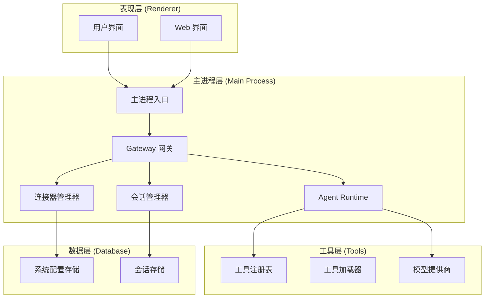
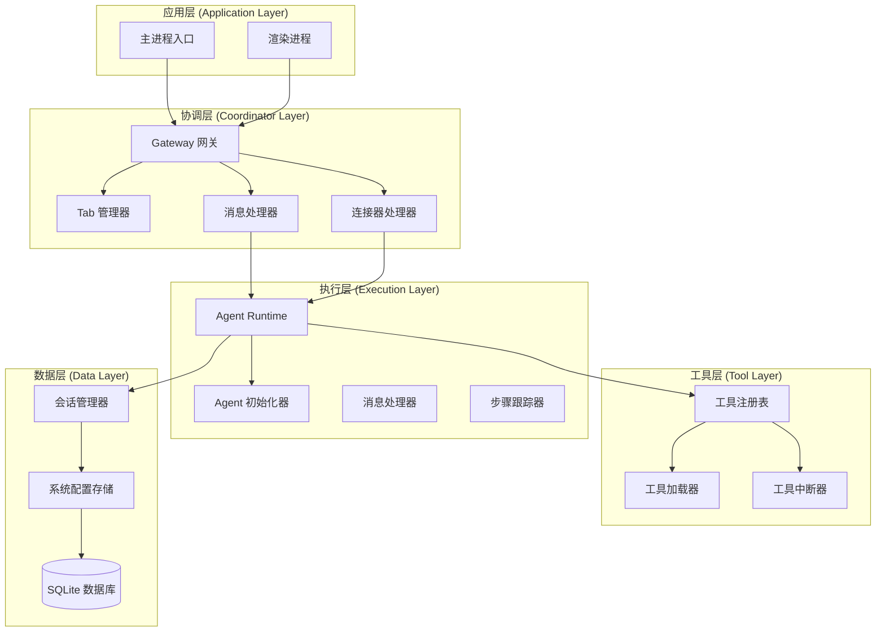
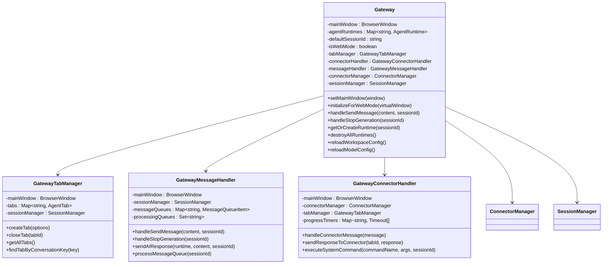
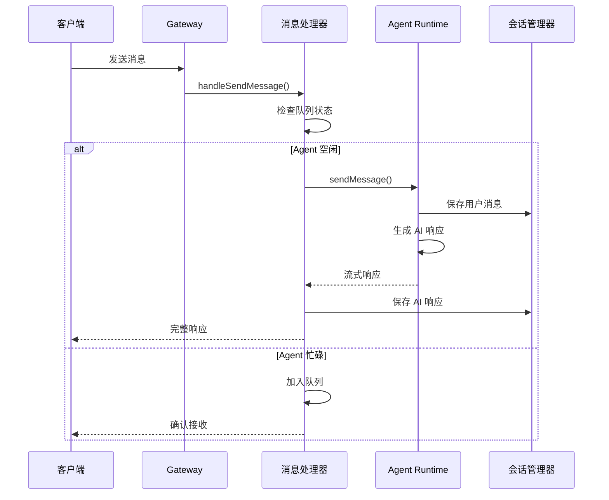
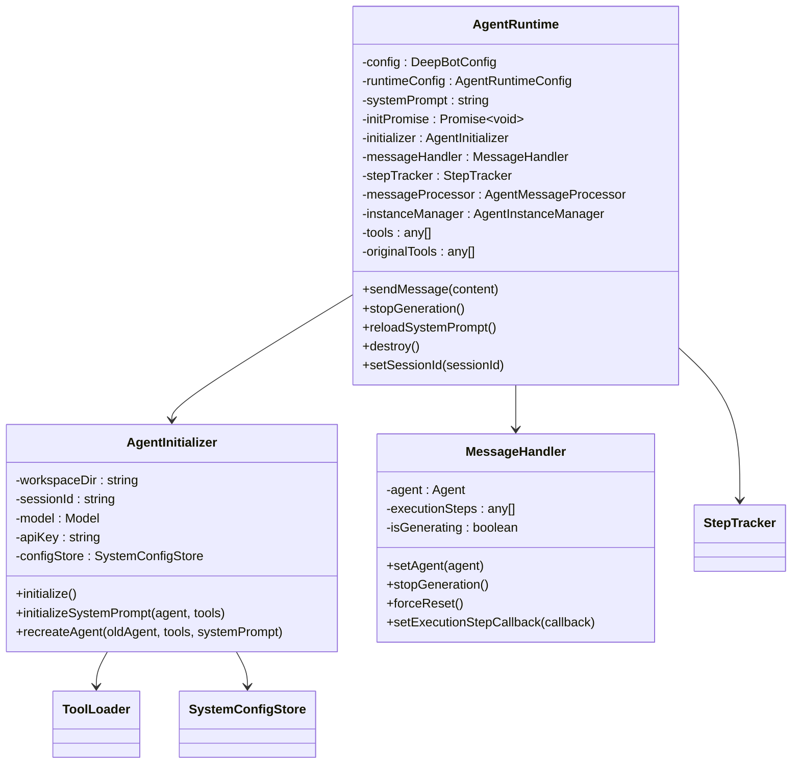
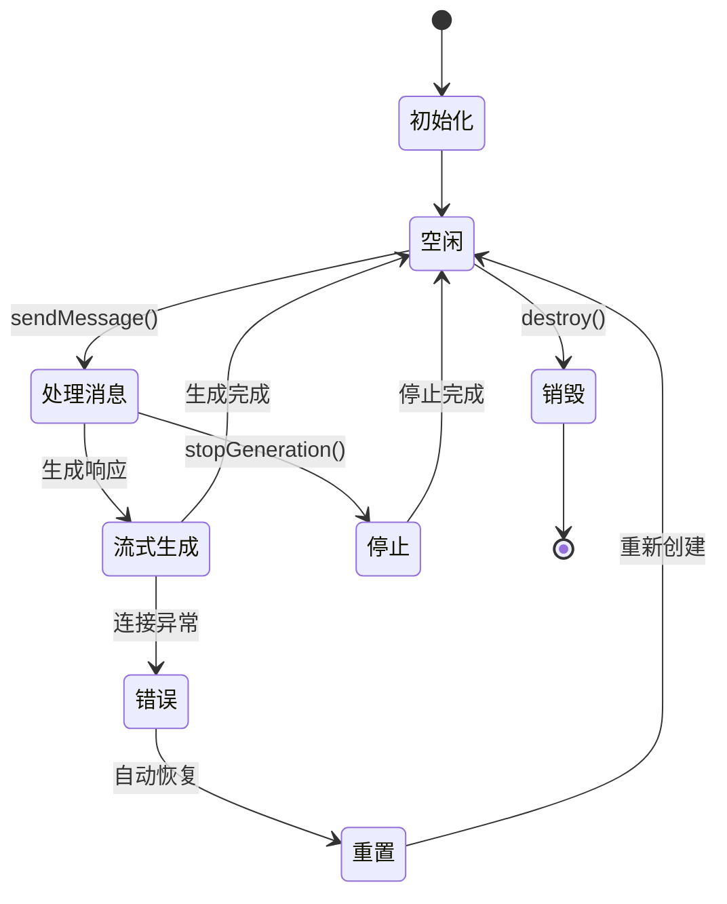
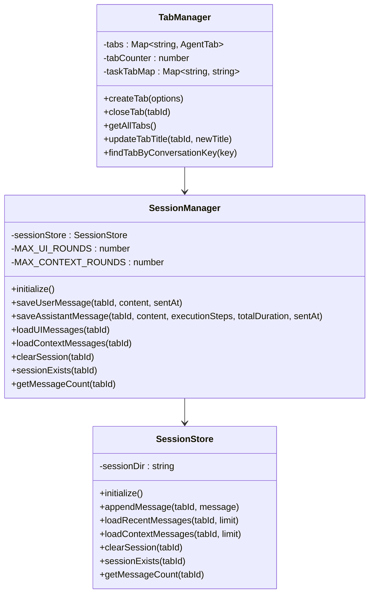
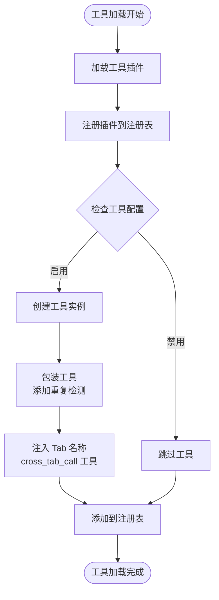
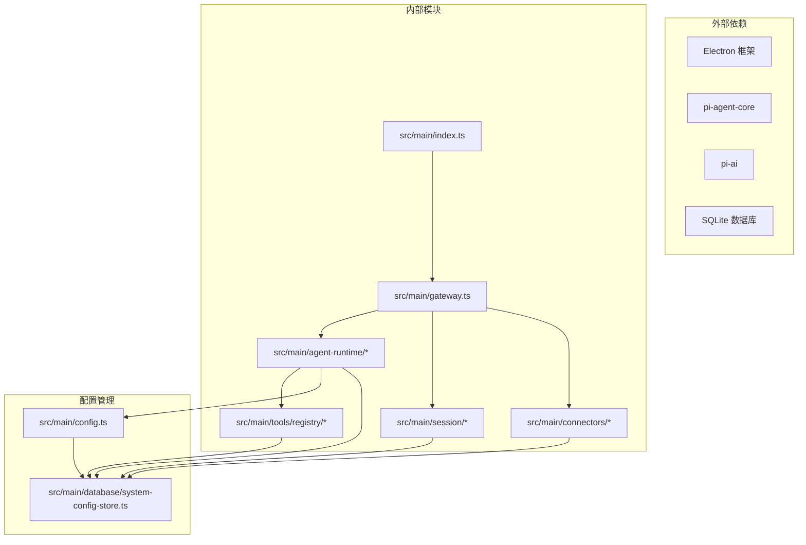
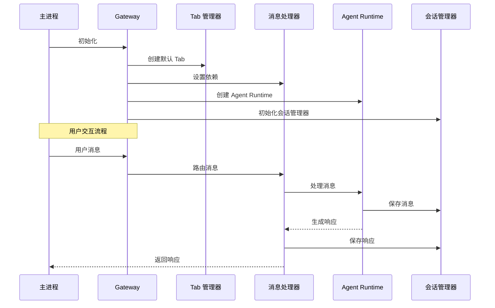

# 架构设计概览

<cite>
**本文档引用的文件**
- [src/main/index.ts](file://src/main/index.ts)
- [src/main/gateway.ts](file://src/main/gateway.ts)
- [src/main/agent-runtime/agent-runtime.ts](file://src/main/agent-runtime/agent-runtime.ts)
- [src/main/agent-runtime/agent-initializer.ts](file://src/main/agent-runtime/agent-initializer.ts)
- [src/main/agent-runtime/types.ts](file://src/main/agent-runtime/types.ts)
- [src/main/session/session-manager.ts](file://src/main/session/session-manager.ts)
- [src/main/gateway-tab.ts](file://src/main/gateway-tab.ts)
- [src/main/gateway-message.ts](file://src/main/gateway-message.ts)
- [src/main/gateway-connector.ts](file://src/main/gateway-connector.ts)
- [src/main/connectors/connector-manager.ts](file://src/main/connectors/connector-manager.ts)
- [src/main/tools/registry/tool-registry.ts](file://src/main/tools/registry/tool-registry.ts)
- [src/main/config.ts](file://src/main/config.ts)
</cite>

## 目录
1. [简介](#简介)
2. [项目结构](#项目结构)
3. [核心组件](#核心组件)
4. [架构概览](#架构概览)
5. [详细组件分析](#详细组件分析)
6. [依赖关系分析](#依赖关系分析)
7. [性能考虑](#性能考虑)
8. [故障排除指南](#故障排除指南)
9. [结论](#结论)

## 简介

DeepBot 是一个基于 Electron 的桌面 AI 助手应用，采用模块化架构设计，支持多 Agent 协作系统、Gateway 会话管理和 Agent Runtime 执行环境。该系统通过清晰的分层架构实现了消息路由、会话管理、工具集成和连接器扩展等功能。

## 项目结构

DeepBot 采用典型的三层架构设计：

**图表来源**
- [src/main/index.ts:1-800](file://src/main/index.ts#L1-L800)
- [src/main/gateway.ts:1-772](file://src/main/gateway.ts#L1-L772)

**章节来源**
- [src/main/index.ts:1-800](file://src/main/index.ts#L1-L800)
- [src/main/gateway.ts:1-772](file://src/main/gateway.ts#L1-L772)

## 核心组件

### 1. Gateway 网关系统

Gateway 是整个系统的核心协调器，负责：

- **会话生命周期管理**：管理多个 AgentRuntime 实例
- **消息路由**：将用户消息路由到相应的 AgentRuntime
- **流式响应处理**：处理 AI 响应的流式输出
- **连接器集成**：管理外部连接器的消息收发

### 2. Agent Runtime 执行环境

Agent Runtime 提供了完整的 AI Agent 执行环境：

- **Agent 生命周期管理**：创建、初始化、销毁 Agent 实例
- **工具集成**：动态加载和管理工具
- **系统提示词管理**：构建和维护系统提示词
- **消息处理**：处理用户消息并生成响应

### 3. 会话管理系统

会话管理系统负责：

- **消息持久化**：保存用户消息和 AI 响应
- **上下文管理**：维护 Agent 的对话上下文
- **历史记录**：管理对话历史和执行步骤

### 4. 工具注册表系统

工具注册表提供了：

- **工具插件管理**：注册和管理工具插件
- **工具配置**：管理工具的启用状态和配置
- **工具加载**：动态加载工具插件

**章节来源**
- [src/main/gateway.ts:1-772](file://src/main/gateway.ts#L1-L772)
- [src/main/agent-runtime/agent-runtime.ts:1-800](file://src/main/agent-runtime/agent-runtime.ts#L1-L800)
- [src/main/session/session-manager.ts:1-195](file://src/main/session/session-manager.ts#L1-L195)
- [src/main/tools/registry/tool-registry.ts:1-328](file://src/main/tools/registry/tool-registry.ts#L1-L328)

## 架构概览

DeepBot 采用了分层架构设计，每层都有明确的职责分工：

**图表来源**
- [src/main/gateway.ts:29-748](file://src/main/gateway.ts#L29-L748)
- [src/main/agent-runtime/agent-runtime.ts:27-800](file://src/main/agent-runtime/agent-runtime.ts#L27-L800)

## 详细组件分析

### Gateway 网关组件

Gateway 作为系统的核心协调器，承担着多重职责：

**图表来源**
- [src/main/gateway.ts:29-748](file://src/main/gateway.ts#L29-L748)
- [src/main/gateway-tab.ts:26-796](file://src/main/gateway-tab.ts#L26-L796)
- [src/main/gateway-message.ts:31-525](file://src/main/gateway-message.ts#L31-L525)
- [src/main/gateway-connector.ts:44-813](file://src/main/gateway-connector.ts#L44-L813)

#### 消息处理流程

Gateway 的消息处理采用异步流式处理机制：

**图表来源**
- [src/main/gateway-message.ts:76-160](file://src/main/gateway-message.ts#L76-L160)
- [src/main/agent-runtime/agent-runtime.ts:661-688](file://src/main/agent-runtime/agent-runtime.ts#L661-L688)

**章节来源**
- [src/main/gateway.ts:1-772](file://src/main/gateway.ts#L1-L772)
- [src/main/gateway-message.ts:1-525](file://src/main/gateway-message.ts#L1-L525)

### Agent Runtime 执行环境

Agent Runtime 提供了完整的 AI Agent 执行环境：

**图表来源**
- [src/main/agent-runtime/agent-runtime.ts:27-800](file://src/main/agent-runtime/agent-runtime.ts#L27-L800)
- [src/main/agent-runtime/agent-initializer.ts:17-188](file://src/main/agent-runtime/agent-initializer.ts#L17-L188)
- [src/main/agent-runtime/types.ts:8-40](file://src/main/agent-runtime/types.ts#L8-L40)

#### Agent 生命周期管理

Agent Runtime 采用智能的生命周期管理模式：

**图表来源**
- [src/main/agent-runtime/agent-runtime.ts:537-564](file://src/main/agent-runtime/agent-runtime.ts#L537-L564)
- [src/main/agent-runtime/agent-runtime.ts:731-744](file://src/main/agent-runtime/agent-runtime.ts#L731-L744)

**章节来源**
- [src/main/agent-runtime/agent-runtime.ts:1-800](file://src/main/agent-runtime/agent-runtime.ts#L1-L800)
- [src/main/agent-runtime/agent-initializer.ts:1-188](file://src/main/agent-runtime/agent-initializer.ts#L1-L188)

### 会话管理系统

会话管理系统提供了完整的消息持久化和上下文管理功能：

**图表来源**
- [src/main/session/session-manager.ts:17-195](file://src/main/session/session-manager.ts#L17-L195)
- [src/main/gateway-tab.ts:26-796](file://src/main/gateway-tab.ts#L26-L796)

**章节来源**
- [src/main/session/session-manager.ts:1-195](file://src/main/session/session-manager.ts#L1-L195)
- [src/main/gateway-tab.ts:1-796](file://src/main/gateway-tab.ts#L1-L796)

### 工具注册表系统

工具注册表提供了灵活的工具插件管理机制：

**图表来源**
- [src/main/tools/registry/tool-registry.ts:46-194](file://src/main/tools/registry/tool-registry.ts#L46-L194)

**章节来源**
- [src/main/tools/registry/tool-registry.ts:1-328](file://src/main/tools/registry/tool-registry.ts#L1-L328)

## 依赖关系分析

DeepBot 的依赖关系遵循单一职责原则和依赖倒置原则：

**图表来源**
- [src/main/index.ts:23-321](file://src/main/index.ts#L23-L321)
- [src/main/gateway.ts:11-99](file://src/main/gateway.ts#L11-L99)

### 模块间交互关系

系统采用事件驱动的交互模式：

**图表来源**
- [src/main/gateway.ts:337-374](file://src/main/gateway.ts#L337-L374)
- [src/main/gateway-message.ts:76-160](file://src/main/gateway-message.ts#L76-L160)

**章节来源**
- [src/main/index.ts:1-800](file://src/main/index.ts#L1-L800)
- [src/main/gateway.ts:1-772](file://src/main/gateway.ts#L1-L772)

## 性能考虑

DeepBot 在设计时充分考虑了性能优化：

### 1. 异步处理机制
- 使用 Promise 和 async/await 实现非阻塞操作
- 采用流式处理减少内存占用
- 消息队列机制避免并发冲突

### 2. 缓存策略
- AI 连接缓存减少重复连接开销
- 工具实例缓存避免重复创建
- 系统提示词缓存提升响应速度

### 3. 资源管理
- 智能的 Agent 实例生命周期管理
- 会话历史的分页加载
- 连接器的懒加载机制

### 4. 错误恢复
- 自动重试机制处理网络异常
- 状态检查和自动恢复
- 队列化的错误处理

## 故障排除指南

### 常见问题及解决方案

#### 1. AI 连接超时
**症状**：消息发送后长时间无响应
**解决方案**：
- 检查网络连接状态
- 验证 API Key 配置
- 重启 Agent Runtime 实例

#### 2. 工具加载失败
**症状**：工具无法正常使用
**解决方案**：
- 检查工具配置状态
- 重新加载工具注册表
- 验证工具依赖完整性

#### 3. 会话历史丢失
**症状**：重启后对话记录消失
**解决方案**：
- 检查会话目录权限
- 验证 SQLite 数据库状态
- 重新初始化会话管理器

**章节来源**
- [src/main/gateway-message.ts:246-283](file://src/main/gateway-message.ts#L246-L283)
- [src/main/agent-runtime/agent-runtime.ts:537-564](file://src/main/agent-runtime/agent-runtime.ts#L537-L564)

## 结论

DeepBot 的架构设计体现了现代桌面应用的最佳实践：

### 设计优势
1. **模块化设计**：清晰的职责分离和依赖管理
2. **可扩展性**：插件化的工具系统和连接器架构
3. **可靠性**：完善的错误处理和自动恢复机制
4. **性能优化**：异步处理和缓存策略

### 架构特点
- **分层架构**：从表现层到数据层的清晰分层
- **事件驱动**：基于事件的消息路由机制
- **生命周期管理**：完整的资源生命周期控制
- **配置驱动**：灵活的配置管理和热重载

### 发展方向
- 支持更多模型提供商
- 增强多 Agent 协作能力
- 优化移动端适配
- 扩展连接器生态

该架构为 DeepBot 提供了坚实的技术基础，便于后续的功能扩展和性能优化。