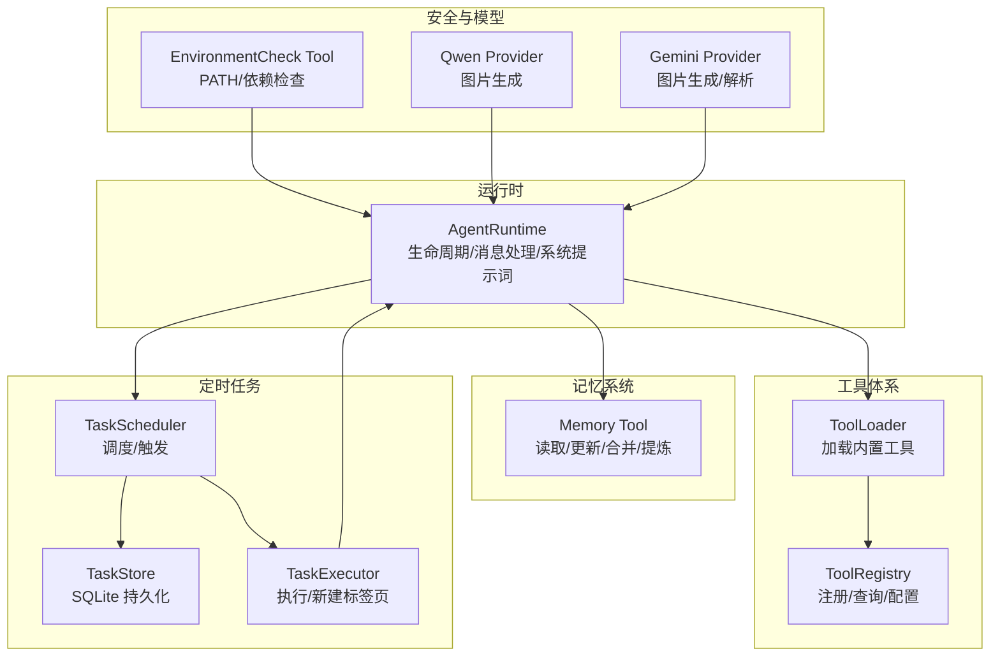
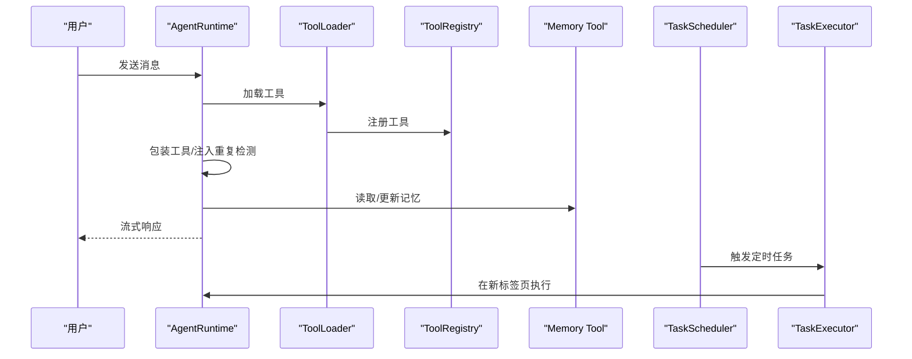
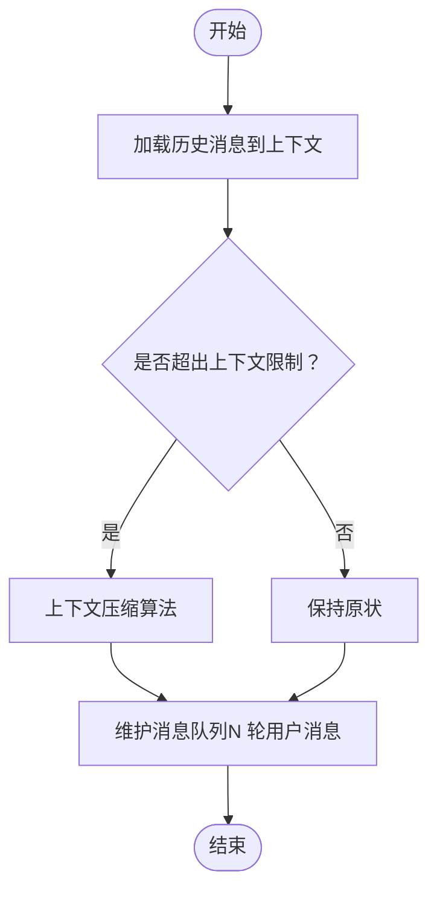
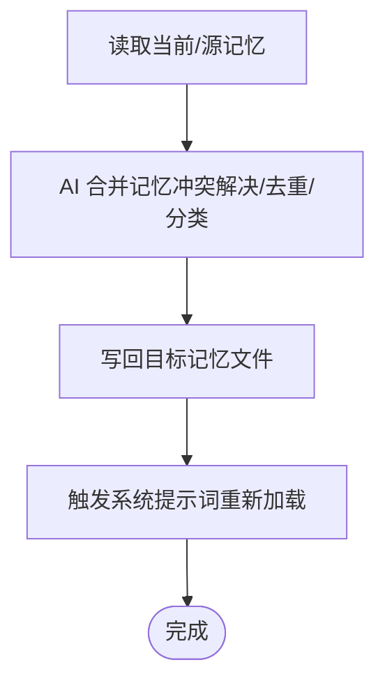
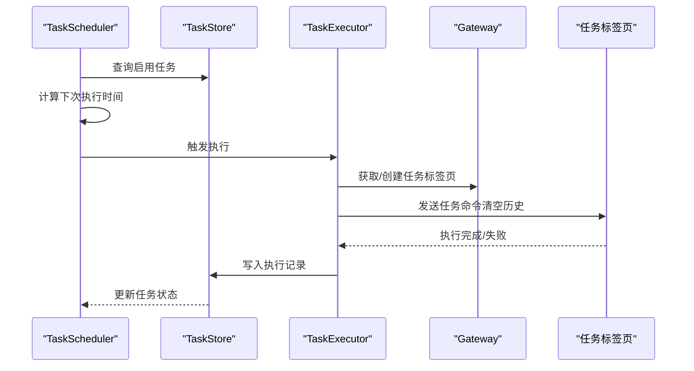
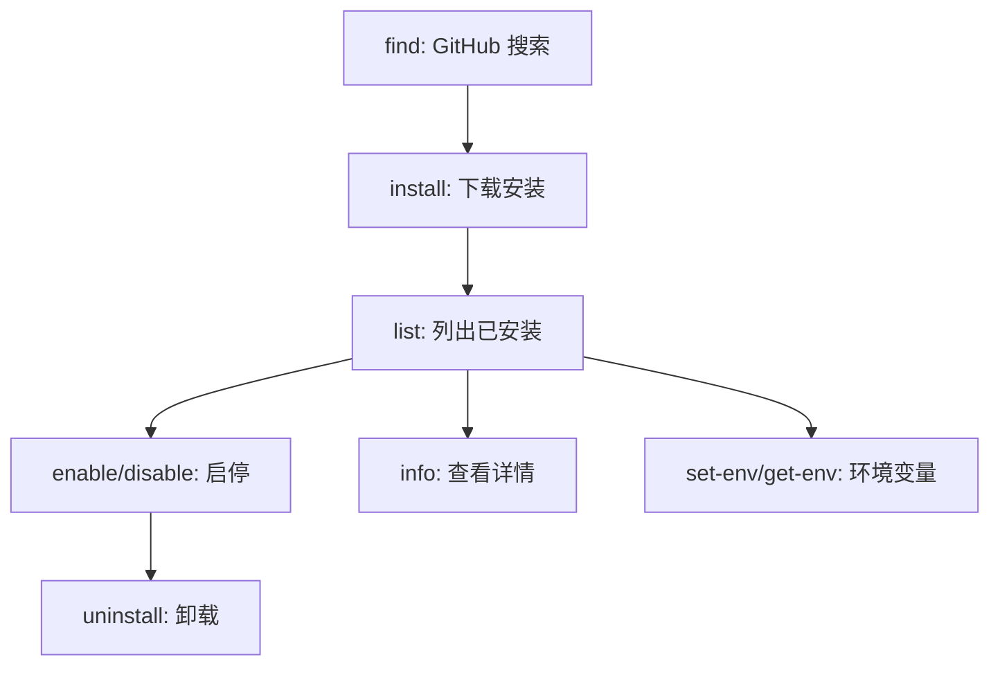
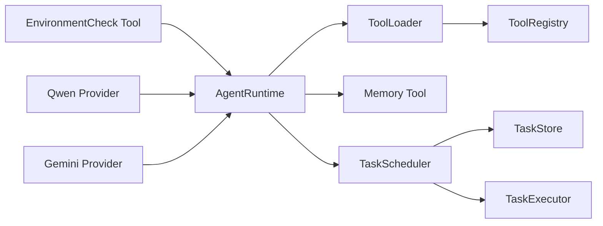

# 核心特性介绍

<cite>
**本文引用的文件**
- [agent-runtime.ts](file://src/main/agent-runtime/agent-runtime.ts)
- [tool-loader.ts](file://src/main/tools/registry/tool-loader.ts)
- [tool-registry.ts](file://src/main/tools/registry/tool-registry.ts)
- [memory-tool.ts](file://src/main/tools/memory-tool.ts)
- [index.ts](file://src/main/scheduled-tasks/index.ts)
- [types.ts](file://src/main/scheduled-tasks/types.ts)
- [store.ts](file://src/main/scheduled-tasks/store.ts)
- [scheduler.ts](file://src/main/scheduled-tasks/scheduler.ts)
- [executor.ts](file://src/main/scheduled-tasks/executor.ts)
- [environment-check-tool.ts](file://src/main/tools/environment-check-tool.ts)
- [constants.ts](file://src/main/config/constants.ts)
- [qwen-provider.ts](file://src/main/tools/providers/qwen-provider.ts)
- [gemini-provider.ts](file://src/main/tools/providers/gemini-provider.ts)
- [index.ts](file://src/main/tools/skill-manager/index.ts)
</cite>

## 目录
1. [简介](#简介)
2. [项目结构](#项目结构)
3. [核心组件](#核心组件)
4. [架构总览](#架构总览)
5. [详细组件分析](#详细组件分析)
6. [依赖关系分析](#依赖关系分析)
7. [性能考量](#性能考量)
8. [故障排除指南](#故障排除指南)
9. [结论](#结论)
10. [附录](#附录)

## 简介
本文件面向企业级用户与开发者，系统化阐述 史丽慧小助理 的核心特性与工程实现，包括：
- 多任务并行处理：基于会话与子代理的并发控制与消息队列维护
- 14个内置工具：文件、执行、浏览器、日历、技能管理、定时任务、环境检查、图片生成、网络搜索、Web 抓取、记忆、跨标签调用、系统指令、飞书文档等
- 记忆系统：主记忆与多标签独立记忆、自动提炼与分类、冲突解决与去重
- 定时任务：一次性/周期/CRON 调度、持久化存储、执行记录与自动停止
- 技能扩展：GitHub 源搜索、安装、启停、卸载、环境变量管理
- 安全限制：环境变量合并与保险机制、超时与取消信号、上下文压缩与历史轮次限制
- 多模型支持：OpenAI 与 Google Generative AI 的统一抽象与上下文窗口适配
- 外部通讯：HTTP(S) 请求、图片生成 API、Cron 调度与任务执行隔离

## 项目结构
史丽慧小助理 采用“运行时 + 工具体系 + 任务系统 + 记忆与上下文”的分层设计：
- 运行时层：AgentRuntime 负责生命周期、消息处理、工具包装与系统提示词初始化
- 工具层：ToolLoader/ToolRegistry 管理内置工具加载与注册，支持按需启用/禁用
- 记忆层：Memory Tool 提供主记忆与标签页记忆的读写、提炼与合并
- 任务层：定时任务的存储、调度、执行与历史记录
- 安全与模型层：环境检查、超时与取消、多模型抽象与上下文窗口适配

图表来源
- [agent-runtime.ts:1-909](file://src/main/agent-runtime/agent-runtime.ts#L1-L909)
- [tool-loader.ts:1-312](file://src/main/tools/registry/tool-loader.ts#L1-L312)
- [tool-registry.ts:1-328](file://src/main/tools/registry/tool-registry.ts#L1-L328)
- [memory-tool.ts:1-870](file://src/main/tools/memory-tool.ts#L1-L870)
- [store.ts:1-364](file://src/main/scheduled-tasks/store.ts#L1-L364)
- [scheduler.ts:1-322](file://src/main/scheduled-tasks/scheduler.ts#L1-L322)
- [executor.ts:1-170](file://src/main/scheduled-tasks/executor.ts#L1-L170)
- [environment-check-tool.ts:1-318](file://src/main/tools/environment-check-tool.ts#L1-L318)
- [qwen-provider.ts:1-310](file://src/main/tools/providers/qwen-provider.ts#L1-L310)
- [gemini-provider.ts:1-409](file://src/main/tools/providers/gemini-provider.ts#L1-L409)

章节来源
- [agent-runtime.ts:1-909](file://src/main/agent-runtime/agent-runtime.ts#L1-L909)
- [tool-loader.ts:1-312](file://src/main/tools/registry/tool-loader.ts#L1-L312)
- [tool-registry.ts:1-328](file://src/main/tools/registry/tool-registry.ts#L1-L328)

## 核心组件
- AgentRuntime：统一的运行时入口，协调初始化、消息处理、工具包装、系统提示词与上下文压缩
- ToolLoader/ToolRegistry：集中加载与注册内置工具，支持配置启用/禁用与动态参数校验
- Memory Tool：主记忆与标签页记忆的读取、更新、合并与提炼，支持冲突解决与去重
- TaskStore/Scheduler/Executor：定时任务的持久化、调度、执行与历史记录
- EnvironmentCheck Tool：系统环境依赖检查与 PATH 合并，保障工具链可用性
- 多模型支持：对 OpenAI 与 Google Generative AI 的抽象封装，适配上下文窗口与最大输出

章节来源
- [agent-runtime.ts:1-909](file://src/main/agent-runtime/agent-runtime.ts#L1-L909)
- [tool-loader.ts:1-312](file://src/main/tools/registry/tool-loader.ts#L1-L312)
- [tool-registry.ts:1-328](file://src/main/tools/registry/tool-registry.ts#L1-L328)
- [memory-tool.ts:1-870](file://src/main/tools/memory-tool.ts#L1-L870)
- [store.ts:1-364](file://src/main/scheduled-tasks/store.ts#L1-L364)
- [scheduler.ts:1-322](file://src/main/scheduled-tasks/scheduler.ts#L1-L322)
- [executor.ts:1-170](file://src/main/scheduled-tasks/executor.ts#L1-L170)
- [environment-check-tool.ts:1-318](file://src/main/tools/environment-check-tool.ts#L1-L318)
- [qwen-provider.ts:1-310](file://src/main/tools/providers/qwen-provider.ts#L1-L310)
- [gemini-provider.ts:1-409](file://src/main/tools/providers/gemini-provider.ts#L1-L409)

## 架构总览
史丽慧小助理 的核心是“运行时 + 工具 + 记忆 + 任务”的协同架构。运行时负责消息流与工具调用编排；工具体系提供丰富的外部能力；记忆系统持续优化上下文质量；定时任务在独立标签页中执行，避免相互干扰。

图表来源
- [agent-runtime.ts:1-909](file://src/main/agent-runtime/agent-runtime.ts#L1-L909)
- [tool-loader.ts:1-312](file://src/main/tools/registry/tool-loader.ts#L1-L312)
- [tool-registry.ts:1-328](file://src/main/tools/registry/tool-registry.ts#L1-L328)
- [memory-tool.ts:1-870](file://src/main/tools/memory-tool.ts#L1-L870)
- [scheduler.ts:1-322](file://src/main/scheduled-tasks/scheduler.ts#L1-L322)
- [executor.ts:1-170](file://src/main/scheduled-tasks/executor.ts#L1-L170)

## 详细组件分析

### 多任务并行处理
- 会话与标签页隔离：AgentRuntime 支持多会话（sessionId）与标签页切换，每个会话拥有独立 Agent 实例与系统提示词
- 工具包装与重复检测：工具执行前经 OperationTracker 包装，避免重复调用；跨标签调用工具注入 senderTabName
- 消息队列与上下文压缩：限制最近 N 轮用户消息，结合上下文压缩算法减少 Token 消耗
- 历史消息加载：从会话存储加载最近消息到 Agent 上下文，并进行压缩

图表来源
- [agent-runtime.ts:236-423](file://src/main/agent-runtime/agent-runtime.ts#L236-L423)

章节来源
- [agent-runtime.ts:1-909](file://src/main/agent-runtime/agent-runtime.ts#L1-L909)

### 14个内置工具
- 文件工具：文件读写、批量处理
- 执行工具：命令执行与阻塞检查
- 浏览器工具：网页自动化与截图
- 日历工具：事件查询与创建
- 技能管理工具：GitHub 源搜索、安装、启停、卸载、环境变量管理
- 定时任务工具：创建、暂停、恢复、手动触发
- 环境检查工具：Python 等依赖检查与 PATH 合并
- 图片生成工具：Qwen/Gemini 提供商，支持参考图与多种分辨率
- 网络搜索工具：Web 搜索（配置化）
- Web 内容获取工具：抓取网页内容
- 记忆工具：读取/更新/合并/提炼
- 跨标签调用工具：在其他标签页执行并获取结果
- 系统指令工具：/new 等系统级指令
- 飞书文档工具：云文档读写

章节来源
- [tool-loader.ts:1-312](file://src/main/tools/registry/tool-loader.ts#L1-L312)
- [index.ts:1-180](file://src/main/tools/skill-manager/index.ts#L1-L180)

### 记忆系统
- 记忆文件结构：角色、用户习惯、错误总结、备忘事项四类
- 主记忆与标签页记忆：默认 memory.md 为主记忆，标签页可配置独立 memory-{tabId}.md
- 自动提炼与分类：基于大模型提炼新信息，自动分类并去重
- 冲突解决：当前标签页记忆优先级高于源记忆，避免覆盖核心信息
- 合并策略：两份记忆合并后进行去重与结构化整理，长度限制 20000 字符

图表来源
- [memory-tool.ts:233-306](file://src/main/tools/memory-tool.ts#L233-L306)
- [memory-tool.ts:521-621](file://src/main/tools/memory-tool.ts#L521-L621)
- [memory-tool.ts:623-763](file://src/main/tools/memory-tool.ts#L623-L763)

章节来源
- [memory-tool.ts:1-870](file://src/main/tools/memory-tool.ts#L1-L870)

### 定时任务
- 调度类型：一次性、周期、CRON；支持时区与时限
- 存储：SQLite 持久化，包含任务与执行记录表
- 调度器：每秒检查到期任务，避免并发执行同一任务
- 执行器：在任务专属标签页执行，自动等待空闲窗口，清空历史避免干扰
- 自动停止：达到最大执行次数或一次性任务完成后自动禁用

图表来源
- [scheduler.ts:1-322](file://src/main/scheduled-tasks/scheduler.ts#L1-L322)
- [store.ts:1-364](file://src/main/scheduled-tasks/store.ts#L1-L364)
- [executor.ts:1-170](file://src/main/scheduled-tasks/executor.ts#L1-L170)

章节来源
- [types.ts:1-86](file://src/main/scheduled-tasks/types.ts#L1-L86)
- [store.ts:1-364](file://src/main/scheduled-tasks/store.ts#L1-L364)
- [scheduler.ts:1-322](file://src/main/scheduled-tasks/scheduler.ts#L1-L322)
- [executor.ts:1-170](file://src/main/scheduled-tasks/executor.ts#L1-L170)
- [index.ts:1-9](file://src/main/scheduled-tasks/index.ts#L1-L9)

### 技能扩展
- 搜索：从 ClawHub 搜索可安装的 Skill
- 安装：下载到本地 skill 目录
- 管理：启停、卸载、查看详情
- 环境变量：为 Skill 写入 .env 并刷新 PATH 缓存

图表来源
- [index.ts:1-180](file://src/main/tools/skill-manager/index.ts#L1-L180)

章节来源
- [index.ts:1-180](file://src/main/tools/skill-manager/index.ts#L1-L180)

### 安全限制
- 环境变量合并与保险机制：从登录 Shell 合并 PATH，必要时将 Python 路径追加到进程环境
- 超时与取消：命令执行、图片生成、HTTP 请求均设置超时与 AbortSignal 支持
- 上下文压缩与历史轮次限制：防止上下文溢出，降低 Token 成本
- 工具重复检测：避免同一工具重复执行

章节来源
- [environment-check-tool.ts:1-318](file://src/main/tools/environment-check-tool.ts#L1-L318)
- [constants.ts:1-26](file://src/main/config/constants.ts#L1-L26)
- [agent-runtime.ts:1-909](file://src/main/agent-runtime/agent-runtime.ts#L1-L909)

### 多模型支持
- 统一抽象：对 OpenAI 与 Google Generative AI 的模型封装，统一上下文窗口与最大输出
- 上下文窗口适配：优先从数据库读取，否则按模型 ID 推断
- 图片生成：Qwen 与 Gemini 提供商，支持参考图与多分辨率

章节来源
- [agent-runtime.ts:101-143](file://src/main/agent-runtime/agent-runtime.ts#L101-L143)
- [qwen-provider.ts:1-310](file://src/main/tools/providers/qwen-provider.ts#L1-L310)
- [gemini-provider.ts:1-409](file://src/main/tools/providers/gemini-provider.ts#L1-L409)

### 外部通讯
- HTTP(S) 请求：图片生成与 API 调用，支持自定义 Agent 与超时控制
- CRON 调度：基于 cron 表达式的定时任务
- 任务执行隔离：定时任务在独立标签页执行，避免与其他会话互相干扰

章节来源
- [executor.ts:1-170](file://src/main/scheduled-tasks/executor.ts#L1-L170)
- [scheduler.ts:1-322](file://src/main/scheduled-tasks/scheduler.ts#L1-L322)
- [qwen-provider.ts:1-310](file://src/main/tools/providers/qwen-provider.ts#L1-L310)
- [gemini-provider.ts:1-409](file://src/main/tools/providers/gemini-provider.ts#L1-L409)

## 依赖关系分析
- AgentRuntime 依赖 ToolLoader/ToolRegistry 提供工具集合，依赖 Memory Tool 管理上下文记忆
- TaskScheduler 依赖 TaskStore 进行持久化，依赖 TaskExecutor 执行任务
- 环境检查工具与图片生成提供商分别服务于工具链可用性与多媒体能力
- 工具加载器集中导入内置工具，按开关过滤与动态配置

图表来源
- [agent-runtime.ts:1-909](file://src/main/agent-runtime/agent-runtime.ts#L1-L909)
- [tool-loader.ts:1-312](file://src/main/tools/registry/tool-loader.ts#L1-L312)
- [tool-registry.ts:1-328](file://src/main/tools/registry/tool-registry.ts#L1-L328)
- [memory-tool.ts:1-870](file://src/main/tools/memory-tool.ts#L1-L870)
- [store.ts:1-364](file://src/main/scheduled-tasks/store.ts#L1-L364)
- [scheduler.ts:1-322](file://src/main/scheduled-tasks/scheduler.ts#L1-L322)
- [executor.ts:1-170](file://src/main/scheduled-tasks/executor.ts#L1-L170)
- [environment-check-tool.ts:1-318](file://src/main/tools/environment-check-tool.ts#L1-L318)
- [qwen-provider.ts:1-310](file://src/main/tools/providers/qwen-provider.ts#L1-L310)
- [gemini-provider.ts:1-409](file://src/main/tools/providers/gemini-provider.ts#L1-L409)

章节来源
- [tool-loader.ts:1-312](file://src/main/tools/registry/tool-loader.ts#L1-L312)
- [tool-registry.ts:1-328](file://src/main/tools/registry/tool-registry.ts#L1-L328)

## 性能考量
- 上下文窗口与最大输出：根据模型 ID 推断上下文窗口，合理设置 maxTokens 以平衡成本与质量
- 历史消息轮次限制：限制最近 N 轮用户消息，避免上下文膨胀
- 上下文压缩：在加载历史时进行压缩，显著降低 Token 使用
- 定时任务并发控制：每秒检查一次，避免重复执行同一任务
- 超时与取消：命令执行、图片生成、HTTP 请求均设置超时与取消信号，防止资源泄露

## 故障排除指南
- Agent 卡死或状态异常：运行时会在发送消息前检查并重置 streaming 状态与生成器状态
- 环境变量缺失：使用环境检查工具刷新 PATH 缓存并自动追加 Python 路径
- 定时任务长时间未执行：检查任务状态、下次执行时间与执行记录，必要时手动触发
- 记忆更新失败：检查内存文件长度限制与提炼提示词，确保无重复与冲突

章节来源
- [agent-runtime.ts:430-456](file://src/main/agent-runtime/agent-runtime.ts#L430-L456)
- [environment-check-tool.ts:127-200](file://src/main/tools/environment-check-tool.ts#L127-L200)
- [store.ts:270-337](file://src/main/scheduled-tasks/store.ts#L270-L337)
- [memory-tool.ts:766-782](file://src/main/tools/memory-tool.ts#L766-L782)

## 结论
史丽慧小助理 通过运行时编排、工具体系、记忆系统、定时任务与安全限制，为企业用户提供稳定、可扩展、可审计的智能体平台。多模型支持与外部通讯能力进一步增强其在复杂业务场景中的适应性。建议在生产环境中结合上下文压缩、历史轮次限制与超时控制，确保性能与稳定性。

## 附录
- 企业级价值主张
  - 生产力提升：自动化日常任务、跨应用协作与知识沉淀
  - 可靠性：上下文压缩、超时与取消、重复检测与任务隔离
  - 可扩展性：内置工具与技能生态、多模型与多提供商支持
  - 安全性：环境变量合并与保险机制、最小权限原则下的工具启用/禁用