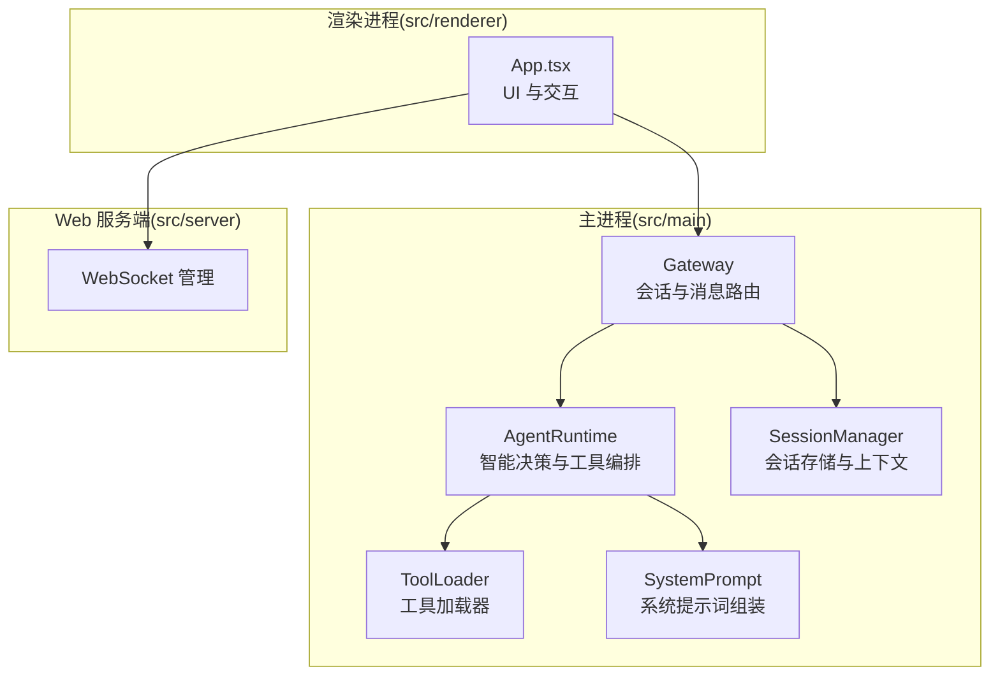
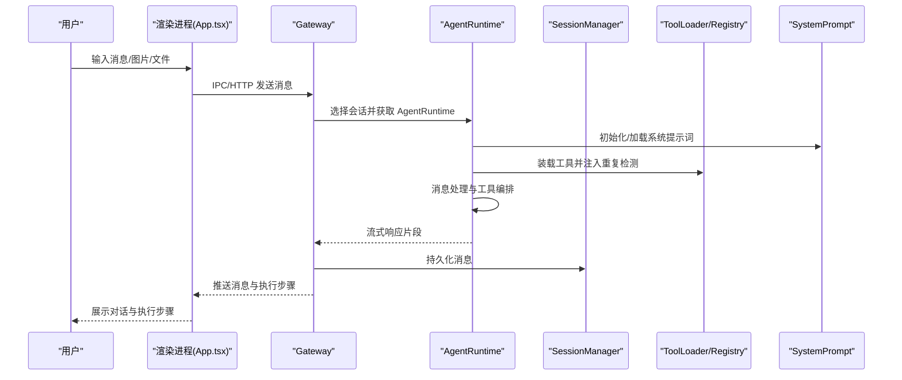
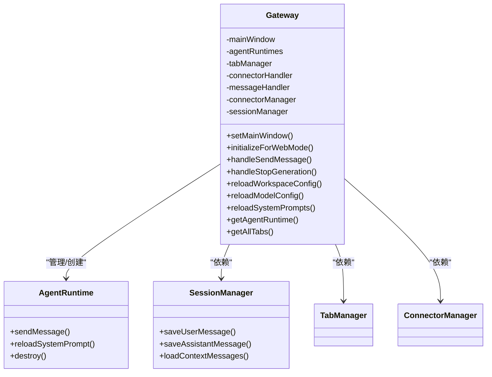
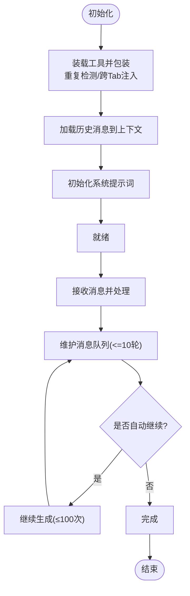
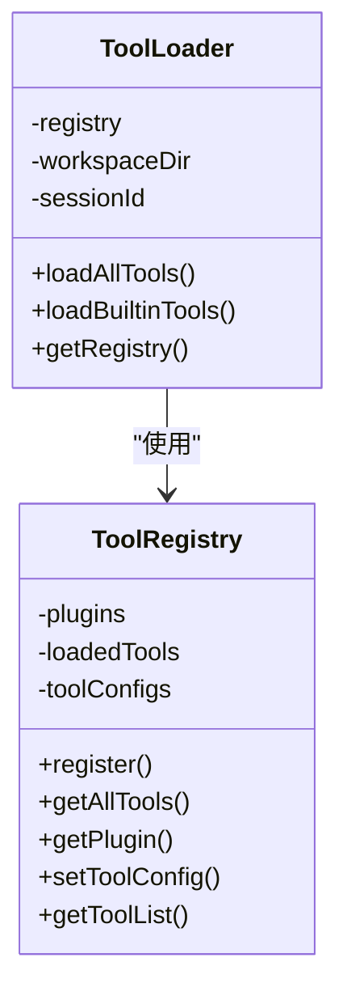
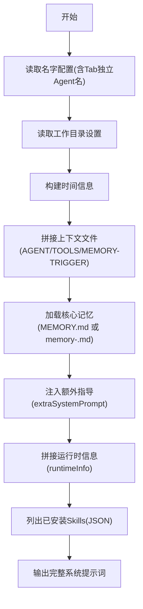
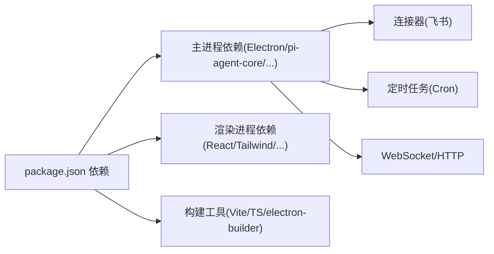

# 项目概述

<cite>
**本文引用的文件**
- [README.md](file://README.md)
- [package.json](file://package.json)
- [src/main/index.ts](file://src/main/index.ts)
- [src/renderer/App.tsx](file://src/renderer/App.tsx)
- [src/main/gateway.ts](file://src/main/gateway.ts)
- [src/main/agent-runtime/agent-runtime.ts](file://src/main/agent-runtime/agent-runtime.ts)
- [src/main/session/session-manager.ts](file://src/main/session/session-manager.ts)
- [src/main/tools/registry/tool-loader.ts](file://src/main/tools/registry/tool-loader.ts)
- [src/main/tools/registry/tool-registry.ts](file://src/main/tools/registry/tool-registry.ts)
- [src/main/prompts/system-prompt.ts](file://src/main/prompts/system-prompt.ts)
- [src/main/config/constants.ts](file://src/main/config/constants.ts)
- [src/types/index.ts](file://src/types/index.ts)
</cite>

## 目录
1. [简介](#简介)
2. [项目结构](#项目结构)
3. [核心组件](#核心组件)
4. [架构总览](#架构总览)
5. [详细组件分析](#详细组件分析)
6. [依赖关系分析](#依赖关系分析)
7. [性能考量](#性能考量)
8. [故障排查指南](#故障排查指南)
9. [结论](#结论)
10. [附录](#附录)

## 简介
史丽慧小助理 是一个系统级 AI 助手，面向企业生产提效，强调“让 AI 深入参与企业日常办公”。其核心价值主张包括：
- 多任务并行与多 Agent 协作：每个 Tab 对应一个独立会话与 Agent，支持跨 Tab 消息路由与协作，实现复杂业务流程自动化。
- 强大的工具体系：内置 13+ 工具，覆盖文件操作、命令执行、浏览器控制、图片生成、AI 对话、跨会话通信、网页内容获取、飞书云文档操作等。
- 记忆系统：支持全局记忆与独立记忆（多 Agent 角色化），实现长期知识沉淀与角色专业化。
- 定时任务与技能扩展：通过 Skills 组合工具实现复杂功能；支持定时任务自动化执行。
- 安全机制：路径白名单与工作空间隔离，严格限制文件与命令操作范围，保障企业系统安全。
- 多模型支持：兼容通义千问、OpenAI、Claude 等主流模型，且针对标准对话模型进行优化，避免推理模型带来的额外开销。

## 项目结构
项目采用模块化分层设计，前后端分离（Electron 主进程 + 渲染进程 + Web 服务端），核心目录与职责如下：
- src/main：主进程与服务端逻辑
  - agent-runtime：Agent 运行时，负责智能决策与工具编排
  - gateway：会话管理与消息路由中枢
  - session：会话存储与上下文管理
  - tools：工具系统与工具加载器
  - prompts：系统提示词组装层
  - database：系统配置与存储
  - connectors：外部连接器（如飞书）
  - scheduled-tasks：定时任务
  - utils：AI 客户端、路径安全、令牌估算等
- src/renderer：React 渲染进程 UI
- src/server：Web 服务端（Express + WebSocket）
- src/shared：共享工具与类型
- src/types：类型定义

图表来源
- [src/main/gateway.ts:29-114](file://src/main/gateway.ts#L29-L114)
- [src/main/agent-runtime/agent-runtime.ts:27-188](file://src/main/agent-runtime/agent-runtime.ts#L27-L188)
- [src/main/session/session-manager.ts:17-26](file://src/main/session/session-manager.ts#L17-L26)
- [src/main/tools/registry/tool-loader.ts:40-71](file://src/main/tools/registry/tool-loader.ts#L40-L71)
- [src/main/prompts/system-prompt.ts:25-125](file://src/main/prompts/system-prompt.ts#L25-L125)
- [src/renderer/App.tsx:24-741](file://src/renderer/App.tsx#L24-L741)

章节来源
- [README.md:128-248](file://README.md#L128-L248)
- [package.json:10-44](file://package.json#L10-L44)

## 核心组件
- Gateway（会话与消息中枢）
  - 管理多个 AgentRuntime（每个 Tab 一个），负责消息路由、流式响应、连接器与定时任务集成。
  - 提供工作目录、模型配置、工具配置的热重载能力。
- AgentRuntime（Agent 运行时）
  - 基于 pi-agent-core，负责系统提示词初始化、工具装载、消息处理与自动继续机制。
  - 维护消息队列上限（最近 10 轮）、重复检测与操作追踪，支持跨 Tab 调用。
- SessionManager（会话存储）
  - 负责消息持久化（UI 最近 100 轮、Agent 上下文最近 10 轮），提供加载与清理能力。
- ToolLoader/ToolRegistry（工具系统）
  - 统一加载内置工具，支持启用/禁用与配置注入；工具插件化，便于扩展。
- SystemPrompt（系统提示词组装）
  - 动态组装基础 Agent 提示、工具说明、记忆文件、Skills 指令与运行时信息，支持实时更新。
- UI（React）
  - 提供多 Tab 聊天界面、技能管理、定时任务管理、系统设置等，支持流式消息与执行步骤可视化。

章节来源
- [src/main/gateway.ts:29-772](file://src/main/gateway.ts#L29-L772)
- [src/main/agent-runtime/agent-runtime.ts:27-909](file://src/main/agent-runtime/agent-runtime.ts#L27-L909)
- [src/main/session/session-manager.ts:17-195](file://src/main/session/session-manager.ts#L17-L195)
- [src/main/tools/registry/tool-loader.ts:40-312](file://src/main/tools/registry/tool-loader.ts#L40-L312)
- [src/main/tools/registry/tool-registry.ts:36-328](file://src/main/tools/registry/tool-registry.ts#L36-L328)
- [src/main/prompts/system-prompt.ts:25-125](file://src/main/prompts/system-prompt.ts#L25-L125)
- [src/renderer/App.tsx:24-741](file://src/renderer/App.tsx#L24-L741)

## 架构总览
史丽慧小助理 采用“多 Agent 协作 + 工具编排”的系统级架构，核心流程：
- 用户在 UI 中发起消息，经 IPC/HTTP 到达 Gateway。
- Gateway 选择对应 AgentRuntime（按 Tab 会话），加载系统提示词与工具，进入消息处理循环。
- AgentRuntime 通过 MessageProcessor 编排工具调用，生成流式响应并通过 Gateway 回传 UI。
- SessionManager 持久化消息，支持上下文压缩与历史加载。
- 外部连接器（如飞书）通过 Gateway 与 AgentRuntime 交互，实现跨平台协作。

图表来源
- [src/renderer/App.tsx:613-685](file://src/renderer/App.tsx#L613-L685)
- [src/main/gateway.ts:455-458](file://src/main/gateway.ts#L455-L458)
- [src/main/agent-runtime/agent-runtime.ts:661-688](file://src/main/agent-runtime/agent-runtime.ts#L661-L688)
- [src/main/session/session-manager.ts:38-85](file://src/main/session/session-manager.ts#L38-L85)
- [src/main/tools/registry/tool-loader.ts:57-71](file://src/main/tools/registry/tool-loader.ts#L57-L71)
- [src/main/prompts/system-prompt.ts:25-125](file://src/main/prompts/system-prompt.ts#L25-L125)

章节来源
- [README.md:128-248](file://README.md#L128-L248)

## 详细组件分析

### Gateway 组件分析
- 职责与边界
  - 管理多个 AgentRuntime（每 Tab 一个），负责消息路由、连接器与定时任务集成、工作目录与模型配置热重载。
  - 提供 Tab 生命周期管理、会话存储依赖注入、Web 模式初始化。
- 关键流程
  - handleSendMessage：委派到消息处理器，按会话 ID 获取或创建 AgentRuntime，执行消息处理。
  - reloadWorkspaceConfig/reloadModelConfig：销毁现有 AgentRuntime，确保新配置生效。
  - reloadSystemPrompts：批量重新加载所有活跃会话的系统提示词。
- 依赖关系
  - 依赖 SessionManager 进行消息持久化；依赖 ConnectorManager/ConnectorHandler 处理外部连接器；依赖 TabManager 管理 Tab。
- 错误处理
  - 对连接器启动、SessionManager 初始化、工具重载等过程进行 try/catch 与日志记录，避免阻塞主流程。

图表来源
- [src/main/gateway.ts:29-114](file://src/main/gateway.ts#L29-L114)
- [src/main/gateway.ts:430-450](file://src/main/gateway.ts#L430-L450)
- [src/main/session/session-manager.ts:17-26](file://src/main/session/session-manager.ts#L17-L26)

章节来源
- [src/main/gateway.ts:29-772](file://src/main/gateway.ts#L29-L772)

### AgentRuntime 组件分析
- 职责与边界
  - 负责 Agent 生命周期、系统提示词初始化、工具装载与包装（重复检测、跨 Tab 名称注入）、消息处理与自动继续。
- 关键流程
  - initialize：初始化 Agent、装载工具、包装工具（重复检测、跨 Tab 名称注入）、加载历史上下文。
  - sendMessage：委托给 MessageProcessor，维护消息队列（最多 10 轮用户对话），支持自动继续与最大次数限制。
  - reloadSystemPrompt：在记忆或 Skills 更新后重新组装系统提示词。
- 安全与稳定性
  - 重复检测与操作追踪，避免重复执行与状态卡死；支持强制停止与实例重建。
- 与工具系统的关系
  - 通过 ToolLoader/Registry 获取工具列表，包装后注入到 Agent。

图表来源
- [src/main/agent-runtime/agent-runtime.ts:193-229](file://src/main/agent-runtime/agent-runtime.ts#L193-L229)
- [src/main/agent-runtime/agent-runtime.ts:392-423](file://src/main/agent-runtime/agent-runtime.ts#L392-L423)
- [src/main/agent-runtime/agent-runtime.ts:661-688](file://src/main/agent-runtime/agent-runtime.ts#L661-L688)

章节来源
- [src/main/agent-runtime/agent-runtime.ts:27-909](file://src/main/agent-runtime/agent-runtime.ts#L27-L909)

### 工具系统（ToolLoader/ToolRegistry）
- 设计要点
  - ToolRegistry：集中注册与管理工具插件，支持启用/禁用与配置注入。
  - ToolLoader：按会话与工作目录加载内置工具，动态读取工具配置文件，按开关过滤工具。
- 关键流程
  - loadAllTools：加载工具配置，调用 loadBuiltinTools，逐项创建工具实例并注入 workspaceDir、sessionId、configStore。
  - 支持跨 Tab 调用工具（cross_tab_call）注入 senderTabName，便于多 Agent 协作。
- 扩展性
  - 新增工具只需实现 ToolPlugin 接口并在 ToolLoader 中注册，即可被 AgentRuntime 使用。

图表来源
- [src/main/tools/registry/tool-registry.ts:36-328](file://src/main/tools/registry/tool-registry.ts#L36-L328)
- [src/main/tools/registry/tool-loader.ts:40-312](file://src/main/tools/registry/tool-loader.ts#L40-L312)

章节来源
- [src/main/tools/registry/tool-registry.ts:36-328](file://src/main/tools/registry/tool-registry.ts#L36-L328)
- [src/main/tools/registry/tool-loader.ts:40-312](file://src/main/tools/registry/tool-loader.ts#L40-L312)

### 系统提示词组装层（SystemPrompt）
- 设计要点
  - 动态组装：身份信息（含 Tab 独立 Agent 名称）、工作目录、时间信息、上下文文件、核心记忆、额外指导、运行时信息、已安装 Skills。
  - 实时更新：记忆文件更新、Skills 安装/卸载、系统提示词热更新，无需重启应用。
- 关键流程
  - buildSystemPrompt：按顺序拼接各部分，最终交由 AgentRuntime 使用。

图表来源
- [src/main/prompts/system-prompt.ts:25-125](file://src/main/prompts/system-prompt.ts#L25-L125)

章节来源
- [src/main/prompts/system-prompt.ts:25-125](file://src/main/prompts/system-prompt.ts#L25-L125)

### UI 组件（App.tsx）
- 设计要点
  - 多 Tab 管理：创建/关闭/切换 Tab，Tab 标题与名称配置联动。
  - 流式消息：监听消息流、执行步骤更新、错误处理与系统提示。
  - 集成技能管理、定时任务管理、系统设置。
- 关键流程
  - handleSendMessage：校验模型配置、插入图片/文件引用、发送消息到 Gateway。
  - 监听 onMessageStream/onExecutionStepUpdate/onMessageError，批量更新消息与执行步骤。

章节来源
- [src/renderer/App.tsx:24-741](file://src/renderer/App.tsx#L24-L741)

## 依赖关系分析
- 技术栈与依赖
  - 主进程：Electron、pi-agent-core、pi-ai、pi-coding-agent、Express、WebSocket、Cron、JSON Schema 校验等。
  - 渲染进程：React、Zustand、TailwindCSS、React Markdown、Highlight 等。
  - 构建与打包：Vite、TypeScript、electron-builder、concurrently 等。
- 外部集成
  - 飞书连接器：通过 LarkSuite SDK 与飞书机器人交互，支持私聊/群聊、消息去重、云文档操作。
  - 外部服务：Tavily API（网页搜索）、Gemini Imagen 3（图片生成）。
- 依赖图

图表来源
- [package.json:45-107](file://package.json#L45-L107)

章节来源
- [package.json:45-107](file://package.json#L45-L107)
- [README.md:251-288](file://README.md#L251-L288)

## 性能考量
- 上下文窗口与消息队列
  - Agent 上下文最多保留 10 轮用户对话，结合上下文压缩算法，控制 Token 使用与响应速度。
- 工具调用与重复检测
  - 工具执行前进行重复检测与操作追踪，避免重复执行与状态卡死。
- 流式响应与批量更新
  - UI 使用 requestAnimationFrame 批量更新消息与执行步骤，减少重渲染开销。
- 模型与上下文窗口
  - 根据模型 ID 推断上下文窗口，合理设置 maxTokens，平衡成本与性能。
- 文件与网络
  - 上传文件大小限制、图片大小限制，避免内存与网络压力过大。

章节来源
- [src/main/agent-runtime/agent-runtime.ts:392-423](file://src/main/agent-runtime/agent-runtime.ts#L392-L423)
- [src/main/agent-runtime/agent-runtime.ts:104-143](file://src/main/agent-runtime/agent-runtime.ts#L104-L143)
- [src/renderer/App.tsx:374-506](file://src/renderer/App.tsx#L374-L506)
- [src/main/config/constants.ts:1-26](file://src/main/config/constants.ts#L1-L26)

## 故障排查指南
- 模型未配置
  - 现象：UI 提示模型未配置，发送消息失败。
  - 处理：在系统设置中配置 API Key，或在首次使用时自动提示。
- 系统托盘与窗口行为
  - 现象：关闭窗口未退出应用，最小化到系统托盘。
  - 处理：点击托盘图标显示窗口；退出时点击托盘菜单“退出”。
- 图片/文件上传失败
  - 现象：上传图片/文件报错或失败。
  - 处理：检查文件大小限制（图片 ≤5MB，文件 ≤500MB）；确认工作目录配置正确。
- Agent 卡住或状态异常
  - 现象：Agent 长时间处于 streaming 状态或无法继续。
  - 处理：使用“停止生成”，AgentRuntime 会强制停止并重建实例。
- 记忆或 Skills 更新未生效
  - 现象：更新记忆或安装/卸载 Skills 后提示词未变化。
  - 处理：Gateway 会自动重新加载系统提示词；若未生效，可手动触发重载或重启应用。

章节来源
- [src/renderer/App.tsx:271-297](file://src/renderer/App.tsx#L271-L297)
- [src/main/index.ts:182-198](file://src/main/index.ts#L182-L198)
- [src/main/agent-runtime/agent-runtime.ts:731-744](file://src/main/agent-runtime/agent-runtime.ts#L731-L744)
- [src/main/gateway.ts:288-306](file://src/main/gateway.ts#L288-L306)

## 结论
史丽慧小助理 通过“多 Agent 协作 + 工具编排 + 系统提示词动态组装”的架构，为企业提供系统级 AI 助手能力。其模块化设计、强安全机制与丰富的工具生态，使其既能满足初学者快速上手，也能支撑有经验开发者进行深度定制与扩展。结合记忆系统、定时任务与外部连接器，史丽慧小助理 能够在企业日常办公中实现从文档处理、数据分析到跨部门协作的自动化，显著提升生产效率。

## 附录
- 常见用例示例（概念性说明）
  - 多 Agent 协作：销售 Agent 负责客户跟进，市场 Agent 负责推广方案，研发 Agent 负责技术实现，项目管理 Agent 协调进度，通过跨 Tab 调用工具协同完成复杂任务。
  - 记忆驱动：为不同 Tab 设置独立 Agent 名称与记忆，形成角色化 Agent，持续学习用户偏好与专业领域。
  - 定时任务：每日/每周定时检查桌面文件、生成报表、清理临时文件，由专用 Tab 执行并记录历史。
  - 外部平台集成：通过飞书连接器实现跨平台消息与云文档操作，提升跨团队协作效率。